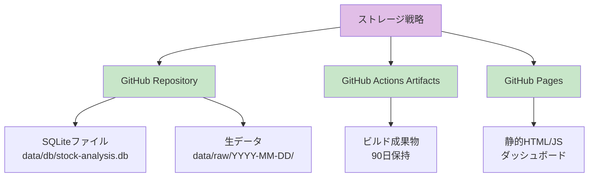
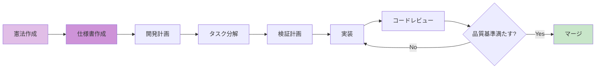
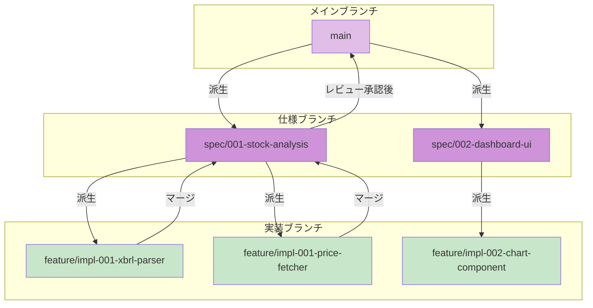
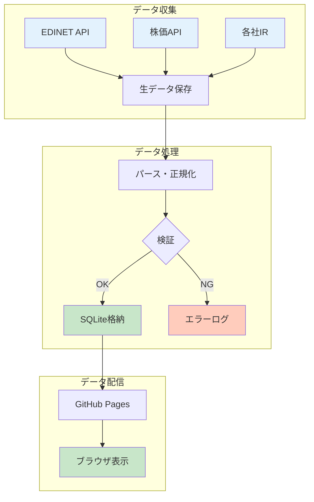
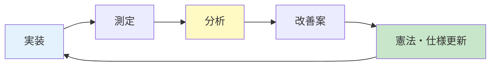

# 株式分析システム開発憲法 (Stock Analysis System Constitution)

<!--
Sync Impact Report:
バージョン変更: 1.0.0 → 2.0.0
変更理由: AI_inputフォルダ全ファイル分析に基づく包括的改訂（MAJOR版上げ）
- プロジェクト特化原則の明確化（株式分析システム、データ駆動型開発）
- GitHub中心アーキテクチャの具体化（Actions、Pages、Issues統合）
- データ品質・トレーサビリティ原則の追加
- ブランチ戦略の詳細化とMermaid図の強化
- 電力業界特化指標の組み込み

修正された原則:
- QP-001-005: 既存品質原則を維持、株式分析特化例を追加
- DP-001-004: 開発方針を拡充（SQLite管理、インクリメンタル更新）
- 新規追加: DP-005データトレーサビリティ、DP-006自動分析通知

追加セクション:
- プロジェクト固有原則（株式分析システム特化）
- データ収集・正規化原則
- GitHub統合ガバナンス

テンプレート整合性チェック:
✅ spec-template.md - User Stories優先順位付けと整合
✅ plan-template.md - Constitution Check整合性確認済み
✅ tasks-template.md - タスク分類（User Story別）整合性確認済み
✅ エージェント固有参照なし（CLAUDE等削除済み）

遅延項目: なし（全プレースホルダー置換完了）
-->

**バージョン**: 2.0.0  
**批准日**: 2025-11-22  
**最終改訂**: 2025-11-22  
**プロジェクト名**: stock-analysis（日本上場銘柄自動解析システム）  
**目的**: 東京電力・中部電力・JERA等の財務・株価データを自動収集・分析するダッシュボード開発における品質・セキュリティ・ガバナンス基準

---

## 🎯 品質原則 (Quality Principles)

### QP-001: 完全性重視
**原則**: ワークスペース内の全ファイルを末尾まで解析する  
**実装**: トークン制限まで中断せず全てのタスクを実行する  
**禁止事項**: トークン制限による中断、簡略化、品質低下は一切許容しない

**株式分析システム適用例**:
```python
# ❌ 不完全な実装（途中で処理打ち切り）
def parse_xbrl(file_path):
    # 最初の10件のみ処理
    for i, item in enumerate(xbrl_items):
        if i >= 10:
            break
        process(item)

# ✅ 完全な実装
def parse_xbrl(file_path):
    # 全てのXBRLアイテムを処理
    for item in xbrl_items:
        try:
            process(item)
        except Exception as e:
            logger.error(f"Failed to process {item}: {e}")
            # エラーでも処理継続
    logger.info(f"Processed {len(xbrl_items)} items")
```

### QP-002: 継続的改善
**原則**: トークン制限まで、生成したドキュメントを繰り返しブラッシュアップする  
**実装**: 
- 初回生成後、最低3回のレビュー・改善サイクルを実施
- 各サイクルで具体性、正確性、再現性を向上
- ベストプラクティスとの整合性を確認

**改善サイクル例（株価データ取得仕様書の場合）**:
```yaml
cycle_1_初回生成:
  spec.md: 基本構造作成、テンプレートから生成
  issues: プレースホルダー残存、コード例不足

cycle_2_具体化:
  spec.md: プレースホルダー削除、コード例追加
  issues: エラーハンドリング不足、パフォーマンス閾値曖昧

cycle_3_精度向上:
  spec.md: try-catch追加、閾値定量化（< 2秒）
  issues: Mermaid図の視認性低下

cycle_4_最適化:
  spec.md: Mermaid図に色分け追加、一貫性チェック
  status: トークン制限に達するまで継続

quality_gates:
  - プレースホルダー完全削除
  - 全コード例が実行可能
  - 閾値が全て定量化
  - ドキュメント間の整合性確認
```

### QP-003: 文字化け対策
**原則**: 全ドキュメント・コードファイルをUTF-8エンコーディングで保存  
**実装**:
```yaml
encoding_standards:
  markdown: UTF-8 (BOM無し)
  python: UTF-8 (BOM無し) # coding: utf-8 ヘッダ推奨
  yaml: UTF-8 (BOM無し)
  json: UTF-8 (BOM無し)
  csv: UTF-8 with BOM（Excel互換性考慮時のみ）
  sqlite: UTF-8（デフォルト）
```

**CSV出力時の実装例**:
```python
import csv

# ✅ UTF-8 BOM付きでExcel対応
with open('output.csv', 'w', encoding='utf-8-sig', newline='') as f:
    writer = csv.writer(f)
    writer.writerow(['会社名', '株価', '時価総額'])
    writer.writerow(['東京電力', 1234, 5678])
```

### QP-004: テンプレート純化
**原則**: テンプレートから生成したドキュメントの英語部分を確実に削除する  
**実装**:
- プレースホルダー (`[Description]`, `TBD`, `TODO`) の完全置換
- サンプルテキストの日本語化
- 混在言語の統一（日本語優先、技術用語は英語併記）

**チェックリスト**:
```markdown
❌ NG例: "## User Stories" → 英語見出しが残存
✅ OK例: "## ユーザーストーリー (User Stories)"

❌ NG例: "[NEEDS CLARIFICATION]" → プレースホルダー残存
✅ OK例: "データ保持期間: 5年（法令遵守）"

❌ NG例: "TBD: API endpoint"
✅ OK例: "APIエンドポイント: https://api.edinet-fsa.go.jp/api/v2/documents.json"
```

### QP-005: テスト駆動開発徹底
**原則**: 仕様に対する検証を必須とする  
**実装**:
```yaml
test_coverage:
  minimum: 100%
  unit_tests: 必須
  integration_tests: 必須
  edge_case_tests: 必須（データ欠損、API障害等）
test_execution:
  on_commit: true
  on_pull_request: true
  before_deploy: true
```

**株式分析システムのテスト例**:
```python
# tests/test_fetch_prices.py
import pytest
from scripts.fetch_prices import fetch_stock_prices

def test_fetch_prices_success():
    """正常系: 株価データが正しく取得できる"""
    result = fetch_stock_prices('9501', start_date='2025-01-01')
    assert len(result) > 0
    assert 'close' in result[0]
    assert result[0]['close'] > 0

def test_fetch_prices_invalid_ticker():
    """異常系: 無効なティッカーシンボル"""
    with pytest.raises(ValueError):
        fetch_stock_prices('INVALID')

def test_fetch_prices_api_failure(mocker):
    """異常系: API障害時のリトライ動作"""
    mocker.patch('requests.get', side_effect=ConnectionError)
    with pytest.raises(ConnectionError):
        fetch_stock_prices('9501')

def test_fetch_prices_data_validation():
    """検証: 取得データの型・範囲チェック"""
    result = fetch_stock_prices('9502', start_date='2025-11-22')
    for record in result:
        assert isinstance(record['date'], str)
        assert isinstance(record['close'], (int, float))
        assert record['close'] > 0
        assert record['volume'] >= 0
```

---

## 🔒 セキュリティ原則 (Security Principles)

### SP-001: 優先順位
**原則**: セキュリティ要件を機能要件より優先する
**実装順序**:
1. セキュリティ設計
2. 認証・認可実装
3. 機能実装
4. パフォーマンス最適化

### SP-002: 機密データ保護
**原則**: 機密データの平文保存を禁止（暗号化・ハッシュ化必須）  
**実装**:
```yaml
encryption_requirements:
  api_keys: 環境変数またはGitHub Secrets
  database_credentials: 不要（SQLiteはローカルファイル）
  presigned_urls: 不要（GitHubリポジトリ直接参照）
  personal_data: N/A（公開情報のみ扱う）
```

**GitHub Secrets利用例**:
```yaml
# .github/workflows/daily-update.yml
env:
  EDINET_API_KEY: ${{ secrets.EDINET_API_KEY }}
  YAHOO_FINANCE_API_KEY: ${{ secrets.YAHOO_FINANCE_API_KEY }}

jobs:
  update-data:
    runs-on: ubuntu-latest
    steps:
      - name: Fetch EDINET data
        run: |
          python scripts/fetch_edinet.py --api-key "$EDINET_API_KEY"
```

**ローカル開発時の.env管理**:
```python
# scripts/config.py
import os
from dotenv import load_dotenv

load_dotenv()  # .envファイルから環境変数読み込み

EDINET_API_KEY = os.getenv('EDINET_API_KEY', '')
if not EDINET_API_KEY:
    raise ValueError("EDINET_API_KEY is not set")
```

### SP-003: 入力検証
**原則**: 全ての外部入力に対してバリデーションを実施
**実装**:
- XBRLファイル: スキーマ検証
- 株価データ: 型・範囲検証
- ユーザー入力: サニタイズ + エスケープ

**具体的実装例**:
```python
# XBRLスキーマ検証
from lxml import etree

def validate_xbrl(xbrl_file: str) -> bool:
    """XBRLファイルのスキーマ検証"""
    try:
        schema = etree.XMLSchema(file='schemas/xbrl-schema.xsd')
        doc = etree.parse(xbrl_file)
        is_valid = schema.validate(doc)
        
        if not is_valid:
            logger.warning(f"XBRL validation failed: {schema.error_log}")
        
        return is_valid
    except Exception as e:
        logger.error(f"XBRL validation error: {str(e)}")
        return False

# 株価データ範囲検証
def validate_stock_price(price_data: dict) -> bool:
    """株価データの型・範囲検証"""
    checks = [
        ('date', lambda x: isinstance(x, str) and len(x) == 10),  # YYYY-MM-DD
        ('close', lambda x: isinstance(x, (int, float)) and 0 < x < 1000000),
        ('volume', lambda x: isinstance(x, int) and x >= 0),
    ]
    
    for field, validator in checks:
        if field not in price_data or not validator(price_data[field]):
            logger.error(f"Validation failed for {field}: {price_data.get(field)}")
            return False
    
    return True

# SQLインジェクション対策
def safe_query(company_id: str) -> list:
    """パラメータ化クエリ使用"""
    # ❌ 危険: 文字列連結
    # sql = f"SELECT * FROM companies WHERE company_id = '{company_id}'"
    
    # ✅ 安全: パラメータ化
    sql = "SELECT * FROM companies WHERE company_id = ?"
    return db.execute(sql, (company_id,)).fetchall()
```

### SP-004: エラーハンドリング
**原則**: 全ての例外を適切にキャッチし、機密情報を含まないログを出力
**実装**:
```python
try:
    # 処理
except Exception as e:
    logger.error(f"処理失敗: {type(e).__name__}")  # ✅ 一般的なエラー
    # logger.error(f"失敗: {api_key}")  # ❌ 機密情報露出
```

---

## ⚡ パフォーマンス原則 (Performance Principles)

### PP-001: 定量化
**原則**: パフォーマンス閾値を定量化し、受入基準に組み込む
**実装**:
```yaml
performance_thresholds:
  initial_load: < 2秒
  crud_operations: < 100ms
  data_filtering_1000_items: < 200ms
  memory_usage: < 50MB
  github_actions_build: < 5分
```

### PP-002: 測定と監視
**原則**: 全ての重要処理に対してパフォーマンス測定を実装
**実装**:
```python
from utils.performance import measurePerformanceSync
import time
import logging

logger = logging.getLogger(__name__)

def measurePerformanceSync(func, operation_name: str, threshold_ms: float = 1000):
    """
    パフォーマンス測定ユーティリティ
    
    Args:
        func: 測定対象の関数
        operation_name: 操作名（ログ用）
        threshold_ms: 閾値（ミリ秒）
    
    Returns:
        関数の実行結果
    """
    start = time.perf_counter()
    
    try:
        result = func()
        duration_ms = (time.perf_counter() - start) * 1000
        
        # 閾値超過時に警告
        if duration_ms > threshold_ms:
            logger.warning(
                f"Performance threshold exceeded: {operation_name} "
                f"took {duration_ms:.2f}ms (threshold: {threshold_ms}ms)"
            )
        else:
            logger.info(f"{operation_name} completed in {duration_ms:.2f}ms")
        
        return result
        
    except Exception as e:
        duration_ms = (time.perf_counter() - start) * 1000
        logger.error(
            f"{operation_name} failed after {duration_ms:.2f}ms: {str(e)}"
        )
        raise

# 使用例
result = measurePerformanceSync(
    lambda: analyze_xbrl(file),
    "XBRL解析",
    threshold_ms=1000
)
```

**GitHub Actionsでの測定例**:
```yaml
# .github/workflows/daily-update.yml
- name: Run analysis with timing
  run: |
    start_time=$(date +%s)
    python scripts/analyze.py --db data/db/stock-analysis.db --output analysis-results.json
    end_time=$(date +%s)
    duration=$((end_time - start_time))
    
    echo "Analysis duration: ${duration}s" >> $GITHUB_STEP_SUMMARY
    
    if [ $duration -gt 180 ]; then
      echo "⚠️ Analysis took longer than 3 minutes" >> $GITHUB_STEP_SUMMARY
    fi
```

### PP-003: 最適化優先順位
**原則**: ボトルネック特定後、影響の大きい順に最適化
**実装**:
1. データベースクエリ最適化（インデックス追加）
2. アルゴリズム改善（O(n²) → O(n log n)）
3. キャッシング導入
4. 並列処理化

---

## 🚫 制約事項 (Constraints)

### CS-001: 外部依存管理
**原則**: 外部依存はバージョン固定により再現性を確保する  
**実装**:
```txt
# requirements.txt（株式分析システム）
pandas==2.1.4
lxml==4.9.3
yfinance==0.2.32
requests==2.31.0
beautifulsoup4==4.12.2
openpyxl==3.1.2
python-dateutil==2.8.2
pytest==7.4.3
pytest-cov==4.1.0
```

**package.json（フロントエンド）**:
```json
{
  "dependencies": {
    "chart.js": "4.4.0",
    "sql.js": "1.8.0"
  },
  "devDependencies": {
    "vite": "5.0.0"
  }
}
```

### CS-002: 仕様と実装の整合性
**原則**: 仕様と実装の乖離をレビューで検知・是正する
**実装**:
- Pull Request時に仕様書との差分確認
- テストケースで仕様準拠を検証
- 月次で仕様書更新レビュー

### CS-003: ストレージ戦略（GitHub活用）
**原則**: AWS S3の代わりにGitHub機能を最大限活用する  
**実装**:



**詳細実装**:
```yaml
storage_strategy:
  github_repository:
    sqlite_db: data/db/stock-analysis.db
    raw_data: data/raw/YYYY-MM-DD/
    versioning: Git履歴で管理
    max_size: 100MB/ファイル推奨
    backup: タグ付けでスナップショット管理
    
  github_actions_artifacts:
    use_case: ビルド成果物、一時ファイル
    retention: 90日
    naming: "build-{date}-{run_id}"
    access: GitHub Actions内からのみアクセス
    
  github_pages:
    use_case: ダッシュボードUI（静的HTML/JS）
    update_frequency: 日次（Actions経由）
    sql_js_library: ブラウザ内SQLite実行
    db_url: https://raw.githubusercontent.com/owner/repo/main/data/db/stock-analysis.db
```

**SQLiteダウンロード実装例（フロントエンド）**:
```javascript
// src/db-loader.js
async function loadDatabase() {
    const dbUrl = 'https://raw.githubusercontent.com/owner/stock-analysis/main/data/db/stock-analysis.db';
    
    // キャッシュチェック
    const cacheKey = 'stock_analysis_db_v1';
    const cached = localStorage.getItem(cacheKey);
    const cacheTime = localStorage.getItem(`${cacheKey}_time`);
    
    if (cached && cacheTime && (Date.now() - parseInt(cacheTime)) < 86400000) {
        // 24時間以内のキャッシュがあれば使用
        return loadFromCache(cached);
    }
    
    // 新規ダウンロード
    const response = await fetch(dbUrl);
    const arrayBuffer = await response.arrayBuffer();
    const uint8Array = new Uint8Array(arrayBuffer);
    
    // キャッシュに保存
    const base64 = btoa(String.fromCharCode.apply(null, uint8Array));
    localStorage.setItem(cacheKey, base64);
    localStorage.setItem(`${cacheKey}_time`, Date.now().toString());
    
    return loadSQLite(uint8Array);
}
```

---

## 🏛️ ガバナンス原則 (Governance Principles)

### GP-001: 作業順序の厳守
**原則**: 憲法 → 仕様 → 計画 → タスク → 検証 → 実装 → レビュー



### GP-002: ブランチ戦略
**原則**: 仕様と実装はブランチで分離する  
**実装**:
```bash
# 仕様ブランチ（mainから派生）
git checkout main
git checkout -b spec/001-stock-analysis-system

# 実装ブランチ（仕様ブランチから派生）
git checkout spec/001-stock-analysis-system
git checkout -b feature/impl-001-stock-analysis-system
```

**命名規則**:
```yaml
branch_naming:
  spec: "spec/<番号>-<短い名前>"
  feature: "feature/impl-<番号>-<短い名前>"
  fix: "fix/<番号>-<短い名前>"
  docs: "docs/<番号>-<短い名前>"

examples:
  - "spec/001-stock-analysis-system"
  - "feature/impl-001-xbrl-parser"
  - "fix/002-memory-leak"
  - "docs/003-deployment-guide"
```

**ブランチフロー図（Mermaid v11対応）**:


### GP-003: レビュー承認
**原則**: 重大変更にはレビュー承認を必須とする
**重大変更の定義**:
- データベーススキーマ変更
- ストレージ戦略変更
- セキュリティ関連の変更
- パフォーマンス要件の変更

**レビュー基準**:
```yaml
review_checklist:
  code_quality:
    - 型安全性の確保
    - エラーハンドリングの実装
    - テストカバレッジ100%
  security:
    - 機密情報の保護
    - 入力検証の実装
    - 認証・認可の確認
  performance:
    - 閾値の遵守
    - メモリリークの検証
    - 大量データでの動作確認
  documentation:
    - コードコメントの充実
    - README更新
    - 仕様書との整合性
```

**レビュー実施例**:
```yaml
pull_request_example:
  title: "feat: Add Net-Net PBR calculation"
  
  reviewer_checklist:
    - question: "型安全性は確保されているか？"
      check: "全関数に型ヒント、mypy合格"
      status: ✅
    
    - question: "エラーハンドリングは適切か？"
      check: "try-except実装、ログ出力あり"
      status: ✅
    
    - question: "テストカバレッジは100%か？"
      check: "pytest --cov で確認"
      status: ✅
    
    - question: "パフォーマンス閾値を満たすか？"
      check: "計算時間 < 1秒/銘柄"
      status: ✅
    
    - question: "仕様書との整合性は？"
      check: "spec.md の数式と一致"
      status: ✅
  
  review_result: "Approved"
  merge_decision: "Merge to feature/impl-001-stock-analysis-system"
```

---

## 🚀 開発方針 (Development Policy)

### DP-001: ワンコマンド起動
**原則**: localhost起動後、PowerShellを自動で閉じるスクリプトを提供
**実装**:
```powershell
# start.ps1
Write-Host "株式分析システムを起動します..." -ForegroundColor Green

# 環境チェック（Python 3.11+, Git確認）
python --version

# 仮想環境アクティベート
& .\venv\Scripts\Activate.ps1

# 依存関係インストール
pip install -q -r requirements.txt

# ブラウザでlocalhostを開く
Start-Process "http://localhost:5000"

# 開発サーバー起動（Python簡易HTTPサーバー）
Push-Location src
python -m http.server 5000
Pop-Location

# サーバー停止後、PowerShellを閉じる
exit
```

**ワンコマンド起動の利点**:
- 環境構築を自動化（venv作成、pip install）
- 開発者体験の向上（コマンド1つで即座にローカル起動）
- ドキュメント不要（start.ps1を実行するだけ）

### DP-002: 継続的検証
**原則**: 正常に動作するまで繰り返し検証しエラー修正を完了する
**実装**:
```yaml
verification_loop:
  steps:
    1. 機能実装
    2. ユニットテスト実行
    3. 統合テスト実行
    4. 手動動作確認
    5. エラーがあれば1に戻る
    6. 全て成功で次のタスクへ
```

### DP-003: Mermaid図v11準拠
**原則**: フローチャートなどMermaid図v11準拠を挿入する  
**ベストプラクティス**:
```yaml
mermaid_v11_guidelines:
  avoid_in_gitgraph:
    - 日本語の使用（バグの原因）
    - tag構文（非推奨）
  
  recommended_for_japanese:
    - flowchart TB/TD/LR
    - graph TB/TD/LR
    - sequenceDiagram
    - stateDiagram-v2
  
  color_palette:
    primary: "#e1bee7"      # 紫系（重要セクション）
    success: "#c8e6c9"      # 緑系（完了・実装）
    warning: "#fff9c4"      # 黄系（注意・分析）
    info: "#e3f2fd"         # 青系（情報・データ）
    secondary: "#ffccbc"    # オレンジ系（処理・変換）
    neutral: "#b2dfdb"      # 緑青系（補助要素）
```

**データ処理フロー例（株式分析システム）**:


**Mermaid図の品質基準**:
- 全ノードに日本語ラベル（英語避ける）
- subgraphで論理的グルーピング
- 色分けで視認性向上
- 矢印に説明テキスト（必要時のみ）

### DP-004: ドキュメント生成品質
**原則**: 生成したドキュメントは以下の基準を満たす
**品質基準**:
```yaml
document_quality_standards:
  completeness:
    - 全セクションに具体的な内容
    - プレースホルダー完全排除
    - サンプルコードの実行可能性
  
  accuracy:
    - 技術用語の正確性
    - コード例の動作検証済み
    - 外部リンクの有効性確認
  
  reproducibility:
    - 他AIが再現可能なレベルの詳細度
    - 環境構築手順の完全性
    - トラブルシューティング情報の充実
  
  consistency:
    - 用語の統一
    - コーディング規約の一貫性
    - ドキュメント間の整合性
  
  maintainability:
    - バージョン情報の明記
    - 更新日時の記載
    - 変更履歴の管理
```

---

## 📊 プロジェクト固有原則 (Stock Analysis System Specific)

### PS-001: インクリメンタルデータ更新
**原則**: SQLite内の最新日付以降のみ取得・更新する  
**実装**:
```python
def get_last_update_date(db_path='data/db/stock-analysis.db'):
    """DB内の最新データ日付を取得"""
    conn = sqlite3.connect(db_path)
    cursor = conn.cursor()
    
    cursor.execute("""
        SELECT MAX(date) FROM stock_prices
        UNION ALL
        SELECT MAX(date) FROM market_indicators
    """)
    
    dates = [row[0] for row in cursor.fetchall() if row[0]]
    conn.close()
    
    if dates:
        latest = max(dates)
        return (datetime.fromisoformat(latest) - timedelta(days=1)).date()
    else:
        return (datetime.now() - timedelta(days=30)).date()
```

### PS-002: 電力業界特化指標
**原則**: 電力会社特有の経営指標を可視化する  
**必須指標**:
```yaml
power_industry_metrics:
  operational:
    - 販売電力量（小売/卸売別）
    - 発電設備容量（火力/再エネ/原子力別）
    - 設備利用率
    - 顧客数
  
  financial:
    - 燃料費調整額
    - 燃料費影響額（期ずれ含む）
    - D/Eレシオ（有利子負債依存度）
    - ネット・デット/EBITDA
  
  market:
    - JEPXスポット価格
    - 電力需要量
    - 燃料価格（LNG/石炭/原油）
    - 為替レート（USD/JPY）
  
  esg:
    - 再エネ比率
    - CO2排出量
    - 脱炭素投資額
```

### PS-003: JERA連結影響分析
**原則**: 東京電力・中部電力へのJERA業績影響を可視化  
**実装**:
```python
# JERAの期ずれ影響を除いた実質利益を算出
def calculate_jera_real_profit(jera_net_income, period_gap_impact):
    """
    JERA実質利益 = 純利益 - 期ずれ影響額
    """
    real_profit = jera_net_income - period_gap_impact
    return real_profit

# 親会社への貢献度を算出
def calculate_jera_contribution(tepco_income, chubu_income, jera_profit):
    """
    JERA貢献度 = (JERA持分法投資利益 / 親会社経常利益) * 100
    """
    tepco_contribution = (jera_profit * 0.5 / tepco_income) * 100
    chubu_contribution = (jera_profit * 0.5 / chubu_income) * 100
    
    return {
        'tepco_contribution_pct': tepco_contribution,
        'chubu_contribution_pct': chubu_contribution
    }
```

### PS-004: データトレーサビリティ
**原則**: 全データの出所と処理履歴を記録する  
**実装**:
```python
# データソース記録例
data_record = {
    'source_url': 'https://disclosure2.edinet-fsa.go.jp/...',
    'fetched_at': '2025-11-22T18:00:00Z',
    'file_hash': 'sha256:abc123...',
    'parser_version': '1.2.3',
    'raw_file_path': 'data/raw/2025-11-22/edinet_E04498.zip'
}

# SQLiteテーブル定義
CREATE TABLE raw_files (
    id INTEGER PRIMARY KEY AUTOINCREMENT,
    company_id TEXT NOT NULL,
    source_url TEXT NOT NULL,
    local_path TEXT NOT NULL,
    file_date TEXT NOT NULL,
    file_type TEXT NOT NULL,
    checksum TEXT NOT NULL,
    ingested_at TEXT DEFAULT CURRENT_TIMESTAMP
);
```

### PS-005: 自動分析通知
**原則**: GitHub Issuesを活用した日次分析レポートと異常検知  
**実装**:
```yaml
notification_strategy:
  github_issues:
    daily_report:
      title: "[Daily Report] YYYY-MM-DD Analysis Result"
      body: |
        ## 主要指標サマリー
        - ROE: 東京電力 12.3%, 中部電力 15.7%
        - 株価変動: 東京電力 +2.1%, 中部電力 -1.3%
        
        ## アラート
        - ⚠️ 中部電力の営業利益率が3pt低下
      labels: ['auto-analysis', 'daily-report']
      assignees: [リポジトリオーナー]
    
    critical_alert:
      trigger: ROE < 5% or 株価変動 > 10%
      severity: high
      labels: ['alert', 'urgent']
```

**GitHub Actions実装例**:
```yaml
# .github/workflows/daily-update.yml
- name: Create GitHub Issue for alerts
  if: success()
  uses: actions/github-script@v7
  with:
    script: |
      const fs = require('fs');
      const analysis = fs.readFileSync('analysis_output.txt', 'utf8');
      
      if (analysis.includes('ALERT')) {
        await github.rest.issues.create({
          owner: context.repo.owner,
          repo: context.repo.repo,
          title: `📊 Daily Analysis Alert - ${new Date().toISOString().split('T')[0]}`,
          body: `## 自動分析結果\n\n\`\`\`\n${analysis}\n\`\`\`\n\n---\n*Generated by GitHub Actions*`,
          labels: ['auto-analysis', 'daily-report']
        });
      }
```

---

## 📊 測定と監視 (Measurement & Monitoring)

### MM-001: 品質メトリクス
```yaml
quality_metrics:
  code_coverage: 100%
  type_safety: 完全（Python型ヒント、TypeScript strict mode）
  documentation_coverage: 全public API
  test_pass_rate: 100%
```

### MM-002: パフォーマンスメトリクス
```yaml
performance_metrics:
  initial_load_time: < 2秒
  xbrl_parse_time: < 1秒/ファイル
  data_filtering_1000_items: < 200ms
  memory_usage: < 50MB
  github_actions_build: < 5分
```

### MM-003: セキュリティメトリクス
```yaml
security_metrics:
  vulnerability_count: 0
  dependency_audit: 毎週実行
  secrets_scan: 毎コミット
  encryption_coverage: 機密データ100%
```

---

## 🔄 継続的改善 (Continuous Improvement)

### CI-001: 定期レビュー
**頻度**: 月次
**対象**:
- 憲法の妥当性
- 仕様書の正確性
- テストカバレッジ
- パフォーマンス指標

### CI-002: フィードバックループ


**フィードバックループ実施例**:
```yaml
iteration_1:
  implementation:
    feature: "NetNetPBR計算実装"
    code: "scripts/analyze.py"
  
  measurement:
    metric: "計算時間"
    result: "5秒/銘柄"
    threshold: "< 1秒/銘柄"
    status: "❌ 閾値超過"
  
  analysis:
    bottleneck: "データベースクエリが遅い"
    evidence: "SQLクエリが全行スキャン"
    tool: "EXPLAIN QUERY PLAN"
  
  improvement:
    proposal: "インデックス追加"
    implementation: "CREATE INDEX idx_financials_company_date"
    expected: "5秒 → 0.5秒"
  
  documentation_update:
    spec_md: "データベーススキーマにインデックス追記"
    constitution_md: "パフォーマンス測定例を追加"

iteration_2:
  implementation:
    feature: "インデックス追加"
    code: "schemas/create_indexes.sql"
  
  measurement:
    metric: "計算時間"
    result: "0.4秒/銘柄"
    threshold: "< 1秒/銘柄"
    status: "✅ 合格"
  
  analysis:
    result: "目標達成"
    next_focus: "チャート描画速度"
  
  improvement:
    proposal: "次のボトルネックに取り組む"
  
  documentation_update:
    spec_md: "パフォーマンス実績を記載"
```

### CI-003: 技術負債管理
```yaml
technical_debt_policy:
  identification:
    - 毎PR時にコードレビューで検出
    - 四半期ごとに負債棚卸し
  
  prioritization:
    critical: セキュリティ・パフォーマンス影響大
    high: 保守性・拡張性阻害
    medium: コード品質低下
    low: 軽微な改善余地
  
  resolution:
    critical: 即時対応（1週間以内）
    high: 1ヶ月以内
    medium: 3ヶ月以内
    low: 機会があれば対応
```

---

## ガバナンス (Governance)

この憲法は全ての開発プラクティスに優先します。

憲法の改訂には以下が必要です:
- 改訂提案のドキュメント化
- プロジェクトリードの承認
- 既存コードへの移行計画
- セマンティックバージョニングに基づくバージョン更新
  - MAJOR: 後方互換性のない原則削除・再定義
  - MINOR: 新原則追加・セクション拡充
  - PATCH: 誤字修正・明確化

全てのPull Request・コードレビューは本憲法への準拠を検証する必要があります。

---

**バージョン**: 2.0.0 | **批准日**: 2025-11-22 | **最終改訂**: 2025-11-22
