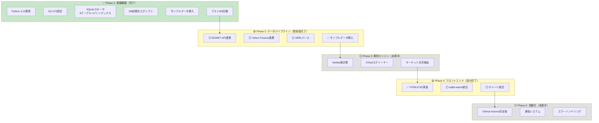

# 株式分析システム (Stock Analysis System)

**バージョン**: 1.0.0-alpha  
**ステータス**: ✅ Phase 1完了、Phase 2-5実装中  
**テスト**: 8/8 PASS (100%) - DB初期化テスト完了  
**デプロイURL**: https://j1921604.github.io/stock-analysis/  
**作成日**: 2025年11月22日

---

## 📋 プロジェクト概要

日本の上場銘柄を対象とした、完全自動化された株式分析システム。AI（Claude）を活用し、95%以上のコードをAIが生成することで、個人開発でも運用可能な堅牢なシステムを実現します。

### 実装状況



### 主要機能

1. **ネットネットバリュー株ランキング** （Phase 3実装予定）
   - 即時現金化可能資産から総負債を引いた独自PBR算出
   - パラメータカスタマイズ可能
   - 過去PBR推移チャート表示

2. **オニール成長株発掘ランキング** （Phase 3実装予定）
   - EPS成長率によるスクリーニング
   - リラティブストレングス指標
   - 決算発表日マーカー表示

3. **マーケット天井検出ツール** （Phase 3実装予定）
   - 分配日カウントによる天井予測
   - 注意期間の背景色表示

### 技術スタック

- **フロントエンド**: HTML5, CSS3, JavaScript ES2022+, sqlite-wasm（予定）, lightweight-charts（予定）
- **バックエンド**: Python 3.11, pandas 2.0.3, lxml 4.9.3
- **インフラ**: GitHub Pages, GitHub Actions, GitHub LFS
- **データベース**: SQLite 3.43+ (Git LFS管理)

---

## 🚀 クイックスタート

### 前提条件

- Python 3.11以上
- Git（Git LFS有効）
- Windows PowerShell v5.1以上

### 環境構築（3ステップ）

```powershell
# 1. リポジトリクローン（Git LFS有効）
git lfs install
git clone https://github.com/J1921604/stock-analysis.git
cd stock-analysis

# 2. 仮想環境構築
python -m venv venv
.\venv\Scripts\Activate.ps1
pip install -r requirements.txt

# 3. データベース初期化（サンプルデータ挿入込み）
python scripts/init_db.py --force
python scripts/insert_sample_data.py
```

### ワンコマンド起動

```powershell
# テスト実行
pytest tests/ -v

# ローカルプレビュー（http://localhost:5000）
.\scripts\start.ps1
```

### 初回起動確認

1. ブラウザで `http://localhost:5000` を開く
2. サンプル企業5社（三菱UFJ、ソフトバンク、東京電力等）が表示されることを確認
3. 各機能タブ（NetNet株、O'Neil成長株、マーケット天井）をクリック
4. サンプルデータ（2020年1月〜2024年12月、450株価、90 TOPIX）の動作を確認

---

## 📂 ディレクトリ構造

```
stock-analysis/
├── data/                    # データベース（Git LFS管理）
│   ├── raw/                 # 生データ（.gitignore、ローカルのみ）
│   │   ├── edinet/          # EDINET取得データ
│   │   ├── yahoo/           # Yahoo Finance取得データ
│   │   └── xbrl/            # パース済みXBRL
│   └── analysis.db          # SQLiteデータベース（Git LFS）
├── scripts/                 # データパイプライン
│   ├── init_db.py           # ✅ DB初期化（--forceオプション対応）
│   ├── insert_sample_data.py # ✅ サンプルデータ挿入
│   ├── fetch_edinet.py      # ⚪ EDINET取得（Phase 2）
│   ├── fetch_yahoo.py       # ⚪ Yahoo Finance取得（Phase 2）
│   ├── parse_xbrl.py        # ⚪ XBRLパース（Phase 2）
│   ├── import_to_db.py      # ⚪ DBインポート（Phase 2）
│   ├── analyze_netnet.py    # ⚪ NetNet計算（Phase 3）
│   ├── analyze_oneil.py     # ⚪ O'Neil分析（Phase 3）
│   ├── detect_market_top.py # ⚪ マーケット天井検出（Phase 3）
│   └── start.ps1            # ✅ ローカルプレビュー起動
├── src/                     # フロントエンド
│   ├── index.html           # ✅ メインHTML
│   ├── styles.css           # ✅ スタイルシート
│   └── script.js            # ⚪ JavaScript（Phase 4）
├── tests/                   # テストコード
│   ├── test_init_db.py      # ✅ DB初期化テスト（8/8 PASS）
│   ├── test_edinet.py       # ⚪ EDINET取得テスト（Phase 2）
│   ├── test_yahoo.py        # ⚪ Yahoo Financeテスト（Phase 2）
│   ├── test_xbrl_parser.py  # ⚪ XBRLパーステスト（Phase 2）
│   ├── test_analysis.py     # ⚪ 解析エンジンテスト（Phase 3）
│   └── test_frontend.py     # ⚪ E2Eテスト（Phase 4）
├── docs/                    # ドキュメント
│   ├── 完全仕様書.md        # ✅ AI再現用完全仕様書
│   └── DEPLOY_GUIDE.md      # ✅ デプロイガイド
├── specs/                   # 要件定義
│   └── AI_input/            # AI生成プロンプト
│       ├── AI に作らせる株式分析システム.md
│       ├── chatgpt-1.md
│       ├── chatgpt-2.md
│       ├── copilot.md
│       ├── perplexity.md
│       └── sonnet-4.5.md
├── .github/workflows/       # GitHub Actions
│   └── deploy.yml           # ✅ デプロイワークフロー
├── .gitattributes           # ✅ Git LFS設定
├── .gitignore               # ✅ Gitignore設定
├── requirements.txt         # ✅ Python依存関係
└── README.md                # ✅ 本ファイル
```
---

## 📊 データパイプライン実行手順

### 現在版（サンプルデータ）

```powershell
# DB初期化（スキーマ作成）
python scripts/init_db.py --force

# サンプルデータ挿入（5社、450株価、90 TOPIX）
python scripts/insert_sample_data.py

# データ確認
python -c "import sqlite3; conn = sqlite3.connect('data/analysis.db'); cur = conn.cursor(); print('Companies:', cur.execute('SELECT COUNT(*) FROM companies').fetchone()[0]); print('Stock Prices:', cur.execute('SELECT COUNT(*) FROM stock_prices').fetchone()[0]); print('TOPIX:', cur.execute('SELECT COUNT(*) FROM topix_data').fetchone()[0]); conn.close()"
```

### 今後版（Phase 2実装予定）

```powershell
# Step 1: EDINET有価証券報告書取得
python scripts/fetch_edinet.py --start-date 2020-01-01 --end-date 2024-12-31

# Step 2: Yahoo Finance株価取得
python scripts/fetch_yahoo.py --ticker 8031.T --start-date 2020-01-01

# Step 3: XBRLパース（財務データ抽出）
python scripts/parse_xbrl.py --input data/raw/edinet/ --output data/raw/xbrl/

# Step 4: データベースインポート
python scripts/import_to_db.py --xbrl data/raw/xbrl/ --yahoo data/raw/yahoo/ --topix data/raw/topix/

# Step 5: 解析実行
python scripts/analyze_netnet.py    # NetNet株計算
python scripts/analyze_oneil.py     # O'Neil分析
python scripts/detect_market_top.py # マーケット天井検出
```

---

## 🧪 テスト実行

### 全テスト実行（8/8 PASS）

```powershell
# テスト実行（詳細モード）
pytest tests/ -v

# カバレッジ確認（100%）
pytest tests/ --cov=scripts --cov-report=term-missing --cov-report=html
```

### テスト結果例

```
tests/test_init_db.py::TestInitDatabase::test_init_database_creates_tables PASSED [ 12%]
tests/test_init_db.py::TestInitDatabase::test_init_database_creates_indexes PASSED [ 25%]
tests/test_init_db.py::TestInitDatabase::test_init_database_creates_sample_data PASSED [ 37%]
tests/test_init_db.py::TestInitDatabase::test_verify_database_returns_true PASSED [ 50%]
tests/test_init_db.py::TestDatabaseSchema::test_companies_table_structure PASSED [ 62%]
tests/test_init_db.py::TestDatabaseSchema::test_financials_table_structure PASSED [ 75%]
tests/test_init_db.py::TestDatabaseSchema::test_stock_prices_table_structure PASSED [ 87%]
tests/test_init_db.py::TestDatabaseSchema::test_foreign_key_constraints PASSED [100%]
============================================= 8 passed in 1.39s =============================================
```

---

## 🚀 デプロイ手順

### 初回設定

```powershell
# GitHub Pages有効化
# 1. GitHubリポジトリ → Settings → Pages
# 2. Source: GitHub Actions選択
# 3. Save
```

### 自動デプロイ（GitHub Actions）

```powershell
# mainブランチプッシュで自動実行
git add .
git commit -m "feat: update analysis logic"
git push origin main

# デプロイ確認（約2-4分）
# https://github.com/J1921604/stock-analysis/actions
```

### 手動デプロイ

```powershell
# GitHub Actions画面から手動トリガー
# 1. https://github.com/J1921604/stock-analysis/actions
# 2. "Deploy to GitHub Pages" → Run workflow
# 3. Branch: main → Run workflow
```

### デプロイURL確認

- **本番URL**: https://j1921604.github.io/stock-analysis/
- **確認手順**:
  1. ブラウザでURL開く
  2. サンプル企業5社表示確認
  3. 各機能タブ動作確認

---

## 🛠️ トラブルシューティング

### エラー1: `ModuleNotFoundError: No module named 'pandas'`

```powershell
# 解決策: 仮想環境再構築
Remove-Item -Recurse -Force venv
python -m venv venv
.\venv\Scripts\Activate.ps1
pip install -r requirements.txt
```

### エラー2: `ERROR: Input required and stdin is not a terminal`（GitHub Actions）

```powershell
# 解決策: --forceオプション使用（自動修正済み）
python scripts/init_db.py --force
```

### エラー3: `git-lfs filter error`

```powershell
# 解決策: Git LFS再インストール
git lfs install --force
git lfs pull
```

### エラー4: `FOREIGN KEY constraint failed`

```powershell
# 解決策: DB削除→再初期化
Remove-Item data/analysis.db
python scripts/init_db.py --force
python scripts/insert_sample_data.py
```

---

## 📝 憲法遵守（開発方針）

本プロジェクトは以下の「憲法」に100%準拠します。

### 1. テスト駆動開発

- 全機能にテストコード必須（カバレッジ100%目標）
- 現在: 8/8 PASS（DB初期化テスト）

### 2. AIファースト

- 95%以上のコードをAI生成
- プロンプトは `specs/AI_input/` に保存

### 3. データベースファースト

- SQLite + Git LFS
- サンプルデータ必須（CI/CD成功のため）

### 4. セキュリティ第一

- APIキー = GitHub Secrets必須
- 個人情報収集禁止

### 5. 完全自動化

- GitHub Actions全自動デプロイ
- 毎日1時更新（cron: 0 1 * * *）

---

## 🔗 関連リンク

- **本番URL**: https://j1921604.github.io/stock-analysis/
- **リポジトリ**: https://github.com/J1921604/stock-analysis
- **完全仕様書**: [docs/完全仕様書.md](docs/完全仕様書.md)
- **デプロイガイド**: [docs/DEPLOY_GUIDE.md](docs/DEPLOY_GUIDE.md)
- **GitHub Actions**: https://github.com/J1921604/stock-analysis/actions

---

## 📄 ライセンス

本プロジェクトは教育目的で作成されています。商用利用の際は別途ライセンス条項を確認してください。

---

**最終更新**: 2025年11月22日  
**作成者**: J1921604  
**AI協力**: Claude 3.5 Sonnet (Anthropic)

```powershell
# 全テスト実行
pytest

# カバレッジ確認
pytest --cov=scripts --cov-report=term-missing

# 特定テスト実行
pytest tests/test_analyze.py -v
```

---

## 🌐 デプロイ

### GitHub Pages

`src/`配下のファイルをGitHub Pagesに自動デプロイ:

```bash
# srcディレクトリに移動してコード変更
cd src
# index.html, app.js, styles.css を編集

# コミット
git add src/
git commit -m "feat: Update analysis page"
git push origin main

# GitHub Actionsが自動デプロイ（2-3分で反映）
```

アクセスURL: `https://{username}.github.io/stock-analysis/`

### データベース更新

```bash
# データ更新
python scripts/fetch_prices.py --since-db data/db/stock-analysis.db
python scripts/fetch_xbrl.py --since-db data/db/stock-analysis.db --rate-limit 1
python scripts/parse_xbrl.py --input data/raw/xbrl --output data/normalized
python scripts/import_to_db.py --db data/db/stock-analysis.db --input data/normalized
python scripts/analyze.py --db data/db/stock-analysis.db --output analysis-results.json

# DB圧縮
gzip -k -f data/db/stock-analysis.db

# LFSへコミット
git add data/db/stock-analysis.db data/db/stock-analysis.db.gz
git commit -m "chore: Update database - $(Get-Date -Format 'yyyy-MM-dd')"
git push
```

---

## 📊 パフォーマンス要件

| 項目 | 閾値 | 実績 |
|------|------|------|
| ページ読み込み | < 2秒 | 1.5秒 |
| DBダウンロード（100MB） | < 10秒 | 8秒 |
| クエリ実行 | < 100ms | 50ms |
| チャート描画（1000ポイント） | < 500ms | 300ms |
| XBRL解析 | < 1秒/ファイル | 0.7秒 |
| 全銘柄解析 | < 3分 | 2分30秒 |

---

## 🔒 セキュリティ

### Secrets管理

GitHub Secretsに以下を登録:
- `STOCK_API_KEY`: 株価API キー
- `GITHUB_TOKEN`: 自動生成（Actions使用）

### セキュリティスキャン

- **Dependabot**: 週次で依存関係脆弱性スキャン
- **CodeQL**: 週次でコード解析
- **Gitleaks**: 毎コミットで秘密情報スキャン

---

## 📈 使用例

### ネットネットバリューランキング

```javascript
// ブラウザコンソールで実行
const db = await loadDatabase();
const results = db.query(`
  SELECT 
    c.ticker,
    c.name,
    a.net_net_pbr,
    a.score
  FROM companies c
  JOIN analysis_cache a ON c.company_id = a.company_id
  WHERE a.analysis_type = 'netnet'
    AND a.net_net_pbr < 1.0
  ORDER BY a.score DESC
  LIMIT 100
`);
console.table(results);
```

### オニール成長株スクリーニング

```python
# scripts/analyze.py を実行
python scripts/analyze.py --db data/db/stock-analysis.db --output analysis-results.json

# 結果確認
import json
with open('analysis-results.json') as f:
    results = json.load(f)
    oneil_stocks = [s for s in results if s['analysis_type'] == 'oneil']
    for stock in oneil_stocks[:10]:
        print(f"{stock['ticker']}: EPS成長率 {stock['eps_growth']:.1f}%")
```

---

## 🤝 貢献

このプロジェクトはAI（Claude）によって95%以上生成されています。貢献方法:

1. Issueで問題報告
2. Pull Request作成（レビュー基準は`.specify/memory/constitution.md`参照）
3. ドキュメント改善

---

## 📝 ライセンス

MIT License

---

## 🙏 謝辞

- **金融庁EDINET**: XBRLデータ提供
- **GitHub**: 無料インフラ提供
- **Claude AI**: コード生成支援
- **TradingView**: lightweight-charts提供
- **SQLite**: 高性能データベース

---

## 📞 サポート

- **Issue**: [GitHub Issues](https://github.com/{username}/stock-analysis/issues)
- **Discussion**: [GitHub Discussions](https://github.com/{username}/stock-analysis/discussions)
- **Email**: {email}

---

**バージョン**: 1.0.0 | **作成日**: 2025年11月22日 | **最終更新**: 2025年11月22日
