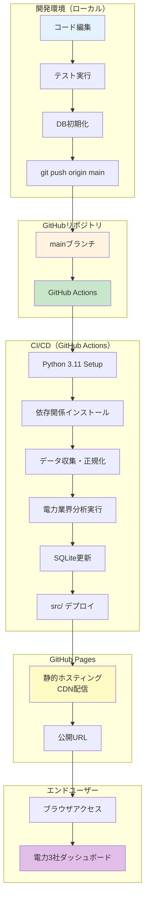

# GitHub Pages デプロイ完全ガイド

電力3社（東京電力・中部電力・JERA）特化株式分析システムを GitHub Pages で本番運用するための完全なデプロイガイドです。

**バージョン**: 1.0.0  
**最終更新**: 2025-11-25  
**ステータス**: Phase 1 実装中  
**公開URL**: https://j1921604.github.io/stock-analysis/  
**リポジトリ**: https://github.com/J1921604/stock-analysis

---

## 📋 目次

1. [システム概要](#システム概要)
2. [クイックスタート](#クイックスタート)
3. [自動デプロイ（GitHub Actions）](#自動デプロイ)
4. [GitHub Pages初回設定](#github-pages初回設定)
5. [ローカルビルド・プレビュー](#ローカルビルドプレビュー)
6. [トラブルシューティング](#トラブルシューティング)
7. [デプロイ前チェックリスト](#デプロイ前チェックリスト)

---

## システム概要

### アーキテクチャ



### デプロイフロー概要

| ステップ            | 実行場所     | 処理内容                                  | 所要時間        |
| ------------------- | ------------ | ----------------------------------------- | --------------- |
| 1. コミット         | ローカル     | `git push origin main`                  | -               |
| 2. トリガー         | GitHub       | GitHub Actions 起動                       | 即時            |
| 3. セットアップ     | CI/CD        | Python 3.11 + 依存関係インストール        | 30-60秒         |
| 4. データ収集       | CI/CD        | EDINET/Yahoo Finance API                  | 5-10分          |
| 5. 分析実行         | CI/CD        | 電力業界特化分析                          | 1-2分           |
| 6. ビルド           | CI/CD        | SQLite → src/                             | 10-20秒         |
| 7. デプロイ         | GitHub Pages | 静的サイト公開                            | 30-60秒         |
| **合計**            | -            | -                                         | **約10-15分**   |

---

## クイックスタート

### 前提条件

- GitHub アカウント
- Git インストール済み
- Python 3.11+ インストール済み
- **EDINET API Subscription Key**（無料・必須）

### EDINET API Key取得と設定

**重要**: 2024年4月以降、EDINET API v2では Subscription Key が必須です。

#### 1. キー取得

1. **EDINET APIポータル**: https://disclosure2.edinet-fsa.go.jp/WEEK0010.aspx
2. 「Subscription Key申込」ボタンをクリック
3. 利用規約に同意してメールアドレスを入力
4. メールで32文字の英数字キーが即時送付される（件名: 【EDINET】Subscription Key発行のお知らせ）

**参考資料**:
- API仕様書: https://disclosure2dl.edinet-fsa.go.jp/guide/static/disclosure/WZEK0110.html
- 利用ガイド(PDF): https://disclosure2dl.edinet-fsa.go.jp/guide/static/disclosure/download/ESE140206.pdf

#### 2. GitHub Secretsに登録

```bash
# GitHubリポジトリページで以下の手順:
Settings → Secrets and variables → Actions → New repository secret

# Secret設定:
Name: EDINET_API_KEY
Value: (メールで受け取った32文字のキー、引用符不要)
```

#### 3. ローカル環境設定

```bash
# .env.example をコピー
cp .env.example .env

# エディタで .env を編集し、キーをそのまま記載（引用符不要）
# EDINET_API_KEY=a1b2c3d4e5f6g7h8i9j0k1l2m3n4o5p6
```

### 1. リポジトリクローン

```powershell
git clone https://github.com/J1921604/stock-analysis.git
cd stock-analysis
```

### 2. ローカル環境構築

```powershell
# Python仮想環境作成
python -m venv venv
.\venv\Scripts\Activate.ps1

# 依存関係インストール
pip install -r requirements.txt

# DB初期化
python scripts/init_db.py
```

### 3. ローカルプレビュー

```powershell
.\start.ps1
```

ブラウザで http://localhost:5000 にアクセス

### 4. GitHub Pagesデプロイ

```powershell
git add .
git commit -m "feat: Initial deployment"
git push origin main
```

GitHub Actions が自動実行され、約10-15分後に https://j1921604.github.io/stock-analysis/ で公開されます。

---

## 自動デプロイ

### GitHub Actions 設定

#### ワークフロー定義（`.github/workflows/daily-update.yml`）

```yaml
name: Daily Data Update

on:
  schedule:
    - cron: '0 9 * * *'  # 毎日18:00 JST (UTC+9)
  workflow_dispatch:     # 手動実行可能

jobs:
  update:
    runs-on: ubuntu-latest
    
    steps:
      - name: Checkout
        uses: actions/checkout@v4
        with:
          lfs: true  # Git LFS対応
      
      - name: Setup Python
        uses: actions/setup-python@v5
        with:
          python-version: '3.11'
      
      - name: Install dependencies
        run: pip install -r requirements.txt
      
      - name: Initialize DB
        run: python scripts/init_db.py
      
      - name: Fetch XBRL data
        run: python scripts/fetch_xbrl.py
        env:
          EDINET_API_KEY: ${{ secrets.EDINET_API_KEY }}
      
      - name: Fetch stock prices
        run: python scripts/fetch_prices.py
      
      - name: Parse XBRL
        run: python scripts/parse_xbrl.py
      
      - name: Run power industry analysis
        run: python scripts/analyzers/power_industry.py
      
      - name: Commit and push
        run: |
          git config user.name "GitHub Actions"
          git config user.email "actions@github.com"
          git add data/db/stock-analysis.db
          git commit -m "chore: Update DB [skip ci]" || echo "No changes"
          git push
```

### GitHub Secrets 設定

1. GitHubリポジトリ → Settings → Secrets and variables → Actions
2. **New repository secret** をクリック
3. 以下のシークレットを追加:

| Name | Value | 説明 |
|------|-------|------|
| `EDINET_API_KEY` | （API キー） | EDINET API認証用（オプション） |

---

## GitHub Pages初回設定

### 1. リポジトリSettings

1. GitHub リポジトリ → **Settings** タブ
2. 左サイドバー → **Pages**

### 2. Source設定

- **Source**: `Deploy from a branch`
- **Branch**: `main`
- **Folder**: `/src` （重要！）
- **Save** をクリック

### 3. デプロイ確認

約1-2分後、以下のURLでアクセス可能:
```
https://j1921604.github.io/stock-analysis/
```

### 4. Custom Domain（オプション）

独自ドメイン使用時:
```
Custom domain: stock-analysis.example.com
Enforce HTTPS: ✅ 有効
```

---

## ローカルビルド・プレビュー

### ビルドスクリプト実行

```powershell
python scripts/build.py
```

### ローカルサーバー起動

```powershell
.\start.ps1
```

または

```powershell
cd src
python -m http.server 5000
```

### ブラウザアクセス

```
http://localhost:5000/
```

---

## トラブルシューティング

### Q1: GitHub Actions が失敗する

**症状**: ワークフローが赤字で失敗

**解決策**:
```powershell
# ログ確認
# GitHub → Actions → 失敗したワークフロー → ログ表示

# よくあるエラー:
# - Python依存関係エラー → requirements.txt 確認
# - DB初期化失敗 → schema.sql 確認
# - API認証エラー → GitHub Secrets 確認
```

### Q2: GitHub Pages で404エラー

**症状**: https://j1921604.github.io/stock-analysis/ が404

**解決策**:
1. Settings → Pages で `/src` フォルダ指定を確認
2. `src/index.html` が存在するか確認
3. GitHub Actions ワークフローが成功しているか確認

### Q3: SQLiteファイルが大きすぎる

**症状**: `file size exceeds GitHub's 100MB limit`

**解決策**:
```powershell
# Git LFS 設定
git lfs install
git lfs track "data/db/*.db"
git add .gitattributes
git commit -m "chore: Add Git LFS"
git push
```

### Q4: データが更新されない

**症状**: ダッシュボードに古いデータが表示される

**解決策**:
```powershell
# ブラウザキャッシュクリア
# Chrome: Ctrl+Shift+Delete → キャッシュ削除

# SQLiteファイル確認
sqlite3 data/db/stock-analysis.db "SELECT MAX(date) FROM stock_prices;"
```

---

## デプロイ前チェックリスト

### コード品質

- [ ] `pytest` でユニットテスト全合格
- [ ] `pytest --cov` でカバレッジ100%
- [ ] `mypy scripts/` で型チェック合格

### データ整合性

- [ ] `python scripts/init_db.py` でDB初期化成功
- [ ] `python scripts/insert_sample_data.py` でサンプルデータ投入成功
- [ ] `sqlite3 data/db/stock-analysis.db "SELECT COUNT(*) FROM companies;"` で3件（東京電力・中部電力・JERA）確認

### ビルド検証

- [ ] `python scripts/build.py` でビルド成功
- [ ] `src/index.html` 存在確認
- [ ] `.\start.ps1` でローカルプレビュー正常表示

### GitHub設定

- [ ] GitHub Secrets 設定済み（EDINET_API_KEY）
- [ ] GitHub Pages → Source → `/src` 設定済み
- [ ] GitHub Actions ワークフロー有効化

### ドキュメント

- [ ] README.md 更新（v1.0.0, 2025-11-25）
- [ ] 完全仕様書.md 更新
- [ ] DEPLOY_GUIDE.md（本ドキュメント）更新

---

## セキュリティ設定

### 環境変数管理

```yaml
# ❌ NG: 平文でコミット
EDINET_API_KEY = "abc123..."

# ✅ OK: GitHub Secrets 使用
env:
  EDINET_API_KEY: ${{ secrets.EDINET_API_KEY }}
```

### HTTPS強制

GitHub Pages設定:
- **Enforce HTTPS**: ✅ 有効

### レート制限対策

```python
import time

# EDINET API: 1秒/1ファイル
def download_xbrl(doc_id):
    response = requests.get(url)
    time.sleep(1)  # レート制限遵守
    return response
```

---

## 関連ドキュメント

| ドキュメント | リンク |
|-------------|--------|
| **完全実装仕様書** | [docs/完全仕様書.md](https://github.com/J1921604/stock-analysis/blob/main/docs/完全仕様書.md) |
| **要件定義書** | [specs/001-stock-analysis-system/checklists/requirements.md](https://github.com/J1921604/stock-analysis/blob/main/specs/001-stock-analysis-system/checklists/requirements.md) |
| **実装計画書** | [specs/feature/impl-001-stock-analysis-system/plan.md](https://github.com/J1921604/stock-analysis/blob/main/specs/feature/impl-001-stock-analysis-system/plan.md) |
| **開発憲法** | [.specify/memory/constitution.md](https://github.com/J1921604/stock-analysis/blob/main/.specify/memory/constitution.md) |

---

**変更履歴**:
- 2025-11-25: 初版作成（v1.0.0）- 電力3社特化システム対応
