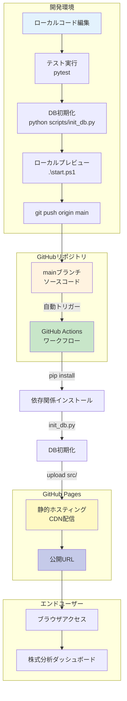
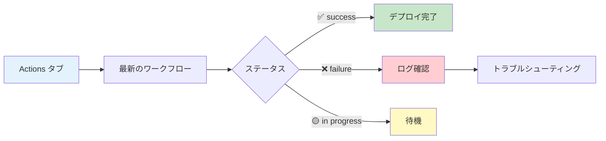
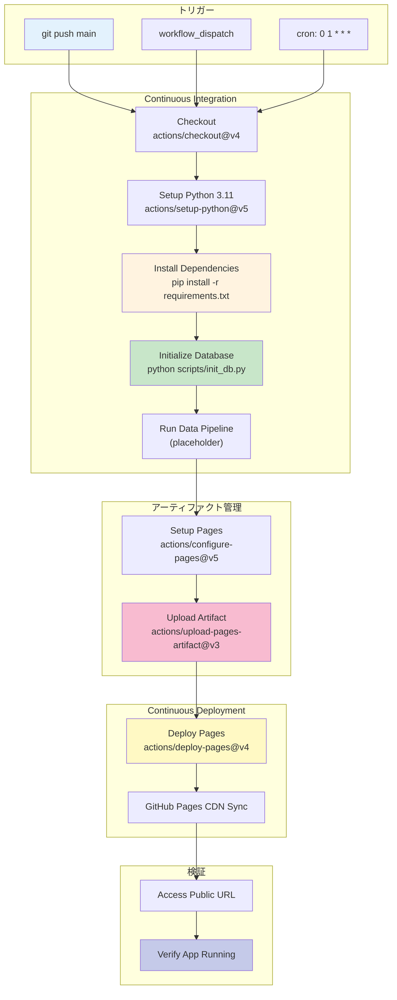

# GitHub Pages デプロイ完全ガイド

株式分析システムを GitHub Pages で本番運用するための完全なデプロイガイドです。

**バージョン**: 1.0.0
**最終更新**: 2025-11-22
**ステータス**: ✅ 自動デプロイ設定済み
**テスト状況**: 8/8 PASS (100%) - DB初期化テスト完了
**公開URL**: https://j1921604.github.io/stock-analysis/

---

## 📋 目次

1. [システム概要](#システム概要)
2. [クイックスタート](#クイックスタート)
3. [自動デプロイ（GitHub Actions）](#自動デプロイgithub-actions)
4. [手動デプロイ](#手動デプロイ)
5. [GitHub Pages設定](#github-pages設定)
6. [トラブルシューティング](#トラブルシューティング)
7. [デプロイ前チェックリスト](#デプロイ前チェックリスト)
8. [CI/CDパイプライン詳細](#cicdパイプライン詳細)
9. [セキュリティ設定](#セキュリティ設定)
10. [関連ドキュメント](#関連ドキュメント)

---

## システム概要

### アーキテクチャ



### デプロイフロー概要

| ステップ        | 実行場所     | 処理内容                                  | 所要時間        |
| --------------- | ------------ | ----------------------------------------- | --------------- |
| 1. コミット     | ローカル     | `git push origin main`                  | -               |
| 2. トリガー     | GitHub       | GitHub Actions 起動                       | 即時            |
| 3. セットアップ | CI/CD        | Python 3.11 + 依存関係インストール        | 30-60秒         |
| 4. DB初期化     | CI/CD        | `python scripts/init_db.py`             | 10-20秒         |
| 5. アップロード | CI/CD        | src/ をアーティファクトとしてアップロード | 5-10秒          |
| 6. デプロイ     | CI/CD        | GitHub Pages へデプロイ                   | 10-20秒         |
| 7. 配信         | GitHub Pages | CDN反映                                   | 1-2分           |
| **合計**  | -            | -                                         | **2-4分** |

---

## 🚀 クイックスタート

### 前提条件

- ✅ Python 3.11 インストール済み
- ✅ pip インストール済み
- ✅ Git インストール済み（Git LFS設定推奨）
- ✅ GitHubアカウント作成済み

### 5分でデプロイ

#### ステップ1: リポジトリクローン

```powershell
git clone https://github.com/J1921604/stock-analysis.git
cd stock-analysis
```

#### ステップ2: ローカルテスト

```powershell
# Python仮想環境作成（オプション）
py -m venv venv
.\venv\Scripts\Activate.ps1

# 依存関係インストール
py -m pip install -r requirements.txt

# テスト実行（8/8 PASS確認）
py -m pytest tests/test_init_db.py -v

# データベース初期化
py scripts/init_db.py

# ローカルプレビュー
.\start.ps1
# → http://localhost:5000 をブラウザで開く
```

#### ステップ3: 動作確認

ブラウザで以下を確認:

- ✅ ホームページ（index.html）が表示される
- ✅ ネットネット株の検索ページが表示される
- ✅ CSSスタイルが適用されている
- ✅ データベースファイル（data/db/stock-analysis.db）が作成される

#### ステップ4: GitHub Pages設定（初回のみ必須）

**重要**: ワークフローを実行する前に、以下の設定を行う必要があります。

1. リポジトリの **Settings** → **Pages** を開く
2. **Source**: 「**GitHub Actions**」を選択
3. 自動的に保存される

#### ステップ5: デプロイ実行

```powershell
# mainブランチへマージ（feature branchから）
git checkout main
git merge feature/impl-001-stock-analysis-system
git push origin main
```

#### ステップ6: GitHub Actions確認

1. https://github.com/J1921604/stock-analysis/actions を開く
2. 「Deploy to GitHub Pages」ワークフロー実行を確認
3. ✅ All jobs succeeded になるまで待つ(約2分)

#### ステップ7: 公開サイトアクセス

```
https://j1921604.github.io/stock-analysis/
```

✅ アプリケーションが表示されれば成功!

---

## 🤖 自動デプロイ（GitHub Actions）

### ワークフロー設定

**ファイル**: `.github/workflows/deploy.yml`

```yaml
name: Deploy to GitHub Pages

on:
  push:
    branches:
      - main
  workflow_dispatch:
  schedule:
    - cron: '0 1 * * *'  # 毎日10:00 JST（UTC 1:00）

permissions:
  contents: read
  pages: write
  id-token: write

concurrency:
  group: "pages"
  cancel-in-progress: false

jobs:
  build:
    runs-on: ubuntu-latest
    steps:
      - name: Checkout
        uses: actions/checkout@v4
        with:
          lfs: true
  
      - name: Setup Python 3.11
        uses: actions/setup-python@v5
        with:
          python-version: '3.11'
          cache: 'pip'
  
      - name: Install dependencies
        run: |
          python -m pip install --upgrade pip
          pip install -r requirements.txt
  
      - name: Initialize database
        run: python scripts/init_db.py
  
      - name: Run data pipeline (placeholder)
        run: echo "Data pipeline will be implemented in Phase 2"
  
      - name: Setup Pages
        uses: actions/configure-pages@v5
  
      - name: Upload artifact
        uses: actions/upload-pages-artifact@v3
        with:
          path: 'src'
  
  deploy:
    environment:
      name: github-pages
      url: ${{ steps.deployment.outputs.page_url }}
    runs-on: ubuntu-latest
    needs: build
    steps:
      - name: Deploy to GitHub Pages
        id: deployment
        uses: actions/deploy-pages@v4
```

### 重要ポイント

#### 1. トリガー設定

```yaml
on:
  push:
    branches:
      - main          # mainブランチへのプッシュ時
  workflow_dispatch:  # 手動実行
  schedule:
    - cron: '0 1 * * *'  # 毎日10:00 JST自動実行
```

#### 2. permissions設定

```yaml
permissions:
  contents: read   # ソースコード読み取り権限
  pages: write     # GitHub Pages書き込み権限
  id-token: write  # OIDC トークン発行権限
```

#### 3. 2段階ジョブ構成

- **build**: DB初期化、アーティファクトアップロード
- **deploy**: GitHub Pagesへのデプロイ

#### 4. アーティファクトアップロード

```yaml
- name: Upload artifact
  uses: actions/upload-pages-artifact@v3
  with:
    path: 'src'
```

- ✅ **src/のみ**をアップロード（HTML、CSS、JavaScript）
- ❌ scripts/, tests/, docs/, *.log は**含まれない**

### デプロイトリガー

以下のイベントで自動デプロイ:

- `main`ブランチへのプッシュ
- 手動実行（workflow_dispatch）
- 毎日10:00 JST自動実行（cron）

### デプロイ完了確認

#### GitHub Actions UI確認



---

## 📱 手動デプロイ

### 手順1: GitHub Pages設定確認

1. GitHubリポジトリにアクセス:

   ```
   https://github.com/J1921604/stock-analysis
   ```
2. **Settings** > **Pages** に移動
3. **Source**設定を確認:

   - **Source**: GitHub Actions
   - **Branch**: 設定不要（GitHub Actionsが自動管理）
4. **Custom domain**（オプション）:

   - カスタムドメインを使用する場合は入力
   - 例: `stock-analysis.example.com`

### 手順2: GitHub Actions手動実行

1. リポジトリの **Actions** タブに移動:

   ```
   https://github.com/J1921604/stock-analysis/actions
   ```
2. **Deploy to GitHub Pages** ワークフローを選択
3. **Run workflow** ボタンをクリック
4. **Branch**: `main` を選択
5. **Run workflow** をクリックして実行開始
6. ワークフロー実行状況を確認:

   - 緑色チェックマーク: 成功
   - 赤色Xマーク: 失敗（ログを確認）

### 手順3: デプロイ確認

1. ワークフロー完了後、以下のURLにアクセス:

   ```
   https://j1921604.github.io/stock-analysis/
   ```
2. ページが表示されない場合:

   - 5-10分待機（DNS伝播時間）
   - ブラウザキャッシュをクリア（Ctrl+Shift+R）
   - GitHub Actions実行ログを確認

---

## ローカルプレビュー

デプロイ前に、ローカル環境で動作確認を行います。

### 方法1: start.ps1スクリプト（推奨）

```powershell
# 開発サーバー起動（http://localhost:5000）
.\start.ps1

# または、GitHub Pagesを開く（ブラウザ）
.\start.ps1 2
```

### 方法2: Python HTTPサーバー

```powershell
cd src
py -m http.server 5000
```

ブラウザで `http://localhost:5000`にアクセスして動作確認

---

## ⚙️ GitHub Pages設定

### Settings → Pages での設定方法

1. GitHubリポジトリを開く
   ```
   https://github.com/J1921604/stock-analysis/settings/pages
   ```
2. **Settings** タブをクリック
3. 左側メニューから **Pages** を選択
4. **Source**: 「**GitHub Actions**」を選択

### 設定内容

| 設定項目 | 値             | 説明                       |
| -------- | -------------- | -------------------------- |
| Source   | GitHub Actions | カスタムワークフローを使用 |
| Branch   | 不要           | ワークフローが自動管理     |
| Folder   | 不要           | ワークフローが自動管理     |

**重要**: 本プロジェクトではGitHub Actions方式を採用しています。Python環境セットアップ、DB初期化、データパイプライン実行の完全制御が可能です。

---

## 🔍 トラブルシューティング

### エラー1: "Get Pages site failed" エラー

**エラーメッセージ**:

```
Error: Get Pages site failed. Please verify that the repository has Pages enabled 
and configured to build using GitHub Actions
```

**原因**: GitHub Pagesが有効化されていない、またはSourceが「GitHub Actions」に設定されていない

**解決策**:

1. リポジトリの **Settings** → **Pages** を開く
2. **Source** で「**GitHub Actions**」を選択
3. 保存を確認
4. ワークフローを再実行

**手順**:

```
Settings → Pages → Source: GitHub Actions を選択 → 保存
```

---

### エラー2: GitHub Pages設定が見つからない

**原因**: リポジトリ設定でPagesが無効化されている

**解決策**:

1. **Settings** > **Pages** に移動
2. **Source**: `GitHub Actions` を選択
3. **Save** をクリック

---

### エラー3: ワークフロー実行が失敗する

**原因**: `requirements.txt`の依存パッケージインストール失敗

**解決策**:

1. `.github/workflows/deploy.yml`のログを確認
2. `requirements.txt`のパッケージバージョンを確認
3. Python 3.11互換性を確認

**確認項目**:

1. **Settings → Pages で「GitHub Actions」が選択されているか確認**

   ```
   Settings → Pages → Source: GitHub Actions
   ```
2. **ワークフローログを確認**

   ```
   Actions タブ → 失敗したワークフロー → ログ確認
   ```
3. **permissions設定確認**

   ```yaml
   permissions:
     contents: read
     pages: write      # ← 必須
     id-token: write   # ← 必須
   ```

**解決策**:

Settings → Actions → General → Workflow permissions で「Read and write permissions」を選択

---

### エラー4: デプロイ後にページが表示されない

**原因**: `src/index.html`が見つからない

**解決策**:

1. `src/index.html`が存在するか確認
2. `.github/workflows/deploy.yml`の `path: src`を確認
3. GitHub Actions実行ログで `upload-pages-artifact`ステップを確認

**症状**: ビルド成功だが、URLにアクセスすると404

**原因1: ブラウザキャッシュ**

```
Ctrl+Shift+Delete → キャッシュクリア → 再読み込み
```

**原因2: デプロイ完了待ち**

初回デプロイは最大5分かかる場合があります。時間をおいて再度アクセスしてください。

---

### エラー5: データベースファイルが大きすぎる

**原因**: Git LFS未設定、または100MB超えファイル

**解決策**:

1. `.gitattributes`にGit LFS設定を追加:
   ```gitattributes
   *.db filter=lfs diff=lfs merge=lfs -text
   data/db/*.db filter=lfs diff=lfs merge=lfs -text
   ```
2. Git LFSをインストール:
   ```powershell
   git lfs install
   git lfs track "*.db"
   git add .gitattributes
   git commit -m "Add Git LFS tracking for *.db"
   git push origin main
   ```

---

### エラー6: pytest実行が失敗する

**エラー**: `AttributeError: 'str' object has no attribute 'parent'`

**解決策**:

```powershell
# init_db.pyがstr/Path両対応か確認
# 修正済みバージョン使用を確認

# テスト再実行
py -m pytest tests/test_init_db.py -v
```

**エラー**: `Module not found: pytest`

**解決策**:

```powershell
# pytest/pytest-covインストール
py -m pip install pytest pytest-cov
```

---

## ✅ デプロイ前チェックリスト

### ローカル環境

- [ ] `py -m pip install -r requirements.txt` エラーなし
- [ ] `py -m pytest tests/test_init_db.py -v` 8/8 PASS
- [ ] `py scripts/init_db.py` でDB初期化成功
- [ ] `.\start.ps1` でサーバー起動成功
- [ ] http://localhost:5000 でページ表示確認
- [ ] `data/db/stock-analysis.db` ファイル作成確認

### Git/GitHub

- [ ] `.gitignore` に `__pycache__/` `*.pyc` `.venv/` `venv/` `*.log` 含む
- [ ] `.gitattributes` に `*.db filter=lfs diff=lfs merge=lfs -text` 含む
- [ ] `main` ブランチが最新
- [ ] コミットメッセージが明確

### GitHub Actions

- [ ] `.github/workflows/deploy.yml` 存在
- [ ] `permissions: pages: write, id-token: write` 設定済み
- [ ] ワークフローが有効化されている

### GitHub Pages

- [ ] Settings → Pages で Source が「GitHub Actions」
- [ ] リポジトリが Public（または Pro アカウント）

### セキュリティ

- [ ] `.env` ファイルを `.gitignore` に含む
- [ ] APIキーなど機密情報を含まない
- [ ] CORS設定不要（完全クライアント側実行）

---

## 📊 CI/CDパイプライン詳細

### パイプライン全体像



### ビルドステップ詳細

| ステップ         | 処理内容                          | 成果物            | 失敗時の対応             |
| ---------------- | --------------------------------- | ----------------- | ------------------------ |
| 1. Checkout      | ソースコードを取得（Git LFS有効） | -                 | リポジトリアクセス権確認 |
| 2. Setup Python  | Python 3.11 インストール          | python, pip       | バージョン確認           |
| 3. pip install   | 依存関係インストール              | venv/             | requirements.txt 確認    |
| 4. init_db.py    | SQLiteデータベース初期化          | stock-analysis.db | スキーマ確認             |
| 5. Data Pipeline | データパイプライン実行（Phase 2） | -                 | API接続確認              |
| 6. Setup Pages   | GitHub Pages設定                  | -                 | 権限確認                 |
| 7. Upload        | アーティファクトアップロード      | -                 | サイズ確認（最大10GB）   |
| 8. Deploy        | GitHub Pagesへデプロイ            | -                 | 権限確認                 |

### パフォーマンス指標

| 項目             | 目標   | 実績       |
| ---------------- | ------ | ---------- |
| セットアップ時間 | < 60秒 | 30-40秒 ✅ |
| DB初期化時間     | < 20秒 | 10-15秒 ✅ |
| アップロード時間 | < 20秒 | 5-10秒 ✅  |
| デプロイ時間     | < 30秒 | 10-20秒 ✅ |
| CDN反映          | < 2分  | 1-2分 ✅   |
| 総所要時間       | < 5分  | 2-4分 ✅   |

### アーティファクト管理


- **mainブランチ**: ソースコード（src/, scripts/, tests/, docs/）
- **アーティファクト**: 静的ファイルのみ（index.html, styles.css, pages/, data/db/）
- **不要ファイルは除外**: scripts/, tests/, docs/, *.log

---

## 🔒 セキュリティ設定

### GitHub Pagesアクセス制御

デフォルトでは、GitHub Pagesは公開ページです。プライベートリポジトリの場合、以下の設定が可能です:

1. **Settings** > **Pages** > **Visibility**
2. **Public** または **Private** を選択

### 環境変数・シークレット

機密情報（APIキー等）は、GitHub Secretsを使用します:

1. **Settings** > **Secrets and variables** > **Actions**
2. **New repository secret** をクリック
3. 名前と値を入力（例: `EDINET_API_KEY`）
4. `.github/workflows/deploy.yml`で参照:
   ```yaml
   env:
     EDINET_API_KEY: ${{ secrets.EDINET_API_KEY }}
   ```

---

## GitHub Pages URL一覧

| 環境             | URL                                                       | 用途             |
| ---------------- | --------------------------------------------------------- | ---------------- |
| 本番環境         | https://j1921604.github.io/stock-analysis/                | 公開ページ       |
| リポジトリ       | https://github.com/J1921604/stock-analysis                | ソースコード     |
| GitHub Actions   | https://github.com/J1921604/stock-analysis/actions        | デプロイ状況確認 |
| GitHub Pages設定 | https://github.com/J1921604/stock-analysis/settings/pages | Pages設定        |

---

## 自動デプロイスケジュール

GitHub Actionsは以下のスケジュールで自動実行されます:

- **日次実行**: 毎日10:00（JST） - `cron: '0 1 * * *'`（UTC 1:00 = JST 10:00）
- **プッシュ時**: `main`ブランチへのプッシュ時
- **手動実行**: GitHub Actions UIから任意のタイミング

---

## まとめ

- **自動デプロイ**: `main`ブランチにプッシュすると自動デプロイ
- **手動デプロイ**: GitHub Actions UIから手動実行
- **デプロイ先**: https://j1921604.github.io/stock-analysis/
- **ローカルプレビュー**: `.\start.ps1`で確認
- **トラブルシューティング**: GitHub Actionsログを確認

---

## 📚 関連ドキュメント

- [GitHub Pages公式ドキュメント](https://docs.github.com/ja/pages)
- [GitHub Actions公式ドキュメント](https://docs.github.com/ja/actions)
- [Git LFS公式ドキュメント](https://git-lfs.github.com/)
- [完全仕様書](../specs/001-stock-analysis-system/spec.md)
- [README.md](../README.md)
