# GitHub Pages デプロイ完全ガイド

タスク管理アプリケーションを GitHub Pages で本番運用するための完全なデプロイガイドです。

**バージョン**: 1.0.0
**最終更新**: 2025-11-20
**ステータス**: ✅ 自動デプロイ設定済み
**テスト状況**: 77/77 PASS (100%)
**公開URL**: https://j1921604.github.io/ToDo/

---

## 📋 目次

1. [システム概要](#システム概要)
2. [クイックスタート](#クイックスタート)
3. [自動デプロイ（GitHub Actions）](#自動デプロイgithub-actions)
4. [GitHub Pages設定](#github-pages設定)
5. [トラブルシューティング](#トラブルシューティング)
6. [デプロイ前チェックリスト](#デプロイ前チェックリスト)
7. [CI/CDパイプライン詳細](#cicdパイプライン詳細)

---

## システム概要

### アーキテクチャ

```mermaid
flowchart TB
    subgraph Developer["開発環境"]
        A[ローカルコード編集]
        B[テスト実行<br/>npm run test]
        C[ビルド確認<br/>npm run build]
        D[git push origin main]
    end
  
    subgraph GitHub["GitHubリポジトリ"]
        E[mainブランチ<br/>ソースコード]
        F[GitHub Actions<br/>ワークフロー]
    end
  
    subgraph Deploy["GitHub Pages"]
        H[静的ホスティング<br/>CDN配信]
        I[公開URL]
    end
  
    subgraph Users["エンドユーザー"]
        J[ブラウザアクセス]
        K[アプリケーション利用]
    end
  
    A --> B
    B --> C
    C --> D
    D --> E
    E -->|自動トリガー| F
    F -->|npm ci| F1[依存関係インストール]
    F1 -->|npm run build| F2[Viteビルド<br/>dist/生成]
    F2 -->|actions/deploy-pages| H
    H --> I
    I --> J
    J --> K
  
    style A fill:#e3f2fd
    style E fill:#fff3e0
    style F fill:#c8e6c9
    style H fill:#fff9c4
    style I fill:#c5cae9
```



### デプロイフロー概要

| ステップ        | 実行場所     | 処理内容                                   | 所要時間        |
| --------------- | ------------ | ------------------------------------------ | --------------- |
| 1. コミット     | ローカル     | `git push origin main`                   | -               |
| 2. トリガー     | GitHub       | GitHub Actions 起動                        | 即時            |
| 3. ビルド       | CI/CD        | `npm ci && npm run build`                | 30-60秒         |
| 4. アップロード | CI/CD        | dist/ をアーティファクトとしてアップロード | 5-10秒          |
| 5. デプロイ     | CI/CD        | GitHub Pages へデプロイ                    | 10-20秒         |
| 6. 配信         | GitHub Pages | CDN反映                                    | 1-2分           |
| **合計**  | -            | -                                          | **2-4分** |

---

## 🚀 クイックスタート

### 前提条件

- ✅ Node.js 20.x インストール済み
- ✅ npm 10.x インストール済み
- ✅ Git インストール済み
- ✅ GitHubアカウント作成済み

### 5分でデプロイ

#### ステップ1: リポジトリクローン

```bash
git clone https://github.com/J1921604/ToDo.git
cd ToDo
```

#### ステップ2: ローカルテスト

```bash
# 依存関係インストール
npm install

# テスト実行（77/77 PASS確認）
npm run test

# ビルド
npm run build

# ローカルプレビュー
npm run preview
# → http://localhost:4173/ToDo/ をブラウザで開く
```

#### ステップ3: 動作確認

ブラウザで以下を確認:

- ✅ アップロードボタンが表示される
- ✅ 写真ファイル選択ダイアログが開く
- ✅ レスポンシブデザインが適用されている

#### ステップ4: GitHub Pages設定（初回のみ必須）

**重要**: ワークフローを実行する前に、以下の設定を行う必要があります。

1. リポジトリの **Settings** → **Pages** を開く
2. **Source**: 「**GitHub Actions**」を選択
3. 自動的に保存される

#### ステップ5: デプロイ実行

```bash
# mainブランチへプッシュ
git checkout main
git pull origin main
git add .
git commit -m "Deploy: Initial release"
git push origin main
```

#### ステップ6: GitHub Actions確認

1. https://github.com/J1921604/ToDo/actions を開く
2. 「Deploy to GitHub Pages」ワークフロー実行を確認
3. ✅ All jobs succeeded になるまで待つ(約2分)

#### ステップ7: 公開サイトアクセス

```
https://j1921604.github.io/ToDo/
```

✅ アプリケーションが表示されれば成功!

---

## 🤖 自動デプロイ（GitHub Actions）

### ワークフロー設定

**ファイル**: `.github/workflows/deploy.yml`

```yaml
name: Deploy to GitHub Pages

on:
  push:
    branches:
      - main

permissions:
  contents: read
  pages: write
  id-token: write

concurrency:
  group: "pages"
  cancel-in-progress: true

jobs:
  build:
    runs-on: ubuntu-latest
    steps:
      - name: Checkout
        uses: actions/checkout@v4
        with:
          fetch-depth: 0
      
      - name: Setup Node.js
        uses: actions/setup-node@v4
        with:
          node-version: '20'
          cache: 'npm'
        
      - name: Install dependencies
        run: npm ci
      
      - name: Build project
        run: npm run build
      
      - name: List dist contents
        run: ls -la dist/
      
      - name: Setup Pages
        uses: actions/configure-pages@v4
      
      - name: Upload artifact
        uses: actions/upload-pages-artifact@v3
        with:
          path: './dist'
        
  deploy:
    environment:
      name: github-pages
      url: ${{ steps.deployment.outputs.page_url }}
    runs-on: ubuntu-latest
    needs: build
    steps:
      - name: Deploy to GitHub Pages
        id: deployment
        uses: actions/deploy-pages@v4
```

### 重要ポイント

#### 1. permissions設定

```yaml
permissions:
  contents: read   # ソースコード読み取り権限
  pages: write     # GitHub Pages書き込み権限
  id-token: write  # OIDC トークン発行権限
```

#### 2. 2段階ジョブ構成

- **build**: ビルドとアーティファクトアップロード
- **deploy**: GitHub Pagesへのデプロイ

#### 3. アーティファクトアップロード

```yaml
- name: Upload artifact
  uses: actions/upload-pages-artifact@v3
  with:
    path: './dist'
```

- ✅ **dist/のみ**をアップロード
- ❌ docs/, node_modules/, *.log は**含まれない**

### デプロイトリガー

以下のブランチへのプッシュで自動デプロイ:

- `main`

### デプロイ完了確認

#### GitHub Actions UI確認

```mermaid
flowchart LR
    A[Actions タブ] --> B[最新のワークフロー]
    B --> C{ステータス}
    C -->|✅ success| D[デプロイ完了]
    C -->|❌ failure| E[ログ確認]
    C -->|🟡 in progress| F[待機]
  
    E --> G[トラブルシューティング]
  
    style A fill:#e3f2fd
    style D fill:#c8e6c9
    style E fill:#ffcdd2
    style F fill:#fff9c4
```



---

## ⚙️ GitHub Pages設定

### Settings → Pages での設定方法

1. GitHubリポジトリを開く
2. **Settings** タブをクリック
3. 左側メニューから **Pages** を選択
4. **Source**: 「**GitHub Actions**」を選択

### 設定内容

| 設定項目 | 値             | 説明                       |
| -------- | -------------- | -------------------------- |
| Source   | GitHub Actions | カスタムワークフローを使用 |
| Branch   | 不要           | ワークフローが自動管理     |
| Folder   | 不要           | ワークフローが自動管理     |

**重要**: 本プロジェクトではGitHub Actions方式を採用しています。ビルドプロセスの完全制御、依存関係の自動管理、テスト統合が可能です。

---

## 🔍 トラブルシューティング

### 問題1: "Get Pages site failed" エラー

**エラーメッセージ**:

```
Error: Get Pages site failed. Please verify that the repository has Pages enabled 
and configured to build using GitHub Actions
```

**原因**: GitHub Pagesが有効化されていない、またはSourceが「GitHub Actions」に設定されていない

**解決策**:

1. リポジトリの **Settings** → **Pages** を開く
2. **Source** で「**GitHub Actions**」を選択
3. 保存を確認
4. ワークフローを再実行

**手順**:

```
Settings → Pages → Source: GitHub Actions を選択 → 保存
```

---

### 問題2: デプロイワークフローが失敗する

**症状**: GitHub Actionsワークフローが失敗する

**確認項目**:

1. **Settings → Pages で「GitHub Actions」が選択されているか確認**

   ```
   Settings → Pages → Source: GitHub Actions
   ```
2. **ワークフローログを確認**

   ```
   Actions タブ → 失敗したワークフロー → ログ確認
   ```
3. **permissions設定確認**

   ```yaml
   permissions:
     contents: read
     pages: write      # ← 必須
     id-token: write   # ← 必須
   ```

**解決策**:

Settings → Actions → General → Workflow permissions で「Read and write permissions」を選択

---

### 問題3: npm run build 失敗

**エラー**: `Module not found: sql.js`

**解決策**:

```powershell
# キャッシュクリア
npm cache clean --force

# node_modules削除
Remove-Item -Recurse -Force node_modules

# 再インストール
npm install

# ビルド
npm run build
```

**エラー**: `Cannot find module '@vitejs/plugin-react'`

**解決策**:

```powershell
# 開発依存関係を明示的にインストール
npm install --save-dev vite
```

---

### 問題4: GitHub Pagesに反映されない

**症状**: ビルド成功だが、URLにアクセスすると404

**原因1: ブラウザキャッシュ**

```
Ctrl+Shift+Delete → キャッシュクリア → 再読み込み
```

**原因2: base path設定誤り**

`vite.config.js` の `base` 設定がリポジトリ名と一致しているか確認:

```javascript
export default defineConfig({
  base: '/ToDo/',  // ← リポジトリ名と一致させる
  // 例: リポジトリが github.com/J1921604/ToDo なら '/ToDo/'
  // 例: リポジトリが github.com/J1921604/my-app なら '/my-app/'
})
```

**修正が必要な場合**:

```powershell
# vite.config.js を編集
# base: '/間違った名前/' を base: '/正しいリポジトリ名/' に変更

# 再ビルド
npm run build

# コミット・プッシュ
git add vite.config.js
git commit -m "Fix: Update base path"
git push origin main
```

**原因3: デプロイ完了待ち**

初回デプロイは最大5分かかる場合があります。時間をおいて再度アクセスしてください。

---

### 問題5: WASMファイルが読み込めない

**エラー**: `Failed to load sql-wasm.wasm`

**確認**:

```powershell
# dist/内のWASMファイル確認
Get-ChildItem -Recurse -Filter *.wasm dist/
```

**解決策**: `vite.config.js` に以下が含まれているか確認

```javascript
export default defineConfig({
  assetsInclude: ['**/*.wasm'],
  server: {
    mime: {
      'application/wasm': ['wasm']
    }
  }
})
```

---

## ✅ デプロイ前チェックリスト

### ローカル環境

- [ ] `npm install` エラーなし
- [ ] `npm run test` 77/77 PASS
- [ ] `npm run build` エラーなし
- [ ] `npm run preview` でアプリが動作
- [ ] ファイルアップロード機能確認
- [ ] ソート機能確認（日付/名前、昇順/降順）

### Git/GitHub

- [ ] `.gitignore` に `node_modules/` `dist/` `*.log` 含む
- [ ] `main` ブランチが最新
- [ ] コミットメッセージが明確

### GitHub Actions

- [ ] `.github/workflows/deploy.yml` 存在
- [ ] `permissions: pages: write, id-token: write` 設定済み
- [ ] ワークフローが有効化されている

### GitHub Pages

- [ ] Settings → Pages で Source が「GitHub Actions」
- [ ] リポジトリが Public（または Pro アカウント）
- [ ] `vite.config.js` の base path正しい

### セキュリティ

- [ ] `.env` ファイルを `.gitignore` に含む
- [ ] APIキーなど機密情報を含まない
- [ ] CORS設定不要（完全クライアント側実行）

---

## 📊 CI/CDパイプライン詳細

### パイプライン全体像

```mermaid
flowchart TB
    subgraph Trigger ["トリガー"]
        A1["git push main"]
    end
  
    subgraph CI ["Continuous Integration"]
        B1["Checkout<br/>actions/checkout@v4"]
        B2["Setup Node.js 20<br/>actions/setup-node@v4"]
        B3["Install Dependencies<br/>npm ci"]
        B4["Build Project<br/>npm run build"]
        B5["Verify Build<br/>ls -la dist/"]
    end
  
    subgraph Artifact ["アーティファクト管理"]
        C1["Setup Pages<br/>actions/configure-pages@v4"]
        C2["Upload Artifact<br/>actions/upload-pages-artifact@v3"]
    end
  
    subgraph CD ["Continuous Deployment"]
        D1["Deploy Pages<br/>actions/deploy-pages@v4"]
        D2["GitHub Pages CDN Sync"]
    end
  
    subgraph Verify ["検証"]
        E1["Access Public URL"]
        E2["Verify App Running"]
    end
  
    A1 --> B1
    B1 --> B2
    B2 --> B3
    B3 --> B4
    B4 --> B5
    B5 --> C1
    C1 --> C2
    C2 --> D1
    D1 --> D2
    D2 --> E1
    E1 --> E2
  
    style A1 fill:#e3f2fd
    style B3 fill:#fff3e0
    style B4 fill:#c8e6c9
    style C2 fill:#f8bbd0
    style D1 fill:#fff9c4
    style E2 fill:#c5cae9
```



### ビルドステップ詳細

| ステップ         | 処理内容                     | 成果物        | 失敗時の対応             |
| ---------------- | ---------------------------- | ------------- | ------------------------ |
| 1. Checkout      | ソースコードを取得           | -             | リポジトリアクセス権確認 |
| 2. Setup Node    | Node.js 20.x インストール    | node, npm     | バージョン確認           |
| 3. npm ci        | 依存関係インストール         | node_modules/ | package-lock.json 再生成 |
| 4. npm run build | Viteビルド実行               | dist/         | ローカルでビルド確認     |
| 5. Setup Pages   | GitHub Pages設定             | -             | 権限確認                 |
| 6. Upload        | アーティファクトアップロード | -             | サイズ確認（最大10GB）   |
| 7. Deploy        | GitHub Pagesへデプロイ       | -             | 権限確認                 |

### パフォーマンス指標

| 項目             | 目標   | 実績       |
| ---------------- | ------ | ---------- |
| ビルド時間       | < 60秒 | 30-40秒 ✅ |
| アップロード時間 | < 20秒 | 5-10秒 ✅  |
| デプロイ時間     | < 30秒 | 10-20秒 ✅ |
| CDN反映          | < 2分  | 1-2分 ✅   |
| 総所要時間       | < 5分  | 2-4分 ✅   |

### アーティファクト管理

```mermaid
flowchart LR
    A[mainブランチ<br/>ソースコード] --> B[GitHub Actions<br/>ビルド環境]
    B --> C[dist/<br/>一時ビルド成果物]
    C --> D[Pages Artifact<br/>アップロード]
    D --> E[GitHub Pages<br/>公開配信]
  
    style A fill:#e3f2fd
    style C fill:#fff9c4
    style D fill:#f8bbd0
    style E fill:#c5cae9
```



- **mainブランチ**: ソースコード（src/, tests/, docs/）
- **アーティファクト**: ビルド成果物のみ（index.html, assets/, sql.js-wasm/）
- **不要ファイルは除外**: node_modules/, docs/, *.log

---

## 📚 関連ドキュメント

- [README.md](https://github.com/J1921604/ToDo/blob/main/README.md) - プロジェクト概要
- [完全仕様書.md](https://github.com/J1921604/ToDo/blob/main/docs/完全仕様書.md) - 完全な仕様書
- [DEPLOY_GUIDE.md](https://github.com/J1921604/ToDo/blob/main/docs/DEPLOY_GUIDE.md) - デプロイ手順
- [GitHub Pages 公式ドキュメント](https://docs.github.com/pages)
- [GitHub Actions 公式ドキュメント](https://docs.github.com/actions)
- [リポジトリ](https://github.com/J1921604/ToDo)

---
