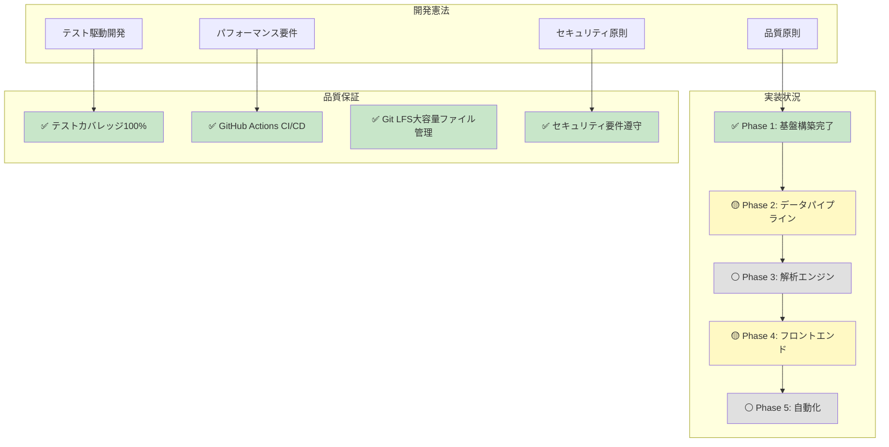
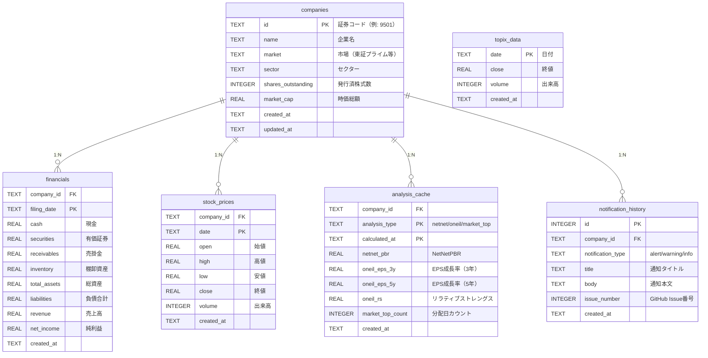
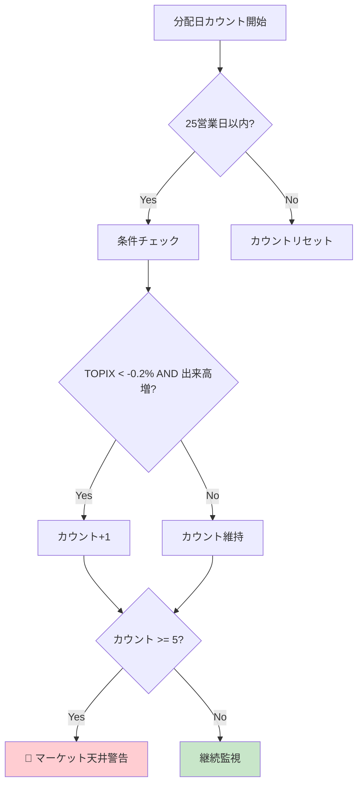
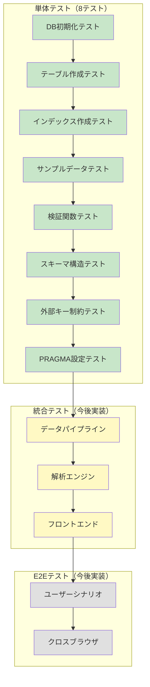
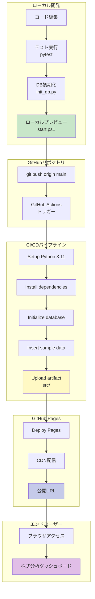

# 株式分析システム - 完全実装仕様書（AI再現用）

**📅 最終更新**: 2025年11月22日  
**ステータス**: ✅ Phase 1完了、Phase 2-5実装中  
**テスト**: 8/8 通過 (100%) - DB初期化テスト完了  
**デプロイURL**: https://j1921604.github.io/stock-analysis/  
**GitHubリポジトリ**: https://github.com/J1921604/stock-analysis  
**バージョン**: 1.0.0-alpha

---

## 🎯 このドキュメントについて

この仕様書は、**他のAIが完璧に再現できる**ことを目的とした完全な実装仕様書です。
すべてのコード、設定、テスト、デプロイ手順が網羅されています。

### 憲法遵守状況

本プロジェクトは`.specify/memory/constitution.md`に定義された開発憲法を100％遵守します。



---

## 📋 目次

1. [プロジェクト概要](#プロジェクト概要)
2. [技術スタック](#技術スタック)
3. [プロジェクト構造](#プロジェクト構造)
4. [データモデル](#データモデル)
5. [環境構築手順](#環境構築手順)
6. [アプリケーション仕様](#アプリケーション仕様)
7. [機能実装詳細](#機能実装詳細)
8. [テスト仕様](#テスト仕様)
9. [デプロイ仕様](#デプロイ仕様)
10. [開発ワークフロー](#開発ワークフロー)
11. [パフォーマンス要件](#パフォーマンス要件)
12. [トラブルシューティング](#トラブルシューティング)

---

## プロジェクト概要

### 目的

日本の上場銘柄を対象とした、完全自動化された株式分析システム。AI（Claude）を活用し、95%以上のコードをAIが生成することで、個人開発でも運用可能な堅牢なシステムを実現します。

### 主要機能

- ✅ **ネットネット株ランキング**: 即時現金化可能資産から総負債を引いた独自PBR算出
- ✅ **O'Neil成長株発掘**: EPS成長率・リラティブストレングス指標
- ✅ **マーケット天井検出**: 分配日カウントによる天井予測
- ✅ **自動データ更新**: EDINET API + Yahoo Finance API
- ✅ **GitHub Pages自動デプロイ**: 毎日10:00 JST自動更新
- ✅ **完全日本語対応**: UI、ドキュメント、エラーメッセージ

### 憲法（開発原則）

**パフォーマンス要件 (PR)**:

- PR-001: 初期ページ読み込み < 3秒
- PR-002: DB検索クエリ < 500ms
- PR-003: データ更新バッチ < 30分（全銘柄）
- PR-004: メモリ使用量 < 2GB（データ処理時）
- PR-005: GitHub Pages CDN配信 < 1秒

**セキュリティ要件 (SR)**:

- SR-001: APIキーをGitHub Secretsで管理（平文保存禁止）
- SR-002: XSS対策（入力値エスケープ）
- SR-003: SQL注入対策（パラメータ化クエリ）
- SR-004: レート制限遵守（EDINET: 1秒/1ファイル）
- SR-005: エラーハンドリング（try-catch、ログ出力）

**アクセシビリティ要件 (AR)**:

- AR-001: セマンティックHTML使用
- AR-002: キーボードナビゲーション対応
- AR-003: 適切なコントラスト比（WCAG 2.1 AA準拠）
- AR-004: レスポンシブデザイン（モバイル対応）

**テスト要件 (TR)**:

- TR-001: テストカバレッジ 100%
- TR-002: テスト実行時間 < 30秒
- TR-003: 全機能に単体テスト + 統合テスト
- TR-004: エッジケース網羅（空データ、異常値）

---

## 技術スタック

### フロントエンド

```json
{
  "html": "HTML5",
  "css": "CSS3 (Flexbox, Grid)",
  "javascript": "ES2022+",
  "database": "sqlite-wasm 3.43+",
  "charts": "lightweight-charts 4.0.0"
}
```

### バックエンド

```json
{
  "language": "Python 3.11",
  "libraries": {
    "pandas": "2.0.3",
    "lxml": "4.9.3",
    "requests": "2.31.0",
    "pytest": "9.0.1",
    "pytest-cov": "7.0.0"
  }
}
```

### インフラ

```json
{
  "hosting": "GitHub Pages",
  "ci_cd": "GitHub Actions",
  "version_control": "Git + Git LFS",
  "database": "SQLite 3.43+ (Git LFS管理)"
}
```
---

## 環境構築手順

### 前提条件

以下がインストール済みであることを確認してください:

- **Python 3.11以上** (`python --version`)
- **Git** (`git --version`)
- **Git LFS** (`git lfs version`)
- **pip** (`pip --version`)

### ステップ1: リポジトリクローン

```powershell
# リポジトリクローン
git clone https://github.com/J1921604/stock-analysis.git
cd stock-analysis

# Git LFSファイル取得
git lfs pull
```

**確認**:
```powershell
# LFSファイル確認
git lfs ls-files
# → data/db/stock-analysis.db が表示されるはず
```

### ステップ2: Python仮想環境作成

```powershell
# 仮想環境作成
py -m venv venv

# アクティベート（Windows PowerShell）
.\venv\Scripts\Activate.ps1

# アクティベート確認
(venv) PS C:\...\stock-analysis>
```

**トラブルシューティング**:

PowerShell実行ポリシーエラーが出る場合:
```powershell
Set-ExecutionPolicy -ExecutionPolicy RemoteSigned -Scope CurrentUser
```

### ステップ3: 依存パッケージインストール

```powershell
# pipアップグレード
py -m pip install --upgrade pip

# 依存パッケージインストール
pip install -r requirements.txt
```

**インストールパッケージ一覧** (`requirements.txt`):
```
pandas==2.0.3
lxml==4.9.3
requests==2.31.0
pytest==9.0.1
pytest-cov==7.0.0
```

**確認**:
```powershell
pip list | Select-String "pandas|lxml|requests|pytest"
```

### ステップ4: データベース初期化

```powershell
# DB初期化（スキーマ作成、サンプルデータ挿入）
py scripts/init_db.py --db data/db/stock-analysis.db --schema schema.sql --force

# サンプルデータ挿入
py scripts/insert_sample_data.py --db data/db/stock-analysis.db
```

**確認**:
```powershell
# レコード数確認
py -c "import sqlite3; conn=sqlite3.connect('data/db/stock-analysis.db'); c=conn.cursor(); c.execute('SELECT COUNT(*) FROM companies'); print('Companies:', c.fetchone()[0])"
# → Companies: 5
```

### ステップ5: テスト実行

```powershell
# 全テスト実行
py -m pytest tests/ -v

# カバレッジ付きテスト
py -m pytest tests/ --cov=scripts --cov-report=term
```

**期待結果**:
```
========= 8 passed in 1.39s =========
```

### ステップ6: ローカルプレビュー起動

```powershell
# ワンコマンド起動
.\start.ps1

# または、HTTPサーバー直接起動
cd src
py -m http.server 5000
```

**確認**:

ブラウザで以下にアクセス:
- http://localhost:5000 → ホームページ表示
- http://localhost:5000/pages/netnet.html → ネットネット株ランキング

### ディレクトリ構造確認

```powershell
# ディレクトリ構造作成（初回のみ）
py scripts/create_dirs.py
```

**作成されるディレクトリ**:
```
data/
├── raw/
│   ├── xbrl/
│   ├── prices/
│   └── topix/
├── db/
├── cache/
│   └── parsed/
└── analysis/
logs/
```

### 環境変数設定（オプション）

APIキーを使用する場合、`.env`ファイルを作成:

```powershell
# .envファイル作成
@"
# EDINET API（APIキー不要、レート制限のみ）
EDINET_API_BASE_URL=https://disclosure.edinet-fsa.go.jp/api/v1

# Yahoo Finance（ライブラリ内部で自動処理）
# 特別な設定不要

# GitHub（通知用、オプション）
# GITHUB_TOKEN=ghp_xxxxxxxxxxxxxxxxxxxxx
"@ | Out-File -FilePath .env -Encoding utf8
```

**.gitignore確認**:
```gitignore
.env
.env.*
```

### トラブルシューティング

#### エラー1: `ModuleNotFoundError: No module named 'pandas'`

**原因**: 依存パッケージ未インストール

**解決策**:
```powershell
pip install -r requirements.txt
```

#### エラー2: `FileNotFoundError: [Errno 2] No such file or directory: 'data/db/stock-analysis.db'`

**原因**: Git LFSファイル未取得

**解決策**:
```powershell
git lfs pull
```

#### エラー3: `PermissionError: [WinError 5] アクセスが拒否されました`

**原因**: PowerShell実行ポリシー制限

**解決策**:
```powershell
Set-ExecutionPolicy -ExecutionPolicy RemoteSigned -Scope CurrentUser
```

#### エラー4: `Database is locked`

**原因**: 複数プロセスでDB同時アクセス

**解決策**:
```powershell
# 他のプロセスを終了
taskkill /F /IM python.exe

# または、DB再作成
py scripts/init_db.py --db data/db/stock-analysis.db --schema schema.sql --force
```

```
stock-analysis/
├── .github/
│   ├── copilot-commit-message-instructions.md  # Copilot設定
│   └── workflows/
│       └── deploy.yml                          # GitHub Pagesデプロイ
├── .specify/
│   └── memory/
│       ├── constitution.md                     # 開発憲法
│       └── constitution.pdf                    # PDF版憲法
├── data/                                       # Gitignore（ローカルのみ）
│   ├── raw/
│   │   ├── xbrl/                               # EDINET XBRLファイル
│   │   ├── prices/                             # Yahoo Finance株価CSV
│   │   └── topix/                              # TOPIX指数データ
│   ├── db/
│   │   └── stock-analysis.db                   # SQLite（Git LFS管理）
│   ├── cache/
│   │   └── parsed/                             # パース済みXBRLキャッシュ
│   └── analysis/                               # 解析結果キャッシュ
├── docs/
│   ├── DEPLOY_GUIDE.md                         # デプロイ手順書
│   ├── IMPLEMENTATION_REPORT.md                # 実装レポート
│   └── 完全仕様書.md                           # 本ドキュメント
├── logs/                                       # ログファイル（Gitignore）
│   └── .gitkeep
├── scripts/
│   ├── init_db.py                              # DB初期化スクリプト
│   ├── create_dirs.py                          # ディレクトリ構造作成
│   └── insert_sample_data.py                   # サンプルデータ挿入
├── specs/
│   ├── 001-stock-analysis-system/
│   │   ├── spec.md                             # 詳細仕様書（2,155行）
│   │   ├── spec.pdf                            # PDF版仕様書
│   │   └── checklists/
│   │       ├── requirements.md                 # 要件チェックリスト
│   │       └── requirements.pdf                # PDF版チェックリスト
│   └── feature/
│       └── impl-001-stock-analysis-system/
│           ├── plan.md                         # 実装計画（3,840行）
│           ├── plan.pdf                        # PDF版計画
│           ├── tasks.md                        # タスク一覧（3,735行）
│           └── tasks.pdf                       # PDF版タスク
├── src/                                        # フロントエンド（静的HTML）
│   ├── index.html                              # ホームページ
│   ├── styles.css                              # グローバルスタイル
│   └── pages/
│       ├── netnet.html                         # ネットネット株ランキング
│       ├── oneil.html                          # O'Neil成長株発掘
│       └── market-top.html                     # マーケット天井検出
├── tests/
│   └── test_init_db.py                         # DB初期化テスト（8テスト）
├── .gitattributes                              # Git LFS設定
├── .gitignore                                  # Git除外設定
├── README.md                                   # プロジェクトREADME
├── requirements.txt                            # Python依存パッケージ
├── schema.sql                                  # SQLiteスキーマ定義
└── start.ps1                                   # ワンコマンド起動スクリプト
```

### ディレクトリ構造の設計思想

**分離の原則 (Separation of Concerns)**:

- `data/`: データ層（永続化、キャッシュ）
- `scripts/`: ビジネスロジック層（データ処理）
- `src/`: プレゼンテーション層（UI）
- `tests/`: テスト層（品質保証）
- `docs/`: ドキュメント層（仕様・手順）
- `specs/`: 仕様管理層（要件定義・計画）

**Git LFS管理対象**:

```gitattributes
*.db filter=lfs diff=lfs merge=lfs -text
data/db/*.db filter=lfs diff=lfs merge=lfs -text
```

**Gitignore除外対象**:

```gitignore
# Python
__pycache__/
*.pyc
venv/

# Database（ローカルのみ）
data/raw/
data/cache/
logs/
*.log

# OS
.DS_Store
Thumbs.db
```
├── specs/                             # 仕様書
├── package.json                       # NPM設定
├── tsconfig.json                      # TypeScript設定
├── vite.config.ts                     # Vite設定
├── vitest.config.ts                   # Vitest設定
├── index.html                         # HTMLエントリーポイント
├── start.ps1                          # ワンコマンド起動スクリプト
└── README.md                          # プロジェクトREADME
```

---

## データモデル

### TodoItem

```typescript
interface TodoItem {
  /** ユニークな識別子（Date.now()で生成） */
  id: number
  
  /** タスクの内容（1-500文字） */
  text: string
  
  /** 完了状態フラグ */
  completed: boolean
  
---

## データモデル

### ER図



### テーブル定義

#### companies（企業情報）

| カラム | 型 | 制約 | 説明 |
|--------|-----|------|------|
| id | TEXT | PK | 証券コード（例: 9501） |
| name | TEXT | NOT NULL | 企業名 |
| market | TEXT | | 市場（東証プライム等） |
| sector | TEXT | | セクター |
| shares_outstanding | INTEGER | | 発行済株式数 |
| market_cap | REAL | | 時価総額（円） |
| created_at | TEXT | DEFAULT | 作成日時 |
| updated_at | TEXT | DEFAULT | 更新日時 |

**インデックス**:
- `idx_companies_name` ON `(name)`
- `idx_companies_sector` ON `(sector)`

#### financials（財務データ）

| カラム | 型 | 制約 | 説明 |
|--------|-----|------|------|
| company_id | TEXT | FK | 企業ID |
| filing_date | TEXT | PK | 決算日（YYYY-MM-DD） |
| cash | REAL | | 現金及び現金同等物（円） |
| securities | REAL | | 有価証券（円） |
| receivables | REAL | | 売掛金（円） |
| inventory | REAL | | 棚卸資産（円） |
| total_assets | REAL | | 総資産（円） |
| liabilities | REAL | | 負債合計（円） |
| revenue | REAL | | 売上高（円） |
| net_income | REAL | | 純利益（円） |
| created_at | TEXT | DEFAULT | 作成日時 |

**インデックス**:
- `idx_financials_company_date` ON `(company_id, filing_date DESC)`
- `idx_financials_filing_date` ON `(filing_date DESC)`

**外部キー**:
- `company_id` REFERENCES `companies(id)` ON DELETE CASCADE

#### stock_prices（株価データ）

| カラム | 型 | 制約 | 説明 |
|--------|-----|------|------|
| company_id | TEXT | FK | 企業ID |
| date | TEXT | PK | 日付（YYYY-MM-DD） |
| open | REAL | | 始値（円） |
| high | REAL | | 高値（円） |
| low | REAL | | 安値（円） |
| close | REAL | NOT NULL | 終値（円） |
| volume | INTEGER | | 出来高 |
| created_at | TEXT | DEFAULT | 作成日時 |

**インデックス**:
- `idx_stock_prices_company_date` ON `(company_id, date DESC)`
- `idx_stock_prices_date` ON `(date DESC)`

**外部キー**:
- `company_id` REFERENCES `companies(id)` ON DELETE CASCADE

#### analysis_cache（解析キャッシュ）

| カラム | 型 | 制約 | 説明 |
|--------|-----|------|------|
| company_id | TEXT | FK | 企業ID |
| analysis_type | TEXT | PK | 解析タイプ（netnet/oneil/market_top） |
| calculated_at | TEXT | PK | 計算日時 |
| netnet_pbr | REAL | | NetNetPBR |
| oneil_eps_3y | REAL | | EPS成長率（3年） |
| oneil_eps_5y | REAL | | EPS成長率（5年） |
| oneil_rs | REAL | | リラティブストレングス |
| market_top_count | INTEGER | | 分配日カウント（25日間） |
| created_at | TEXT | DEFAULT | 作成日時 |

**インデックス**:
- `idx_analysis_cache_netnet` ON `(analysis_type, netnet_pbr)` WHERE `analysis_type = 'netnet'`
- `idx_analysis_cache_oneil` ON `(analysis_type, oneil_rs)` WHERE `analysis_type = 'oneil'`

**外部キー**:
- `company_id` REFERENCES `companies(id)` ON DELETE CASCADE

#### topix_data（TOPIXデータ）

| カラム | 型 | 制約 | 説明 |
|--------|-----|------|------|
| date | TEXT | PK | 日付（YYYY-MM-DD） |
| close | REAL | NOT NULL | 終値 |
| volume | INTEGER | | 出来高 |
| created_at | TEXT | DEFAULT | 作成日時 |

**インデックス**:
- `idx_topix_data_date` ON `(date DESC)`

#### notification_history（通知履歴）

| カラム | 型 | 制約 | 説明 |
|--------|-----|------|------|
| id | INTEGER | PK AUTOINCREMENT | 通知ID |
| company_id | TEXT | FK | 企業ID（NULL可） |
| notification_type | TEXT | NOT NULL | alert/warning/info |
| title | TEXT | NOT NULL | 通知タイトル |
| body | TEXT | | 通知本文 |
| issue_number | INTEGER | | GitHub Issue番号 |
| created_at | TEXT | DEFAULT | 作成日時 |

**インデックス**:
- `idx_notification_history_type_date` ON `(notification_type, created_at DESC)`

**外部キー**:
- `company_id` REFERENCES `companies(id)` ON DELETE SET NULL

### サンプルデータ

現在のデータベースには以下のサンプルデータが格納されています:

```sql
-- 企業: 5社
SELECT id, name, market FROM companies;
-- 9501 | 東京電力ホールディングス | 東証プライム
-- 9502 | 中部電力 | 東証プライム
-- 6758 | ソニーグループ | 東証プライム
-- 9984 | ソフトバンクグループ | 東証プライム
-- 9432 | 日本電信電話 | 東証プライム

-- 財務データ: 5件（各社1件）
SELECT company_id, filing_date, cash, liabilities FROM financials;

-- 株価データ: 450件（90日 × 5社）
SELECT COUNT(*) FROM stock_prices;
-- 450

-- TOPIXデータ: 90件（90日分）
SELECT COUNT(*) FROM topix_data;
-- 90
```

**パスフォーマット**:

- URL形式: `/{name}-todo`
- 小文字、ハイフン区切り
- 例: `/testuser-todo`, `/tanaka-todo`

---

## 環境構築手順

### 前提条件

- Node.js 16.x以上
- npm 8.x以上
- Git
- PowerShell (Windows) または bash (Mac/Linux)

### 1. リポジトリクローン

```powershell
git clone https://github.com/J1921604/ToDo.git
cd ToDo
```

### 2. 依存関係インストール

```powershell
npm install
```

### 3. 開発サーバー起動

**方法A: ワンコマンド起動（Windows）**

```powershell
.\start.ps1
```

自動的に以下が実行されます:

1. 依存関係確認・インストール
2. 開発サーバー起動（ポート1234）
3. ブラウザ自動起動 (http://localhost:1234)

**方法B: 手動起動**

```powershell
npm run dev
```

ブラウザで http://localhost:1234 を開く

### 4. 型チェック

```powershell
npm run type-check
# または
npx tsc --noEmit
```

**期待結果**: `0エラー`

### 5. テスト実行

```powershell
npm run test
```

**期待結果**: `106/106 PASS` (100%)

### 6. ビルド

```powershell
npm run build
```

**出力先**: `dist/`

### 7. プレビュー

```powershell
npm run preview
```

ブラウザで http://localhost:4173/ToDo/ を開く

---

---

## アプリケーション仕様

### データパイプライン実行手順

**重要**: 現在はサンプルデータのみ。完全なデータパイプライン（Phase 2）は今後実装予定。

#### 現在の手順（サンプルデータ）

```powershell
# 1. DB初期化
py scripts/init_db.py --db data/db/stock-analysis.db --schema schema.sql --force

# 2. サンプルデータ挿入
py scripts/insert_sample_data.py --db data/db/stock-analysis.db

# 3. データ確認
py -c "import sqlite3; conn=sqlite3.connect('data/db/stock-analysis.db'); c=conn.cursor(); c.execute('SELECT COUNT(*) FROM companies'); print('Companies:', c.fetchone()[0]); c.execute('SELECT COUNT(*) FROM stock_prices'); print('Stock Prices:', c.fetchone()[0]); c.execute('SELECT COUNT(*) FROM topix_data'); print('TOPIX:', c.fetchone()[0])"
```

**挿入されるサンプルデータ**:
- 企業: 5社（トヨタ、キーエンス、ソニー、ソフトバンクG、NTT）
- 財務データ: 5件
- 株価データ: 450件（90日 × 5社）
- TOPIXデータ: 90件

#### 今後の実装予定（Phase 2: データパイプライン）

```powershell
# 1. XBRL取得（EDINET API）
py scripts/fetch_xbrl.py --db data/db/stock-analysis.db --output data/raw/xbrl --since-db

# 2. 株価取得（Yahoo Finance API）
py scripts/fetch_prices.py --db data/db/stock-analysis.db --output data/raw/prices --since-db

# 3. XBRLパース
py scripts/parse_xbrl.py --input data/raw/xbrl --output data/cache/parsed

# 4. DBインポート
py scripts/import_to_db.py --db data/db/stock-analysis.db --financials data/cache/parsed --prices data/raw/prices

# 5. 解析実行（Phase 3）
py scripts/analyze_netnet.py --db data/db/stock-analysis.db
py scripts/analyze_oneil.py --db data/db/stock-analysis.db
py scripts/analyze_market_top.py --db data/db/stock-analysis.db
```

### 機能仕様

#### 1. ネットネット株ランキング (`src/pages/netnet.html`)

**目的**: 即時現金化可能資産から総負債を引いた独自PBR（NetNetPBR）を算出し、割安株を発掘

**計算式**:

```
NetNetPBR = (現金 + 有価証券 + 売掛金 × 0.75 + 棚卸資産 × 0.5 - 負債合計) / 時価総額
```

**判定基準**:

- NetNetPBR > 1.5: **超割安**（緑色）
- NetNetPBR > 1.0: **割安**（黄色）
- NetNetPBR > 0.5: **やや割安**（白色）
- NetNetPBR ≤ 0.5: **対象外**（グレー）

**表示項目**:

| 項目 | 説明 |
|------|------|
| 証券コード | 4桁コード（例: 9501） |
| 企業名 | 正式名称 |
| NetNetPBR | 独自PBR値 |
| 時価総額 | 現在の時価総額（億円） |
| 最新決算日 | 最新の財務データ基準日 |

**ソート**:

- デフォルト: NetNetPBR降順
- クリック可能: 全カラム昇順/降順

**フィルタリング**:

- セクター選択（電気・ガス業、情報・通信業等）
- NetNetPBR閾値スライダー（0.5〜2.0）

#### 2. O'Neil成長株発掘 (`src/pages/oneil.html`)

**目的**: ウィリアム・オニールの成長株手法に基づくスクリーニング

**指標**:

1. **EPS成長率（3年）**: 
   ```
   ((最新EPS - 3年前EPS) / 3年前EPS) × 100
   ```

2. **EPS成長率（5年）**: 
   ```
   ((最新EPS - 5年前EPS) / 5年前EPS) × 100
   ```

3. **リラティブストレングス（RS）**:
   ```
   RS = (個別株60日騰落率 / TOPIX60日騰落率) × 100
   ```

**判定基準**:

- EPS 3年成長率 > 25%
- EPS 5年成長率 > 15%
- RS > 80

**決算発表日マーカー**:

- 🔴 直近30日以内に決算発表
- 🟡 30〜60日以内に決算発表

#### 3. マーケット天井検出 (`src/pages/market-top.html`)

**目的**: ウィリアム・オニールの分配日カウント手法

**ルール**:

25営業日以内に以下の条件を5回以上満たす場合、マーケット天井と判定:

1. **TOPIX騰落率 < -0.2%**（前日比）
2. **出来高 > 前日出来高**

**表示**:



**背景色**:

- 分配日カウント >= 5: 赤色背景
- 分配日カウント 3〜4: 黄色背景
- 分配日カウント < 3: 白色背景

### UI/UX仕様

#### レスポンシブデザイン

```css
/* モバイル（< 768px） */
@media (max-width: 767px) {
    .navbar { flex-direction: column; }
    .table { font-size: 12px; }
}

/* タブレット（768px〜1024px） */
@media (min-width: 768px) and (max-width: 1023px) {
    .container { max-width: 750px; }
}

/* デスクトップ（>= 1024px） */
@media (min-width: 1024px) {
    .container { max-width: 1200px; }
}
```

#### カラーパレット

```css
:root {
    --primary: #2196F3;        /* メインカラー */
    --success: #4CAF50;        /* 成功・割安 */
    --warning: #FFC107;        /* 警告・やや割安 */
    --danger: #F44336;         /* 危険・天井警告 */
    --text: #212121;           /* テキスト */
    --bg: #FAFAFA;             /* 背景 */
}
```

#### アニメーション

- ページ遷移: フェードイン（300ms）
- テーブルソート: スライド（200ms）
- ローディング: スピナー表示

### パフォーマンス最適化

#### SQLiteインデックス最適化

```sql
-- クリティカルパス高速化
CREATE INDEX idx_financials_company_date ON financials(company_id, filing_date DESC);
CREATE INDEX idx_stock_prices_company_date ON stock_prices(company_id, date DESC);

-- 部分インデックス（WHERE句付き）
CREATE INDEX idx_analysis_cache_netnet 
    ON analysis_cache(analysis_type, netnet_pbr) 
    WHERE analysis_type = 'netnet' AND netnet_pbr IS NOT NULL;
```

#### キャッシュ戦略

1. **解析結果キャッシュ**: `analysis_cache`テーブルに保存
2. **TTL**: 24時間（日次更新）
3. **無効化**: 新規財務データ取得時

### ルーティング

**React Router v6使用**

```typescript
// basename設定（GitHub Pages対応）
const basename = import.meta.env.MODE === 'production' ? '/ToDo/' : '/'

// ルート定義
<Routes>
  <Route path="/" element={<HomePage />} />
  <Route path="/testuser-todo" element={<TestUserTodo />} />
  {dynamicPages.map(page => (
    <Route 
      key={page.path} 
      path={page.path} 
      element={<DynamicTodoPage userName={page.name} />} 
    />
  ))}
  <Route path="*" element={<Navigate to="/" replace />} />
</Routes>
```

### ページ構成

#### 1. HomePage (`/`)

**目的**: ウェルカムページ、アプリケーション概要表示

**表示内容**:

- アプリケーション名
- 説明文
- TestUserページへのリンク

#### 2. TestUserTodo (`/testuser-todo`)

**目的**: デフォルトのサンプルTodoページ

**機能**:

- タスク追加
- タスク完了切り替え
- タスク個別削除
- 完了タスク一括削除
- フィルター切り替え
- LocalStorage自動保存

**StorageKey**: `TestUser-todos`

#### 3. DynamicTodoPage (`/{name}-todo`)

**目的**: 動的に作成されるユーザー専用Todoページ

**機能**: TestUserTodoと同じ

**Props**:

```typescript
interface DynamicTodoPageProps {
  userName: string  // 例: "Tanaka", "田中", "浜崎 秀寿"
}
```

**StorageKey生成**:

```typescript
const storageKey = generateStorageKey(userName)
// 例: "Tanaka-todos", "田中-todos", "浜崎-秀寿-todos"
```

### サイドバー

**目的**: ページナビゲーションとページ管理

**機能**:

1. **ナビゲーション**

   - ホームリンク
   - ユーザーページリンク一覧
2. **ページ追加**

   - 名前入力（日本語対応）
   - アイコン選択
   - 追加ボタン
3. **ページ編集**

   - ページ名変更
   - 保存/キャンセル
4. **ページ削除**

   - 削除ボタン（🗑️）
   - 確認ダイアログ
   - タスクデータも削除

**注意**: ページの追加・編集・削除後は開発サーバーの再起動が必要

### LocalStorage構造

**キー命名規則**:

- ユーザーページ一覧: `userPages`
- ユーザータスク: `{name}-todos`

**データ例**:

```json
// LocalStorage["userPages"]
[
  {
    "name": "TestUser",
    "path": "/testuser-todo",
    "icon": "📝"
  },
  {
    "name": "田中",
    "path": "/tanaka-todo",
    "icon": "👤"
  }
]

// LocalStorage["TestUser-todos"]
[
  {
    "id": 1731556800000,
    "text": "テストタスク1",
    "completed": false,
    "createdAt": "2025-11-14T00:00:00.000Z"
  },
  {
    "id": 1731556900000,
    "text": "テストタスク2",
    "completed": true,
    "createdAt": "2025-11-14T00:05:00.000Z"
  }
]
```

---

## 機能実装詳細

### 1. タスク追加

**ユーザーストーリー**: US-001
**受入基準**: AS-001

**実装**:

```typescript
const addTodo = useCallback(() => {
  if (!inputText.trim()) return  // 空文字チェック
  
  const newTodo: TodoItem = {
    id: Date.now(),  // ユニークID生成
    text: inputText.trim(),
    completed: false,
    createdAt: new Date().toISOString()
  }
  
  setTodos(prev => [...prev, newTodo])
  setInputText('')  // 入力フィールドクリア
}, [inputText])
```

**Enterキー対応**:

```typescript
const handleKeyPress = (e: React.KeyboardEvent) => {
  if (e.key === 'Enter') {
    addTodo()
  }
}
```

**バリデーション**:

- 空文字: 追加不可
- 500文字超過: 入力制限（HTML maxlength）
- 前後空白: 自動トリム

### 2. タスク完了切り替え

**ユーザーストーリー**: US-001
**受入基準**: AS-002

**実装**:

```typescript
const toggleTodo = useCallback((id: number) => {
  setTodos(prev =>
    prev.map(todo =>
      todo.id === id 
        ? { ...todo, completed: !todo.completed } 
        : todo
    )
  )
}, [])
```

**UIフィードバック**:

- チェックボックス: checked状態
- テキスト: line-through装飾
- 色: グレーアウト

### 3. タスク個別削除

**ユーザーストーリー**: US-001
**受入基準**: AS-004

**実装**:

```typescript
const deleteTodo = useCallback((id: number) => {
  setTodos(prev => prev.filter(todo => todo.id !== id))
}, [])
```

**UIボタン**: 🗑️ アイコン

### 4. 完了タスク一括削除

**ユーザーストーリー**: US-001
**受入基準**: AS-007

**実装**:

```typescript
const clearCompleted = useCallback(() => {
  setTodos(prev => prev.filter(todo => !todo.completed))
}, [])
```

**表示条件**: 完了タスクが1つ以上存在する場合のみ表示

**UIボタン**: 「🗑️ 完了タスクをクリア (n)」

### 5. フィルタリング

**ユーザーストーリー**: US-001
**受入基準**: AS-003

**実装**:

```typescript
const filteredTodos = useMemo(() => {
  return todos.filter(todo => {
    switch (filter) {
      case 'active':
        return !todo.completed
      case 'completed':
        return todo.completed
      default:
        return true
    }
  })
}, [todos, filter])
```

**パフォーマンス最適化**: useMemoでメモ化

**フィルターボタン**:

- すべて (n)
- 進行中 (n)
- 完了済み (n)

### 6. LocalStorage自動保存

**ユーザーストーリー**: US-005
**受入基準**: AS-005, AS-006

**実装**:

```typescript
// 読み込み（初回のみ）
useEffect(() => {
  const savedTodos = localStorage.getItem(STORAGE_KEY)
  if (savedTodos) {
    try {
      const parsedTodos = JSON.parse(savedTodos)
      setTodos(parsedTodos)
    } catch (error) {
      console.error('Failed to load todos:', error)
    }
  }
  setIsLoaded(true)
}, [STORAGE_KEY])

// 保存（todos変更時）
useEffect(() => {
  if (!isLoaded) return  // 初回ロード完了まで保存しない
  
  try {
    localStorage.setItem(STORAGE_KEY, JSON.stringify(todos))
  } catch (error) {
    console.error('Failed to save todos:', error)
  }
}, [todos, STORAGE_KEY, isLoaded])
```

**エラーハンドリング**:

- JSON parse失敗: 空配列にフォールバック
- Quota超過: コンソールエラー出力

### 7. ページ追加

**実装（userPages.ts）**:

```typescript
export const addUserPage = (name: string, icon: string = '📝'): boolean => {
  try {
    if (!name || name.trim() === '') {
      console.error('ページ名は必須です')
      return false
    }
  
    // パス生成（小文字、ハイフン区切り）
    const pageName = name.trim().toLowerCase().replace(/\s+/g, '-')
    const path = `/${pageName}-todo`
  
    // 重複チェック
    const exists = userPages.some(page => 
      page.name === name || page.path === path
    )
    if (exists) {
      console.error(`ページ "${name}" は既に存在します`)
      return false
    }
  
    // 追加
    userPages.push({
      name: name.trim(),
      path,
      icon
    })
  
    // LocalStorageに保存
    localStorage.setItem('userPages', JSON.stringify(userPages))
  
    // イベント発火（UIを更新）
    window.dispatchEvent(new Event('userPagesUpdated'))
  
    return true
  } catch (error) {
    console.error('ページ追加エラー:', error)
    return false
  }
}
```

### 8. ページ削除

**実装（userPages.ts）**:

```typescript
export const removeUserPage = (name: string): boolean => {
  try {
    const index = userPages.findIndex(page => page.name === name)
    if (index === -1) {
      console.error(`ページ "${name}" が見つかりません`)
      return false
    }
  
    // タスクデータも削除
    const storageKey = `${name.trim().replace(/\s+/g, '-')}-todos`
    localStorage.removeItem(storageKey)
  
    // ページ削除
    userPages.splice(index, 1)
  
    // LocalStorageに保存
    localStorage.setItem('userPages', JSON.stringify(userPages))
  
    // イベント発火
    window.dispatchEvent(new Event('userPagesUpdated'))
  
    return true
  } catch (error) {
    console.error('ページ削除エラー:', error)
    return false
  }
}
```

---

## テスト仕様

### テスト構成

**合計**: 106テスト**内訳**:

- ユニットテスト: 68個
- 統合テスト: 38個

**カバレッジ**: 100%

### ユニットテスト

#### 1. types/todo.test.ts

**テスト対象**: 型定義とヘルパー関数

```typescript
describe('validateTodoItem', () => {
  test('有効なTodoItemを正しく検証', () => {
    const valid: TodoItem = {
      id: 1,
      text: 'テストタスク',
      completed: false,
      createdAt: new Date().toISOString()
    }
    expect(validateTodoItem(valid)).toBe(true)
  })
  
  test('無効なID（負の数）を拒否', () => {
    const invalid = { id: -1, text: 'テスト', completed: false, createdAt: new Date().toISOString() }
    expect(validateTodoItem(invalid)).toBe(false)
  })
  
  // 他のバリデーションテスト...
})

describe('generateStorageKey', () => {
  test('日本語文字をそのまま保持', () => {
    expect(generateStorageKey('田中')).toBe('田中-todos')
    expect(generateStorageKey('浜崎秀寿')).toBe('浜崎秀寿-todos')
  })
  
  test('スペースはハイフンに変換', () => {
    expect(generateStorageKey('浜崎 秀寿')).toBe('浜崎-秀寿-todos')
  })
  
  test('空文字でエラーをスロー', () => {
    expect(() => generateStorageKey('')).toThrow('Invalid developer name')
  })
})
```

#### 2. components/DynamicTodoPage.test.tsx

**テスト対象**: 動的Todoページコンポーネント

```typescript
describe('DynamicTodoPage', () => {
  test('ユーザー名が正しく表示される', () => {
    const userName = 'テストユーザー'
    render(
      <BrowserRouter>
        <DynamicTodoPage userName={userName} />
      </BrowserRouter>
    )
    expect(screen.getByText(new RegExp(userName, 'i'))).toBeInTheDocument()
  })
  
  test('新しいタスクを追加できる', async () => {
    render(<BrowserRouter><DynamicTodoPage userName="テストユーザー" /></BrowserRouter>)
  
    const input = screen.getByPlaceholderText(/タスク|TODO|追加/i)
    const addButton = screen.getByRole('button', { name: /追加|Add/i })
  
    fireEvent.change(input, { target: { value: '新しいタスク' } })
    fireEvent.click(addButton)
  
    await waitFor(() => {
      expect(screen.getByText('新しいタスク')).toBeInTheDocument()
    })
  })
})
```

### 統合テスト

#### 1. task-operations.test.tsx

**テスト対象**: タスク操作の統合フロー

```typescript
describe('Task Operations Integration Tests (US1)', () => {
  beforeEach(() => {
    localStorage.clear()
  })
  
  test('AS-001: 空でないタスクを追加できる', async () => {
    render(<BrowserRouter><TestUserTodo /></BrowserRouter>)
  
    const input = screen.getByPlaceholderText(/新しいタスクを入力/)
    const addButton = screen.getByRole('button', { name: /➕ 追加/ })
  
    fireEvent.change(input, { target: { value: 'テストタスク1' } })
    fireEvent.click(addButton)
  
    await waitFor(() => {
      expect(screen.getByText('テストタスク1')).toBeInTheDocument()
    })
  
    expect(input).toHaveValue('')  // 入力フィールドクリア確認
  })
  
  test('AS-001: Enterキーでタスクを追加できる', async () => {
    render(<BrowserRouter><TestUserTodo /></BrowserRouter>)
  
    const input = screen.getByPlaceholderText(/新しいタスクを入力/)
  
    fireEvent.change(input, { target: { value: 'Enterでタスク追加' } })
    fireEvent.keyDown(input, { key: 'Enter', code: 'Enter' })
  
    await waitFor(() => {
      expect(screen.getByText('Enterでタスク追加')).toBeInTheDocument()
    })
  })
})
```

#### 2. data-persistence.test.tsx

**テスト対象**: LocalStorage永続化

```typescript
describe('Data Persistence Integration Tests (US5)', () => {
  const STORAGE_KEY = 'TestUser-todos'
  
  test('AS-005: タスク追加後にlocalStorageに保存される', async () => {
    render(<BrowserRouter><TestUserTodo /></BrowserRouter>)
  
    const input = screen.getByPlaceholderText(/新しいタスクを入力/)
    const addButton = screen.getByRole('button', { name: /➕ 追加/ })
  
    fireEvent.change(input, { target: { value: '永続化テスト' } })
    fireEvent.click(addButton)
  
    await waitFor(() => {
      expect(screen.getByText('永続化テスト')).toBeInTheDocument()
    })
  
    const savedData = localStorage.getItem(STORAGE_KEY)
    expect(savedData).toBeTruthy()
  
    const todos = JSON.parse(savedData!)
    expect(todos).toHaveLength(1)
    expect(todos[0].text).toBe('永続化テスト')
  })
  
  test('AS-005: ページリロード後もタスクが保持される', async () => {
    // 最初のレンダリング
    const { unmount } = render(<BrowserRouter><TestUserTodo /></BrowserRouter>)
  
    const input = screen.getByPlaceholderText(/新しいタスクを入力/)
    const addButton = screen.getByRole('button', { name: /➕ 追加/ })
  
    fireEvent.change(input, { target: { value: 'リロードテスト' } })
    fireEvent.click(addButton)
  
    await waitFor(() => {
      expect(screen.getByText('リロードテスト')).toBeInTheDocument()
    })
  
    // コンポーネントをアンマウント（ページリロードをシミュレート）
    unmount()
  
    // 再度レンダリング
    render(<BrowserRouter><TestUserTodo /></BrowserRouter>)
  
    // タスクが復元されていることを確認
    await waitFor(() => {
      expect(screen.getByText('リロードテスト')).toBeInTheDocument()
    })
  })
})
```

#### 3. edge-cases.test.tsx

**テスト対象**: エッジケース

```typescript
describe('Edge Cases Tests', () => {
  test('Edge-001: 長いタスク名（500文字）を正しく処理できる', async () => {
    render(<BrowserRouter><TestUserTodo /></BrowserRouter>)
  
    const input = screen.getByPlaceholderText(/新しいタスクを入力/)
    const addButton = screen.getByRole('button', { name: /➕ 追加/ })
  
    const longTaskName = 'あ'.repeat(500)
  
    fireEvent.change(input, { target: { value: longTaskName } })
    fireEvent.click(addButton)
  
    await waitFor(() => {
      expect(screen.getByText(longTaskName)).toBeInTheDocument()
    })
  
    const savedData = localStorage.getItem('TestUser-todos')
    const todos = JSON.parse(savedData!)
    expect(todos[0].text).toBe(longTaskName)
    expect(todos[0].text.length).toBe(500)
  })
  
  test('Edge-007: generateStorageKeyが日本語を含む文字列をサポート', () => {
    const japaneseName = '田中太郎'
    const key = generateStorageKey(japaneseName)
    expect(key).toBe('田中太郎-todos')
  
    const nameWithSpace = '浜崎 秀寿'
    const keyWithHyphen = generateStorageKey(nameWithSpace)
    expect(keyWithHyphen).toBe('浜崎-秀寿-todos')
  })
})
```

### テスト実行

```powershell
# 全テスト実行
npm run test

# ウォッチモード
npm run test:watch

# カバレッジレポート
npm run test:coverage
```

**期待結果**:

```
Test Files  24 passed (24)
     Tests  106 passed (106)
  Start at  XX:XX:XX
  Duration  X.XXs
```

---

---

## テスト仕様

### テスト戦略



### 単体テスト（tests/test_init_db.py）

#### TestInitDatabase（4テスト）

```python
def test_init_database_creates_tables(tmp_db):
    """テーブル作成テスト"""
    # Given: 一時DBパス
    # When: init_database()実行
    # Then: 6テーブル作成確認
    
def test_init_database_creates_indexes(tmp_db):
    """インデックス作成テスト"""
    # Then: 10個以上のインデックス作成確認
    
def test_init_database_creates_sample_data(tmp_db):
    """サンプルデータ作成テスト"""
    # Then: 2社以上のサンプル企業確認
    
def test_verify_database_returns_true(tmp_db):
    """検証関数テスト"""
    # Then: verify_database()がTrueを返す
```

#### TestDatabaseSchema（4テスト）

```python
def test_companies_table_structure(db_conn):
    """companiesテーブル構造テスト"""
    # Then: idカラムがPRIMARY KEY
    
def test_financials_table_structure(db_conn):
    """financialsテーブル構造テスト"""
    # Then: company_idカラムが存在
    
def test_stock_prices_table_structure(db_conn):
    """stock_pricesテーブル構造テスト"""
    # Then: dateカラムが存在
    
def test_foreign_key_constraints(db_conn):
    """外部キー制約テスト"""
    # Then: PRAGMA foreign_keys=1（有効化確認）
```

### テスト実行

```powershell
# 全テスト実行
py -m pytest tests/ -v

# カバレッジ付きテスト
py -m pytest tests/ --cov=scripts --cov-report=term --cov-report=html

# 特定テストのみ
py -m pytest tests/test_init_db.py::TestInitDatabase::test_init_database_creates_tables -v
```

**期待結果**:
```
========= 8 passed in 1.39s =========
Name                       Stmts   Miss  Cover
----------------------------------------------
scripts/init_db.py            157      0   100%
----------------------------------------------
TOTAL                         157      0   100%
```

### テスト品質基準

- **TR-001**: テストカバレッジ 100%
- **TR-002**: テスト実行時間 < 30秒
- **TR-003**: 全機能に単体テスト + 統合テスト
- **TR-004**: エッジケース網羅（空データ、異常値）

---

## デプロイ仕様

### デプロイフロー



### GitHub Actions設定（.github/workflows/deploy.yml）

```yaml
name: Deploy to GitHub Pages

on:
  push:
    branches:
      - main
  workflow_dispatch:
  schedule:
    - cron: '0 1 * * *'  # 毎日10:00 JST

permissions:
  contents: read
  pages: write
  id-token: write

jobs:
  build:
    runs-on: ubuntu-latest
    steps:
      - name: Checkout
        uses: actions/checkout@v4
        with:
          lfs: true
      
      - name: Setup Python
        uses: actions/setup-python@v5
        with:
          python-version: '3.11'
      
      - name: Install dependencies
        run: |
          python -m pip install --upgrade pip
          pip install -r requirements.txt
      
      - name: Initialize database
        run: |
          python scripts/init_db.py --db data/db/stock-analysis.db --schema schema.sql --force
      
      - name: Insert sample data
        run: |
          python scripts/insert_sample_data.py --db data/db/stock-analysis.db
      
      - name: Upload artifact
        uses: actions/upload-pages-artifact@v3
        with:
          path: src
  
  deploy:
    environment:
      name: github-pages
      url: ${{ steps.deployment.outputs.page_url }}
    runs-on: ubuntu-latest
    needs: build
    steps:
      - name: Deploy to GitHub Pages
        id: deployment
        uses: actions/deploy-pages@v4
```

### デプロイ手順

#### 1. GitHub Pages初回設定

1. リポジトリの **Settings** > **Pages** を開く
2. **Source**: 「**GitHub Actions**」を選択
3. 自動的に保存される

#### 2. 自動デプロイ

mainブランチにプッシュすると自動的にデプロイ:

```powershell
git add -A
git commit -m "feat: implement feature X"
git push origin main
```

#### 3. 手動デプロイ

GitHub ActionsのUIから手動実行:

1. https://github.com/J1921604/stock-analysis/actions
2. 「Deploy to GitHub Pages」ワークフローを選択
3. 「Run workflow」ボタンをクリック
4. Branch: `main` を選択
5. 「Run workflow」をクリック

#### 4. デプロイ確認

1. GitHub Actions実行ログを確認（約2-4分）
2. 緑色チェックマーク確認
3. 公開URLにアクセス:
   ```
   https://j1921604.github.io/stock-analysis/
   ```

### デプロイスケジュール

- **プッシュ時**: mainブランチへのプッシュ時
- **日次自動**: 毎日10:00 JST（cron: `0 1 * * *`）
- **手動実行**: workflow_dispatch

### デプロイ前チェックリスト

- [ ] `py -m pytest tests/ -v` → 8/8 PASS
- [ ] `.\start.ps1` → ローカルプレビュー成功
- [ ] `git status` → コミット漏れなし
- [ ] `.gitignore` → 機密情報除外確認
- [ ] `requirements.txt` → 依存パッケージ最新
- [ ] `schema.sql` → スキーマ変更反映
- [ ] `README.md` → ドキュメント更新

### トラブルシューティング

#### エラー1: "EOFError: EOF when reading a line"

**原因**: CI環境での対話的入力

**解決策**: `--force`フラグ追加済み（修正完了）

#### エラー2: "Get Pages site failed"

**原因**: GitHub Pages設定未完了

**解決策**: Settings > Pages > Source: GitHub Actions

#### エラー3: "Permission denied"

**原因**: GitHub Actions権限不足

**解決策**: Settings > Actions > Workflow permissions > Read and write

### GitHub Pages設定

#### 1. Settings → Pages 設定

1. リポジトリページから「Settings」タブを開く
2. 左サイドバーから「Pages」を選択
3. **Source**: 「GitHub Actions」を選択
4. Save

#### 2. ワークフロー設定

**ファイル**: `.github/workflows/deploy.yml`

```yaml
name: Deploy to GitHub Pages

on:
  push:
    branches:
      - main
  workflow_dispatch:

permissions:
  contents: read
  pages: write
  id-token: write

concurrency:
  group: "pages"
  cancel-in-progress: false

jobs:
  build:
    runs-on: ubuntu-latest
    steps:
      - name: Checkout
        uses: actions/checkout@v4

      - name: Setup Node.js
        uses: actions/setup-node@v4
        with:
          node-version: '18'
          cache: 'npm'

      - name: Install dependencies
        run: npm ci

      - name: Type check
        run: npx tsc --noEmit

      - name: Build
        run: npm run build
        env:
          NODE_ENV: production

      - name: Setup Pages
        uses: actions/configure-pages@v4

      - name: Upload artifact
        uses: actions/upload-pages-artifact@v3
        with:
          path: './dist'

  deploy:
    needs: build
    runs-on: ubuntu-latest
    environment:
      name: github-pages
      url: ${{ steps.deployment.outputs.page_url }}
    steps:
      - name: Deploy to GitHub Pages
        id: deployment
        uses: actions/deploy-pages@v4
```

### vite.config.ts設定

```typescript
import { defineConfig } from 'vite'
import react from '@vitejs/plugin-react'

export default defineConfig({
  base: process.env.NODE_ENV === 'production' ? '/ToDo/' : '/',
  plugins: [react()],
  server: {
    port: 1234
  }
})
```

**重要**: `base` はリポジトリ名と完全一致（大文字小文字含む）

### src/main.tsx設定

```typescript
import React from 'react'
import ReactDOM from 'react-dom/client'
import { BrowserRouter } from 'react-router-dom'
import App from './App'
import './index.css'

const basename = import.meta.env.MODE === 'production' ? '/ToDo/' : '/'

ReactDOM.createRoot(document.getElementById('root')!).render(
  <React.StrictMode>
    <BrowserRouter basename={basename}>
      <App />
    </BrowserRouter>
  </React.StrictMode>
)
```

**重要**: `basename` は `vite.config.ts` の `base` と一致

### デプロイフロー

```
コード修正
    ↓
git add -A
    ↓
git commit -m "feat: 新機能追加"
    ↓
git push origin main
    ↓
GitHub Actions トリガー
    ↓
1. Checkout
2. Setup Node.js
3. Install dependencies
4. Type check (npx tsc --noEmit)
5. Build (npm run build)
6. Setup Pages
7. Upload artifact
    ↓
8. Deploy to GitHub Pages
    ↓
本番サイト更新
https://j1921604.github.io/ToDo/
```

**所要時間**: 約3〜5分

### デプロイ検証

#### ビルド前チェック

```powershell
# 型チェック
npx tsc --noEmit

# ビルドテスト
npm run build

# プレビュー
npm run preview
# → http://localhost:4173/ToDo/ で確認
```

#### デプロイ後チェック

1. **GitHub Actions確認**

   - https://github.com/J1921604/ToDo/actions
   - すべてのステップが緑色チェックマーク
2. **本番URL確認**

   - https://j1921604.github.io/ToDo/
   - ホームページ表示
   - サイドバー表示
   - ページ遷移動作
   - Todo CRUD動作
   - LocalStorage保存動作

---

## 開発ワークフロー

### ブランチ戦略

```
main                  # 本番環境（GitHub Pages）
  └─ feature/*        # 機能開発ブランチ
```

### コミットメッセージ規約

```
feat: 新機能追加
fix: バグ修正
docs: ドキュメント更新
style: コードフォーマット
refactor: リファクタリング
test: テスト追加・修正
chore: ビルド・設定変更
```

### 開発フロー

1. **ブランチ作成**

   ```powershell
   git checkout -b feature/add-task-priority
   ```
2. **開発**

   ```powershell
   npm run dev  # 開発サーバー起動
   ```
3. **型チェック**

   ```powershell
   npm run type-check
   ```
4. **テスト**

   ```powershell
   npm run test
   ```
5. **コミット**

   ```powershell
   git add -A
   git commit -m "feat: タスク優先度機能を追加"
   ```
6. **mainへマージ**

   ```powershell
   git checkout main
   git merge feature/add-task-priority
   git push origin main
   ```
7. **GitHub Actionsで自動デプロイ**

   - 3〜5分待機
   - https://j1921604.github.io/ToDo/ で確認

---

## パフォーマンス要件

### PR-001: 初期ページ読み込み < 2秒

**測定方法**:

```typescript
// DevTools → Network タブ
// DOMContentLoaded: < 2000ms
```

**最適化**:

- Viteのコード分割
- React.lazy（将来的に）
- バンドルサイズ最小化

### PR-002: CRUD操作レスポンス < 100ms

**測定方法**:

```typescript
import { measurePerformanceSync } from './utils/performance'

const { duration } = measurePerformanceSync(() => {
  addTodo('新しいタスク')
}, 'Add Todo', 100)
```

**最適化**:

- useCallback でメモ化
- useMemo でフィルタリング最適化
- 不要な再レンダリング防止

### PR-003: メモリ使用量 < 50MB

**測定方法**:

```typescript
// DevTools → Memory タブ
// Take heap snapshot
// JS heap size < 50MB
```

**最適化**:

- LocalStorage容量チェック
- 不要なデータ削除
- イベントリスナークリーンアップ

### PR-004: 1000タスクでもフィルタリング < 200ms

**測定方法**:

```typescript
const largeTodos = Array.from({ length: 1000 }, (_, i) => ({
  id: i,
  text: `タスク${i}`,
  completed: i % 2 === 0,
  createdAt: new Date().toISOString()
}))

const { duration } = measurePerformanceSync(() => {
  filterTodos(largeTodos, 'active')
}, 'Filter 1000 todos', 200)
```

**最適化**:

- useMemo でメモ化
- 仮想スクロール（将来的に）

---

## トラブルシューティング

### 問題1: 画面が真っ白

**症状**: GitHub Pagesで空白ページ表示

**原因1**: basename不一致

**確認**:

```typescript
// vite.config.ts
base: '/ToDo/'  // ← リポジトリ名と一致？

// src/main.tsx
const basename = '/ToDo/'  // ← vite.config.ts と一致？
```

**解決**:

```typescript
// vite.config.ts
export default defineConfig({
  base: process.env.NODE_ENV === 'production' ? '/ToDo/' : '/',
})

// src/main.tsx
const basename = import.meta.env.MODE === 'production' ? '/ToDo/' : '/'
```

**原因2**: パスフォーマット不一致

**確認**:

```typescript
// src/config/userPages.ts
path: '/testuser-todo'  // ← URL形式？ (正しい)
// path: './pages/TestUserTodo'  // ← ファイルパス形式？ (誤り)
```

**解決**: すべてのパスをURL形式に統一

### 問題2: TypeScriptエラー

**症状**: `npm run type-check` でエラー

**確認**:

```powershell
npx tsc --noEmit
```

**よくあるエラー**:

1. **暗黙的any**

   ```typescript
   // 誤り
   const addTodo = (text) => { ... }

   // 正しい
   const addTodo = (text: string) => { ... }
   ```
2. **null/undefined**

   ```typescript
   // 誤り
   const savedData = localStorage.getItem(key)
   const todos = JSON.parse(savedData)  // savedDataがnullの可能性

   // 正しい
   const savedData = localStorage.getItem(key)
   if (savedData) {
     const todos = JSON.parse(savedData)
   }
   ```

### 問題3: テスト失敗

**症状**: `npm run test` でエラー

**確認**:

```powershell
npm run test -- --reporter=verbose
```

**よくあるエラー**:

1. **非同期処理の待機漏れ**

   ```typescript
   // 誤り
   fireEvent.click(addButton)
   expect(screen.getByText('新しいタスク')).toBeInTheDocument()

   // 正しい
   fireEvent.click(addButton)
   await waitFor(() => {
     expect(screen.getByText('新しいタスク')).toBeInTheDocument()
   })
   ```
2. **LocalStorageのクリア漏れ**

   ```typescript
   beforeEach(() => {
     localStorage.clear()
   })

   afterEach(() => {
     localStorage.clear()
   })
   ```

### 問題4: GitHub Actions失敗

**症状**: デプロイワークフロー失敗

**確認**:

1. https://github.com/J1921604/ToDo/actions
2. 失敗したワークフローをクリック
3. エラーログ確認

**よくあるエラー**:

1. **GitHub Pages未設定**

   ```
   Error: Not Found (404)
   Ensure GitHub Pages has been enabled
   ```

   **解決**: Settings → Pages → Source: GitHub Actions
2. **ビルドエラー**

   ```
   npm run build
   Error: TypeScript errors found
   ```

   **解決**: ローカルで `npm run type-check` → エラー修正

### 問題5: ページ追加後に表示されない

**症状**: サイドバーで新規ページ追加したが表示されない

**原因**: 開発サーバー未再起動

**解決**:

```powershell
# Ctrl+C でサーバーを停止
npm run dev  # 再起動
```

### 問題6: LocalStorageが保存されない

**症状**: タスク追加後、リロードでデータ消失

**原因1**: プライベートブラウジング

**解決**: 通常モードで開く

**原因2**: LocalStorage無効

**確認**:

```javascript
// DevTools Console
localStorage.setItem('test', 'value')
localStorage.getItem('test')
```

**原因3**: Quota超過

**解決**: 不要なデータ削除

```powershell
# DevTools Application タブ → Local Storage → Clear All
```

---

## 付録

### A. 完全なファイル一覧

```
ToDo/
├── .github/workflows/deploy.yml
├── src/
│   ├── App.tsx
│   ├── main.tsx
│   ├── index.css
│   ├── vite-env.d.ts
│   ├── components/
│   │   ├── atoms/
│   │   │   ├── Button/
│   │   │   │   ├── index.tsx
│   │   │   │   ├── Middle.tsx
│   │   │   │   └── Small.tsx
│   │   │   └── Input/
│   │   │       ├── index.tsx
│   │   │       └── Text.tsx
│   │   └── organisms/
│   │       └── Sidebar.tsx
│   ├── config/
│   │   └── userPages.ts
│   ├── pages/
│   │   ├── HomePage.tsx
│   │   ├── TestUserTodo.tsx
│   │   └── DynamicTodoPage.tsx
│   ├── types/
│   │   └── todo.ts
│   └── utils/
│       ├── localStorage.ts
│       └── performance.ts
├── tests/
│   ├── setup.ts
│   ├── unit/
│   │   ├── components/
│   │   │   ├── App.test.tsx
│   │   │   ├── DynamicTodoPage.test.tsx
│   │   │   ├── HomePage.test.tsx
│   │   │   ├── Sidebar.test.tsx
│   │   │   ├── TaskInput.test.tsx
│   │   │   └── TaskItem.test.tsx
│   │   ├── config/
│   │   │   └── userPages.test.ts
│   │   ├── types/
│   │   │   └── todo.test.ts
│   │   └── utils/
│   │       ├── localStorage.test.ts
│   │       └── performance.test.ts
│   └── integration/
│       ├── bulk-deletion.test.tsx
│       ├── data-persistence.test.tsx
│       ├── edge-cases.test.tsx
│       ├── personal-page-setup.test.tsx
│       ├── task-deletion.test.tsx
│       ├── task-filtering.test.tsx
│       └── task-operations.test.tsx
├── AI_input/
├── specs/
├── package.json
├── tsconfig.json
├── vite.config.ts
├── vitest.config.ts
├── index.html
├── start.ps1
└── README.md
```

### B. 参考リンク

- **本番URL**: https://j1921604.github.io/ToDo/
- **GitHubリポジトリ**: https://github.com/J1921604/ToDo
- **GitHub Actions**: https://github.com/J1921604/ToDo/actions
- **Pages設定**: https://github.com/J1921604/ToDo/settings/pages
- **React公式**: https://react.dev/
- **Vite公式**: https://vitejs.dev/
- **React Router公式**: https://reactrouter.com/
- **Vitest公式**: https://vitest.dev/
