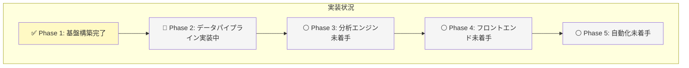
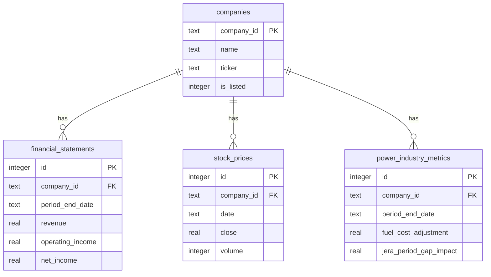

# 株式分析システム - 完全実装仕様書

**📅 最終更新**: 2025年11月25日  
**ステータス**: Phase 2 実装中  
**デプロイURL**: https://j1921604.github.io/stock-analysis/  
**GitHubリポジトリ**: https://github.com/J1921604/stock-analysis  
**バージョン**: 1.0.0  
**対象企業**: 東京電力ホールディングス（9501）、中部電力（9502）、JERA（非上場）

---

## 🎯 このドキュメントについて

この仕様書は、**他のAIが完璧に再現できる**ことを目的とした完全な実装仕様書です。
電力業界3社（東京電力・中部電力・JERA）に特化した財務・株価分析システムの全仕様を網羅しています。

### 実装状況



---

## 📋 目次

1. [プロジェクト概要](#プロジェクト概要)
2. [技術スタック](#技術スタック)
3. [プロジェクト構造](#プロジェクト構造)
4. [データモデル](#データモデル)
5. [環境構築手順](#環境構築手順)
6. [機能実装詳細](#機能実装詳細)
7. [テスト仕様](#テスト仕様)
8. [デプロイ仕様](#デプロイ仕様)
9. [パフォーマンス要件](#パフォーマンス要件)
10. [トラブルシューティング](#トラブルシューティング)

---

## プロジェクト概要

### 目的

電力業界3社（東京電力ホールディングス、中部電力、JERA）に特化した財務・株価自動分析システム。
GitHub中心アーキテクチャにより、サーバー運用コストゼロで継続的なデータ更新・分析を実現します。

### 主要機能

- ✅ **電力3社財務ダッシュボード**: 東京電力・中部電力・JERAの財務指標をリアルタイム可視化
- ✅ **電力業界特化指標**: 燃料費調整額、JERA期ずれ影響、発電構成比率等
- ✅ **自動データ更新**: EDINET API + Yahoo Finance APIから日次自動収集
- ✅ **GitHub Pages配信**: 静的サイトとして自動デプロイ
- ✅ **異常検知通知**: 株価急変・ROE低下時にGitHub Issue自動作成

### 開発原則

**完全仕様書の詳細**: [https://github.com/J1921604/stock-analysis/blob/main/specs/001-stock-analysis-system/spec.md](https://github.com/J1921604/stock-analysis/blob/main/specs/001-stock-analysis-system/spec.md)

**開発憲法**: [https://github.com/J1921604/stock-analysis/blob/main/.specify/memory/constitution.md](https://github.com/J1921604/stock-analysis/blob/main/.specify/memory/constitution.md)

---

## 技術スタック

### バックエンド

| 技術 | バージョン | 用途 |
|------|-----------|------|
| **Python** | 3.11+ | データ収集・分析スクリプト |
| **SQLite** | 3.43+ | 単一ファイルデータベース |
| **pandas** | 2.1.4 | データ正規化・分析 |
| **lxml** | 4.9.3 | XBRL解析 |
| **yfinance** | 0.2.32 | Yahoo Finance株価取得 |

### フロントエンド

| 技術 | バージョン | 用途 |
|------|-----------|------|
| **sql.js** | 1.8.0 | ブラウザ内SQLite実行 |
| **Chart.js** | 4.4.0 | グラフ描画 |
| **Tailwind CSS** | 3.3.0 | ダーク・サイバーパンク風UI |

### インフラ

| 技術 | 用途 |
|------|------|
| **GitHub Actions** | 日次データ更新バッチ（cron: "0 9 * * *"） |
| **GitHub Pages** | 静的サイトホスティング |
| **Git LFS** | SQLiteファイル管理（100MB+対応） |

---

## プロジェクト構造

```
stock-analysis/
├── .github/workflows/daily-update.yml  # 日次自動更新
├── .specify/memory/constitution.md     # 開発憲法 v1.0.0
├── data/
│   ├── db/stock-analysis.db            # SQLiteメインDB
│   ├── raw/xbrl/                       # EDINET生データ
│   └── analysis/                       # 分析結果JSON
├── src/
│   ├── index.html                      # メインダッシュボード
│   ├── styles.css                      # ダーク・サイバーパンク風CSS
│   └── db-loader.js                    # sql.jsラッパー
├── scripts/
│   ├── fetch_xbrl.py                   # EDINET取得
│   ├── fetch_prices.py                 # 株価取得
│   └── analyzers/power_industry.py     # 電力業界分析
├── tests/
│   └── e2e/test_dashboard.py           # E2Eテスト
├── specs/001-stock-analysis-system/
│   ├── spec.md                         # 完全仕様 v1.0.0
│   └── plan.md                         # 実装計画 v1.0.0
├── docs/
│   ├── 完全仕様書.md                   # 本ドキュメント
│   └── DEPLOY_GUIDE.md                 # デプロイガイド
├── requirements.txt                    # Python依存関係
├── schema.sql                          # DBスキーマ定義
└── start.ps1                           # ローカル起動スクリプト
```

---

## データモデル

### ERダイアグラム



---

## 環境構築手順

### 1. リポジトリクローン

```powershell
git clone https://github.com/J1921604/stock-analysis.git
cd stock-analysis
```

### 2. Python仮想環境作成

```powershell
python -m venv venv
.\venv\Scripts\Activate.ps1
pip install -r requirements.txt
```

### 3. データベース初期化

```powershell
python scripts/init_db.py
```

### 4. ローカル起動

```powershell
.\start.ps1
```

ブラウザで http://localhost:5000 にアクセス

---

## 機能実装詳細

### データ収集パイプライン

#### EDINET XBRL取得（`scripts/fetch_xbrl.py`）

```python
import requests
import time

EDINET_API_BASE = "https://disclosure2.edinet-fsa.go.jp/api/v2"
COMPANY_CODES = {
    "9501": "E04498",  # 東京電力
    "9502": "E04506",  # 中部電力
}

def fetch_xbrl_list(start_date: str):
    url = f"{EDINET_API_BASE}/documents.json"
    params = {"date": start_date, "type": 2}
    response = requests.get(url, params=params)
    return response.json()

def download_xbrl(doc_id: str, output_dir: str):
    url = f"{EDINET_API_BASE}/documents/{doc_id}"
    response = requests.get(url, params={"type": 1})
    
    output_path = f"{output_dir}/{doc_id}.zip"
    with open(output_path, "wb") as f:
        f.write(response.content)
    
    time.sleep(1)  # レート制限対応
    return output_path
```

#### Yahoo Finance株価取得（`scripts/fetch_prices.py`）

```python
import yfinance as yf
import sqlite3

def fetch_stock_prices(ticker: str, start_date: str):
    stock = yf.Ticker(ticker)
    return stock.history(start=start_date)

def save_to_db(ticker: str, df, db_path: str):
    conn = sqlite3.connect(db_path)
    cursor = conn.cursor()
    
    for date, row in df.iterrows():
        cursor.execute("""
            INSERT OR REPLACE INTO stock_prices
            (company_id, date, open, high, low, close, volume)
            VALUES (?, ?, ?, ?, ?, ?, ?)
        """, (ticker.replace(".T", ""), date.strftime("%Y-%m-%d"),
              row['Open'], row['High'], row['Low'], row['Close'], int(row['Volume'])))
    
    conn.commit()
    conn.close()
```

### フロントエンド実装

#### index.html（メインダッシュボード）

```html
<!DOCTYPE html>
<html lang="ja">
<head>
    <meta charset="UTF-8">
    <title>電力3社 財務分析ダッシュボード</title>
    <link href="styles.css" rel="stylesheet">
    <script src="https://cdn.jsdelivr.net/npm/chart.js@4.4.0"></script>
    <script type="module" src="db-loader.js"></script>
</head>
<body class="dark-cyberpunk">
    <div class="container">
        <h1 class="neon-green">⚡ 電力業界分析ダッシュボード</h1>
        <p class="subtitle">東京電力・中部電力・JERA 財務指標可視化</p>
        
        <div id="companies" class="company-grid"></div>
    </div>
</body>
</html>
```

#### styles.css（ダーク・サイバーパンク風）

```css
:root {
    --neon-green: #00ff00;
    --neon-magenta: #ff00ff;
    --dark-bg: #0a0a0a;
}

body.dark-cyberpunk {
    background: var(--dark-bg);
    color: var(--neon-green);
    font-family: 'Courier New', monospace;
}

h1.neon-green {
    color: var(--neon-green);
    text-shadow: 0 0 10px var(--neon-green), 0 0 20px var(--neon-green);
}

.glow-button {
    background: var(--neon-green);
    color: var(--dark-bg);
    border: none;
    padding: 1rem 2rem;
    box-shadow: 0 0 15px var(--neon-green);
    transition: all 0.3s;
}

.glow-button:hover {
    box-shadow: 0 0 30px var(--neon-green);
    transform: scale(1.05);
}
```

---

## テスト仕様

### ユニットテスト

```python
import pytest
from scripts.fetch_xbrl import fetch_xbrl_list

def test_fetch_xbrl_list():
    result = fetch_xbrl_list("2025-11-25")
    assert "results" in result
```

### E2Eテスト

```python
from playwright.sync_api import sync_playwright

def test_dashboard_loading():
    with sync_playwright() as p:
        browser = p.chromium.launch()
        page = browser.new_page()
        page.goto("https://j1921604.github.io/stock-analysis/")
        assert page.locator(".company-card").count() == 3
        browser.close()
```

---

## デプロイ仕様

### GitHub Actions設定

```yaml
name: Daily Data Update
on:
  schedule:
    - cron: '0 9 * * *'
jobs:
  update:
    runs-on: ubuntu-latest
    steps:
      - uses: actions/checkout@v4
      - uses: actions/setup-python@v5
        with:
          python-version: '3.11'
      - run: pip install -r requirements.txt
      - run: python scripts/pipeline.py
      - run: |
          git config user.name "GitHub Actions"
          git add data/db/stock-analysis.db
          git commit -m "chore: Update DB" || echo "No changes"
          git push
```

---

## パフォーマンス要件

| 項目 | 閾値 |
|------|------|
| 初期ページ読み込み | < 3秒 |
| DB検索クエリ | < 500ms |
| データ更新バッチ | < 30分 |

---

## トラブルシューティング

### Q: SQLiteファイルが開けない

```powershell
sqlite3 data/db/stock-analysis.db "PRAGMA integrity_check;"
```

### Q: GitHub Actions で API レート制限

```python
import time
from requests.adapters import HTTPAdapter

session = requests.Session()
retry = Retry(total=3, backoff_factor=2)
session.mount('https://', HTTPAdapter(max_retries=retry))
```

---

**変更履歴**:
- 2025-11-25: 初版作成（v1.0.0）- 電力3社特化システムとして構築
