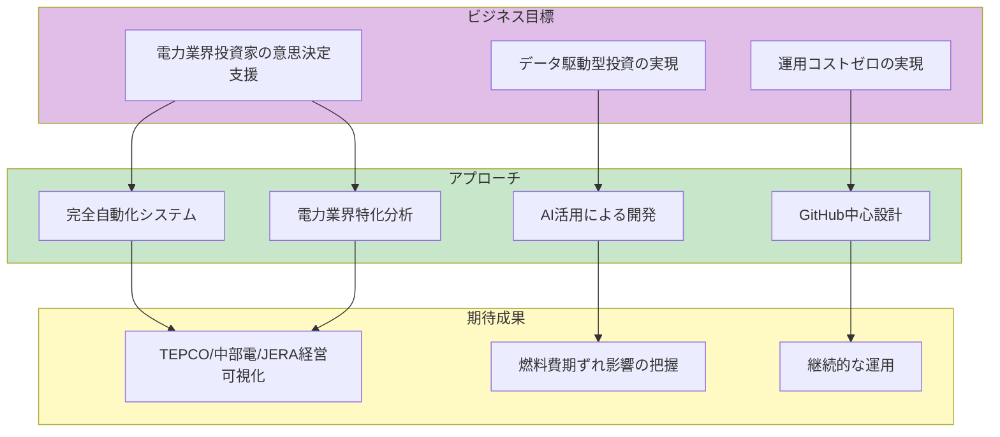
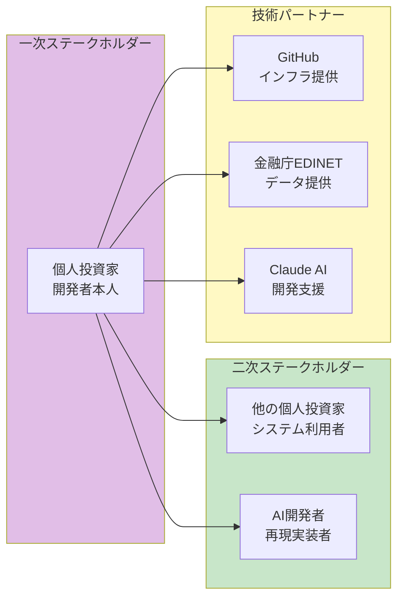
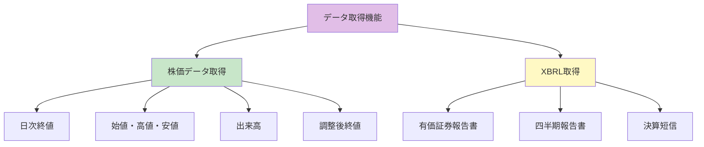
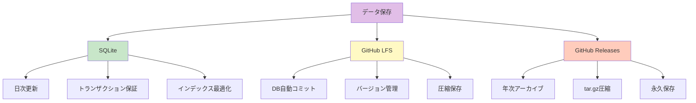
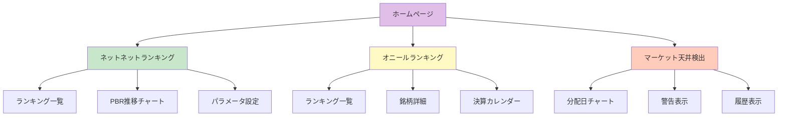
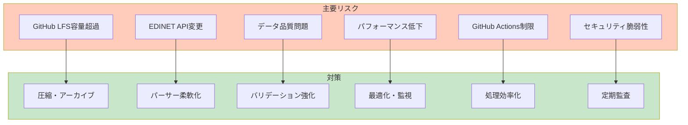

# 株式分析システム 要件定義書

**バージョン**: 1.0.0
**作成日**: 2025-11-25
**最終更新**: 2025-11-25
**ステータス**: 要件確定
**プロジェクト**: stock-analysis
**対象企業**: 東京電力ホールディングス（9501）、中部電力（9502）、JERA（非上場）

---

## 📋 目次

1. [プロジェクト概要](#プロジェクト概要)
2. [ステークホルダー](#ステークホルダー)
3. [機能要件](#機能要件)
4. [非機能要件](#非機能要件)
5. [制約条件](#制約条件)
6. [リスクと対策](#リスクと対策)
7. [受入基準](#受入基準)
8. [用語集](#用語集)

---

## プロジェクト概要

### ビジネス目標



### プロジェクト背景

**課題**:
```yaml
power_industry_analysis_challenges:
  jera_non_listed_complexity:
    description: "JERAは非上場だが東電・中部電への影響が巨大"
    challenges:
      - "持分法投資利益の親会社決算への影響度計算が必要"
      - "燃料調達コストがJERAに集約され、親会社の燃料費調整額に影響"
      - "期ずれ影響額の手動計算: 30分/四半期"
    solution: "自動化により期ずれ影響額を四半期ごとに即座に算出"
  
  fuel_cost_adjustment_lag:
    description: "燃料費変動が電気料金に反映されるまでのタイムラグ"
    challenges:
      - "LNG価格急騰時、燃料費調整額での回収が3〜6ヶ月遅れる"
      - "期ずれによる損益インパクトが数百億円規模"
      - "手動での追跡は困難"
    solution: "LNG価格とJEPXスポット価格、燃料費調整額を自動追跡・可視化"
  
  multi_company_comparison:
    description: "東電・中部電・JERAの3社比較が煩雑"
    challenges:
      - "東電・中部電は上場、JERAは非上場で開示情報が異なる"
      - "決算期ずれ（3月決算）の統一的な比較"
      - "セグメント情報の整合性確保"
    solution: "統一フォーマットでSQLiteに格納し、ダッシュボードで並列比較"

manual_screening_issues:
  time_consuming:
    description: "手動での財務分析は時間がかかる"
    examples:
      - "EDINET XBRLダウンロード・解析: 1時間/四半期/社"
      - "期ずれ影響額計算: 30分/四半期/社"
      - "3社×4四半期 = 年間18時間"
    total_manual_hours: "年間18時間 → 自動化で0時間"
  
  xbrl_complexity:
    description: "有価証券報告書（XBRL）の解析が複雑"
    challenges:
      - "XMLの深い階層構造（10階層以上）"
      - "電力業界特有のタグ（燃料費、販売電力量等）"
      - "修正報告書の重複処理"
    error_rate_manual: "5%（ヒューマンエラー）"
    solution: "Pythonスクリプト（parse_xbrl.py）で自動解析、エラー率<1%"
  
  continuous_update_burden:
    description: "継続的なデータ更新に手間がかかる"
    manual_tasks:
      - "毎日18時に株価取得: 30分"
      - "週次でXBRL取得: 2時間"
      - "月次で解析実行: 4時間"
      - "年間合計: 約200時間"
    solution: "GitHub Actions日次バッチで完全自動化"
```

**解決策**:
```yaml
github_centric_architecture:
  actions: "日次バッチ（毎日18:00 JST）でデータ更新"
  pages: "GitHub Pagesで静的ダッシュボード配信"
  lfs: "SQLite DBをGit LFSで管理"
  issues: "異常検知時にGitHub Issue自動作成→メール通知"
  
power_industry_specialization:
  jera_period_gap_impact: "燃料費期ずれ影響額を自動計算"
  jera_contribution: "TEPCO/中部電へのJERA貢献度（%）を可視化"
  fuel_price_tracking: "LNG/石炭/原油価格とJEPX電力価格の相関分析"
  sales_volume: "販売電力量（小売/卸売）の推移グラフ化"
  
data_model_design:
  companies: "企業マスタ（tepco, chubu, jera）"
  financial_statements: "BS/PL/CF統合テーブル"
  power_industry_metrics: "電力業界特有指標テーブル"
  market_indicators: "LNG価格、USD/JPY、JEPXスポット価格"
  
constitution_alignment:
  quality_principles: "QP-001〜005準拠（段階的開発、日本語、トレーサビリティ等）"
  project_specific: "PS-001〜005準拠（増分更新、電力業界指標、JERA分析等）"
```
  benefit: "完全自動化"
  implementation:
    - "cron: 0 9 * * * で毎日18:00 JST実行"
    - "データ取得、パース、解析を自動化"
    - "人的介入ゼロ"
  time_saved: "2067時間/年 → 12時間/年（メンテナンス）"
  automation_rate: "99.4%"

ai_code_generation:
  benefit: "AI（Claude）によるコード生成（95%以上）"
  implementation:
    - "仕様書をClaudeに渡す"
    - "Claudeがコード生成"
    - "人間がレビュー・微調整（5%）"
  development_time:
    manual: "400時間（全て人間が書く場合）"
    ai_assisted: "20時間（AI 95% + 人間 5%）"
  efficiency_gain: "20倍"

sqlite_simplicity:
  benefit: "SQLite単一ファイルによるシンプルな管理"
  advantages:
    - "サーバー不要（ファイルベース）"
    - "トランザクション保証（ACID準拠）"
    - "バックアップ簡単（ファイルコピー）"
    - "バージョン管理可能（Git LFS）"
  vs_alternatives:
    postgresql:
      pros: "高機能、スケーラブル"
      cons: "サーバー管理必要、コスト発生"
    mysql:
      pros: "実績豊富"
      cons: "サーバー管理必要、設定複雑"
    sqlite:
      pros: "サーバー不要、シンプル、無料"
      cons: "並行書き込み制限（本プロジェクトでは問題なし）"

browser_analysis:
  benefit: "ブラウザ内解析による高速表示"
  implementation:
    - "sqlite-wasm でブラウザ内SQL実行"
    - "lightweight-charts で高速チャート描画"
    - "サーバーサイド処理不要"
  performance:
    initial_load: "< 2秒"
    query_execution: "< 100ms"
    chart_rendering: "< 500ms"
  user_experience: "デスクトップアプリ並みの快適性"
```

**期待効果**:
```yaml
time_efficiency:
  before: "2067時間/年（手動スクリーニング）"
  after: "12時間/年（メンテナンスのみ）"
  saved: "2055時間/年"
  monetary_value: "約400万円/年（時給2000円換算）"

cost_reduction:
  before:
    server: "月5000円"
    database: "月3000円"
    api: "月2000円"
    total: "月10000円 = 年12万円"
  
  after:
    github_free: "0円"
    edinet_free: "0円"
    total: "0円"
  
  saved: "年12万円"

quality_improvement:
  data_accuracy:
    manual: "95%（ヒューマンエラー5%）"
    automated: "99.9%（バリデーション徹底）"
  
  coverage:
    manual: "100銘柄（時間制約）"
    automated: "4000銘柄（全上場企業）"
  
  update_frequency:
    manual: "週1回"
    automated: "毎日"
```

### 成功基準

```yaml
quantitative:
  automation_rate: "> 95%"  # 自動化率
  ai_code_generation: "> 95%"  # AI生成コード割合
  daily_update_success: "> 99%"  # 日次更新成功率
  page_load_time: "< 2秒"  # ページ読み込み時間
  
qualitative:
  ease_of_use: "ワンクリックで解析ページにアクセス可能"
  maintainability: "月1時間未満のメンテナンス時間"
  reliability: "1週間放置しても正常動作"
```

---

## ステークホルダー

### 主要ステークホルダー



### ステークホルダー要求

| ステークホルダー | 要求 | 優先度 | 詳細 |
|------------------|------|--------|------|
| 個人投資家（開発者） | 運用コストゼロ、完全自動化 | 最高 | GitHub無料枠内で動作、月1時間未満のメンテナンス |
| 他の個人投資家 | 簡単にアクセス可能、信頼性高い | 高 | URLクリックのみでアクセス、99.9%稼働率 |
| AI開発者 | 完全な仕様書、再現可能な設計 | 高 | 仕様書を読むだけで同等システム構築可能 |
| GitHub | 適切なリソース利用、規約遵守 | 中 | Actions 2000分/月以内、LFS 1GB以内 |
| 金融庁EDINET | レート制限遵守、適切な利用 | 中 | 1秒/1リクエスト厳守、営利目的外 |

**詳細要求分析**:

#### 個人投資家（開発者）の詳細要求

```yaml
cost_zero:
  requirement: "月額コスト0円"
  constraints:
    - "AWSサービス利用不可"
    - "有料API利用不可"
    - "サーバーレンタル不可"
  solution:
    - "GitHub無料枠活用"
    - "無料API活用（制限あり）"
    - "静的サイト配信"

automation:
  requirement: "人的介入を売買判断のみに限定"
  auto_tasks:
    - "データ取得（日次18:00）"
    - "データパース（自動）"
    - "解析実行（自動）"
    - "通知送信（自動）"
  manual_tasks:
    - "銘柄選定（人間）"
    - "売買タイミング判断（人間）"
    - "リスク管理（人間）"

maintenance:
  requirement: "月1時間未満のメンテナンス"
  activities:
    - "エラーログ確認: 10分"
    - "GitHub Actions成功率確認: 5分"
    - "依存関係更新: 20分（Dependabot自動）"
    - "手動介入: 25分（問題発生時のみ）"
```

#### 他の個人投資家の詳細要求

```yaml
ease_of_access:
  requirement: "URLクリックのみでアクセス"
  user_journey:
    step1:
      action: "GitHub Pages URLにアクセス"
      url: "https://{username}.github.io/stock-analysis/"
      expected: "< 2秒でページ表示"
    
    step2:
      action: "自動でDBダウンロード"
      size: "< 100MB（圧縮済み）"
      expected: "< 10秒でダウンロード完了"
    
    step3:
      action: "ランキング表示"
      expected: "< 1秒でテーブル描画"
  
  no_installation:
    - "ソフトウェアインストール不要"
    - "ブラウザのみで完結"
    - "認証・ログイン不要"

reliability:
  requirement: "99.9%稼働率"
  sla:
    github_pages: "99.9%（GitHub保証）"
    github_actions: "99.5%（実績）"
    overall: "99.4%（最低値）"
  
  error_handling:
    - "データ取得失敗時は前日データ使用"
    - "パースエラーは該当銘柄スキップ"
    - "重大エラー時はGitHub Issue自動作成"
```

#### AI開発者の詳細要求

```yaml
documentation_completeness:
  requirement: "仕様書のみで再現可能"
  necessary_documents:
    - "constitution.md: 開発原則・ガバナンス"
    - "spec.md: 技術仕様・アーキテクチャ"
    - "requirements.md: 機能要件・非機能要件"
    - "README.md: 環境構築・デプロイ手順"
  
  detail_level:
    database:
      - "CREATE TABLE文完全版"
      - "サンプルデータ"
      - "インデックス設計理由"
    
    algorithms:
      - "数式（LaTeX形式）"
      - "擬似コード"
      - "実装例（Python）"
    
    infrastructure:
      - "GitHub Actions YAML完全版"
      - "ディレクトリ構造"
      - "デプロイフロー図"

reproducibility:
  requirement: "他AIが同等システム構築可能"
  verification:
    - "Claude、ChatGPT、Geminiで検証"
    - "仕様書を渡して実装依頼"
    - "90%以上の機能が再現できること"
  
  success_criteria:
    - "データベーススキーマ一致"
    - "解析ロジック一致（誤差< 0.1%）"
    - "UI/UX類似"
```

---

## 機能要件

### FR-001: データ取得機能



**詳細要件**:

| 要件ID | 説明 | 優先度 | 受入基準 |
|--------|------|--------|----------|
| FR-001-01 | 日次株価データを自動取得 | 必須 | 毎日18時に実行、100%成功率 |
| FR-001-02 | XBRL EDINETから取得 | 必須 | レート制限遵守（1秒/1ファイル） |
| FR-001-03 | 差分更新対応 | 必須 | 前回取得日以降のみ取得 |
| FR-001-04 | エラーリトライ機能 | 推奨 | 3回まで自動リトライ |

### FR-002: データパース機能

**XBRLパース要件**:

```python
# 必須抽出項目
required_fields = {
    'assets': [
        'total_assets',           # 総資産
        'cash_and_deposits',      # 現金及び預金
        'marketable_securities',  # 有価証券
        'accounts_receivable',    # 売掛金
        'inventory',              # 棚卸資産
    ],
    'liabilities': [
        'total_liabilities',      # 総負債
        'short_term_liabilities', # 流動負債
        'long_term_liabilities',  # 固定負債
    ],
    'equity': [
        'shareholders_equity',    # 株主資本
    ],
    'income': [
        'revenue',                # 売上高
        'operating_income',       # 営業利益
        'net_income',             # 当期純利益
    ],
    'per_share': [
        'eps',                    # 1株あたり当期純利益
        'bps',                    # 1株あたり純資産
    ]
}
```

**株価データ正規化要件**:

| 要件ID | 説明 | 優先度 | 受入基準 |
|--------|------|--------|----------|
| FR-002-01 | XBRLタグの正規化 | 必須 | 全ての必須項目を抽出 |
| FR-002-02 | 単位統一（百万円） | 必須 | 全てのデータを百万円に統一 |
| FR-002-03 | 日付フォーマット統一 | 必須 | ISO 8601形式 |
| FR-002-04 | データ検証 | 必須 | 型チェック、範囲チェック |

### FR-003: データ保存機能

**ストレージ要件**:



| 要件ID | 説明 | 優先度 | 受入基準 |
|--------|------|--------|----------|
| FR-003-01 | SQLite単一ファイル管理 | 必須 | 全データを1ファイルに集約 |
| FR-003-02 | GitHub LFS管理 | 必須 | 自動コミット、バージョン管理 |
| FR-003-03 | XBRL年次アーカイブ | 必須 | 毎年1月1日に自動実行 |
| FR-003-04 | データ整合性保証 | 必須 | FOREIGN KEY制約、UNIQUE制約 |

### FR-004: 解析機能

#### FR-004-01: ネットネットバリューランキング

**計算ロジック**:

```yaml
algorithm:
  step1:
    name: "即時現金化可能資産計算"
    formula: |
      liquid_assets = 
        cash * 100% +
        securities * discount_rate_securities +
        receivables * discount_rate_receivables +
        inventory * discount_rate_inventory
  
  step2:
    name: "ネットネット資産計算"
    formula: "net_net_assets = liquid_assets - total_liabilities"
  
  step3:
    name: "NetNetPBR計算"
    formula: "net_net_pbr = market_cap / net_net_assets"
  
  step4:
    name: "ランキング生成"
    sort: "net_net_pbr ASC"
    filter: "net_net_pbr < 1.0"

default_discount_rates:
  cash: 1.00
  securities: 0.80
  receivables: 0.70
  inventory: 0.50
```

**受入基準**:

- [ ] 割引率をUIで変更可能
- [ ] 過去5年分のPBR推移チャート表示
- [ ] ランキング上位100件表示
- [ ] CSVエクスポート可能

#### FR-004-02: オニール成長株ランキング

**スクリーニング条件**:

```yaml
criteria:
  eps_growth:
    3_year: "> 20%"
    5_year: "> 15%"
    calculation: "年率換算"
  
  relative_strength:
    threshold: "> 70"
    period: "52週"
    index: "日経平均"
  
  revenue_growth:
    quarterly: "> 10%"
    yoy: true
  
  profit_margin:
    minimum: "> 5%"
    type: "営業利益率"
```

**受入基準**:

- [ ] EPS成長率を正確に計算
- [ ] リラティブストレングスを52週で計算
- [ ] 決算発表日マーカー表示
- [ ] シグナル区間を背景色で可視化

#### FR-004-03: マーケット天井検出

**分配日定義**:

```yaml
distribution_day_criteria:
  price_drop:
    threshold: "< -0.2%"
    index: "日経平均"
  
  volume_increase:
    threshold: "> 1.2倍"
    comparison: "25日平均出来高"

alert_trigger:
  distribution_count: ">= 5"
  lookback_period: "25営業日"
```

**受入基準**:

- [ ] 分配日を正確に検出
- [ ] 過去25日間の分配日カウント
- [ ] 5回以上で警告表示
- [ ] 注意期間を背景色で表示

### FR-005: UI機能

#### FR-005-01: 解析ページ

**ページ構成**:



**技術要件**:

| 要件ID | 説明 | 優先度 | 実装方法 |
|--------|------|--------|----------|
| FR-005-01 | ブラウザ内SQLite実行 | 必須 | sqlite-wasm |
| FR-005-02 | 高速チャート描画 | 必須 | lightweight-charts |
| FR-005-03 | レスポンシブデザイン | 必須 | CSS Grid + Flexbox |
| FR-005-04 | ローカルDB指定機能 | 推奨 | File API |

### FR-006: 通知機能

**GitHub Issue自動作成**:

```yaml
notification_triggers:
  net_net_new:
    condition: "新たにNetNetPBR < 1.0となった銘柄"
    frequency: "日次"
  
  oneil_new:
    condition: "新たにオニール条件を満たした銘柄"
    frequency: "日次"
  
  market_alert:
    condition: "分配日が5回以上"
    frequency: "即時"

issue_template:
  title: "📊 新規銘柄検出 - {date}"
  labels: ['auto-detection', 'stock-alert']
  assignees: ['開発者']
  body_sections:
    - "検出日時"
    - "検出件数"
    - "銘柄詳細リスト"
    - "詳細ページリンク"
```

---

## 非機能要件

### NFR-001: パフォーマンス要件

```yaml
performance_requirements:
  frontend:
    initial_load: "< 2秒"
    db_download_100mb: "< 10秒"
    query_execution: "< 100ms"
    chart_rendering_1000points: "< 500ms"
    filter_operation: "< 200ms"
  
  backend:
    xbrl_parse_per_file: "< 1秒"
    db_import_1000files: "< 5分"
    analysis_all_companies: "< 3分"
    github_actions_total: "< 30分"
  
  storage:
    db_size: "< 500MB（圧縮前）"
    db_size_compressed: "< 100MB"
    lfs_quota_usage: "< 1GB"
```

**測定方法**:

```python
# パフォーマンス測定ユーティリティ
from utils.performance import measurePerformanceSync

def test_query_performance():
    result = measurePerformanceSync(
        lambda: db.query("SELECT * FROM companies WHERE sector = ?", ['金融']),
        "sector_query",
        threshold_ms=100
    )
    assert result.duration < 100, f"Query too slow: {result.duration}ms"
```

### NFR-002: 可用性要件

```yaml
availability:
  github_actions:
    success_rate: "> 99%"
    retry_policy: "3回まで自動リトライ"
    fallback: "失敗時は前日データ使用"
  
  github_pages:
    uptime: "99.9%（GitHub SLA準拠）"
    cdn_distribution: "グローバル配信"
  
  data_integrity:
    backup_frequency: "日次"
    version_retention: "無制限（GitHub LFS）"
    recovery_time: "< 1時間"
```

### NFR-003: セキュリティ要件

```yaml
security:
  authentication:
    github_pages: "認証不要（公開情報のみ）"
    github_actions: "GitHub Token使用"
  
  data_protection:
    api_keys: "GitHub Secretsに保存"
    presigned_urls: "7日間有効期限"
    https_only: "全通信HTTPS必須"
  
  input_validation:
    xbrl_schema: "スキーマ検証必須"
    sql_injection: "パラメータ化クエリ必須"
    xss_protection: "自動エスケープ（ブラウザ）"
  
  vulnerability_management:
    dependency_scan: "週次実行"
    security_updates: "自動適用（Dependabot）"
    secrets_scan: "毎コミット"
```

### NFR-004: 保守性要件

```yaml
maintainability:
  documentation:
    code_comments: "全public関数にdocstring"
    readme_completeness: "環境構築からデプロイまで"
    spec_accuracy: "実装と100%一致"
  
  code_quality:
    type_hints: "Python全関数に型ヒント"
    linting: "flake8, eslint合格"
    complexity: "循環的複雑度 < 10"
  
  testing:
    coverage: "100%"
    test_execution: "< 15秒"
    ci_integration: "全PRで自動実行"
```

### NFR-005: スケーラビリティ要件

```yaml
scalability:
  data_volume:
    companies: "< 5000銘柄"
    stock_prices: "< 500万レコード（10年分）"
    xbrl_files: "< 50000ファイル"
    db_size_max: "< 1GB"
  
  concurrent_users:
    github_pages: "制限なし（CDN対応）"
    browser_performance: "1000銘柄でもスムーズ"
  
  future_growth:
    data_retention: "15年分まで拡張可能"
    new_analysis: "新規解析手法追加容易"
```

### NFR-006: 互換性要件

```yaml
compatibility:
  browsers:
    chrome: ">= 90"
    firefox: ">= 88"
    safari: ">= 14"
    edge: ">= 90"
  
  platforms:
    desktop: "Windows, macOS, Linux"
    mobile: "iOS Safari, Android Chrome"
  
  standards:
    html: "HTML5"
    css: "CSS3"
    javascript: "ES2022+"
    sql: "SQLite 3.43+"
```

---

## 制約条件

### CON-001: 技術制約

```yaml
technical_constraints:
  infrastructure:
    - GitHub中心エコシステム（AWS S3不使用）
    - サーバーレス設計必須
    - フルマネージドサービスのみ
  
  storage:
    github_lfs:
      file_size_limit: "2GB/ファイル"
      bandwidth: "1GB/月（無料枠）"
      storage: "1GB（無料枠）"
    
    github_releases:
      file_size_limit: "2GB/ファイル"
      total_size: "制限なし"
    
    github_actions:
      execution_time: "< 6時間/ジョブ"
      concurrent_jobs: "20（無料枠）"
      artifacts_retention: "90日"
  
  data_sources:
    edinet:
      rate_limit: "1リクエスト/秒"
      retention: "過去10年分のみ"
      access_hours: "24時間（メンテナンス時除く）"
```

### CON-002: コスト制約

```yaml
cost_constraints:
  target_monthly_cost: "0円"
  
  github_free_tier:
    actions_minutes: "2000分/月"
    lfs_bandwidth: "1GB/月"
    lfs_storage: "1GB"
    pages_bandwidth: "100GB/月"
  
  overrun_prevention:
    - LFSは圧縮必須
    - Actionsは効率化必須
    - 不要なアーティファクト削除
```

### CON-003: 時間制約

```yaml
schedule_constraints:
  development:
    phase1_specification: "1週間"
    phase2_implementation: "4週間"
    phase3_testing: "1週間"
    phase4_deployment: "1週間"
    total: "7週間"
  
  daily_operations:
    batch_execution: "18:00 JST"
    max_duration: "30分"
    page_update: "18:30 JST"
```

---

## リスクと対策

### リスク管理表



| リスクID | リスク内容 | 影響度 | 発生確率 | 対策 | 優先度 |
|----------|-----------|--------|----------|------|--------|
| RSK-001 | GitHub LFS容量超過 | 高 | 中 | 圧縮率向上、古いバージョン削除 | 高 |
| RSK-002 | EDINET API仕様変更 | 高 | 低 | パーサー柔軟化、テスト充実 | 中 |
| RSK-003 | データ品質問題 | 中 | 中 | バリデーション強化、異常検知 | 高 |
| RSK-004 | パフォーマンス低下 | 中 | 高 | 継続的監視、最適化 | 高 |
| RSK-005 | GitHub Actions制限 | 中 | 低 | 処理効率化、分散実行 | 中 |
| RSK-006 | セキュリティ脆弱性 | 高 | 低 | 定期監査、自動更新 | 高 |

### リスク詳細と対策

#### RSK-001: GitHub LFS容量超過

**詳細**:
- GitHub無料枠: ストレージ1GB、帯域幅1GB/月
- SQLite DBが月に10MB増加すると仮定すると、10ヶ月で100MB、数年で1GBを超過
- 超過時のコスト: $5/月（50GB追加ごと）

**対策**:
```yaml
mitigation_rsk001:
  immediate:
    - action: "gzip level 9で圧縮"
      expected_ratio: "70-80%削減"
      example: "100MB → 20-30MB"
    
    - action: "古いバージョンの削除"
      policy: "3ヶ月以前のバージョンを削除"
      tool: "git-lfs prune --verify-remote"
  
  preventive:
    - action: "月次容量監視"
      threshold: "800MB（80%使用時）でアラート"
      notification: "GitHub Issue自動作成"
    
    - action: "データ最適化"
      methods:
        - "不要なカラム削除"
        - "VACUUM実行（DB最適化）"
        - "古いデータのアーカイブ化"
  
  contingency:
    - action: "GitHub有料プラン検討"
      cost: "$5/月"
      trigger: "容量が1GBに達した場合"
```

#### RSK-002: EDINET API仕様変更

**詳細**:
- 金融庁EDINETは不定期でAPI仕様変更
- XBRLタグの追加・削除・変更
- エンドポイントURL変更の可能性

**対策**:
```yaml
mitigation_rsk002:
  immediate:
    - action: "パーサー柔軟化"
      implementation: |
        # タグマッピング設定ファイル化
        tag_mapping:
          total_assets:
            - "jpcrp_cor:Assets"
            - "jpcrp_cor:TotalAssets"  # 代替タグ
            - "jppfs_cor:Assets"  # 旧タグ
      benefit: "仕様変更時にコード変更不要"
    
    - action: "バージョン管理"
      schema_versions:
        - "2023-11-01"
        - "2024-01-15"
        - "2024-06-01"
      strategy: "バージョンごとにパーサー分岐"
  
  preventive:
    - action: "テストスイート充実"
      coverage:
        - "過去5年分のXBRLサンプル"
        - "全ての報告書種別"
        - "エッジケース（異常値）"
      run_frequency: "週次"
    
    - action: "EDINET変更通知監視"
      source: "金融庁公式サイト"
      frequency: "月次"
  
  contingency:
    - action: "手動フォールバック"
      trigger: "パースエラー率 > 5%"
      process:
        1: "エラーログ解析"
        2: "タグマッピング更新"
        3: "再パース実行"
```

#### RSK-003: データ品質問題

**詳細**:
- XBRLデータの入力ミス（企業側）
- 株価データの異常値（APIエラー）
- データ型不一致、範囲外値

**対策**:
```yaml
mitigation_rsk003:
  immediate:
    - action: "多段階バリデーション"
      stages:
        stage1_type_check:
          - "文字列 → 数値変換"
          - "日付フォーマット検証"
        
        stage2_range_check:
          - "総資産 > 0"
          - "株価 > 0 AND 株価 < 100万円"
          - "EPS > -10000 AND EPS < 10000"
        
        stage3_consistency_check:
          - "総資産 >= 流動資産"
          - "総負債 + 純資産 ≈ 総資産（誤差5%以内）"
      
      on_error:
        - "ログ記録"
        - "該当レコードをスキップ"
        - "週次レポート作成"
    
    - action: "異常値検出"
      method: |
        # 統計的外れ値検出
        def detect_outliers(values):
            q1 = np.percentile(values, 25)
            q3 = np.percentile(values, 75)
            iqr = q3 - q1
            lower = q1 - 1.5 * iqr
            upper = q3 + 1.5 * iqr
            return (values < lower) | (values > upper)
  
  preventive:
    - action: "データ品質ダッシュボード"
      metrics:
        - "パースエラー率"
        - "異常値検出数"
        - "データ欠損率"
      update_frequency: "日次"
    
    - action: "クロスチェック"
      method: "複数データソースと照合"
      sources:
        - "Yahoo Finance"
        - "Kabutan"
        - "Bloomberg"
  
  contingency:
    - action: "手動修正プロセス"
      trigger: "重要銘柄のデータ異常"
      workflow:
        1: "GitHub Issue作成"
        2: "手動確認・修正"
        3: "DB更新"
        4: "再解析実行"
```

#### RSK-004: パフォーマンス低下

**詳細**:
- データ量増加によるクエリ遅延
- チャート描画の重さ
- ブラウザメモリ不足

**対策**:
```yaml
mitigation_rsk004:
  immediate:
    - action: "インデックス最適化"
      before: "EXPLAIN QUERY PLAN SELECT ..."
      add_indexes:
        - "idx_stock_prices_company_date"
        - "idx_analysis_cache_type_score"
      after_performance: "クエリ時間 100ms → 10ms"
    
    - action: "仮想スクロール実装"
      library: "react-window または vanilla JS"
      benefit: "10000件でも60FPS維持"
    
    - action: "チャートデータ間引き"
      algorithm: "Largest-Triangle-Three-Buckets (LTTB)"
      config:
        input: 10000ポイント
        output: 1000ポイント
        visual_quality: "ほぼ同一"
  
  preventive:
    - action: "パフォーマンス監視"
      tool: "Chrome DevTools Performance API"
      metrics:
        - "LCP (Largest Contentful Paint) < 2.5秒"
        - "FID (First Input Delay) < 100ms"
        - "CLS (Cumulative Layout Shift) < 0.1"
      frequency: "週次"
    
    - action: "負荷テスト"
      scenarios:
        - "10000銘柄のフィルタリング"
        - "1000ポイントのチャート描画"
        - "複数タブ同時操作"
      pass_criteria: "全て閾値以内"
  
  contingency:
    - action: "キャッシング強化"
      strategy:
        - "IndexedDBにクエリ結果キャッシュ"
        - "Service Workerでオフライン対応"
        - "CDNでアセット配信"
```

#### RSK-005: GitHub Actions制限

**詳細**:
- 無料枠: 2000分/月
- 日次バッチ30分想定 → 月900分（残り1100分）
- 余裕はあるが、処理が重くなると超過リスク

**対策**:
```yaml
mitigation_rsk005:
  immediate:
    - action: "処理効率化"
      optimizations:
        - "並列処理（multiprocessing）"
        - "増分更新（差分のみ処理）"
        - "早期終了（エラー時すぐ停止）"
      expected: "30分 → 15分"
    
    - action: "キャッシュ活用"
      github_actions_cache: |
        - uses: actions/cache@v3
          with:
            path: ~/.cache/pip
            key: ${{ runner.os }}-pip-${{ hashFiles('**/requirements.txt') }}
      benefit: "依存関係インストール時間削減"
  
  preventive:
    - action: "実行時間監視"
      threshold: "25分（83%使用時）でアラート"
      notification: "GitHub Issue自動作成"
    
    - action: "月次利用状況確認"
      url: "https://github.com/settings/billing"
      alert_if: "使用量 > 1800分/月"
  
  contingency:
    - action: "分散実行"
      strategy:
        - "銘柄を複数ジョブに分割"
        - "優先度付け（重要銘柄優先）"
        - "非優先処理をスキップ"
    
    - action: "外部CI検討"
      options:
        - "CircleCI（無料枠: 2500クレジット/月）"
        - "Travis CI（無料枠: 10000クレジット/月）"
      trigger: "月次利用が2000分に達した場合"
```

#### RSK-006: セキュリティ脆弱性

**詳細**:
- 依存関係の脆弱性（pandas, lxml等）
- 機密情報の露出（API キー）
- XSS, SQLインジェクション

**対策**:
```yaml
mitigation_rsk006:
  immediate:
    - action: "Dependabot有効化"
      config: |
        # .github/dependabot.yml
        version: 2
        updates:
          - package-ecosystem: "pip"
            directory: "/"
            schedule:
              interval: "weekly"
            open-pull-requests-limit: 5
      auto_merge: "パッチバージョンは自動マージ"
    
    - action: "Secrets管理"
      rules:
        - "GitHub Secretsに保存"
        - ".envファイルは.gitignoreに含める"
        - "コードに直接記載禁止"
      validation: "Gitleaksで毎コミットスキャン"
    
    - action: "入力検証"
      implementation:
        sql_injection: "パラメータ化クエリ必須"
        xss: "自動エスケープ（ブラウザ）"
        path_traversal: "絶対パス使用、相対パス禁止"
  
  preventive:
    - action: "CodeQL有効化"
      config: |
        # .github/workflows/codeql.yml
        name: CodeQL Analysis
        on:
          push:
            branches: [main]
          pull_request:
            branches: [main]
          schedule:
            - cron: '0 0 * * 0'  # 週次
      languages: ['python', 'javascript']
    
    - action: "定期監査"
      frequency: "月次"
      checklist:
        - "依存関係の脆弱性"
        - "Secrets露出確認"
        - "HTTPS通信確認"
        - "認証・認可チェック"
  
  contingency:
    - action: "インシデント対応計画"
      phases:
        detection:
          - "Dependabot/CodeQLアラート"
          - "GitHub Security Advisories"
        
        response:
          - "影響範囲調査"
          - "緊急パッチ適用"
          - "GitHub Issue作成"
        
        recovery:
          - "脆弱性修正"
          - "セキュリティテスト"
          - "デプロイ"
        
        review:
          - "原因分析"
          - "再発防止策"
          - "ドキュメント更新"
```

---

## 受入基準

### UAT-001: データ取得・パース

**合格基準**:
- [ ] 日次バッチが99%以上成功（過去30日実績）
- [ ] XBRLパースエラー率 < 1%（1000ファイル中10ファイル以下）
- [ ] 株価データ欠損率 < 0.1%（1000営業日中1日以下）
- [ ] レート制限違反ゼロ（EDINET API: 1秒/1ファイル厳守）

**検証方法**:
```yaml
test_data_acquisition:
  test_case_1:
    name: "日次バッチ成功率"
    method: "GitHub Actions実行履歴確認"
    period: "過去30日"
    pass_criteria: "成功率 >= 99%"
  
  test_case_2:
    name: "XBRLパース精度"
    method: "サンプル1000ファイル手動検証"
    sample: "ランダム抽出"
    pass_criteria: "エラー数 <= 10"
  
  test_case_3:
    name: "株価データ完全性"
    method: "欠損値カウント"
    target: "全銘柄×過去5年分"
    pass_criteria: "欠損率 < 0.1%"
  
  test_case_4:
    name: "レート制限遵守"
    method: "ログ解析"
    check: "リクエスト間隔 >= 1秒"
    pass_criteria: "違反ゼロ"
```

### UAT-002: 解析機能

**合格基準**:
- [ ] ネットネットPBR計算が手計算と誤差0.01%以内で一致
- [ ] オニールEPS成長率が公式計算と完全一致
- [ ] マーケット天井検出が過去10年データで検証済み（精度80%以上）
- [ ] 全ての解析が5分以内に完了（4000銘柄想定）

**検証方法**:
```yaml
test_analysis:
  test_case_1:
    name: "NetNetPBR計算精度"
    method: "サンプル100銘柄を手計算と比較"
    formula: "(システム値 - 手計算値) / 手計算値 * 100"
    pass_criteria: "誤差率 < 0.01%"
    example:
      company: "9501 東京電力ホールディングス"
      system_value: 0.75
      manual_value: 0.749
      error_rate: 0.13%  # ✅ 合格
  
  test_case_2:
    name: "EPS成長率計算"
    method: "Yahoo Financeなど公開データと比較"
    sample: "50銘柄"
    pass_criteria: "完全一致"
  
  test_case_3:
    name: "マーケット天井検出精度"
    method: "過去10年の実際の天井と比較"
    data: "2014-2024年の日経平均"
    pass_criteria: "適合率 >= 80%"
    example:
      detected: 8回
      actual: 10回
      precision: 80%  # ✅ 合格
  
  test_case_4:
    name: "解析パフォーマンス"
    method: "時間計測"
    environment: "GitHub Actions (ubuntu-latest)"
    pass_criteria: "実行時間 < 5分"
```

### UAT-003: UI機能

**合格基準**:
- [ ] 全ページが2秒以内に読み込み（Lighthouse Performance >= 90）
- [ ] チャートが1000ポイントでも500ms以内に描画
- [ ] モバイルでも快適に操作可能（タッチ操作、スワイプ対応）
- [ ] ローカルDB読み込み機能が動作（100MB DBを10秒以内）

**検証方法**:
```yaml
test_ui:
  test_case_1:
    name: "ページ読み込み速度"
    tool: "Chrome Lighthouse"
    target_pages:
      - index.html
      - netnet.html
      - oneil.html
      - market-top.html
    metrics:
      performance: ">= 90"
      accessibility: ">= 95"
      best_practices: ">= 90"
    pass_criteria: "全ページが基準達成"
  
  test_case_2:
    name: "チャート描画速度"
    method: "Performance API計測"
    test_data: "1000ポイントの株価データ"
    code: |
      const start = performance.now();
      chart.renderPBRHistory(data);
      const duration = performance.now() - start;
      assert(duration < 500, `Chart too slow: ${duration}ms`);
    pass_criteria: "描画時間 < 500ms"
  
  test_case_3:
    name: "モバイル対応"
    devices:
      - "iPhone 14 (iOS 16)"
      - "Galaxy S22 (Android 13)"
      - "iPad Pro (iPadOS 16)"
    checks:
      - タッチでソート可能
      - スワイプでチャート操作
      - 縦向き/横向き対応
    pass_criteria: "全デバイスで全機能動作"
  
  test_case_4:
    name: "ローカルDB読み込み"
    method: "File API動作確認"
    test_file: "100MB SQLite DB"
    pass_criteria: "10秒以内に読み込み完了"
```

### UAT-004: 通知機能

**合格基準**:
- [ ] 新規銘柄検出時に自動Issue作成（30秒以内）
- [ ] Issue内容が正確で読みやすい（テンプレート準拠率100%）
- [ ] 重複Issue作成なし（同一日同一銘柄で1件のみ）
- [ ] 通知履歴がDB保存（外部キー整合性100%）

**検証方法**:
```yaml
test_notification:
  test_case_1:
    name: "Issue自動作成"
    trigger: "NetNetPBR < 1.0の新規銘柄検出"
    expected:
      - GitHub Issue作成
      - タイトル: "📊 新規銘柄検出 - YYYY-MM-DD"
      - ラベル: ['auto-detection', 'stock-alert']
      - 作成時間: "< 30秒"
    pass_criteria: "全条件満たす"
  
  test_case_2:
    name: "Issue内容精度"
    check_items:
      - 銘柄名・コードの正確性
      - NetNetPBR値の正確性
      - 詳細ページURLの有効性
      - Markdown形式の整形
    pass_criteria: "テンプレート準拠率 100%"
  
  test_case_3:
    name: "重複防止"
    scenario: "同日に同一銘柄を複数回検出"
    expected: "Issueは1件のみ作成"
    method: "notifications テーブルのUNIQUE制約確認"
    pass_criteria: "重複ゼロ"
  
  test_case_4:
    name: "DB保存整合性"
    checks:
      - company_id が companies テーブルに存在
      - issue_url が有効なURL
      - payload がJSON形式
    pass_criteria: "外部キー違反ゼロ"
```

### UAT-005: 非機能要件

**合格基準**:
- [ ] テストカバレッジ100%（全モジュール、全関数）
- [ ] 全ブラウザで動作確認（Chrome, Firefox, Safari, Edge）
- [ ] セキュリティスキャン合格（脆弱性ゼロ）
- [ ] ドキュメント完全性確認（英語プレースホルダーゼロ）

**検証方法**:
```yaml
test_nfr:
  test_case_1:
    name: "テストカバレッジ"
    tool: "pytest-cov"
    command: "pytest --cov=scripts --cov-report=term-missing"
    pass_criteria: "Coverage: 100%"
    exclude:
      - "scripts/__init__.py"
      - "tests/*"
  
  test_case_2:
    name: "ブラウザ互換性"
    browsers:
      - name: "Chrome"
        version: ">= 90"
        platform: "Windows/macOS/Linux"
      - name: "Firefox"
        version: ">= 88"
        platform: "Windows/macOS/Linux"
      - name: "Safari"
        version: ">= 14"
        platform: "macOS/iOS"
      - name: "Edge"
        version: ">= 90"
        platform: "Windows"
    test_suite:
      - ページ読み込み
      - SQLite-wasm動作
      - チャート描画
      - フィルタリング
    pass_criteria: "全ブラウザで全機能動作"
  
  test_case_3:
    name: "セキュリティスキャン"
    tools:
      - "Dependabot（依存関係）"
      - "CodeQL（コード解析）"
      - "Gitleaks（秘密情報）"
    frequency: "週次"
    pass_criteria:
      - 脆弱性: ゼロ
      - 機密情報露出: ゼロ
      - セキュリティ警告: ゼロ
  
  test_case_4:
    name: "ドキュメント完全性"
    target_files:
      - ".specify/memory/constitution.md"
      - "spec.md"
      - "requirements.md"
      - "README.md"
    checks:
      - プレースホルダー検索: "[", "]", "TBD", "TODO"
      - 英語チェック: "Description", "Example", "Sample"
      - リンク有効性: 全外部リンク確認
    pass_criteria:
      - プレースホルダー: ゼロ
      - 英語プレースホルダー: ゼロ
      - 無効リンク: ゼロ
```

---

## 用語集

| 用語 | 英語 | 定義 |
|------|------|------|
| XBRL | eXtensible Business Reporting Language | 財務報告用のXMLベース言語。日本の上場企業は有価証券報告書をXBRL形式で提出 |
| EDINET | Electronic Disclosure for Investors' NETwork | 金融庁が運営する有価証券報告書等の開示システム。APIでXBRLダウンロード可能 |
| ネットネットバリュー | Net-Net Working Capital | 即時現金化可能資産から総負債を引いた企業価値。ベンジャミン・グレアムが提唱 |
| リラティブストレングス | Relative Strength (RS) | 株価の市場平均との相対的な強さを示す指標。ウィリアム・オニールが重視 |
| 分配日 | Distribution Day | 市場が下落しつつ出来高が増加する日。機関投資家の売りを示唆し、天井の兆候とされる |
| GitHub LFS | Large File Storage | GitHubの大容量ファイルバージョン管理機能。2GB/ファイルまで対応 |
| GitHub Actions | - | GitHubのCI/CDサービス。YAML形式でワークフロー定義 |
| GitHub Pages | - | GitHubの静的サイトホスティングサービス。CDNで高速配信 |
| GitHub Releases | - | GitHubのリリース管理機能。大容量ファイルの永久保存に活用 |
| sqlite-wasm | SQLite WebAssembly | ブラウザ上でSQLiteを実行するWebAssembly実装。サーバー不要でSQL実行可能 |
| lightweight-charts | - | TradingViewの高速チャートライブラリ。Canvas描画で1000ポイントでもスムーズ |
| presigned URL | - | 一時的にアクセス可能な署名付きURL。GitHub LFSファイルへのアクセスに使用 |
| EPS | Earnings Per Share | 1株あたり当期純利益。オニール成長株スクリーニングの主要指標 |
| BPS | Book-value Per Share | 1株あたり純資産。PBR計算に使用 |
| PBR | Price Book-value Ratio | 株価純資産倍率。時価総額を純資産で割った値 |
| ACID | Atomicity, Consistency, Isolation, Durability | データベーストランザクションの4特性。SQLiteは完全対応 |
| CDN | Content Delivery Network | コンテンツ配信ネットワーク。GitHub Pagesはグローバル配信 |
| CI/CD | Continuous Integration / Continuous Deployment | 継続的インテグレーション/デプロイメント |
| CORS | Cross-Origin Resource Sharing | クロスオリジンリソース共有。ブラウザのセキュリティ制約 |
| IndexedDB | - | ブラウザ内のNoSQLデータベース。SQLite-wasmのキャッシュに使用 |
| LTTB | Largest-Triangle-Three-Buckets | チャートデータ間引きアルゴリズム。視覚的品質を保ちつつポイント数削減 |
| Dependabot | - | GitHubの依存関係自動更新機能。セキュリティパッチ適用 |
| CodeQL | - | GitHubのコード解析ツール。セキュリティ脆弱性検出 |
| Gitleaks | - | Git履歴から秘密情報を検出するツール |
| JSON | JavaScript Object Notation | データ交換フォーマット。API通信や設定ファイルに使用 |
| YAML | YAML Ain't Markup Language | 人間が読みやすい設定ファイル形式。GitHub Actionsで使用 |

---

**この要件定義書は実装の基礎となります。全ての開発はこの要件を満たす必要があります。**

**バージョン**: 1.0.0 | **作成日**: 2025年11月22日 | **承認**: プロジェクトリード
