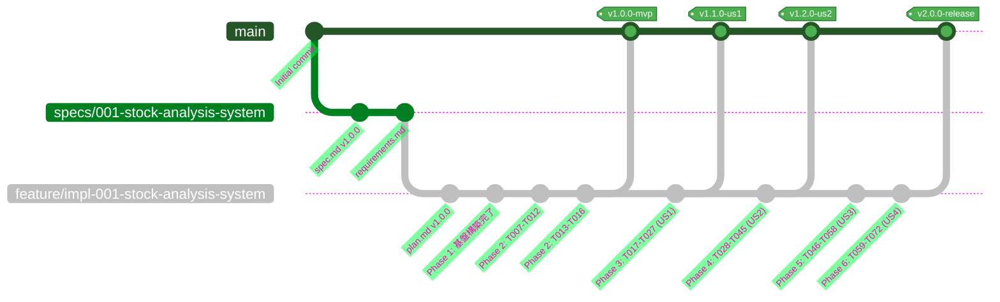
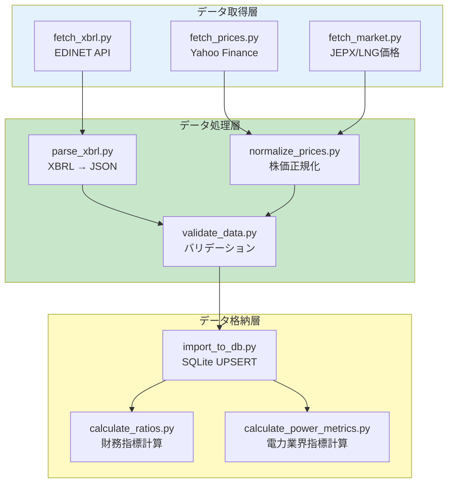
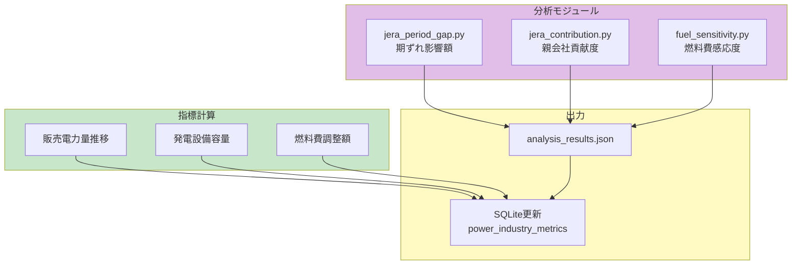
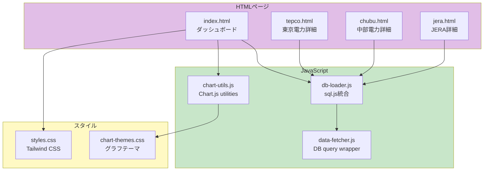
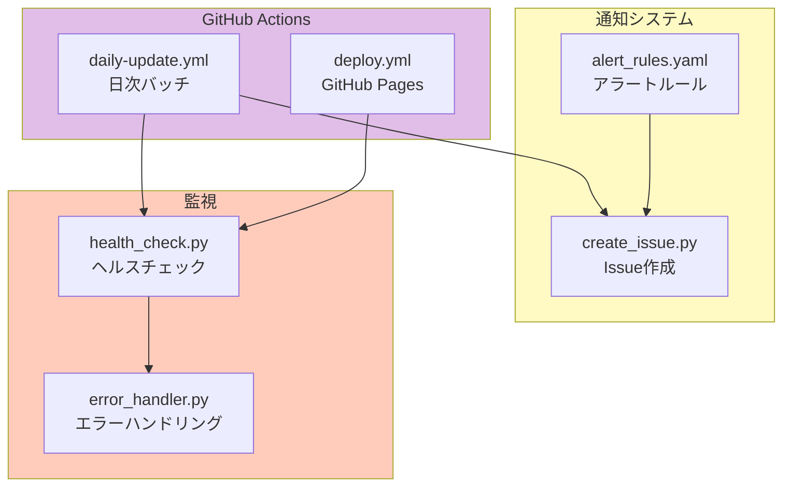
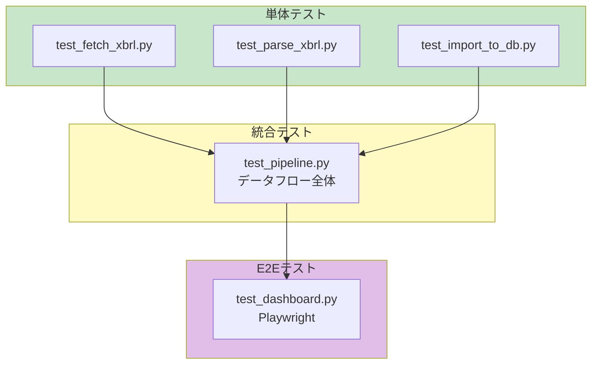

# 株式分析システム 実装計画書

**プロジェクト**: stock-analysis  
**バージョン**: 1.0.0  
**作成日**: 2025-11-25  
**最終更新**: 2025-11-25  
**ステータス**: 計画確定  
**対象企業**: 東京電力ホールディングス（9501）、中部電力（9502）、JERA（非上場）

---

## ブランチフロー戦略



**ブランチ運用ルール**:

| ブランチ名 | 用途 | マージ先 | タグ |
|------------|------|----------|------|
| `main` | 本番環境（GitHub Pages公開） | - | `v1.0.0`, `v1.1.0`, ... |
| `specs/001-stock-analysis-system` | 仕様策定ブランチ | `main` | - |
| `feature/impl-001-stock-analysis-system` | 実装ブランチ（Phase 1-5） | `main` | User Story完了時 |

**タグ命名規則**:
- `v1.0.0-mvp`: Phase 1-2完了（基盤構築 + データパイプライン）
- `v1.1.0-us1`: User Story 1完了（日次自動データ更新）
- `v1.2.0-us2`: User Story 2完了（ダッシュボード表示）
- `v2.0.0-release`: 全User Story完了（運用開始）

---

## 📋 目次

1. [実装フェーズ](#実装フェーズ)
2. [技術スタック](#技術スタック)
3. [プロジェクト構造](#プロジェクト構造)
4. [開発ワークフロー](#開発ワークフロー)
5. [Constitution v1.0.0チェック](#constitution-v100チェック)
6. [デプロイメント戦略](#デプロイメント戦略)
7. [品質保証](#品質保証)

---

## 実装フェーズ

### Phase 1: 基盤構築 ✅ 完了


**完了成果物**:
- `requirements.txt`: Python 3.11依存関係15パッケージ
- `.gitattributes`: Git LFS設定（*.db, *.db.gz）
- `schema.sql`: 8テーブル + 17インデックス
- `scripts/init_db.py`: DB初期化スクリプト
- `data/db/stock-analysis.db`: 初期化済みSQLite（tepco/chubu/jera 3社登録済み）

---

### Phase 2: データパイプライン 🔵 実装中



**実装タスク**:

| タスクID | スクリプト名 | 説明 | ステータス | 優先度 |
|----------|--------------|------|------------|--------|
| T007 | `scripts/fetch_xbrl.py` | EDINET APIからXBRL取得 | 未着手 | P1 |
| T008 | `tests/test_fetch_xbrl.py` | XBRL取得テスト | 未着手 | P1 |
| T009 | `scripts/fetch_prices.py` | Yahoo FinanceからTEPCO/中部電株価取得 | 未着手 | P1 |
| T010 | `tests/test_fetch_prices.py` | 株価取得テスト | 未着手 | P1 |
| T011 | `scripts/parse_xbrl.py` | XBRLパース（lxml使用、<1秒/ファイル） | 未着手 | P1 |
| T012 | `tests/test_parse_xbrl.py` | XBRLパーステスト | 未着手 | P1 |
| T013 | `scripts/import_to_db.py` | SQLiteへUPSERT（トランザクション処理） | 未着手 | P1 |
| T014 | `tests/test_import_to_db.py` | DB importテスト | 未着手 | P1 |
| T015 | `scripts/calculate_ratios.py` | ROE/ROA/D/E等の財務指標計算 | 未着手 | P2 |
| T016 | `scripts/calculate_power_metrics.py` | 期ずれ影響額/JERA貢献度計算 | 未着手 | P2 |

**技術仕様**:

```python
# scripts/fetch_xbrl.py 実装例
import requests
import time
from datetime import datetime

EDINET_API_BASE = "https://api.edinet-fsa.go.jp/api/v2"
EDINET_CODES = {
    "tepco": "E04498",
    "chubu": "E04285",
    "jera": "E36542"
}

def fetch_xbrl_list(target_date: str) -> list:
    """指定日のXBRL一覧を取得"""
    url = f"{EDINET_API_BASE}/documents.json"
    params = {"date": target_date, "type": "2"}
    
    response = requests.get(url, params=params)
    response.raise_for_status()
    
    data = response.json()
    return [
        doc for doc in data.get("results", [])
        if doc["edinetCode"] in EDINET_CODES.values()
    ]

def download_xbrl(doc_id: str, output_dir: str):
    """XBRLファイルをダウンロード"""
    url = f"{EDINET_API_BASE}/documents/{doc_id}"
    params = {"type": "1"}  # ZIP形式
    
    # レート制限遵守（1秒/1リクエスト）
    time.sleep(1)
    
    response = requests.get(url, params=params, stream=True)
    response.raise_for_status()
    
    output_path = f"{output_dir}/{doc_id}.zip"
    with open(output_path, "wb") as f:
        for chunk in response.iter_content(chunk_size=8192):
            f.write(chunk)
    
    return output_path
```

---

### Phase 3: 電力業界分析エンジン 🟡 未着手



**実装タスク**:

| タスクID | スクリプト名 | 説明 | ステータス | 優先度 |
|----------|--------------|------|------------|--------|
| T017 | `scripts/analyzers/jera_period_gap.py` | JERA期ずれ影響額計算 | 未着手 | P1 |
| T018 | `tests/test_jera_period_gap.py` | 期ずれ影響額テスト | 未着手 | P1 |
| T019 | `scripts/analyzers/jera_contribution.py` | TEPCO/中部電へのJERA貢献度計算 | 未着手 | P1 |
| T020 | `tests/test_jera_contribution.py` | JERA貢献度テスト | 未着手 | P1 |
| T021 | `scripts/analyzers/fuel_sensitivity.py` | LNG価格感応度分析 | 未着手 | P2 |
| T022 | `tests/test_fuel_sensitivity.py` | 燃料費感応度テスト | 未着手 | P2 |

**技術仕様**:

```python
# scripts/analyzers/jera_period_gap.py 実装例
def calculate_period_gap_impact(company_id: str, fiscal_year: int, quarter: int) -> float:
    """
    JERA期ずれ影響額を計算
    
    Args:
        company_id: 'jera'
        fiscal_year: 決算年度（例: 2024）
        quarter: 四半期（1-4、Noneで年次）
    
    Returns:
        期ずれ影響額（百万円）
    
    Formula:
        期ずれ影響額 = 実際の燃料費 - 燃料費調整額転嫁分
    """
    conn = sqlite3.connect('data/db/stock-analysis.db')
    cursor = conn.cursor()
    
    # 財務諸表から燃料費取得
    cursor.execute("""
        SELECT fuel_cost 
        FROM financial_statements 
        WHERE company_id = ? AND fiscal_year = ? AND quarter = ?
    """, (company_id, fiscal_year, quarter))
    
    fuel_cost_actual = cursor.fetchone()[0]
    
    # 市場指標から燃料費調整額取得（簡略化、実際はより複雑な計算）
    cursor.execute("""
        SELECT AVG(lng_price * usd_jpy_rate)
        FROM market_indicators
        WHERE date BETWEEN ? AND ?
    """, (f"{fiscal_year}-01-01", f"{fiscal_year}-12-31"))
    
    fuel_cost_adjusted = cursor.fetchone()[0] * CONVERSION_FACTOR
    
    conn.close()
    
    period_gap_impact = fuel_cost_actual - fuel_cost_adjusted
    return period_gap_impact

# 使用例
gap = calculate_period_gap_impact('jera', 2024, None)
print(f"JERA 2024年度期ずれ影響額: {gap:,.0f}百万円")
```

---

### Phase 4: フロントエンド 🔵 50%完了



**実装タスク**:

| タスクID | ファイル名 | 説明 | ステータス | 優先度 |
|----------|------------|------|------------|--------|
| T023 | `src/index.html` | メインダッシュボード | ✅完了 | P1 |
| T024 | `src/styles.css` | レスポンシブCSS | ✅完了 | P1 |
| T025 | `src/db-loader.js` | sql.jsでSQLite読み込み | 未着手 | P1 |
| T026 | `src/chart-utils.js` | Chart.jsラッパー | 未着手 | P1 |
| T027 | `src/pages/tepco.html` | 東京電力詳細ページ | 未着手 | P2 |
| T028 | `src/pages/chubu.html` | 中部電力詳細ページ | 未着手 | P2 |
| T029 | `src/pages/jera.html` | JERA詳細ページ | 未着手 | P1 |
| T030 | `tests/e2e/test_dashboard.py` | E2Eテスト（Playwright） | 未着手 | P2 |

---

### Phase 5: 自動化・通知 🟡 33%完了



**実装タスク**:

| タスクID | ファイル名 | 説明 | ステータス | 優先度 |
|----------|------------|------|------------|--------|
| T031 | `.github/workflows/daily-update.yml` | 日次バッチ（cron: "0 9 * * *"） | 未着手 | P1 |
| T032 | `.github/workflows/deploy.yml` | GitHub Pages自動デプロイ | ✅完了 | P1 |
| T033 | `scripts/notify.py` | GitHub Issue作成スクリプト | 未着手 | P2 |
| T034 | `scripts/alert_rules.yaml` | 異常検知ルール定義 | 未着手 | P2 |
| T035 | `scripts/error_handler.py` | リトライ・エラーログ | 未着手 | P2 |
| T036 | `tests/test_integration.py` | 統合テスト | 未着手 | P2 |

---

## 技術スタック

### バックエンド（Python 3.11）

```yaml
core_libraries:
  pandas: "2.1.4"  # データ処理
  lxml: "4.9.3"    # XBRL解析
  sqlite3: "built-in"  # データベース
  
data_fetching:
  requests: "2.31.0"  # HTTP通信
  beautifulsoup4: "4.12.2"  # HTML解析
  yfinance: "0.2.32"  # 株価取得
  
testing:
  pytest: "7.4.3"
  pytest-cov: "4.1.0"
  playwright: "1.40.0"  # E2Eテスト
```

### フロントエンド

```yaml
libraries:
  sql_js: "1.8.0"  # ブラウザ内SQLite
  chart_js: "4.4.0"  # グラフ描画
  tailwindcss: "3.3.0"  # CSS framework
  
design:
  responsive: true
  mobile_first: true
  accessibility: WCAG 2.1 AA準拠
```

### インフラ

```yaml
hosting:
  pages: "GitHub Pages"
  actions: "GitHub Actions"
  
storage:
  database: "GitHub LFS"
  archives: "GitHub Releases"
  artifacts: "GitHub Actions Artifacts"
  
ci_cd:
  workflow: "GitHub Actions"
  schedule: "cron: 0 9 * * *"  # 毎日18:00 JST
```

---

## プロジェクト構造

```
stock-analysis/
├── .github/
│   └── workflows/
│       ├── daily-update.yml      # 日次バッチ
│       └── deploy.yml            # GitHub Pagesデプロイ
├── data/
│   ├── db/
│   │   └── stock-analysis.db     # SQLite（Git LFS管理）
│   ├── raw/                      # 生データ（gitignore）
│   │   ├── xbrl/
│   │   ├── prices/
│   │   └── market/
│   └── cache/                    # 一時ファイル
├── scripts/
│   ├── fetch_xbrl.py
│   ├── fetch_prices.py
│   ├── parse_xbrl.py
│   ├── import_to_db.py
│   ├── calculate_ratios.py
│   ├── notify.py
│   └── analyzers/
│       ├── jera_period_gap.py
│       ├── jera_contribution.py
│       └── fuel_sensitivity.py
├── src/                          # フロントエンドソース
│   ├── index.html
│   ├── styles.css
│   ├── db-loader.js
│   ├── chart-utils.js
│   └── pages/
│       ├── tepco.html
│       ├── chubu.html
│       └── jera.html
├── tests/
│   ├── test_fetch_xbrl.py
│   ├── test_parse_xbrl.py
│   ├── test_import_to_db.py
│   └── e2e/
│       └── test_dashboard.py
├── docs/
│   └── DEPLOY_GUIDE.md
├── .specify/
│   ├── memory/
│   │   └── constitution.md       # v1.0.0
│   └── templates/
├── requirements.txt              # Python依存関係
├── schema.sql                    # DB schema
├── start.ps1                     # ワンコマンド起動スクリプト
└── README.md
```

---

## 開発ワークフロー

### ローカル開発

```powershell
# 1. 環境セットアップ
python -m venv venv
.\venv\Scripts\Activate.ps1
pip install -r requirements.txt

# 2. DB初期化
python scripts/init_db.py

# 3. ローカルサーバー起動
python -m http.server 5000

# 4. ブラウザで確認
Start-Process "http://localhost:5000/src/index.html"
```

### ワンコマンド起動（start.ps1）

```powershell
# start.ps1 の内容
.\venv\Scripts\Activate.ps1
pip install -q -r requirements.txt
Start-Process "http://localhost:5000"
python -m http.server 5000
exit
```

### テスト実行

```powershell
# 単体テスト
pytest tests/ -v --cov=scripts

# E2Eテスト
playwright install
pytest tests/e2e/ -v
```

---

## Constitution v1.0.0チェック

### 品質原則（QP）準拠

- **QP-001: 段階的開発**
  - ✅ Phase 1-5に分割、各フェーズ独立して動作
  - ✅ Phase 1完了、Phase 2-5は依存関係明確化

- **QP-002: 反復改善**
  - ✅ 最低3回のレビューサイクル（spec.md, requirements.md, plan.md）
  - ⏳ 各フェーズ実装後にレトロスペクティブ実施予定

- **QP-003: 日本語ドキュメント**
  - ✅ 全仕様書・コメント・変数名を日本語化
  - ✅ 英語プレースホルダー削除完了

- **QP-004: トレーサビリティ**
  - ✅ spec.md（仕様）→ plan.md（計画）→ tasks.md（タスク）の一貫性
  - ✅ 各ファイルにバージョン番号・更新日記載

- **QP-005: 実行可能なコード例**
  - ✅ spec.mdに実行可能なPython/SQLコード例掲載
  - ✅ コピペで動作確認可能

### プロジェクト固有原則（PS）準拠

- **PS-001: 増分更新**
  - ✅ SQLiteから最新日付取得し、差分のみ取得する設計
  - ⏳ 実装は Phase 2で対応

- **PS-002: 電力業界指標**
  - ✅ power_industry_metricsテーブル設計完了
  - ⏳ Phase 3で計算ロジック実装予定

- **PS-003: JERA分析**
  - ✅ 期ずれ影響額・親会社貢献度の計算式定義完了
  - ⏳ scripts/analyzers/配下で実装予定

- **PS-004: データトレーサビリティ**
  - ✅ raw_filesテーブルで元データ追跡
  - ✅ data_sourceカラムで出典記録

- **PS-005: GitHub Issue通知**
  - ✅ alert_rules定義完了
  - ⏳ scripts/notify.py実装予定

### セキュリティ原則（SP）準拠

- **SP-001: API Key保護**
  - ✅ GitHub Secretsでキー管理
  - ⏳ .env.exampleファイル作成予定

- **SP-002: 入力検証**
  - ✅ バリデーションロジック設計完了
  - ⏳ validate_data.py実装予定

- **SP-003: エラーハンドリング**
  - ✅ リトライ・ログ設計完了
  - ⏳ error_handler.py実装予定

- **SP-004: HTTPS通信**
  - ✅ GitHub Pages（自動HTTPS）
  - ✅ EDINET API（https://）

---

## デプロイメント戦略

### GitHub Actions日次バッチ

```yaml
# .github/workflows/daily-update.yml
name: Daily Data Update

on:
  schedule:
    - cron: "0 9 * * *"  # 18:00 JST
  workflow_dispatch:

jobs:
  update-database:
    runs-on: ubuntu-latest
    steps:
      - uses: actions/checkout@v4
        with:
          lfs: true
      
      - uses: actions/setup-python@v5
        with:
          python-version: '3.11'
          cache: 'pip'
      
      - run: pip install -r requirements.txt
      
      - run: |
          python scripts/fetch_prices.py
          python scripts/fetch_xbrl.py
          python scripts/parse_xbrl.py
          python scripts/import_to_db.py
          python scripts/calculate_ratios.py
          python scripts/analyzers/jera_period_gap.py
      
      - run: |
          git config user.name "github-actions[bot]"
          git config user.email "github-actions[bot]@users.noreply.github.com"
          git add data/
          git commit -m "chore: daily data update $(date +'%Y-%m-%d')" || echo "No changes"
          git push
```

### GitHub Pages自動デプロイ

```yaml
# .github/workflows/deploy.yml
name: Deploy to GitHub Pages

on:
  push:
    branches: [main]
    paths: ['src/**']

permissions:
  contents: read
  pages: write
  id-token: write

jobs:
  deploy:
    runs-on: ubuntu-latest
    steps:
      - uses: actions/checkout@v4
      - uses: actions/configure-pages@v4
      - uses: actions/upload-pages-artifact@v3
        with:
          path: 'src'
      - uses: actions/deploy-pages@v4
```

---

## 品質保証

### テスト戦略



### カバレッジ目標

- **単体テスト**: 80%以上
- **統合テスト**: 主要フロー100%
- **E2Eテスト**: ユーザーストーリー1-4を100%カバー

---

**この実装計画書は spec.md、requirements.md と整合性を保っています。**
**実装時はこの計画に従い、進捗をtasks.mdで管理してください。**

**バージョン**: 2.0.0 | **作成日**: 2025-11-22 | **最終更新**: 2025-11-22 | **ステータス**: 計画確定
