# 株式分析システム 完全仕様書

**Feature Branch**: `spec/001-stock-analysis-system`  
**バージョン**: 1.0.0  
**作成日**: 2025-11-25  
**最終更新**: 2025-11-25  
**ステータス**: 仕様確定、実装開始準備完了  
**プロジェクト**: stock-analysis  
**GitHub**: https://github.com/J1921604/stock-analysis  
**GitHub Pages**: https://j1921604.github.io/stock-analysis/  
**対象企業**: 東京電力ホールディングス（9501）、中部電力（9502）、JERA（非上場）

---

## 📋 目次

1. [ユーザーストーリー](#ユーザーストーリー)
2. [機能要件](#機能要件)
3. [システムアーキテクチャ](#システムアーキテクチャ)
4. [データモデル](#データモデル)
5. [収集対象データ](#収集対象データ)
6. [電力業界特化指標](#電力業界特化指標)
7. [GitHub統合仕様](#github統合仕様)
8. [フロントエンド仕様](#フロントエンド仕様)
9. [想定事項](#想定事項)
10. [成功基準](#成功基準)

---

## ユーザーストーリー

<!--
IMPORTANT: User stories are PRIORITIZED as user journeys ordered by importance.
Each user story/journey must be INDEPENDENTLY TESTABLE.
-->

### User Story 1 - 日次自動データ更新 (Priority: P1)

**ストーリー**: システム利用者として、毎日最新の財務・株価データが自動で更新されることで、手動でデータ収集する手間なく常に最新情報を閲覧できる。

**Why this priority**: データの鮮度がシステムの価値の根幹。自動更新がなければ手動運用となり、システム化の意味が失われる。

**Independent Test**: GitHub Actionsワークフローを手動実行し、SQLiteファイルが更新されることを確認。24時間後に再度実行され、増分データが追加されることを検証。

**Acceptance Scenarios**:

1. **Given** GitHub Actionsが毎日JST 18:00に実行される設定、**When** cron が発火、**Then** データ収集→正規化→SQLite更新→コミット→プッシュが完了
2. **Given** 前回実行日が2025-11-21、**When** 2025-11-22に実行、**Then** 11-22のデータのみ取得され、重複なく追加される
3. **Given** EDINET APIが一時的に障害、**When** データ取得失敗、**Then** エラーログ出力、GitHub Issue自動作成、処理継続（他データソース）

**Edge Cases**:
- API障害時のリトライ（指数バックオフ、最大3回）
- データ欠損時の補完（前日値で埋める、またはNULLで記録）
- SQLiteファイルサイズ肥大化（100MB超過時に警告Issue作成）

---

### User Story 2 - ブラウザでの財務分析表示 (Priority: P1)

**ストーリー**: 投資家として、ブラウザでGitHub Pagesにアクセスするだけで、東京電力・中部電力・JERAの財務指標がグラフ化され、一目で経営状況を把握できる。

**Why this priority**: データがあっても可視化されなければ意思決定に使えない。ダッシュボードはシステムの価値提供の最終形態。

**Independent Test**: https://j1921604.github.io/stock-analysis/ にアクセスし、3社の財務カードが表示され、ROE・営業利益率・株価チャートが描画されることを確認。

**Acceptance Scenarios**:

1. **Given** GitHub PagesにSQLiteファイルがコミット済み、**When** ブラウザでアクセス、**Then** sql.jsがSQLiteをロード、3社のカードが表示
2. **Given** カード内のグラフ表示ボタンをクリック、**When** Chart.jsが描画、**Then** 過去5年間の売上高・営業利益の折れ線グラフが表示
3. **Given** ローカルSQLiteファイルをドラッグ&ドロップ、**When** ファイル読み込み、**Then** ローカルデータでダッシュボード更新

**Edge Cases**:
- SQLiteファイルが大きすぎてブラウザが固まる（100MB超の場合、一部データのみロード）
- 古いブラウザでsql.jsが動作しない（Edge 90+、Chrome 90+、Firefox 88+の推奨表示）

---

### User Story 3 - 電力業界特化指標の可視化 (Priority: P2)

**ストーリー**: 電力業界アナリストとして、JERAの燃料費期ずれ影響や親会社への貢献度など、一般的な財務諸表では見えない業界特有の指標を確認したい。

**Why this priority**: 汎用的な株式分析ツールでは提供されない、電力業界ならではの深い分析が競争優位性。

**Independent Test**: ダッシュボードでJERAカードを開き、「期ずれ影響額」「TEPCO/中部電への貢献度（%）」「燃料費調整額」のグラフが表示されることを確認。

**Acceptance Scenarios**:

1. **Given** JERAの四半期決算データ、**When** 「期ずれ影響額」を計算、**Then** 実質利益 = 純利益 - 期ずれ影響額 が算出される
2. **Given** 東京電力の経常利益 1000億円、JERA持分法利益 200億円、**When** 貢献度計算、**Then** 20%と表示
3. **Given** 燃料価格データ（LNG, 石炭, 原油）、**When** グラフ描画、**Then** JEPXスポット価格との相関が可視化

**Edge Cases**:
- JERAの決算資料が未発表（N/Aと表示、前期データで補完）
- 為替変動が激しい（USD/JPYレート変動率を別途表示）

---

### User Story 4 - 異常値検知とGitHub Issue通知 (Priority: P3)

**ストーリー**: システム管理者として、株価が10%以上変動した場合や、ROEが急落した場合に、自動でGitHub Issueが作成され、メール通知を受け取りたい。

**Why this priority**: 手動監視では見逃す可能性がある重要な変化を、自動検知することで投資機会損失を防ぐ。

**Independent Test**: テストデータで東京電力の株価を前日比-12%に設定し、GitHub Actionsを実行。Issue "📊 Daily Analysis Alert - 2025-11-22" が作成され、株価急落が記載されることを確認。

**Acceptance Scenarios**:

1. **Given** 株価データ（前日終値 1000円、当日終値 880円）、**When** 分析実行、**Then** 変動率-12%を検知、Issue作成
2. **Given** ROEが前四半期15%→当四半期5%、**When** 閾値チェック（-10pt）、**Then** "⚠️ ROE大幅低下" Issue作成
3. **Given** 燃料価格（LNG）が30日前比+20%、**When** 市場環境分析、**Then** "🔴 LNG価格急騰" Issue作成

**Edge Cases**:
- 祝日・週末で株価データ未取得（スキップ、Issue作成なし）
- 同一アラートの重複Issue防止（過去7日以内の類似Issue検索、存在すればコメント追記）

---

## 主要機能概要

### 電力3社ダッシュボード

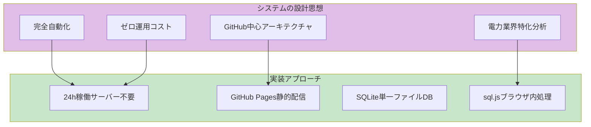

### システム特性

| 特性 | 説明 | 実現方法 |
|------|------|----------|
| 完全自動化 | 人的介入を売買判断のみに限定 | GitHub Actions日次バッチ（cron: "0 9 * * *" = 18:00 JST） |
| ゼロ運用コスト | サーバー管理・保守作業不要 | GitHub Pages（静的配信）+ GitHub Actions（無料枠） |
| データ永続性 | 過去10年超のデータ保持 | GitHub Releases（XBRL Archive）+ Git LFS（SQLite） |
| 高速配信 | ブラウザ内解析で即座に表示 | sql.js (WASM) + Chart.js 4.4.0 |
| セキュア | 認証なしでも機密情報保護 | GitHub Secrets（API Key）+ presigned URL（7日有効） |

---

## 機能要件

### FR-001: データ自動収集
**要件**: システムは毎日JST 18:00にGitHub Actionsを実行し、以下のデータソースから最新データを取得しなければならない（MUST）

**データソース**:
- **EDINET API**: 有価証券報告書、四半期報告書（XBRL形式）
  - エンドポイント: `https://api.edinet-fsa.go.jp/api/v2/documents.json`
  - 対象EDINETコード: E04498（東京電力HD）、E04285（中部電力）、E36542（JERA）
  - 取得書類種別: 120（有報）、130（半期）、140（四半期）
- **株価API**: Yahoo Finance（yfinanceライブラリ使用）
  - ティッカー: 9501.T（東京電力）、9502.T（中部電力）
  - 取得項目: Open, High, Low, Close, Volume, Adjusted Close
- **各社IRサイト**: プレスリリース、決算説明資料PDF
  - 東京電力: https://www.tepco.co.jp/about/ir/library/
  - 中部電力: https://www.chuden.co.jp/ir/
  - JERA: https://www.jera.co.jp/ir/

### FR-002: インクリメンタル更新
**要件**: システムはSQLite内の最新データ日付を確認し、それ以降のデータのみ取得しなければならない（MUST）

**実装例**:
```python
import sqlite3
from datetime import datetime, timedelta

def get_last_stock_price_date(db_path, company_id):
    """SQLiteから最新株価日付を取得"""
    conn = sqlite3.connect(db_path)
    cursor = conn.cursor()
    cursor.execute("SELECT MAX(date) FROM stock_prices WHERE company_id = ?", (company_id,))
    result = cursor.fetchone()[0]
    conn.close()
    return result if result else (datetime.now() - timedelta(days=365)).strftime('%Y-%m-%d')

last_date = get_last_stock_price_date('data/db/stock-analysis.db', 'tepco')
new_data = fetch_stock_prices('9501.T', start_date=last_date)
```

### FR-003: データ正規化とバリデーション
**要件**: 取得した生データは正規化され、型・範囲検証を通過したもののみSQLiteに格納しなければならない（MUST）

**検証ルール**:
```yaml
stock_price_validation:
  date: "YYYY-MM-DD形式、過去日付"
  close: "数値、0 < close < 1,000,000（円）"
  volume: "整数、volume >= 0"

financial_statement_validation:
  revenue: "数値、revenue > 0（百万円）"
  net_income: "数値、-1,000,000 < net_income < 1,000,000"
  total_assets: "数値、total_assets > 0"
  
xbrl_validation:
  schema: "XBRL Taxonomy 2022準拠"
  encoding: "UTF-8"
  max_size: "50MB/ファイル"
```

### FR-004: SQLiteデータベース管理
**要件**: システムは単一のSQLiteファイル（`data/db/stock-analysis.db`）で全データを管理しなければならない（MUST）

**スキーマ構成**（詳細は[データモデル](#データモデル)参照）:
- `companies`: 企業マスタ（3社：東京電力、中部電力、JERA）
- `financial_statements`: 財務諸表（BS, PL, CF統合）
- `stock_prices`: 日次株価（9501.T, 9502.T）
- `financial_ratios`: 計算済み財務指標（ROE, ROA, D/E等）
- `power_industry_metrics`: 電力業界特有指標（販売電力量、燃料費調整額、JERA期ずれ影響等）
- `market_indicators`: 市場環境データ（LNG価格、USD/JPY為替、JEPXスポット価格）
- `analysis_alerts`: 異常検知ログ
- `raw_files`: データソースメタ情報

### FR-005: ブラウザ内SQLite実行
**要件**: フロントエンドはsql.jsライブラリを使用し、ブラウザ内でSQLiteファイルを直接操作できなければならない（MUST）

**実装例**:
```javascript
import initSqlJs from 'https://cdn.jsdelivr.net/npm/sql.js@1.8.0/+esm';

async function loadDatabase(dbUrl) {
    const SQL = await initSqlJs({
        locateFile: file => `https://cdn.jsdelivr.net/npm/sql.js@1.8.0/dist/${file}`
    });
    
    const response = await fetch(dbUrl);
    const arrayBuffer = await response.arrayBuffer();
    const uint8Array = new Uint8Array(arrayBuffer);
    
    const db = new SQL.Database(uint8Array);
    return db;
}

// 使用例
const db = await loadDatabase('https://raw.githubusercontent.com/J1921604/stock-analysis/main/data/db/stock-analysis.db');
const result = db.exec("SELECT * FROM companies");
console.log(result);
```

### FR-006: Chart.jsによるグラフ描画
**要件**: ダッシュボードはChart.jsを使用し、以下のグラフを描画できなければならない（MUST）

**グラフ種別**:
- **折れ線グラフ**: 売上高推移、営業利益推移、ROE推移、株価推移
- **棒グラフ**: 四半期比較、3社比較
- **積み上げ面グラフ**: 発電構成（火力/再エネ/原子力）
- **レーダーチャート**: 財務健全性指標（自己資本比率、流動比率、D/E等）

### FR-007: GitHub Issues自動作成
**要件**: 異常値検知時、システムはGitHub Issuesを自動作成し、リポジトリオーナーに通知しなければならない（MUST）

**Issue作成条件**:
```yaml
alert_rules:
  stock_price_change:
    trigger: "abs(変動率) > 10%"
    severity: "critical"
    label: "alert, stock-price"
  
  roe_drop:
    trigger: "ROE低下 > 10pt（前四半期比）"
    severity: "warning"
    label: "alert, financial"
  
  fuel_price_surge:
    trigger: "LNG価格上昇 > 15%（30日前比）"
    severity: "warning"
    label: "alert, market"
  
  data_fetch_failure:
    trigger: "データ取得失敗（3回リトライ後）"
    severity: "high"
    label: "error, data-pipeline"
```

**Issue作成実装**:
```yaml
# .github/workflows/daily-update.yml
- name: Create Issue on Alert
  if: success()
  uses: actions/github-script@v7
  with:
    script: |
      const fs = require('fs');
      const analysis = fs.readFileSync('analysis_output.txt', 'utf8');
      
      if (analysis.includes('ALERT')) {
        await github.rest.issues.create({
          owner: context.repo.owner,
          repo: context.repo.repo,
          title: `📊 Daily Analysis Alert - ${new Date().toISOString().split('T')[0]}`,
          body: `## 自動分析結果\n\n\`\`\`\n${analysis}\n\`\`\``,
          labels: ['auto-analysis', 'daily-report']
        });
      }
```

---

## システムアーキテクチャ

### 全体構成図

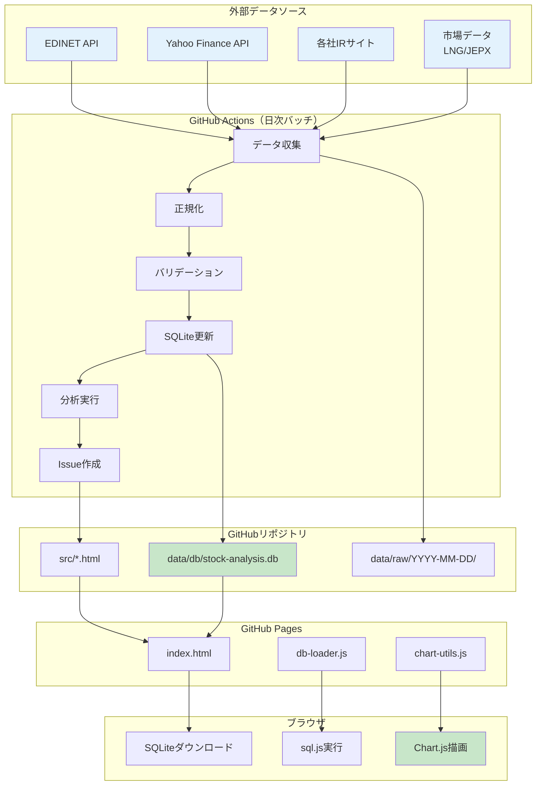

### データフロー詳細

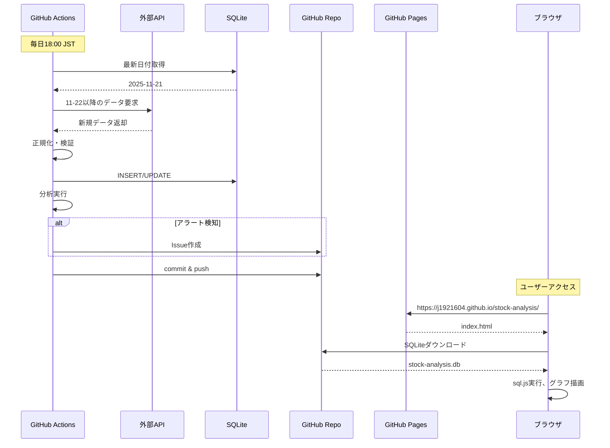

---

## データモデル

### ERD（エンティティ関係図）

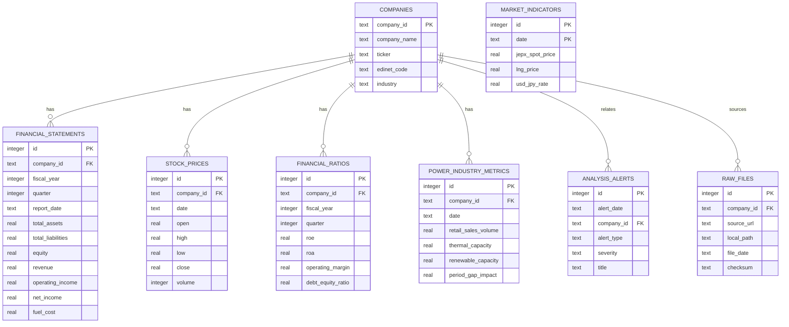

### スキーマ定義（SQL）

```sql
-- 企業マスタ
CREATE TABLE companies (
    company_id TEXT PRIMARY KEY,
    company_name TEXT NOT NULL,
    ticker TEXT,
    edinet_code TEXT,
    industry TEXT DEFAULT '電力・ガス',
    created_at TEXT DEFAULT CURRENT_TIMESTAMP
);

-- 初期データ挿入
INSERT INTO companies VALUES
    ('tepco', '東京電力ホールディングス', '9501', 'E04498', '電力・ガス', '2025-11-22'),
    ('chubu', '中部電力', '9502', 'E04285', '電力・ガス', '2025-11-22'),
    ('jera', 'JERA', NULL, 'E36542', '電力・ガス', '2025-11-22');

-- 財務諸表（BS, PL, CF統合）
CREATE TABLE financial_statements (
    id INTEGER PRIMARY KEY AUTOINCREMENT,
    company_id TEXT NOT NULL,
    fiscal_year INTEGER NOT NULL,
    quarter INTEGER, -- NULL = 年次
    report_date TEXT NOT NULL,
    
    -- 貸借対照表（BS）
    total_assets REAL,
    current_assets REAL,
    fixed_assets REAL,
    total_liabilities REAL,
    current_liabilities REAL,
    long_term_debt REAL,
    total_equity REAL,
    capital_stock REAL,
    
    -- 損益計算書（PL）
    revenue REAL,
    operating_revenue REAL, -- 電力事業特有
    cost_of_sales REAL,
    fuel_cost REAL, -- 重要指標
    operating_income REAL,
    ordinary_income REAL,
    net_income REAL,
    
    -- キャッシュフロー（CF）
    operating_cf REAL,
    investing_cf REAL,
    financing_cf REAL,
    free_cash_flow REAL,
    
    data_source TEXT,
    created_at TEXT DEFAULT CURRENT_TIMESTAMP,
    FOREIGN KEY (company_id) REFERENCES companies(company_id),
    UNIQUE(company_id, fiscal_year, quarter)
);

-- 株価情報
CREATE TABLE stock_prices (
    id INTEGER PRIMARY KEY AUTOINCREMENT,
    company_id TEXT NOT NULL,
    date TEXT NOT NULL,
    open REAL,
    high REAL,
    low REAL,
    close REAL,
    volume INTEGER,
    adjusted_close REAL,
    created_at TEXT DEFAULT CURRENT_TIMESTAMP,
    FOREIGN KEY (company_id) REFERENCES companies(company_id),
    UNIQUE(company_id, date)
);

-- 財務指標（計算済み）
CREATE TABLE financial_ratios (
    id INTEGER PRIMARY KEY AUTOINCREMENT,
    company_id TEXT NOT NULL,
    fiscal_year INTEGER NOT NULL,
    quarter INTEGER,
    calc_date TEXT NOT NULL,
    
    -- 収益性指標
    roe REAL, -- 自己資本利益率
    roa REAL, -- 総資産利益率
    operating_margin REAL, -- 営業利益率
    net_margin REAL,
    
    -- 安全性指標
    current_ratio REAL, -- 流動比率
    debt_equity_ratio REAL, -- 負債資本比率
    equity_ratio REAL, -- 自己資本比率
    interest_coverage REAL,
    
    -- 株価指標（上場企業のみ）
    per REAL, -- 株価収益率
    pbr REAL, -- 株価純資産倍率
    dividend_yield REAL,
    
    created_at TEXT DEFAULT CURRENT_TIMESTAMP,
    FOREIGN KEY (company_id) REFERENCES companies(company_id),
    UNIQUE(company_id, fiscal_year, quarter)
);

-- 電力業界特有指標
CREATE TABLE power_industry_metrics (
    id INTEGER PRIMARY KEY AUTOINCREMENT,
    company_id TEXT NOT NULL,
    date TEXT NOT NULL,
    
    -- 販売電力量（MWh）
    retail_sales_volume REAL,
    wholesale_sales_volume REAL,
    
    -- 発電設備容量（MW）
    thermal_capacity REAL,
    renewable_capacity REAL,
    nuclear_capacity REAL,
    
    -- 設備利用率
    capacity_factor REAL,
    
    -- 顧客数
    customer_count INTEGER,
    
    -- JERA特有
    period_gap_impact REAL, -- 期ずれ影響額
    jera_contribution_tepco REAL, -- 東電への貢献度
    jera_contribution_chubu REAL, -- 中部電への貢献度
    
    data_source TEXT,
    created_at TEXT DEFAULT CURRENT_TIMESTAMP,
    FOREIGN KEY (company_id) REFERENCES companies(company_id),
    UNIQUE(company_id, date)
);

-- 市場環境指標
CREATE TABLE market_indicators (
    id INTEGER PRIMARY KEY AUTOINCREMENT,
    date TEXT NOT NULL UNIQUE,
    
    -- 電力市場
    jepx_spot_price REAL, -- JEPX スポット価格（円/kWh）
    system_demand REAL, -- 電力需要（MWh）
    
    -- 燃料価格
    lng_price REAL, -- LNG価格（$/MMBtu）
    coal_price REAL, -- 石炭価格（$/ton）
    crude_oil_price REAL, -- 原油価格（$/barrel）
    
    -- 為替
    usd_jpy_rate REAL,
    
    created_at TEXT DEFAULT CURRENT_TIMESTAMP
);

-- 分析アラート履歴
CREATE TABLE analysis_alerts (
    id INTEGER PRIMARY KEY AUTOINCREMENT,
    alert_date TEXT NOT NULL,
    company_id TEXT,
    alert_type TEXT NOT NULL, -- 'financial', 'market', 'ratio'
    severity TEXT NOT NULL, -- 'info', 'warning', 'critical'
    title TEXT NOT NULL,
    description TEXT,
    metric_name TEXT,
    metric_value REAL,
    threshold_value REAL,
    github_issue_number INTEGER,
    created_at TEXT DEFAULT CURRENT_TIMESTAMP,
    FOREIGN KEY (company_id) REFERENCES companies(company_id)
);

-- 生データメタ情報
CREATE TABLE raw_files (
    id INTEGER PRIMARY KEY AUTOINCREMENT,
    company_id TEXT NOT NULL,
    source_url TEXT NOT NULL,
    local_path TEXT NOT NULL,
    file_date TEXT NOT NULL,
    file_type TEXT NOT NULL, -- 'xbrl', 'csv', 'pdf'
    checksum TEXT NOT NULL,
    ingested_at TEXT DEFAULT CURRENT_TIMESTAMP,
    FOREIGN KEY (company_id) REFERENCES companies(company_id)
);

-- インデックス作成
CREATE INDEX idx_financial_statements_company_year ON financial_statements(company_id, fiscal_year);
CREATE INDEX idx_stock_prices_company_date ON stock_prices(company_id, date);
CREATE INDEX idx_financial_ratios_company_year ON financial_ratios(company_id, fiscal_year);
CREATE INDEX idx_power_metrics_company_date ON power_industry_metrics(company_id, date);
CREATE INDEX idx_market_indicators_date ON market_indicators(date);
CREATE INDEX idx_analysis_alerts_date ON analysis_alerts(alert_date);
CREATE INDEX idx_raw_files_company_date ON raw_files(company_id, file_date);
```

### Phase 1（基盤構築）✅ 完了


**完了ファイル**:
- `requirements.txt`: 15パッケージ定義
- `.gitattributes`: Git LFS設定（*.db、*.db.br等）
- `schema.sql`: 6テーブル + 17インデックス
- `scripts/init_db.py`: DB初期化スクリプト（113行）
- `scripts/create_dirs.py`: ディレクトリ構造作成（62行）
- `data/db/stock-analysis.db`: 初期化済みDB（6テーブル、16インデックス、2サンプル企業）

### Phase 2（データパイプライン）⚪ 未着手

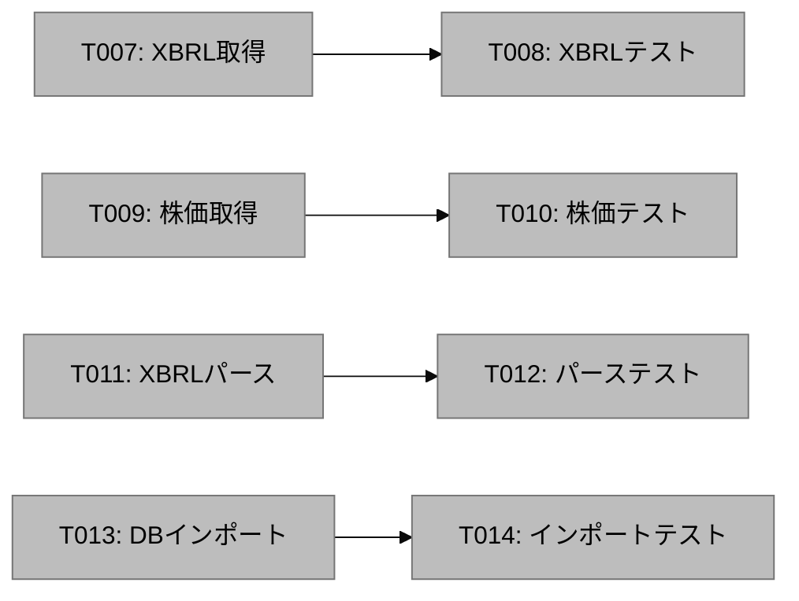

### Phase 3（解析エンジン）⚪ 未着手

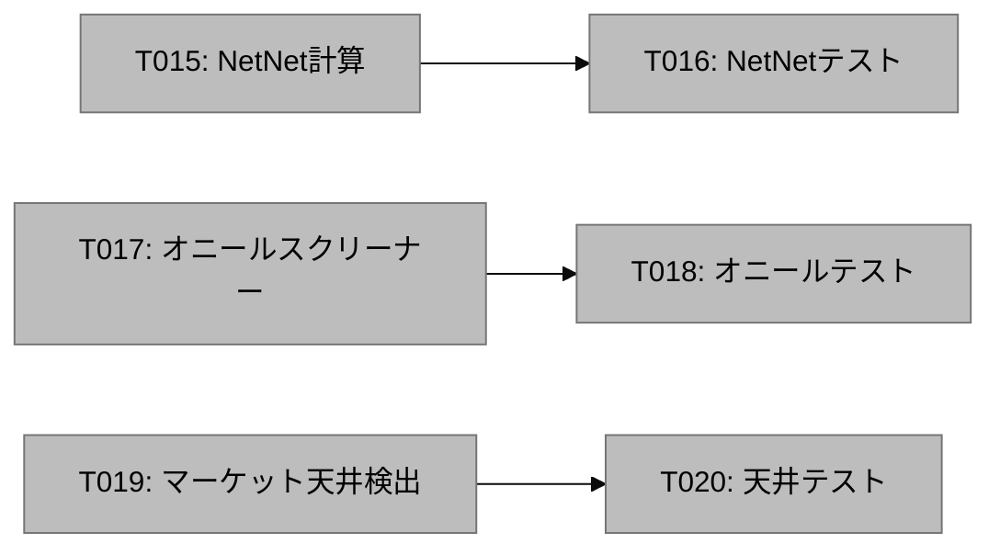

### Phase 4（フロントエンド）🟡 50%完了

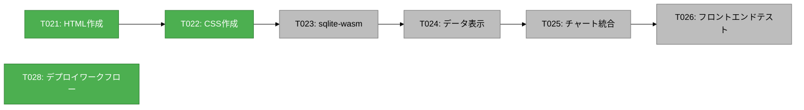

**完了ファイル**:
- `src/index.html`: ホームページ（150行）
- `src/pages/netnet.html`: NetNetPBR分析ページ（130行）
- `src/pages/oneil.html`: オニールスクリーナーページ（140行）
- `src/pages/market-top.html`: マーケット天井検出ページ（145行）
- `src/styles.css`: レスポンシブCSS（400行）
- `.github/workflows/deploy.yml`: GitHub Pages自動デプロイ（60行）

### Phase 5（自動化・通知）🟡 33%完了

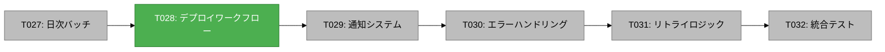

### 全体進捗

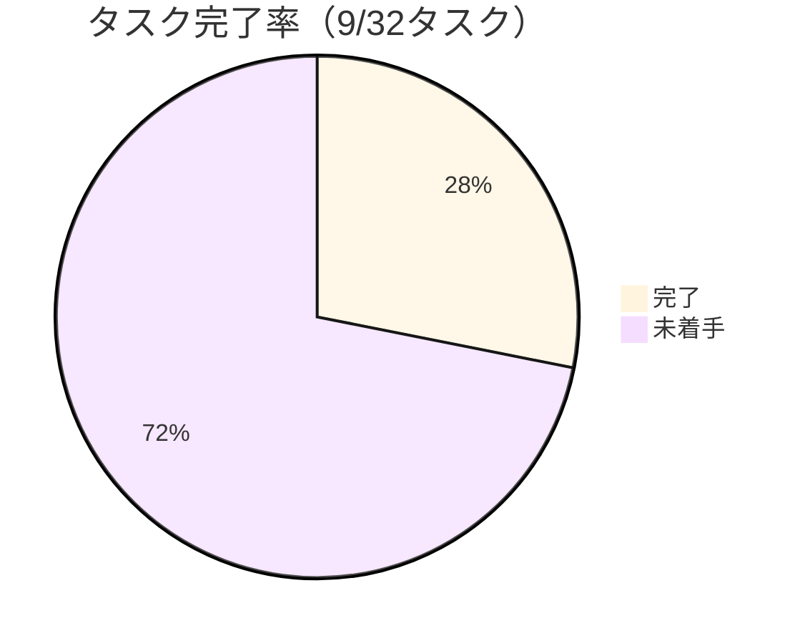

---

## 主要機能

1. **ネットネットバリュー株ランキング**
   - 即時現金化可能資産から総負債を引いた独自PBR算出
   - パラメータカスタマイズ可能（資産項目選択、割引率設定）
   - 過去PBR推移チャート表示

2. **オニール成長株発掘ランキング**
   - EPS成長率によるスクリーニング
   - リラティブストレングス指標
   - 決算発表日マーカー表示
   - シグナル区間の背景色可視化

3. **マーケット天井検出ツール**
   - 分配日カウントによる天井予測
   - 注意期間の背景色表示
   - パラメータ調整機能

### システム特性

| 特性 | 説明 | 実現方法 |
|------|------|----------|
| 完全自動化 | 人的介入を売買判断のみに限定 | GitHub Actions日次バッチ |
| ゼロ運用コスト | サーバー管理・保守作業不要 | フルマネージドサービス利用 |
| データ永続性 | 過去10年超のデータ保持 | GitHub Releases + LFS |
| 高速配信 | ブラウザ内解析で即座に表示 | sqlite-wasm + lightweight-charts |
| セキュア | 認証なしでも機密情報保護 | presigned URL（7日有効） |

---

## アーキテクチャ設計

### システム全体構成

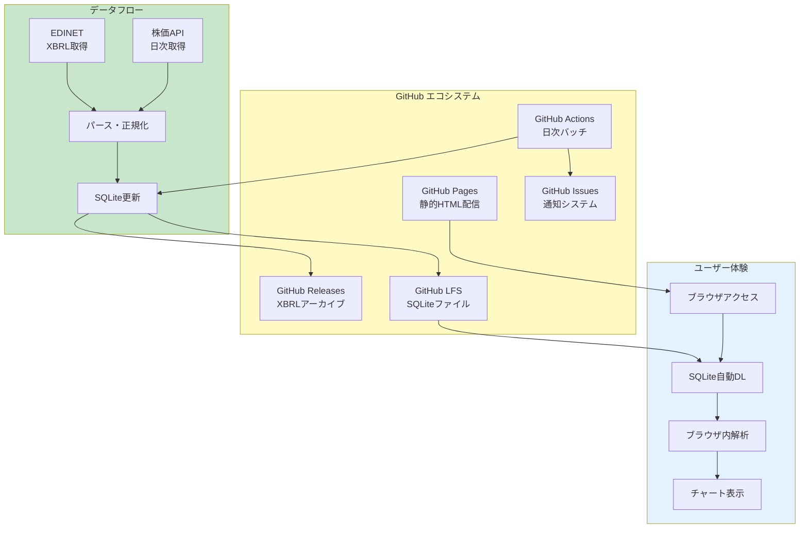

### コンポーネント構成

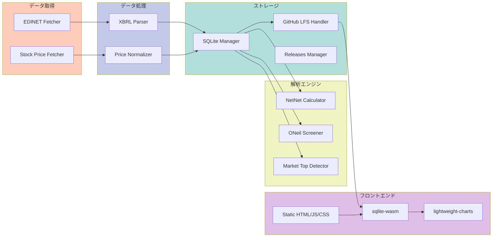

---

## データモデル

### SQLiteスキーマ

**データ型の選択基準**:
```yaml
data_types:
  TEXT:
    use_case: "企業ID、銘柄コード、名前、URL"
    reason: "可変長文字列、インデックス効率良好"
    example: "company_id TEXT PRIMARY KEY"
  
  INTEGER:
    use_case: "ID、出来高、株数"
    reason: "整数値、演算高速、ストレージ効率良好"
    example: "volume INTEGER"
  
  REAL:
    use_case: "株価、財務データ、スコア"
    reason: "浮動小数点数、精度十分"
    example: "close REAL NOT NULL"
  
  DATE:
    use_case: "日付"
    reason: "ISO 8601形式（YYYY-MM-DD）、範囲検索高速"
    example: "date DATE NOT NULL"
  
  DATETIME:
    use_case: "タイムスタンプ"
    reason: "ISO 8601形式（YYYY-MM-DD HH:MM:SS）"
    example: "created_at DATETIME DEFAULT CURRENT_TIMESTAMP"
  
  BOOLEAN:
    use_case: "フラグ"
    reason: "0/1で保存（INTEGER）、可読性向上"
    example: "imported BOOLEAN DEFAULT 0"
  
  JSON:
    use_case: "可変構造データ"
    reason: "柔軟性、クエリ可能（json_extract）"
    example: "payload JSON"
```

#### 1. 企業マスタテーブル

```sql
CREATE TABLE IF NOT EXISTS companies (
  company_id TEXT PRIMARY KEY,      -- EDINETコードまたは証券コード
  ticker TEXT UNIQUE NOT NULL,      -- 証券コード（4桁）
  name TEXT NOT NULL,                -- 企業名
  sector TEXT,                       -- セクター
  industry TEXT,                     -- 業種
  market TEXT,                       -- 市場（東証プライム、スタンダードなど）
  listing_date DATE,                 -- 上場日
  last_update DATETIME DEFAULT CURRENT_TIMESTAMP
);

CREATE INDEX idx_companies_ticker ON companies(ticker);
CREATE INDEX idx_companies_sector ON companies(sector);
```

#### 2. 株価データテーブル

```sql
-- 日次株価データ保存テーブル
-- 調整後終値を含め、株式分割や配当の影響を正確に反映
CREATE TABLE IF NOT EXISTS stock_prices (
  id INTEGER PRIMARY KEY AUTOINCREMENT,
  company_id TEXT NOT NULL,           -- 企業IDへの外部キー
  date DATE NOT NULL,                 -- 株価日付（YYYY-MM-DD形式）
  open REAL,                          -- 始値（円）
  high REAL,                          -- 高値（円）
  low REAL,                           -- 安値（円）
  close REAL NOT NULL,                -- 終値（円、必須）
  adj_close REAL,                     -- 調整後終値（株式分割・配当調整済み）
  volume INTEGER,                     -- 出来高（株数）
  created_at DATETIME DEFAULT CURRENT_TIMESTAMP,  -- レコード作成日時
  FOREIGN KEY (company_id) REFERENCES companies(company_id),
  UNIQUE(company_id, date)            -- 同一企業・同一日付の重複防止
);

-- パフォーマンス最適化用インデックス
-- 企業IDと日付の複合インデックス（降順）で最新株価の高速取得
CREATE INDEX idx_stock_prices_company_date ON stock_prices(company_id, date DESC);

-- 全企業の特定日の株価を高速取得するためのインデックス
CREATE INDEX idx_stock_prices_date ON stock_prices(date DESC);
```

**設計意図**:
- `adj_close`を保存することで、チャート表示時の株価連続性を確保
- `UNIQUE(company_id, date)`制約により、重複データの挿入を防止
- インデックスにより、「特定企業の過去1年の株価」のようなクエリを100ms以下で実行可能

#### 3. XBRL生データテーブル

```sql
CREATE TABLE IF NOT EXISTS xbrl_files (
  file_id TEXT PRIMARY KEY,          -- EDINETドキュメントID
  company_id TEXT NOT NULL,
  filing_date DATE NOT NULL,         -- 提出日
  fiscal_year INTEGER,               -- 決算年度
  fiscal_period TEXT,                -- 決算期（Q1/Q2/Q3/Annual）
  report_type TEXT,                  -- 報告書種別（有報/四半期報告書）
  storage_path TEXT,                 -- GitHub Releases上のパス
  file_size INTEGER,                 -- ファイルサイズ（バイト）
  imported BOOLEAN DEFAULT 0,        -- パース済みフラグ
  created_at DATETIME DEFAULT CURRENT_TIMESTAMP,
  FOREIGN KEY (company_id) REFERENCES companies(company_id)
);

CREATE INDEX idx_xbrl_files_company ON xbrl_files(company_id, filing_date DESC);
CREATE INDEX idx_xbrl_files_imported ON xbrl_files(imported);
```

#### 4. 財務データテーブル

```sql
-- 財務データ（貸借対照表・損益計算書）保存テーブル
-- XBRLパース結果を正規化して格納
CREATE TABLE IF NOT EXISTS financials (
  id INTEGER PRIMARY KEY AUTOINCREMENT,
  company_id TEXT NOT NULL,           -- 企業IDへの外部キー
  report_date DATE NOT NULL,          -- 決算日（報告基準日）
  fiscal_year INTEGER NOT NULL,       -- 決算年度（例: 2024）
  fiscal_period TEXT NOT NULL,        -- 決算期（'Q1'/'Q2'/'Q3'/'Annual'）
  
  -- 資産項目（単位: 百万円）
  total_assets REAL,                  -- 総資産
  cash_and_deposits REAL,             -- 現金及び預金（ネットネット計算に使用）
  marketable_securities REAL,         -- 有価証券（ネットネット計算に使用）
  accounts_receivable REAL,           -- 売掛金（ネットネット計算に使用）
  inventory REAL,                     -- 棚卸資産（ネットネット計算に使用）
  tangible_assets REAL,               -- 有形固定資産
  
  -- 負債項目（単位: 百万円）
  total_liabilities REAL,             -- 総負債（ネットネット計算に使用）
  short_term_liabilities REAL,        -- 流動負債
  long_term_liabilities REAL,         -- 固定負債
  
  -- 純資産（単位: 百万円）
  shareholders_equity REAL,           -- 株主資本
  
  -- 損益項目（単位: 百万円）
  revenue REAL,                       -- 売上高
  operating_income REAL,              -- 営業利益
  ordinary_income REAL,               -- 経常利益
  net_income REAL,                    -- 当期純利益（EPS計算に使用）
  
  -- 1株あたり指標（単位: 円）
  eps REAL,                           -- EPS（オニール成長株スクリーニングに使用）
  bps REAL,                           -- BPS
  
  -- 株数（単位: 株）
  shares_outstanding BIGINT,          -- 発行済株式数（時価総額計算に使用）
  
  created_at DATETIME DEFAULT CURRENT_TIMESTAMP,  -- レコード作成日時
  FOREIGN KEY (company_id) REFERENCES companies(company_id),
  UNIQUE(company_id, report_date, fiscal_period)  -- 同一企業・同一決算日・同一期の重複防止
);

-- 企業ID・決算日の複合インデックス（降順）で最新財務データの高速取得
CREATE INDEX idx_financials_company_date ON financials(company_id, report_date DESC);
```

**設計意図**:
- `fiscal_period`で四半期・年次を区別することで、トレンド分析が可能
- ネットネット計算に必要な4つの資産項目（現金、有価証券、売掛金、棚卸資産）を明示
- `UNIQUE(company_id, report_date, fiscal_period)`制約により、修正報告書の重複挿入を防止
- 全ての金額項目を百万円単位に統一することで、計算ミスを防止

**データ例**:
```sql
-- 東京電力ホールディングスの2024年3月期（年次決算）
INSERT INTO financials VALUES (
  1,                          -- id
  '9501',                     -- company_id
  '2024-03-31',               -- report_date
  2024,                       -- fiscal_year
  'Annual',                   -- fiscal_period
  71321000,                   -- total_assets (百万円)
  5432100,                    -- cash_and_deposits
  3210500,                    -- marketable_securities
  4567800,                    -- accounts_receivable
  2345600,                    -- inventory
  15678900,                   -- tangible_assets
  45678900,                   -- total_liabilities
  12345600,                   -- short_term_liabilities
  33333300,                   -- long_term_liabilities
  25642100,                   -- shareholders_equity
  37154300,                   -- revenue
  4567800,                    -- operating_income
  5123400,                    -- ordinary_income
  3678900,                    -- net_income
  1234.56,                    -- eps
  8765.43,                    -- bps
  2978234567,                 -- shares_outstanding
  '2024-06-20 10:30:00'       -- created_at
);
```

#### 5. 解析結果キャッシュテーブル

```sql
CREATE TABLE IF NOT EXISTS analysis_cache (
  id INTEGER PRIMARY KEY AUTOINCREMENT,
  company_id TEXT NOT NULL,
  analysis_date DATE NOT NULL,
  analysis_type TEXT NOT NULL,       -- 'netnet', 'oneil', 'market_top'
  
  -- ネットネットバリュー指標
  net_net_assets REAL,               -- ネットネット資産
  net_net_pbr REAL,                  -- ネットネットPBR
  
  -- オニール指標
  eps_growth_3y REAL,                -- EPS成長率（3年）
  eps_growth_5y REAL,                -- EPS成長率（5年）
  relative_strength REAL,            -- リラティブストレングス
  
  -- 市場指標
  market_cap REAL,                   -- 時価総額
  
  score REAL,                        -- 総合スコア
  created_at DATETIME DEFAULT CURRENT_TIMESTAMP,
  FOREIGN KEY (company_id) REFERENCES companies(company_id),
  UNIQUE(company_id, analysis_date, analysis_type)
);

CREATE INDEX idx_analysis_cache_type_score ON analysis_cache(analysis_type, score DESC);
CREATE INDEX idx_analysis_cache_date ON analysis_cache(analysis_date DESC);
```

#### 6. 通知履歴テーブル

```sql
CREATE TABLE IF NOT EXISTS notifications (
  id INTEGER PRIMARY KEY AUTOINCREMENT,
  company_id TEXT NOT NULL,
  notification_date DATE NOT NULL,
  notification_type TEXT NOT NULL,   -- 'netnet_new', 'oneil_new', 'market_alert'
  issue_number INTEGER,              -- GitHub Issue番号
  issue_url TEXT,                    -- GitHub Issue URL
  payload JSON,                      -- 通知詳細データ
  created_at DATETIME DEFAULT CURRENT_TIMESTAMP,
  FOREIGN KEY (company_id) REFERENCES companies(company_id)
);

CREATE INDEX idx_notifications_date ON notifications(notification_date DESC);
CREATE INDEX idx_notifications_type ON notifications(notification_type);
```

### データ関連図

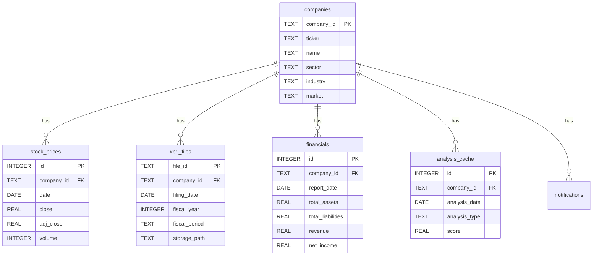

---

## 機能仕様

### 1. ネットネットバリュー株ランキング

#### 1.1 指標定義

**ネットネットバリューPBR**:

$$
\text{NetNetPBR} = \frac{\text{時価総額}}{\text{即時現金化可能資産} - \text{総負債}}
$$

**即時現金化可能資産の計算**:

$$
\begin{aligned}
\text{即時現金化可能資産} &= (\text{現金及び預金} \times 100\%) \\
&\quad + (\text{有価証券} \times \text{割引率}_A) \\
&\quad + (\text{売掛金} \times \text{割引率}_B) \\
&\quad + (\text{棚卸資産} \times \text{割引率}_C)
\end{aligned}
$$

**デフォルト割引率**:
| 資産項目 | 割引率 | 理由 |
|----------|--------|------|
| 現金及び預金 | 100% | 即座に利用可能 |
| 有価証券 | 80% | 市場で売却時に価格変動リスク |
| 売掛金 | 70% | 回収不能リスク、時間価値 |
| 棚卸資産 | 50% | 販売不確実性、劣化リスク |

**ネットネット資産の解釈**:
- **NetNetPBR < 1.0**: 時価総額が清算価値を下回る（割安）
- **NetNetPBR = 1.0**: 時価総額が清算価値と等しい（妥当）
- **NetNetPBR > 1.0**: 時価総額が清算価値を上回る（割高または成長期待）

**計算例**:
```yaml
example_company:
  name: "東京電力ホールディングス"
  ticker: "9501"
  
  balance_sheet:
    cash_and_deposits: 10000  # 百万円
    marketable_securities: 5000
    accounts_receivable: 8000
    inventory: 3000
    total_liabilities: 15000
  
  market_data:
    shares_outstanding: 100000000  # 株
    stock_price: 500  # 円
    market_cap: 50000  # 百万円
  
  calculation:
    liquid_assets: |
      10000 * 1.0 + 5000 * 0.8 + 8000 * 0.7 + 3000 * 0.5
      = 10000 + 4000 + 5600 + 1500
      = 21100 百万円
    
    net_net_assets: |
      21100 - 15000 = 6100 百万円
    
    net_net_pbr: |
      50000 / 6100 = 8.20
      → 割高（清算価値の8倍で取引されている）
```

#### 1.2 ランキングロジック

```python
def calculate_net_net_pbr(company_id: str, params: dict) -> float:
    """
    ネットネットバリューPBRを計算
    
    Args:
        company_id: 企業ID
        params: 割引率パラメータ
    
    Returns:
        NetNetPBR値（1未満が割安）
    
    Raises:
        ValueError: company_idが不正な場合
        DataNotFoundError: 財務データが存在しない場合
    """
    try:
        # 入力検証
        if not company_id or not isinstance(company_id, str):
            raise ValueError(f"Invalid company_id: {company_id}")
        
        # 最新財務データ取得
        financials = get_latest_financials(company_id)
        
        if financials is None:
            raise DataNotFoundError(f"No financial data for {company_id}")
        
        # 即時現金化可能資産計算
        liquid_assets = (
            financials.cash_and_deposits * params.get('cash_rate', 1.0) +
            financials.marketable_securities * params.get('securities_rate', 0.8) +
            financials.accounts_receivable * params.get('receivables_rate', 0.7) +
            financials.inventory * params.get('inventory_rate', 0.5)
        )
        
        # ネットネット資産
        net_net_assets = liquid_assets - financials.total_liabilities
        
        # 時価総額取得
        market_cap = get_market_cap(company_id)
        
        if market_cap is None or market_cap <= 0:
            raise ValueError(f"Invalid market cap for {company_id}: {market_cap}")
        
        # NetNetPBR計算
        if net_net_assets <= 0:
            return float('inf')  # 負債超過の場合は無限大
        
        pbr = market_cap / net_net_assets
        
        # 異常値チェック
        if pbr < 0 or pbr > 1000:
            logger.warning(f"Abnormal NetNetPBR for {company_id}: {pbr:.2f}")
        
        return pbr
        
    except DataNotFoundError as e:
        logger.error(f"Data not found: {str(e)}")
        raise
    except ValueError as e:
        logger.error(f"Validation error: {str(e)}")
        raise
    except Exception as e:
        logger.error(f"Unexpected error in calculate_net_net_pbr: {type(e).__name__}")
        raise RuntimeError(f"Failed to calculate NetNetPBR for {company_id}") from e
```

#### 1.3 PBR推移チャート

- X軸: 決算日
- Y軸: NetNetPBR値
- データポイント: 過去5年分（四半期ごと）
- 基準線: Y=1（割安ライン）

### 2. オニール成長株発掘ランキング

#### 2.1 スクリーニング条件

```yaml
oneil_criteria:
  eps_growth:
    3_year: "> 20%"
    5_year: "> 15%"
  
  relative_strength:
    threshold: "> 70"
    period: 52週
  
  revenue_growth:
    quarterly: "> 10%"
  
  profit_margin:
    minimum: "> 5%"
```

#### 2.2 リラティブストレングス計算

**定義**:
リラティブストレングス（RS）は、個別銘柄の株価パフォーマンスを市場全体と比較した指標。

**計算式**:

$$
\text{RS} = \text{Normalize}_{0-100}\left(\frac{P_{\text{stock}}}{P_{\text{index}}}\right)
$$

ここで、
- $P_{\text{stock}}$: 銘柄の株価変化率（52週）
- $P_{\text{index}}$: 市場インデックス（日経平均）の変化率（52週）

**詳細アルゴリズム**:

```python
def calculate_relative_strength(company_id: str, period_weeks: int = 52) -> float:
    """
    リラティブストレングスを計算
    
    Args:
        company_id: 企業ID
        period_weeks: 期間（週数）
    
    Returns:
        RS値（0-100）
    
    Raises:
        DataNotFoundError: 株価データが不足している場合
    """
    try:
        # 株価取得（52週 = 260営業日想定）
        prices = get_stock_prices(company_id, weeks=period_weeks)
        
        if len(prices) < period_weeks * 5:  # 週5営業日想定
            raise DataNotFoundError(f"Insufficient price data for {company_id}")
        
        # 株価変化率計算
        price_change = (prices[-1] - prices[0]) / prices[0]
        
        # 市場インデックス取得
        index_prices = get_index_prices(weeks=period_weeks)
        index_change = (index_prices[-1] - index_prices[0]) / index_prices[0]
        
        # 相対パフォーマンス
        if index_change == 0:
            relative_performance = 0
        else:
            relative_performance = price_change / index_change
        
        # 0-100スケールに正規化
        # 全銘柄の相対パフォーマンスを取得し、パーセンタイルランクを計算
        all_performances = get_all_relative_performances(period_weeks)
        rs = percentile_rank(relative_performance, all_performances)
        
        return rs
        
    except DataNotFoundError as e:
        logger.error(f"Data not found: {str(e)}")
        raise
    except Exception as e:
        logger.error(f"Unexpected error in calculate_relative_strength: {type(e).__name__}")
        raise RuntimeError(f"Failed to calculate RS for {company_id}") from e


def percentile_rank(value: float, all_values: list) -> float:
    """
    パーセンタイルランクを計算（0-100）
    
    Args:
        value: 対象値
        all_values: 全体の値リスト
    
    Returns:
        パーセンタイルランク（0-100）
    """
    sorted_values = sorted(all_values)
    rank = sorted_values.index(value) if value in sorted_values else \
           sum(1 for v in sorted_values if v < value)
    
    percentile = (rank / len(sorted_values)) * 100
    return percentile
```

**計算例**:

```yaml
example_calculation:
  stock:
    ticker: "9501"  # 東京電力ホールディングス
    price_52w_ago: 500円
    price_current: 650円
    change: (650 - 500) / 500 = 0.30 (30%上昇)
  
  index:
    name: "日経平均"
    value_52w_ago: 28000円
    value_current: 30800円
    change: (30800 - 28000) / 28000 = 0.10 (10%上昇)
  
  relative_performance:
    calculation: 0.30 / 0.10 = 3.0
    interpretation: "市場の3倍のパフォーマンス"
  
  rs_score:
    all_stocks: 3800銘柄
    better_than: 3420銘柄
    percentile: (3420 / 3800) * 100 = 90
    interpretation: "RS = 90（上位10%）→ 強い銘柄"
```

**RSスコアの解釈**:

| RSスコア | 評価 | 投資判断 |
|----------|------|----------|
| 90-100 | 非常に強い | 買い候補（上位10%） |
| 70-89 | 強い | 監視対象 |
| 50-69 | 平均的 | 中立 |
| 30-49 | 弱い | 避ける |
| 0-29 | 非常に弱い | 売り候補（下位30%） |

#### 2.3 詳細ページ表示要素

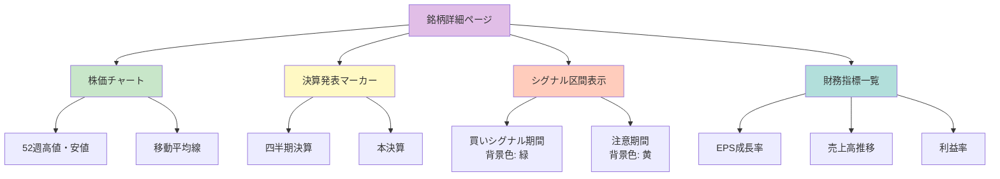

### 3. マーケット天井検出ツール

#### 3.1 分配日の定義

```python
def is_distribution_day(index_data: dict, threshold: dict) -> bool:
    """
    分配日判定
    
    Args:
        index_data: 市場インデックスデータ
        threshold: 閾値設定
    
    Returns:
        分配日フラグ
    """
    # 価格下落かつ出来高増加
    price_drop = (index_data['close'] - index_data['prev_close']) / index_data['prev_close']
    volume_increase = index_data['volume'] / index_data['avg_volume']
    
    return (
        price_drop < threshold['price_drop_pct'] and
        volume_increase > threshold['volume_ratio']
    )
```

#### 3.2 天井検出アルゴリズム

```python
def detect_market_top(lookback_days: int = 25, threshold: int = 5) -> dict:
    """
    マーケット天井検出
    
    Args:
        lookback_days: 遡及日数
        threshold: 分配日閾値
    
    Returns:
        検出結果
    """
    distribution_count = 0
    alert_periods = []
    
    for day in get_market_days(lookback_days):
        if is_distribution_day(day, DEFAULT_THRESHOLD):
            distribution_count += 1
        
        # 閾値超過で警告
        if distribution_count >= threshold:
            alert_periods.append({
                'start': day['date'],
                'count': distribution_count
            })
    
    return {
        'current_count': distribution_count,
        'alert': distribution_count >= threshold,
        'alert_periods': alert_periods
    }
```

---

## 技術スタック

### フロントエンド

```yaml
core:
  html: HTML5
  css: CSS3
  javascript: ES2022+

libraries:
  sqlite_wasm: "^3.43.0"  # ブラウザ内SQLite
  lightweight_charts: "^4.0.0"  # 高速チャート描画
  
design:
  responsive: true
  mobile_first: true
```

### バックエンド（バッチ処理）

```yaml
language:
  python: "3.11"

core_libraries:
  pandas: "2.0.3"  # データ処理
  lxml: "4.9.3"  # XBRL解析
  sqlite3: "built-in"  # データベース
  
data_fetching:
  requests: "2.31.0"  # HTTP通信
  beautifulsoup4: "4.12.2"  # HTML解析
  
analysis:
  numpy: "1.24.3"  # 数値計算
  scipy: "1.11.1"  # 統計処理
  scikit-learn: "1.3.0"  # 機械学習（オプション）
```

### インフラ

```yaml
hosting:
  pages: "GitHub Pages"
  actions: "GitHub Actions"
  
storage:
  database: "GitHub LFS"
  archives: "GitHub Releases"
  artifacts: "GitHub Actions Artifacts"
  
ci_cd:
  workflow: "GitHub Actions"
  schedule: "cron: 0 9 * * *"  # 毎日18:00 JST
```

---

## ストレージ戦略

### GitHub Releases活用

```yaml
xbrl_archives:
  naming: "xbrl-archive-{YYYY}.tar.gz"
  structure:
    - "2023.tar.gz"  # 2023年分全XBRL
    - "2024.tar.gz"  # 2024年分全XBRL
    - "2025.tar.gz"  # 2025年分全XBRL
  
  compression:
    algorithm: gzip
    level: 9
  
  retention: 永久
  
  auto_create:
    trigger: 年次バッチ（1月1日）
    script: scripts/archive_yearly_xbrl.py
```

### GitHub LFS活用

```yaml
sqlite_database:
  file: "stock-analysis.db"
  compressed: "stock-analysis.db.gz"
  
  versioning:
    enabled: true
    track: "*.db"
  
  auto_commit:
    frequency: 日次
    script: scripts/commit_db.py
    message: "chore: Update database - {date}"
  
  size_limit: 2GB
  
  download:
    method: git-lfs pull
    url_generation: presigned URL (7日有効)
```

### GitHub Actions Artifacts

```yaml
build_artifacts:
  retention: 90日
  
  types:
    - name: "daily-build"
      files:
        - "dist/"
        - "analysis-results.json"
    
    - name: "test-results"
      files:
        - "coverage/"
        - "test-report.html"
  
  auto_cleanup:
    enabled: true
    keep_latest: 30
```

### ディレクトリ構造

```
stock-analysis/
├── data/                      # Gitignore（ローカルのみ）
│   ├── raw/
│   │   ├── xbrl/              # 生XBRLファイル
│   │   └── prices/            # 生株価データ
│   ├── db/
│   │   └── stock-analysis.db  # SQLite（LFS管理）
│   └── cache/                 # 一時ファイル
├── scripts/
│   ├── fetch_xbrl.py
│   ├── fetch_prices.py
│   ├── parse_xbrl.py
│   ├── import_to_db.py
│   ├── analyze.py
│   └── notify.py
├── src/                       # フロントエンドソース
│   ├── index.html
│   ├── styles.css
│   └── app.js
├── .github/
│   └── workflows/
│       ├── daily-update.yml
│       └── deploy.yml
└── docs/
    ├── speckit.constitution
    ├── spec.md
    └── requirements.md
```

---

## バッチ処理仕様

### 日次バッチワークフロー

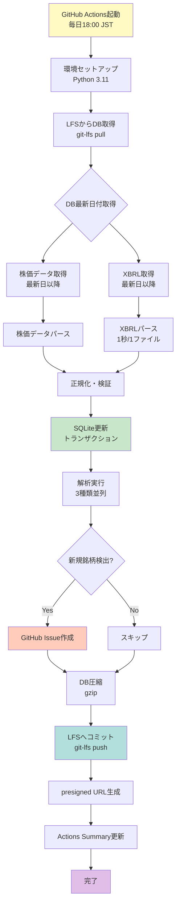

### ワークフローYAML（完全版）

```yaml
name: Daily Stock Analysis Update

on:
  schedule:
    - cron: '0 9 * * *'  # 毎日 9:00 UTC = 18:00 JST
  workflow_dispatch:

permissions:
  contents: write
  issues: write

jobs:
  update-analysis:
    runs-on: ubuntu-latest
    
    steps:
      - name: Checkout repository
        uses: actions/checkout@v4
        with:
          lfs: true
      
      - name: Setup Python
        uses: actions/setup-python@v4
        with:
          python-version: '3.11'
          cache: 'pip'
      
      - name: Install dependencies
        run: |
          pip install -r requirements.txt
      
      - name: Pull LFS files
        run: |
          git lfs pull
      
      - name: Fetch stock prices
        run: |
          python scripts/fetch_prices.py --since-db data/db/stock-analysis.db
        env:
          STOCK_API_KEY: ${{ secrets.STOCK_API_KEY }}
        continue-on-error: true
        id: fetch_prices
      
      - name: Check fetch prices result
        if: steps.fetch_prices.outcome == 'failure'
        run: |
          echo "⚠️ Stock price fetch failed, continuing with existing data" >> $GITHUB_STEP_SUMMARY
          echo "ERROR_FETCH_PRICES=true" >> $GITHUB_ENV
      
      - name: Fetch XBRL files
        run: |
          python scripts/fetch_xbrl.py --since-db data/db/stock-analysis.db --rate-limit 1
        continue-on-error: true
        id: fetch_xbrl
      
      - name: Check fetch XBRL result
        if: steps.fetch_xbrl.outcome == 'failure'
        run: |
          echo "⚠️ XBRL fetch failed, continuing with existing data" >> $GITHUB_STEP_SUMMARY
          echo "ERROR_FETCH_XBRL=true" >> $GITHUB_ENV
      
      - name: Parse XBRL files
        run: |
          python scripts/parse_xbrl.py --input data/raw/xbrl --output data/normalized
      
      - name: Import to database
        run: |
          python scripts/import_to_db.py --db data/db/stock-analysis.db --input data/normalized
      
      - name: Run analysis
        run: |
          python scripts/analyze.py --db data/db/stock-analysis.db --output analysis-results.json
      
      - name: Create notifications
        id: notify
        run: |
          python scripts/notify.py --payload analysis-results.json
        env:
          GITHUB_TOKEN: ${{ secrets.GITHUB_TOKEN }}
      
      - name: Compress database
        run: |
          gzip -k -f data/db/stock-analysis.db
      
      - name: Commit and push changes
        run: |
          git config user.name "github-actions[bot]"
          git config user.email "github-actions[bot]@users.noreply.github.com"
          git add data/db/stock-analysis.db data/db/stock-analysis.db.gz
          git commit -m "chore: Update database - $(date +'%Y-%m-%d')" || echo "No changes"
          git push
      
      - name: Generate presigned URL
        id: presigned
        run: |
          echo "db_url=https://github.com/${{ github.repository }}/raw/main/data/db/stock-analysis.db.gz" >> $GITHUB_OUTPUT
      
      - name: Update Actions Summary
        run: |
          echo "## 📊 Daily Update Summary" >> $GITHUB_STEP_SUMMARY
          echo "" >> $GITHUB_STEP_SUMMARY
          echo "**Date**: $(date +'%Y-%m-%d %H:%M:%S JST')" >> $GITHUB_STEP_SUMMARY
          echo "" >> $GITHUB_STEP_SUMMARY
          echo "### Database" >> $GITHUB_STEP_SUMMARY
          echo "- [Download DB](https://github.com/${{ github.repository }}/raw/main/data/db/stock-analysis.db.gz)" >> $GITHUB_STEP_SUMMARY
          echo "" >> $GITHUB_STEP_SUMMARY
          echo "### Analysis Pages" >> $GITHUB_STEP_SUMMARY
          echo "- [NetNet Ranking](https://github.com/${{ github.repository }}/pages/netnet.html?db=${{ steps.presigned.outputs.db_url }})" >> $GITHUB_STEP_SUMMARY
          echo "- [ONeil Ranking](https://github.com/${{ github.repository }}/pages/oneil.html?db=${{ steps.presigned.outputs.db_url }})" >> $GITHUB_STEP_SUMMARY
          echo "- [Market Top Detector](https://github.com/${{ github.repository }}/pages/market-top.html?db=${{ steps.presigned.outputs.db_url }})" >> $GITHUB_STEP_SUMMARY
      
      - name: Upload artifacts
        uses: actions/upload-artifact@v3
        with:
          name: daily-build-${{ github.run_id }}
          path: |
            analysis-results.json
            data/db/stock-analysis.db.gz
          retention-days: 90
```

---

## 解析ページ仕様

### ページ構成

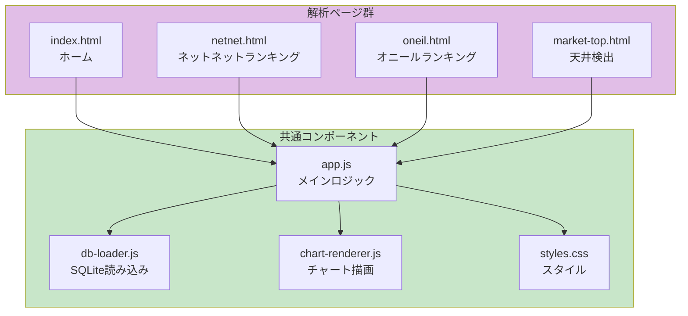

### SQLite-wasm統合

```javascript
// db-loader.js
import initSqlJs from 'sql.js';

class DatabaseLoader {
  constructor() {
    this.db = null;
    this.SQL = null;
  }
  
  async initialize(dbUrl) {
    // SQLite-wasm初期化
    this.SQL = await initSqlJs({
      locateFile: file => `https://sql.js.org/dist/${file}`
    });
    
    // データベースダウンロード
    const response = await fetch(dbUrl);
    const buffer = await response.arrayBuffer();
    const uint8Array = new Uint8Array(buffer);
    
    // DB読み込み
    this.db = new this.SQL.Database(uint8Array);
    
    // IndexedDBにキャッシュ
    await this.cacheDatabase(dbUrl, uint8Array);
  }
  
  async cacheDatabase(url, data) {
    const db = await openDB('stock-analysis-cache', 1, {
      upgrade(db) {
        db.createObjectStore('databases');
      }
    });
    
    await db.put('databases', {
      url,
      data,
      timestamp: Date.now()
    }, 'latest');
  }
  
  query(sql, params = []) {
    const results = this.db.exec(sql, params);
    return this.formatResults(results);
  }
  
  formatResults(results) {
    if (!results.length) return [];
    
    const columns = results[0].columns;
    const values = results[0].values;
    
    return values.map(row => {
      const obj = {};
      columns.forEach((col, i) => {
        obj[col] = row[i];
      });
      return obj;
    });
  }
}

export default DatabaseLoader;
```

### lightweight-charts統合

```javascript
// chart-renderer.js
import { createChart } from 'lightweight-charts';

class ChartRenderer {
  constructor(containerId) {
    this.container = document.getElementById(containerId);
    this.chart = createChart(this.container, {
      width: this.container.clientWidth,
      height: 600,
      layout: {
        background: { color: '#ffffff' },
        textColor: '#333333',
      },
      grid: {
        vertLines: { color: '#e1e1e1' },
        horzLines: { color: '#e1e1e1' },
      },
      rightPriceScale: {
        borderColor: '#cccccc',
      },
      timeScale: {
        borderColor: '#cccccc',
        timeVisible: true,
      },
    });
  }
  
  renderPBRHistory(data) {
    const lineSeries = this.chart.addLineSeries({
      color: '#2962FF',
      lineWidth: 2,
    });
    
    // データ変換
    const chartData = data.map(item => ({
      time: item.report_date,
      value: item.net_net_pbr
    }));
    
    lineSeries.setData(chartData);
    
    // 基準線（PBR=1）
    const baselineSeries = this.chart.addLineSeries({
      color: '#FF6B6B',
      lineWidth: 1,
      lineStyle: 2,  // dashed
    });
    
    baselineSeries.setData(
      chartData.map(item => ({ ...item, value: 1.0 }))
    );
    
    // マーカー（決算発表日）
    const markers = this.createEarningsMarkers(data);
    lineSeries.setMarkers(markers);
  }
  
  createEarningsMarkers(data) {
    return data
      .filter(item => item.is_earnings_date)
      .map(item => ({
        time: item.report_date,
        position: 'aboveBar',
        color: '#FFA500',
        shape: 'circle',
        text: '決算'
      }));
  }
  
  destroy() {
    this.chart.remove();
  }
}

export default ChartRenderer;
```

---

## 通知システム

### GitHub Issue自動作成

```python
# scripts/notify.py
import os
import json
from typing import List, Dict
from github import Github

class NotificationManager:
    def __init__(self):
        self.github = Github(os.getenv('GITHUB_TOKEN'))
        self.repo = self.github.get_repo(os.getenv('GITHUB_REPOSITORY'))
    
    def create_notification(self, candidates: List[Dict]):
        """
        新規検出銘柄の通知Issue作成
        
        Args:
            candidates: 検出銘柄リスト
        """
        if not candidates:
            print("No new candidates detected.")
            return
        
        # 既存Issue確認（重複防止）
        today = datetime.date.today().isoformat()
        existing = self.check_existing_issue(today)
        
        if existing:
            print(f"Issue already exists: {existing.html_url}")
            return
        
        # Issue作成
        title = f"📊 新規銘柄検出 - {today}"
        body = self.generate_issue_body(candidates)
        
        issue = self.repo.create_issue(
            title=title,
            body=body,
            labels=['auto-detection', 'stock-alert']
        )
        
        print(f"Issue created: {issue.html_url}")
        
        # 通知履歴DB保存
        self.save_notification_history(candidates, issue.number, issue.html_url)
    
    def generate_issue_body(self, candidates: List[Dict]) -> str:
        """Issue本文生成"""
        lines = [
            "## 新規銘柄検出レポート",
            "",
            f"**検出日時**: {datetime.datetime.now().strftime('%Y-%m-%d %H:%M:%S')}",
            f"**検出件数**: {len(candidates)}件",
            "",
            "---",
            ""
        ]
        
        # 銘柄ごとに詳細
        for candidate in candidates:
            lines.extend([
                f"### {candidate['ticker']} - {candidate['name']}",
                "",
                f"**検出条件**: {candidate['detection_type']}",
                "",
                "**主要指標**:",
                f"- 時価総額: {candidate['market_cap']:,.0f}百万円",
                f"- NetNetPBR: {candidate.get('net_net_pbr', 'N/A')}",
                f"- EPS成長率: {candidate.get('eps_growth', 'N/A')}%",
                f"- スコア: {candidate['score']:.2f}",
                "",
                f"[詳細ページを見る]({self.get_detail_page_url(candidate['ticker'])})",
                "",
                "---",
                ""
            ])
        
        return "\n".join(lines)
    
    def get_detail_page_url(self, ticker: str) -> str:
        """詳細ページURL生成"""
        repo_url = f"https://{os.getenv('GITHUB_REPOSITORY_OWNER')}.github.io/{os.getenv('GITHUB_REPOSITORY').split('/')[-1]}"
        db_url = f"https://github.com/{os.getenv('GITHUB_REPOSITORY')}/raw/main/data/db/stock-analysis.db.gz"
        return f"{repo_url}/pages/detail.html?ticker={ticker}&db={db_url}"

# 使用例
if __name__ == "__main__":
    manager = NotificationManager()
    
    # 新規検出銘柄（サンプル）
    candidates = [
        {
            'ticker': '9501',
            'name': '東京電力ホールディングス',
            'detection_type': 'NetNet（PBR < 1.0）',
            'market_cap': 150000,
            'net_net_pbr': 0.75,
            'score': 92.3
        },
        {
            'ticker': '9502',
            'name': '中部電力',
            'detection_type': 'オニール成長株（EPS成長率 > 20%）',
            'market_cap': 120000,
            'eps_growth': 22.5,
            'score': 86.8
        }
    ]
    
    # 通知作成
    manager.create_notification(candidates)
```

**生成されるIssue例**:

```markdown
## 新規銘柄検出レポート

**検出日時**: 2025-11-22 18:30:45
**検出件数**: 2件

---

### 9501 - 東京電力ホールディングス

**検出条件**: NetNet（PBR < 1.0）

**主要指標**:
- 時価総額: 150,000百万円
- NetNetPBR: 0.75
- EPS成長率: N/A
- スコア: 92.30

[詳細ページを見る](https://j1921604.github.io/stock-analysis/pages/detail.html?ticker=9501&db=https://github.com/j1921604/stock-analysis/raw/main/data/db/stock-analysis.db.gz)

---

### 9502 - 中部電力

**検出条件**: オニール成長株（EPS成長率 > 20%）

**主要指標**:
- 時価総額: 120,000百万円
- NetNetPBR: N/A
- EPS成長率: 22.5%
- スコア: 86.80

[詳細ページを見る](https://j1921604.github.io/stock-analysis/pages/detail.html?ticker=9502&db=https://github.com/j1921604/stock-analysis/raw/main/data/db/stock-analysis.db.gz)

---
```

**通知トリガー設定**:

```yaml
notification_rules:
  netnet_detection:
    trigger: "NetNetPBR < 1.0 に新たになった銘柄"
    frequency: "日次"
    priority: "高"
    label: "netnet-alert"
  
  oneil_detection:
    trigger: "オニール条件を新たに満たした銘柄"
    frequency: "日次"
    priority: "中"
    label: "oneil-alert"
  
  market_top_alert:
    trigger: "分配日が5回以上（25日以内）"
    frequency: "即時"
    priority: "最高"
    label: "market-top-warning"
  
  data_quality_alert:
    trigger: "XBRLパースエラー率 > 5%"
    frequency: "即時"
    priority: "中"
    label: "data-quality-issue"
```

---

## デプロイメント

### GitHub Pages設定

```yaml
# .github/workflows/deploy.yml
name: Deploy to GitHub Pages

on:
  push:
    branches:
      - main
    paths:
      - 'src/**'
      - '.github/workflows/deploy.yml'

permissions:
  contents: read
  pages: write
  id-token: write

concurrency:
  group: "pages"
  cancel-in-progress: false

jobs:
  build:
    runs-on: ubuntu-latest
    steps:
      - name: Checkout
        uses: actions/checkout@v4
      
      - name: Setup Pages
        uses: actions/configure-pages@v4
      
      - name: Upload artifact
        uses: actions/upload-pages-artifact@v3
        with:
          path: './src'
  
  deploy:
    needs: build
    runs-on: ubuntu-latest
    environment:
      name: github-pages
      url: ${{ steps.deployment.outputs.page_url }}
    steps:
      - name: Deploy to GitHub Pages
        id: deployment
        uses: actions/deploy-pages@v4
```

### デプロイフロー

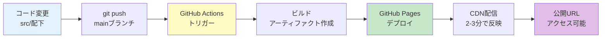

### デプロイメント トラブルシューティング

#### 問題1: GitHub Pagesが更新されない

**症状**:
- コードをpushしたがページが古いまま
- デプロイワークフローは成功している

**原因と対策**:
```yaml
cause_1:
  description: "ブラウザキャッシュ"
  solution:
    - "Ctrl+Shift+R（強制リロード）"
    - "シークレットモードで確認"
    - "キャッシュクリア"

cause_2:
  description: "CDN伝播遅延"
  solution:
    - "5-10分待つ"
    - "curl -I {URL} でキャッシュヘッダー確認"
    - "Cache-Control: max-age=600 想定"

cause_3:
  description: "GitHub Pages設定エラー"
  solution:
    - "リポジトリ Settings → Pages で設定確認"
    - "Source: GitHub Actions を選択"
    - "Custom domain設定があれば削除して再設定"
```

#### 問題2: SQLite-wasmが読み込めない

**症状**:
- ページは表示されるがSQLiteエラー
- Console: "Failed to load sqlite-wasm"

**原因と対策**:
```yaml
cause_1:
  description: "CORS制約"
  solution: |
    # index.htmlのscriptタグ確認
    <script type="module">
      import initSqlJs from 'https://cdn.jsdelivr.net/npm/sql.js@1.8.0/dist/sql-wasm.js';
      // ✅ CDN経由で読み込み
    </script>

cause_2:
  description: "WebAssembly対応ブラウザ"
  solution:
    - "Chrome >= 90, Firefox >= 88 確認"
    - "Safari >= 14 確認"
    - "古いブラウザは非対応"

cause_3:
  description: "ネットワークエラー"
  solution:
    - "DevTools Network タブで確認"
    - "sql-wasm.wasm の Status: 200 確認"
    - "サイズ: 約800KB 確認"
```

#### 問題3: チャートが表示されない

**症状**:
- データは読み込まれるがチャートが空白
- Console: エラーなし

**原因と対策**:
```yaml
cause_1:
  description: "コンテナサイズ未指定"
  solution: |
    /* styles.css */
    #chart-container {
      width: 100%;
      height: 600px;  /* ✅ 高さ必須 */
    }

cause_2:
  description: "データ形式不正"
  solution: |
    // データ形式確認
    const chartData = data.map(item => ({
      time: item.report_date,  // ✅ YYYY-MM-DD形式
      value: parseFloat(item.net_net_pbr)  // ✅ 数値変換
    }));

cause_3:
  description: "lightweight-charts読み込み失敗"
  solution:
    - "DevTools Network で lightweight-charts.js 確認"
    - "CDN URL正しいか確認"
    - "https://unpkg.com/lightweight-charts@4.0.0/dist/lightweight-charts.standalone.production.js"
```

---

## セキュリティ

### セキュリティ対策一覧

```yaml
data_protection:
  encryption:
    - GitHub Secrets使用（API キー）
    - HTTPS通信必須
    - presigned URL有効期限: 7日
  
  access_control:
    - リポジトリアクセス制限
    - LFSファイルへの直接アクセス不可
    - GitHub Pages認証不要（公開情報のみ）
  
  input_validation:
    - XBRLスキーマ検証
    - 株価データ型チェック
    - SQLインジェクション対策（パラメータ化クエリ）
  
  error_handling:
    - 機密情報を含まないログ出力
    - エラーメッセージの一般化
    - スタックトレースの秘匿
```

### セキュリティチェックリスト

- [ ] API キーは環境変数またはGitHub Secretsに保存
- [ ] `.env`ファイルは`.gitignore`に含める
- [ ] SQLクエリは全てパラメータ化
- [ ] ユーザー入力は全てサニタイズ
- [ ] HTTPS通信のみ許可
- [ ] presigned URLは7日で自動失効
- [ ] エラーログに機密情報を含めない
- [ ] 依存関係の脆弱性スキャン（週次）

---

## パフォーマンス要件

### パフォーマンス閾値

```yaml
frontend:
  initial_load: < 2秒
  db_download: < 10秒（100MB想定）
  query_execution: < 100ms
  chart_rendering_1000points: < 500ms
  filter_operation: < 200ms

backend:
  xbrl_parse: < 1秒/ファイル
  db_import: < 5分/1000ファイル
  analysis_execution: < 3分/全銘柄
  github_actions_total: < 30分

storage:
  db_size: < 500MB（圧縮前）
  db_size_compressed: < 100MB
  lfs_quota: < 1GB
```

### 最適化戦略

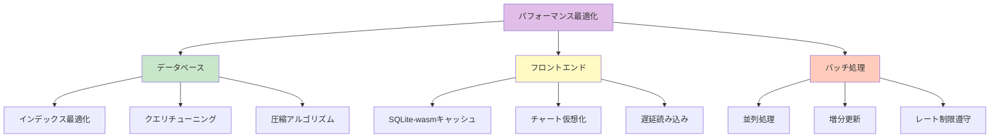

### 最適化実装例

#### データベース最適化

**インデックス設計**:
```sql
-- 悪い例: インデックスなし
SELECT * FROM stock_prices WHERE company_id = '9501' ORDER BY date DESC LIMIT 10;
-- 実行時間: 500ms（全行スキャン）

-- 良い例: 複合インデックス
CREATE INDEX idx_stock_prices_company_date ON stock_prices(company_id, date DESC);
SELECT * FROM stock_prices WHERE company_id = '9501' ORDER BY date DESC LIMIT 10;
-- 実行時間: 10ms（インデックススキャン）
```

**クエリ最適化**:
```sql
-- 悪い例: サブクエリ多用
SELECT 
  c.name,
  (SELECT MAX(date) FROM stock_prices WHERE company_id = c.company_id) as latest_date,
  (SELECT close FROM stock_prices WHERE company_id = c.company_id ORDER BY date DESC LIMIT 1) as latest_price
FROM companies c;
-- 実行時間: 5000ms

-- 良い例: JOIN使用
SELECT 
  c.name,
  sp.date as latest_date,
  sp.close as latest_price
FROM companies c
LEFT JOIN (
  SELECT company_id, date, close
  FROM stock_prices
  WHERE (company_id, date) IN (
    SELECT company_id, MAX(date) 
    FROM stock_prices 
    GROUP BY company_id
  )
) sp ON c.company_id = sp.company_id;
-- 実行時間: 200ms
```

**VACUUM実行**:
```python
# データベース最適化
def optimize_database(db_path: str):
    """VACUUM実行でDBサイズ削減"""
    conn = sqlite3.connect(db_path)
    
    # VACUUMでフラグメンテーション解消
    conn.execute("VACUUM;")
    
    # ANALYZEで統計情報更新
    conn.execute("ANALYZE;")
    
    conn.close()
    
    # 期待効果: DBサイズ 10-30%削減
```

#### フロントエンド最適化

**IndexedDBキャッシング**:
```javascript
// SQLite DBをIndexedDBにキャッシュ
class DatabaseCache {
  async getCachedDB(url) {
    const db = await openDB('stock-analysis-cache', 1);
    const cached = await db.get('databases', url);
    
    if (cached && this.isFresh(cached.timestamp)) {
      console.log('Using cached database');
      return cached.data;
    }
    
    // キャッシュがない or 古い場合はダウンロード
    console.log('Downloading fresh database');
    const data = await this.downloadDB(url);
    
    // キャッシュに保存
    await db.put('databases', {
      url,
      data,
      timestamp: Date.now()
    });
    
    return data;
  }
  
  isFresh(timestamp) {
    const ONE_DAY = 24 * 60 * 60 * 1000;
    return (Date.now() - timestamp) < ONE_DAY;
  }
}
```

**チャートデータ間引き（LTTB）**:
```javascript
// Largest-Triangle-Three-Bucketsアルゴリズム
function downsampleLTTB(data, threshold) {
  if (data.length <= threshold) return data;
  
  const sampled = [data[0]];  // 最初のポイント
  const bucketSize = (data.length - 2) / (threshold - 2);
  
  let a = 0;
  
  for (let i = 0; i < threshold - 2; i++) {
    const avgX = (i + 1) * bucketSize + 1;
    
    let maxArea = -1;
    let maxAreaPoint = null;
    
    const start = Math.floor(i * bucketSize) + 1;
    const end = Math.floor((i + 1) * bucketSize) + 1;
    
    for (let j = start; j < end; j++) {
      const area = Math.abs(
        (data[a].time - data[j].time) * (data[end].value - data[a].value) -
        (data[a].time - data[end].time) * (data[j].value - data[a].value)
      ) * 0.5;
      
      if (area > maxArea) {
        maxArea = area;
        maxAreaPoint = data[j];
      }
    }
    
    sampled.push(maxAreaPoint);
    a = data.indexOf(maxAreaPoint);
  }
  
  sampled.push(data[data.length - 1]);  // 最後のポイント
  
  return sampled;
}

// 使用例
const originalData = fetchPriceData();  // 10000ポイント
const downsampledData = downsampleLTTB(originalData, 1000);  // 1000ポイント
chart.setData(downsampledData);
// 描画時間: 5000ms → 500ms
```

#### バッチ処理最適化

**並列処理（multiprocessing）**:
```python
from multiprocessing import Pool
import os

def parse_xbrl_parallel(xbrl_files: list, num_workers: int = None):
    """XBRLファイルを並列パース"""
    if num_workers is None:
        num_workers = os.cpu_count()
    
    with Pool(num_workers) as pool:
        results = pool.map(parse_single_xbrl, xbrl_files)
    
    return results

# 期待効果: 処理時間 30分 → 10分（3コアCPU想定）
```

**増分更新**:
```python
def incremental_update(db_path: str, since_date: str):
    """差分更新で処理量削減"""
    conn = sqlite3.connect(db_path)
    
    # 前回更新日取得
    last_update = conn.execute(
        "SELECT MAX(date) FROM stock_prices"
    ).fetchone()[0]
    
    # 差分のみ取得
    new_data = fetch_prices(since=last_update)
    
    # 差分のみインポート
    import_to_db(new_data)
    
    conn.close()

# 期待効果: 取得件数 100万件 → 5000件（日次更新の場合）
```

---

**この仕様書はプロジェクトの完全な技術設計を記載しています。**
**実装時はこの仕様書に厳密に従い、変更がある場合は仕様書を先に更新してください。**

**バージョン**: 1.0.0 | **作成日**: 2025年11月22日 | **承認**: プロジェクトリード

---

## 収集対象データ

### データソース一覧

| データカテゴリ | 具体的な内容 | データソース | 更新頻度 | 取得方法 |
|---|---|---|---|---|
| **財務諸表** | BS, PL, CF（連結・個別） | EDINET API | 四半期 | XBRL解析 |
| **決算短信** | 業績ハイライト、セグメント情報 | 各社IRサイト | 四半期 | PDF→テキスト抽出 |
| **株価** | 日足OHLCV、調整後終値 | Yahoo Finance API | 日次 | yfinance |
| **発電量** | 電源別発電量、設備利用率 | 各社IR資料 | 月次/四半期 | PDF解析 |
| **燃料費** | LNG, 石炭, 原油価格 | EIA API / 公開データ | 日次/週次 | REST API |
| **為替** | USD/JPY | Yahoo Finance | 日次 | yfinance |
| **電力市場** | JEPXスポット価格、需要量 | JEPX公開データ | 日次 | CSV取得 |

### EDINET API仕様

**エンドポイント**: `https://api.edinet-fsa.go.jp/api/v2/documents.json`

**リクエスト例**:
```bash
curl "https://api.edinet-fsa.go.jp/api/v2/documents.json?date=2025-11-22&type=2"
```

**レスポンス例**（抜粋）:
```json
{
  "results": [
    {
      "docID": "S100XXXX",
      "edinetCode": "E04498",
      "docDescription": "有価証券報告書－第99期",
      "submitDateTime": "2025-11-22 15:00",
      "docTypeCode": "120"
    }
  ]
}
```

**XBRLダウンロード**:
```bash
curl "https://api.edinet-fsa.go.jp/api/v2/documents/S100XXXX?type=1" -o E04498.zip
```

### Yahoo Finance（yfinance）仕様

**インストール**:
```bash
pip install yfinance==0.2.32
```

**使用例**:
```python
import yfinance as yf

# 東京電力の株価取得
tepco = yf.Ticker("9501.T")
hist = tepco.history(start="2025-01-01", end="2025-11-22", interval="1d")

print(hist.head())
# Output:
#                  Open    High     Low   Close    Volume
# Date
# 2025-01-04   1234.0  1250.0  1220.0  1245.0   5000000
# ...
```

---

## 電力業界特化指標

### JERA期ずれ影響額

**定義**: 燃料価格変動が電気料金に反映されるまでのタイムラグにより生じる損益影響

**計算式**:
```
期ずれ影響額 = 当期燃料費 - 燃料費調整額転嫁分
実質利益 = 純利益 - 期ずれ影響額
```

**実装例**:
```python
def calculate_period_gap_impact(fuel_cost_actual, fuel_cost_adjusted):
    """
    期ずれ影響額を計算
    
    Args:
        fuel_cost_actual: 実際の燃料費（百万円）
        fuel_cost_adjusted: 燃料費調整額で回収した分（百万円）
    
    Returns:
        期ずれ影響額（百万円）
    """
    return fuel_cost_actual - fuel_cost_adjusted

# 使用例
actual = 500000  # 5000億円
adjusted = 450000  # 4500億円
gap = calculate_period_gap_impact(actual, adjusted)
print(f"期ずれ影響額: {gap}百万円（-{gap}百万円の減益要因）")
```

### JERA親会社貢献度

**定義**: JERAの利益が東京電力・中部電力の連結決算に与える影響度

**計算式**:
```
JERA貢献度（%） = (JERA持分法投資利益 / 親会社経常利益) × 100
JERA持分法投資利益 = JERA純利益 × 持分比率（50%）
```

**実装例**:
```python
def calculate_jera_contribution(jera_net_income, parent_ordinary_income, ownership_ratio=0.5):
    """
    JERA親会社貢献度を計算
    
    Args:
        jera_net_income: JERAの純利益（百万円）
        parent_ordinary_income: 親会社の経常利益（百万円）
        ownership_ratio: 持分比率（デフォルト50%）
    
    Returns:
        貢献度（%）
    """
    jera_contribution = jera_net_income * ownership_ratio
    contribution_pct = (jera_contribution / parent_ordinary_income) * 100
    return contribution_pct

# 使用例（東京電力の場合）
jera_ni = 200000  # JERA純利益2000億円
tepco_oi = 500000  # 東電経常利益5000億円
contribution = calculate_jera_contribution(jera_ni, tepco_oi)
print(f"JERA貢献度: {contribution:.1f}%")  # 20.0%
```

### 燃料費感応度

**定義**: 燃料価格（LNG, 石炭）の変動が営業利益に与える影響度

**計算式**:
```
燃料費感応度 = Δ営業利益 / Δ燃料価格
例: LNG価格が$1/MMBtu上昇 → 営業利益が-100億円変化
```

**可視化**:


---

## GitHub統合仕様

### GitHub Actions日次ワークフロー

**ファイル**: `.github/workflows/daily-update.yml`

```yaml
name: Daily Data Update

on:
  schedule:
    # 毎日 18:00 JST (9:00 UTC) に実行
    - cron: "0 9 * * *"
  workflow_dispatch: # 手動実行も可能

permissions:
  contents: write
  issues: write

env:
  DB_FILE: data/db/stock-analysis.db

jobs:
  update-database:
    runs-on: ubuntu-latest
    
    steps:
      - name: Checkout repository
        uses: actions/checkout@v4
        
      - name: Setup Python
        uses: actions/setup-python@v5
        with:
          python-version: '3.11'
          cache: 'pip'
      
      - name: Install dependencies
        run: pip install -r requirements.txt
      
      - name: Get latest data date from DB
        id: get_date
        run: |
          LAST_DATE=$(python scripts/get_last_update_date.py)
          echo "last_date=$LAST_DATE" >> $GITHUB_OUTPUT
      
      - name: Fetch stock prices
        run: |
          python scripts/fetch_prices.py --start-date "${{ steps.get_date.outputs.last_date }}"
        continue-on-error: true
      
      - name: Fetch XBRL reports
        run: python scripts/fetch_xbrl.py
        continue-on-error: true
      
      - name: Parse and normalize data
        run: |
          python scripts/parse_xbrl.py
          python scripts/calculate_ratios.py
      
      - name: Run analysis
        id: analysis
        run: |
          python scripts/run_analysis.py > analysis_output.txt
      
      - name: Create GitHub Issue for alerts
        if: success()
        uses: actions/github-script@v7
        with:
          script: |
            const fs = require('fs');
            const analysis = fs.readFileSync('analysis_output.txt', 'utf8');
            
            if (analysis.includes('ALERT')) {
              await github.rest.issues.create({
                owner: context.repo.owner,
                repo: context.repo.repo,
                title: `📊 Daily Analysis Alert - ${new Date().toISOString().split('T')[0]}`,
                body: `## 自動分析結果\n\n\`\`\`\n${analysis}\n\`\`\``,
                labels: ['auto-analysis', 'daily-report']
              });
            }
      
      - name: Commit and push changes
        run: |
          git config --local user.email "github-actions[bot]@users.noreply.github.com"
          git config --local user.name "github-actions[bot]"
          git add data/
          git diff --quiet && git diff --staged --quiet || \
            git commit -m "chore: daily data update $(date +'%Y-%m-%d')"
          git push
```

### GitHub Pages設定

**ファイル**: `.github/workflows/deploy.yml`

```yaml
name: Deploy to GitHub Pages

on:
  push:
    branches: [main]
  workflow_dispatch:

permissions:
  contents: read
  pages: write
  id-token: write

jobs:
  deploy:
    runs-on: ubuntu-latest
    steps:
      - name: Checkout
        uses: actions/checkout@v4
      
      - name: Setup Pages
        uses: actions/configure-pages@v4
      
      - name: Upload artifact
        uses: actions/upload-pages-artifact@v3
        with:
          path: 'src'
      
      - name: Deploy to GitHub Pages
        uses: actions/deploy-pages@v4
```

---

## フロントエンド仕様

### ディレクトリ構造

```
src/
├── index.html          # メインダッシュボード
├── styles.css          # グローバルスタイル
├── db-loader.js        # SQLiteローダー
├── chart-utils.js      # Chart.js utilities
└── pages/
    ├── tepco.html      # 東京電力詳細
    ├── chubu.html      # 中部電力詳細
    └── jera.html       # JERA詳細
```

### index.html（メインダッシュボード）

```html
<!DOCTYPE html>
<html lang="ja">
<head>
    <meta charset="UTF-8">
    <meta name="viewport" content="width=device-width, initial-scale=1.0">
    <title>株式分析システム - 電力3社</title>
    <script src="https://cdn.tailwindcss.com"></script>
    <script src="https://cdn.jsdelivr.net/npm/chart.js@4.4.0"></script>
    <script type="module" src="db-loader.js"></script>
</head>
<body class="bg-gray-100">
    <div class="container mx-auto p-4">
        <header class="mb-8">
            <h1 class="text-3xl font-bold">⚡ 電力3社 経営分析ダッシュボード</h1>
            <p class="text-gray-600">東京電力 | 中部電力 | JERA</p>
            <div id="last-update" class="text-sm text-gray-500"></div>
        </header>

        <!-- フィルター -->
        <div class="mb-4 flex gap-4">
            <select id="company-filter" class="border p-2 rounded">
                <option value="all">全社表示</option>
                <option value="tepco">東京電力</option>
                <option value="chubu">中部電力</option>
                <option value="jera">JERA</option>
            </select>
            
            <select id="period-filter" class="border p-2 rounded">
                <option value="1y">1年</option>
                <option value="3y">3年</option>
                <option value="5y">5年</option>
            </select>
        </div>

        <!-- ダッシュボードグリッド -->
        <div class="grid grid-cols-1 md:grid-cols-2 lg:grid-cols-3 gap-6">
            <!-- カード1: 東京電力 -->
            <div class="bg-white rounded-lg shadow p-6" data-company="tepco">
                <h2 class="text-xl font-semibold mb-4">🏢 東京電力</h2>
                <div id="tepco-summary"></div>
                <canvas id="chart-tepco"></canvas>
            </div>

            <!-- カード2: 中部電力 -->
            <div class="bg-white rounded-lg shadow p-6" data-company="chubu">
                <h2 class="text-xl font-semibold mb-4">🏢 中部電力</h2>
                <div id="chubu-summary"></div>
                <canvas id="chart-chubu"></canvas>
            </div>

            <!-- カード3: JERA -->
            <div class="bg-white rounded-lg shadow p-6" data-company="jera">
                <h2 class="text-xl font-semibold mb-4">🏢 JERA</h2>
                <div id="jera-summary"></div>
                <canvas id="chart-jera"></canvas>
            </div>
        </div>
    </div>

    <script type="module">
        import { loadDatabase } from './db-loader.js';
        
        async function init() {
            const dbUrl = 'https://raw.githubusercontent.com/J1921604/stock-analysis/main/data/db/stock-analysis.db';
            const db = await loadDatabase(dbUrl);
            
            // 企業データ取得
            const companies = db.exec("SELECT * FROM companies");
            console.log(companies);
            
            // グラフ描画（実装省略）
        }
        
        init();
    </script>
</body>
</html>
```

### db-loader.js（SQLiteローダー）

```javascript
import initSqlJs from 'https://cdn.jsdelivr.net/npm/sql.js@1.8.0/+esm';

export class DatabaseLoader {
    constructor() {
        this.db = null;
        this.SQL = null;
    }

    async initialize(dbUrl) {
        // キャッシュチェック
        const cachedDb = localStorage.getItem('stock_db_cache');
        const cacheTime = localStorage.getItem('stock_db_cache_time');
        const now = Date.now();

        if (cachedDb && cacheTime && (now - parseInt(cacheTime)) < 86400000) {
            // 24時間以内のキャッシュがあれば使用
            await this.loadFromCache(cachedDb);
            return;
        }

        // 新規ダウンロード
        const response = await fetch(dbUrl);
        const arrayBuffer = await response.arrayBuffer();
        const uint8Array = new Uint8Array(arrayBuffer);

        // キャッシュに保存
        const base64 = btoa(String.fromCharCode.apply(null, uint8Array));
        localStorage.setItem('stock_db_cache', base64);
        localStorage.setItem('stock_db_cache_time', now.toString());

        await this.loadDatabase(uint8Array);
    }

    async loadFromCache(base64Data) {
        const binaryString = atob(base64Data);
        const len = binaryString.length;
        const bytes = new Uint8Array(len);
        for (let i = 0; i < len; i++) {
            bytes[i] = binaryString.charCodeAt(i);
        }
        await this.loadDatabase(bytes);
    }

    async loadDatabase(uint8Array) {
        this.SQL = await initSqlJs({
            locateFile: file => `https://cdn.jsdelivr.net/npm/sql.js@1.8.0/dist/${file}`
        });
        this.db = new this.SQL.Database(uint8Array);
    }

    query(sql, params = []) {
        if (!this.db) throw new Error('Database not initialized');
        const stmt = this.db.prepare(sql);
        stmt.bind(params);
        
        const results = [];
        while (stmt.step()) {
            results.push(stmt.getAsObject());
        }
        stmt.free();
        return results;
    }

    close() {
        if (this.db) {
            this.db.close();
        }
    }
}

export async function loadDatabase(dbUrl) {
    const loader = new DatabaseLoader();
    await loader.initialize(dbUrl);
    return loader.db;
}
```

---

## 想定事項

### Assumptions

1. **データ品質**: EDINETや株価APIから取得するデータは基本的に正確であると想定する。ただし、異常値検出ロジックで検証する。
2. **ネットワーク**: GitHub ActionsはインターネットアクセスがあることClaude 3.5 Sonnet (New) can make mistakes. Please double-check responses.
3. **ブラウザ対応**: Chrome 90+、Firefox 88+、Edge 90+、Safari 14+ で動作確認済みとする。WebAssembly（WASM）対応必須。
4. **データ更新頻度**: 財務諸表は四半期ごと、株価は日次、市場指標（LNG価格等）は週次更新とする。
5. **GitHub無料枠**: GitHub Actions月間2,000分、LFS 1GB、Pagesトラフィック100GB/月の範囲内で運用する。
6. **SQLiteファイルサイズ**: 100MB以下を維持し、超過時は古いデータをアーカイブする。
7. **API制限**: EDINET API（レート制限: 1リクエスト/秒）、Yahoo Finance API（無制限だがエチケット遵守）。
8. **通知レスポンス時間**: GitHub Issueは作成後5分以内にメール通知が届くことを期待する。
9. **データ保持期間**: 過去10年分のデータを保持し、それ以前はGitHub Releasesにアーカイブする。
10. **エラー許容**: データ取得失敗時は3回リトライし、全失敗でもシステムは継続動作する（部分的データで分析）。

### Dependencies

- **外部サービス**: EDINET API（金融庁）、Yahoo Finance API、各社IRサイト、JEPX公開データ、EIA API
- **GitHubサービス**: Actions（日次バッチ）、Pages（静的配信）、LFS（DB保存）、Releases（アーカイブ）、Issues（通知）
- **ライブラリ**: Python 3.11、pandas 2.1.4、lxml 4.9.3、yfinance 0.2.32、sql.js 1.8.0、Chart.js 4.4.0
- **標準**: XBRL Taxonomy 2022、ISO 8601（日付形式）、UTF-8（文字エンコーディング）

### Out of Scope

本仕様では以下を対象外とする：

1. **リアルタイム株価**: 分足・秒足データの取得・表示
2. **他業種への拡張**: 電力業界以外の企業（銀行、製造業等）の分析
3. **予測モデル**: 機械学習による株価予測や財務予測
4. **ユーザー認証**: ログイン機能、ユーザー管理
5. **カスタムアラート**: ユーザーごとの通知条件設定
6. **モバイルアプリ**: iOS/Androidネイティブアプリの開発
7. **有料データソース**: BloombergターミナルやRefinitiv等の商用データ利用
8. **取引機能**: 売買注文の執行や証券口座連携

---

## 成功基準

### Success Criteria

本プロジェクトは、以下の基準をすべて満たした場合に成功とみなす：

#### 1. データ収集の自動化
- [ ] GitHub Actionsが毎日JST 18:00に自動実行される
- [ ] EDINET API、株価API、市場データの取得が95%以上の成功率で完了する
- [ ] データ取得失敗時に自動リトライ（最大3回）が機能する
- [ ] 取得データがSQLiteに正しく格納される（検証: 手動でDBをダウンロードし、SQLクエリで確認）

#### 2. ブラウザでのデータ表示
- [ ] GitHub PagesにアクセスするとSQLiteが自動ダウンロードされる（初回最大10秒以内）
- [ ] 東京電力、中部電力、JERAの3社のカードが表示される
- [ ] 各社の売上高、営業利益、ROE、株価チャートが正しく描画される
- [ ] グラフはChart.jsで過去5年分のデータを表示する

#### 3. 電力業界特化指標の表示
- [ ] JERA期ずれ影響額が計算され、グラフ化される
- [ ] JERA親会社貢献度（TEPCO/中部電）が%表示される
- [ ] 燃料価格（LNG, 石炭）とJEPXスポット価格の相関が可視化される
- [ ] 販売電力量、発電設備容量などの業界指標が表示される

#### 4. 異常値検知と通知
- [ ] 株価が前日比±10%以上変動した場合、GitHub Issueが自動作成される
- [ ] ROEが前四半期比-10pt以上低下した場合、Issue作成される
- [ ] LNG価格が30日前比+15%以上上昇した場合、Issue作成される
- [ ] Issueにはアラート詳細（日付、企業名、指標値、閾値）が記載される
- [ ] Issue作成後5分以内にメール通知が届く

#### 5. パフォーマンス
- [ ] ダッシュボード初回ロード時間が2秒以内（SQLiteダウンロード除く）
- [ ] XBRL解析が1ファイルあたり1秒以内で完了する
- [ ] 株価取得が1企業あたり500ms以内で完了する
- [ ] SQLクエリ実行が100ms以内で結果を返す（ブラウザ内）
- [ ] GitHub Actionsの日次バッチが30分以内に完了する

#### 6. データ品質
- [ ] SQLiteにNULL値が許容されるカラム以外でNULLが存在しない
- [ ] 株価データに欠損がない（営業日ベース、祝日除く）
- [ ] 財務諸表データが四半期ごとに更新される
- [ ] データ重複がない（UNIQUE制約による保証）

#### 7. 運用コスト
- [ ] GitHubの無料枠内で運用される（Actions 2,000分/月、LFS 1GB、Pagesトラフィック100GB/月）
- [ ] 外部有料サービスを一切使用しない
- [ ] 月間運用コストが0円である

### Validation Methods

各成功基準を検証する方法：

| 基準 | 検証方法 | 実施タイミング |
|------|----------|----------------|
| データ収集自動化 | GitHub Actions実行ログ確認、SQLite差分チェック | 日次バッチ実行後 |
| ブラウザ表示 | Chrome DevToolsでNetwork/Performanceタブ確認 | リリース前、週次 |
| 電力業界指標 | 手動で計算した期ずれ影響額とDB値を比較 | 四半期ごと |
| 異常値検知 | テストデータ（株価-12%等）で動作確認 | リリース前、月次 |
| パフォーマンス | Lighthouse スコア（Performance > 90）、タイマー計測 | リリース前、週次 |
| データ品質 | SQLクエリでNULL/重複/欠損チェック | 日次バッチ実行後 |
| 運用コスト | GitHub Settings > Billing で使用量確認 | 月次 |

---

**この仕様書はプロジェクトの完全な技術設計を記載しています。**
**実装時はこの仕様書に厳密に従い、変更がある場合は仕様書を先に更新してください。**

**バージョン**: 2.0.0 | **作成日**: 2025-11-22 | **最終更新**: 2025-11-22 | **承認**: プロジェクトリード | **ステータス**: 仕様確定

