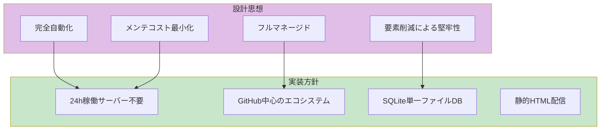
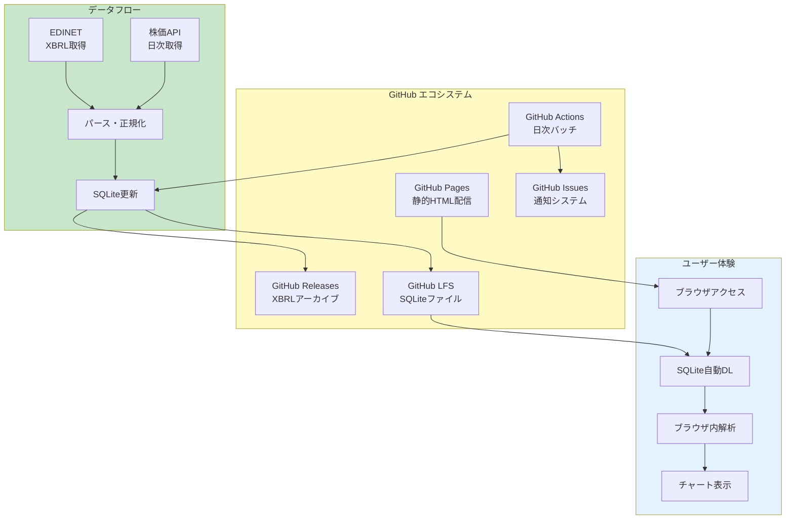
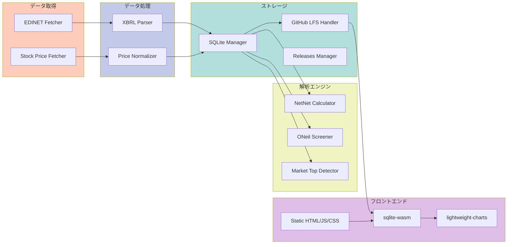
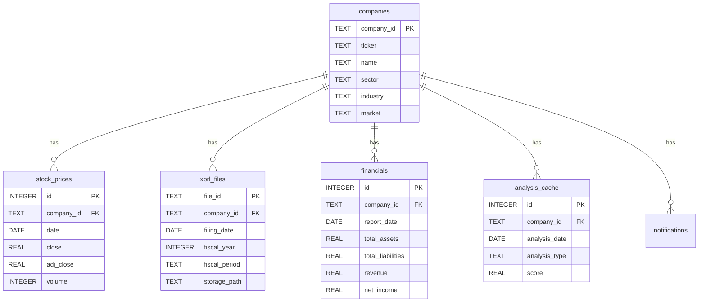
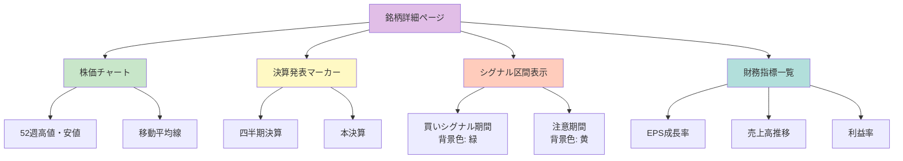
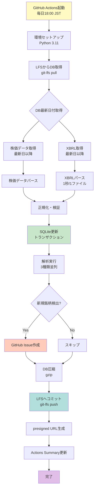
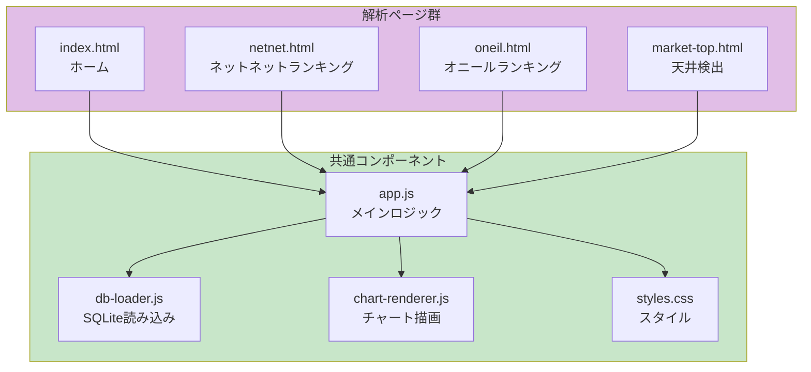
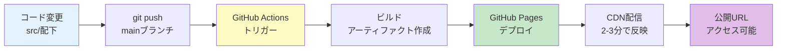
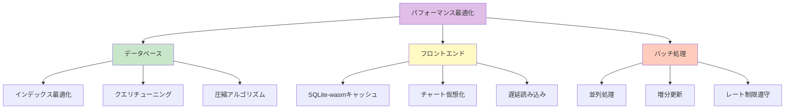

# 株式分析システム 完全仕様書

**バージョン**: 1.0.0
**作成日**: 2025年11月22日
**最終更新**: 2025年11月22日
**ステータス**: 仕様策定完了
**プロジェクト**: stock-analysis

---

## 📋 目次

1. [システム概要](#システム概要)
2. [アーキテクチャ設計](#アーキテクチャ設計)
3. [データモデル](#データモデル)
4. [機能仕様](#機能仕様)
5. [技術スタック](#技術スタック)
6. [ストレージ戦略](#ストレージ戦略)
7. [バッチ処理仕様](#バッチ処理仕様)
8. [解析ページ仕様](#解析ページ仕様)
9. [通知システム](#通知システム)
10. [デプロイメント](#デプロイメント)
11. [セキュリティ](#セキュリティ)
12. [パフォーマンス要件](#パフォーマンス要件)

---

## システム概要

### プロジェクトの目的

日本の上場銘柄を対象とした、完全自動化された株式分析システムを構築する。AI（主にClaude）を活用し、95%以上のコードをAIが生成することで、個人開発でも運用可能な堅牢なシステムを実現する。

### 設計思想



### 主要機能

1. **ネットネットバリュー株ランキング**
   - 即時現金化可能資産から総負債を引いた独自PBR算出
   - パラメータカスタマイズ可能（資産項目選択、割引率設定）
   - 過去PBR推移チャート表示

2. **オニール成長株発掘ランキング**
   - EPS成長率によるスクリーニング
   - リラティブストレングス指標
   - 決算発表日マーカー表示
   - シグナル区間の背景色可視化

3. **マーケット天井検出ツール**
   - 分配日カウントによる天井予測
   - 注意期間の背景色表示
   - パラメータ調整機能

### システム特性

| 特性 | 説明 | 実現方法 |
|------|------|----------|
| 完全自動化 | 人的介入を売買判断のみに限定 | GitHub Actions日次バッチ |
| ゼロ運用コスト | サーバー管理・保守作業不要 | フルマネージドサービス利用 |
| データ永続性 | 過去10年超のデータ保持 | GitHub Releases + LFS |
| 高速配信 | ブラウザ内解析で即座に表示 | sqlite-wasm + lightweight-charts |
| セキュア | 認証なしでも機密情報保護 | presigned URL（7日有効） |

---

## アーキテクチャ設計

### システム全体構成



### コンポーネント構成



---

## データモデル

### SQLiteスキーマ

**データ型の選択基準**:
```yaml
data_types:
  TEXT:
    use_case: "企業ID、銘柄コード、名前、URL"
    reason: "可変長文字列、インデックス効率良好"
    example: "company_id TEXT PRIMARY KEY"
  
  INTEGER:
    use_case: "ID、出来高、株数"
    reason: "整数値、演算高速、ストレージ効率良好"
    example: "volume INTEGER"
  
  REAL:
    use_case: "株価、財務データ、スコア"
    reason: "浮動小数点数、精度十分"
    example: "close REAL NOT NULL"
  
  DATE:
    use_case: "日付"
    reason: "ISO 8601形式（YYYY-MM-DD）、範囲検索高速"
    example: "date DATE NOT NULL"
  
  DATETIME:
    use_case: "タイムスタンプ"
    reason: "ISO 8601形式（YYYY-MM-DD HH:MM:SS）"
    example: "created_at DATETIME DEFAULT CURRENT_TIMESTAMP"
  
  BOOLEAN:
    use_case: "フラグ"
    reason: "0/1で保存（INTEGER）、可読性向上"
    example: "imported BOOLEAN DEFAULT 0"
  
  JSON:
    use_case: "可変構造データ"
    reason: "柔軟性、クエリ可能（json_extract）"
    example: "payload JSON"
```

#### 1. 企業マスタテーブル

```sql
CREATE TABLE IF NOT EXISTS companies (
  company_id TEXT PRIMARY KEY,      -- EDINETコードまたは証券コード
  ticker TEXT UNIQUE NOT NULL,      -- 証券コード（4桁）
  name TEXT NOT NULL,                -- 企業名
  sector TEXT,                       -- セクター
  industry TEXT,                     -- 業種
  market TEXT,                       -- 市場（東証プライム、スタンダードなど）
  listing_date DATE,                 -- 上場日
  last_update DATETIME DEFAULT CURRENT_TIMESTAMP
);

CREATE INDEX idx_companies_ticker ON companies(ticker);
CREATE INDEX idx_companies_sector ON companies(sector);
```

#### 2. 株価データテーブル

```sql
-- 日次株価データ保存テーブル
-- 調整後終値を含め、株式分割や配当の影響を正確に反映
CREATE TABLE IF NOT EXISTS stock_prices (
  id INTEGER PRIMARY KEY AUTOINCREMENT,
  company_id TEXT NOT NULL,           -- 企業IDへの外部キー
  date DATE NOT NULL,                 -- 株価日付（YYYY-MM-DD形式）
  open REAL,                          -- 始値（円）
  high REAL,                          -- 高値（円）
  low REAL,                           -- 安値（円）
  close REAL NOT NULL,                -- 終値（円、必須）
  adj_close REAL,                     -- 調整後終値（株式分割・配当調整済み）
  volume INTEGER,                     -- 出来高（株数）
  created_at DATETIME DEFAULT CURRENT_TIMESTAMP,  -- レコード作成日時
  FOREIGN KEY (company_id) REFERENCES companies(company_id),
  UNIQUE(company_id, date)            -- 同一企業・同一日付の重複防止
);

-- パフォーマンス最適化用インデックス
-- 企業IDと日付の複合インデックス（降順）で最新株価の高速取得
CREATE INDEX idx_stock_prices_company_date ON stock_prices(company_id, date DESC);

-- 全企業の特定日の株価を高速取得するためのインデックス
CREATE INDEX idx_stock_prices_date ON stock_prices(date DESC);
```

**設計意図**:
- `adj_close`を保存することで、チャート表示時の株価連続性を確保
- `UNIQUE(company_id, date)`制約により、重複データの挿入を防止
- インデックスにより、「特定企業の過去1年の株価」のようなクエリを100ms以下で実行可能

#### 3. XBRL生データテーブル

```sql
CREATE TABLE IF NOT EXISTS xbrl_files (
  file_id TEXT PRIMARY KEY,          -- EDINETドキュメントID
  company_id TEXT NOT NULL,
  filing_date DATE NOT NULL,         -- 提出日
  fiscal_year INTEGER,               -- 決算年度
  fiscal_period TEXT,                -- 決算期（Q1/Q2/Q3/Annual）
  report_type TEXT,                  -- 報告書種別（有報/四半期報告書）
  storage_path TEXT,                 -- GitHub Releases上のパス
  file_size INTEGER,                 -- ファイルサイズ（バイト）
  imported BOOLEAN DEFAULT 0,        -- パース済みフラグ
  created_at DATETIME DEFAULT CURRENT_TIMESTAMP,
  FOREIGN KEY (company_id) REFERENCES companies(company_id)
);

CREATE INDEX idx_xbrl_files_company ON xbrl_files(company_id, filing_date DESC);
CREATE INDEX idx_xbrl_files_imported ON xbrl_files(imported);
```

#### 4. 財務データテーブル

```sql
-- 財務データ（貸借対照表・損益計算書）保存テーブル
-- XBRLパース結果を正規化して格納
CREATE TABLE IF NOT EXISTS financials (
  id INTEGER PRIMARY KEY AUTOINCREMENT,
  company_id TEXT NOT NULL,           -- 企業IDへの外部キー
  report_date DATE NOT NULL,          -- 決算日（報告基準日）
  fiscal_year INTEGER NOT NULL,       -- 決算年度（例: 2024）
  fiscal_period TEXT NOT NULL,        -- 決算期（'Q1'/'Q2'/'Q3'/'Annual'）
  
  -- 資産項目（単位: 百万円）
  total_assets REAL,                  -- 総資産
  cash_and_deposits REAL,             -- 現金及び預金（ネットネット計算に使用）
  marketable_securities REAL,         -- 有価証券（ネットネット計算に使用）
  accounts_receivable REAL,           -- 売掛金（ネットネット計算に使用）
  inventory REAL,                     -- 棚卸資産（ネットネット計算に使用）
  tangible_assets REAL,               -- 有形固定資産
  
  -- 負債項目（単位: 百万円）
  total_liabilities REAL,             -- 総負債（ネットネット計算に使用）
  short_term_liabilities REAL,        -- 流動負債
  long_term_liabilities REAL,         -- 固定負債
  
  -- 純資産（単位: 百万円）
  shareholders_equity REAL,           -- 株主資本
  
  -- 損益項目（単位: 百万円）
  revenue REAL,                       -- 売上高
  operating_income REAL,              -- 営業利益
  ordinary_income REAL,               -- 経常利益
  net_income REAL,                    -- 当期純利益（EPS計算に使用）
  
  -- 1株あたり指標（単位: 円）
  eps REAL,                           -- EPS（オニール成長株スクリーニングに使用）
  bps REAL,                           -- BPS
  
  -- 株数（単位: 株）
  shares_outstanding BIGINT,          -- 発行済株式数（時価総額計算に使用）
  
  created_at DATETIME DEFAULT CURRENT_TIMESTAMP,  -- レコード作成日時
  FOREIGN KEY (company_id) REFERENCES companies(company_id),
  UNIQUE(company_id, report_date, fiscal_period)  -- 同一企業・同一決算日・同一期の重複防止
);

-- 企業ID・決算日の複合インデックス（降順）で最新財務データの高速取得
CREATE INDEX idx_financials_company_date ON financials(company_id, report_date DESC);
```

**設計意図**:
- `fiscal_period`で四半期・年次を区別することで、トレンド分析が可能
- ネットネット計算に必要な4つの資産項目（現金、有価証券、売掛金、棚卸資産）を明示
- `UNIQUE(company_id, report_date, fiscal_period)`制約により、修正報告書の重複挿入を防止
- 全ての金額項目を百万円単位に統一することで、計算ミスを防止

**データ例**:
```sql
-- 東京電力ホールディングスの2024年3月期（年次決算）
INSERT INTO financials VALUES (
  1,                          -- id
  '9501',                     -- company_id
  '2024-03-31',               -- report_date
  2024,                       -- fiscal_year
  'Annual',                   -- fiscal_period
  71321000,                   -- total_assets (百万円)
  5432100,                    -- cash_and_deposits
  3210500,                    -- marketable_securities
  4567800,                    -- accounts_receivable
  2345600,                    -- inventory
  15678900,                   -- tangible_assets
  45678900,                   -- total_liabilities
  12345600,                   -- short_term_liabilities
  33333300,                   -- long_term_liabilities
  25642100,                   -- shareholders_equity
  37154300,                   -- revenue
  4567800,                    -- operating_income
  5123400,                    -- ordinary_income
  3678900,                    -- net_income
  1234.56,                    -- eps
  8765.43,                    -- bps
  2978234567,                 -- shares_outstanding
  '2024-06-20 10:30:00'       -- created_at
);
```

#### 5. 解析結果キャッシュテーブル

```sql
CREATE TABLE IF NOT EXISTS analysis_cache (
  id INTEGER PRIMARY KEY AUTOINCREMENT,
  company_id TEXT NOT NULL,
  analysis_date DATE NOT NULL,
  analysis_type TEXT NOT NULL,       -- 'netnet', 'oneil', 'market_top'
  
  -- ネットネットバリュー指標
  net_net_assets REAL,               -- ネットネット資産
  net_net_pbr REAL,                  -- ネットネットPBR
  
  -- オニール指標
  eps_growth_3y REAL,                -- EPS成長率（3年）
  eps_growth_5y REAL,                -- EPS成長率（5年）
  relative_strength REAL,            -- リラティブストレングス
  
  -- 市場指標
  market_cap REAL,                   -- 時価総額
  
  score REAL,                        -- 総合スコア
  created_at DATETIME DEFAULT CURRENT_TIMESTAMP,
  FOREIGN KEY (company_id) REFERENCES companies(company_id),
  UNIQUE(company_id, analysis_date, analysis_type)
);

CREATE INDEX idx_analysis_cache_type_score ON analysis_cache(analysis_type, score DESC);
CREATE INDEX idx_analysis_cache_date ON analysis_cache(analysis_date DESC);
```

#### 6. 通知履歴テーブル

```sql
CREATE TABLE IF NOT EXISTS notifications (
  id INTEGER PRIMARY KEY AUTOINCREMENT,
  company_id TEXT NOT NULL,
  notification_date DATE NOT NULL,
  notification_type TEXT NOT NULL,   -- 'netnet_new', 'oneil_new', 'market_alert'
  issue_number INTEGER,              -- GitHub Issue番号
  issue_url TEXT,                    -- GitHub Issue URL
  payload JSON,                      -- 通知詳細データ
  created_at DATETIME DEFAULT CURRENT_TIMESTAMP,
  FOREIGN KEY (company_id) REFERENCES companies(company_id)
);

CREATE INDEX idx_notifications_date ON notifications(notification_date DESC);
CREATE INDEX idx_notifications_type ON notifications(notification_type);
```

### データ関連図



---

## 機能仕様

### 1. ネットネットバリュー株ランキング

#### 1.1 指標定義

**ネットネットバリューPBR**:

$$
\text{NetNetPBR} = \frac{\text{時価総額}}{\text{即時現金化可能資産} - \text{総負債}}
$$

**即時現金化可能資産の計算**:

$$
\begin{aligned}
\text{即時現金化可能資産} &= (\text{現金及び預金} \times 100\%) \\
&\quad + (\text{有価証券} \times \text{割引率}_A) \\
&\quad + (\text{売掛金} \times \text{割引率}_B) \\
&\quad + (\text{棚卸資産} \times \text{割引率}_C)
\end{aligned}
$$

**デフォルト割引率**:
| 資産項目 | 割引率 | 理由 |
|----------|--------|------|
| 現金及び預金 | 100% | 即座に利用可能 |
| 有価証券 | 80% | 市場で売却時に価格変動リスク |
| 売掛金 | 70% | 回収不能リスク、時間価値 |
| 棚卸資産 | 50% | 販売不確実性、劣化リスク |

**ネットネット資産の解釈**:
- **NetNetPBR < 1.0**: 時価総額が清算価値を下回る（割安）
- **NetNetPBR = 1.0**: 時価総額が清算価値と等しい（妥当）
- **NetNetPBR > 1.0**: 時価総額が清算価値を上回る（割高または成長期待）

**計算例**:
```yaml
example_company:
  name: "東京電力ホールディングス"
  ticker: "9501"
  
  balance_sheet:
    cash_and_deposits: 10000  # 百万円
    marketable_securities: 5000
    accounts_receivable: 8000
    inventory: 3000
    total_liabilities: 15000
  
  market_data:
    shares_outstanding: 100000000  # 株
    stock_price: 500  # 円
    market_cap: 50000  # 百万円
  
  calculation:
    liquid_assets: |
      10000 * 1.0 + 5000 * 0.8 + 8000 * 0.7 + 3000 * 0.5
      = 10000 + 4000 + 5600 + 1500
      = 21100 百万円
    
    net_net_assets: |
      21100 - 15000 = 6100 百万円
    
    net_net_pbr: |
      50000 / 6100 = 8.20
      → 割高（清算価値の8倍で取引されている）
```

#### 1.2 ランキングロジック

```python
def calculate_net_net_pbr(company_id: str, params: dict) -> float:
    """
    ネットネットバリューPBRを計算
    
    Args:
        company_id: 企業ID
        params: 割引率パラメータ
    
    Returns:
        NetNetPBR値（1未満が割安）
    
    Raises:
        ValueError: company_idが不正な場合
        DataNotFoundError: 財務データが存在しない場合
    """
    try:
        # 入力検証
        if not company_id or not isinstance(company_id, str):
            raise ValueError(f"Invalid company_id: {company_id}")
        
        # 最新財務データ取得
        financials = get_latest_financials(company_id)
        
        if financials is None:
            raise DataNotFoundError(f"No financial data for {company_id}")
        
        # 即時現金化可能資産計算
        liquid_assets = (
            financials.cash_and_deposits * params.get('cash_rate', 1.0) +
            financials.marketable_securities * params.get('securities_rate', 0.8) +
            financials.accounts_receivable * params.get('receivables_rate', 0.7) +
            financials.inventory * params.get('inventory_rate', 0.5)
        )
        
        # ネットネット資産
        net_net_assets = liquid_assets - financials.total_liabilities
        
        # 時価総額取得
        market_cap = get_market_cap(company_id)
        
        if market_cap is None or market_cap <= 0:
            raise ValueError(f"Invalid market cap for {company_id}: {market_cap}")
        
        # NetNetPBR計算
        if net_net_assets <= 0:
            return float('inf')  # 負債超過の場合は無限大
        
        pbr = market_cap / net_net_assets
        
        # 異常値チェック
        if pbr < 0 or pbr > 1000:
            logger.warning(f"Abnormal NetNetPBR for {company_id}: {pbr:.2f}")
        
        return pbr
        
    except DataNotFoundError as e:
        logger.error(f"Data not found: {str(e)}")
        raise
    except ValueError as e:
        logger.error(f"Validation error: {str(e)}")
        raise
    except Exception as e:
        logger.error(f"Unexpected error in calculate_net_net_pbr: {type(e).__name__}")
        raise RuntimeError(f"Failed to calculate NetNetPBR for {company_id}") from e
```

#### 1.3 PBR推移チャート

- X軸: 決算日
- Y軸: NetNetPBR値
- データポイント: 過去5年分（四半期ごと）
- 基準線: Y=1（割安ライン）

### 2. オニール成長株発掘ランキング

#### 2.1 スクリーニング条件

```yaml
oneil_criteria:
  eps_growth:
    3_year: "> 20%"
    5_year: "> 15%"
  
  relative_strength:
    threshold: "> 70"
    period: 52週
  
  revenue_growth:
    quarterly: "> 10%"
  
  profit_margin:
    minimum: "> 5%"
```

#### 2.2 リラティブストレングス計算

**定義**:
リラティブストレングス（RS）は、個別銘柄の株価パフォーマンスを市場全体と比較した指標。

**計算式**:

$$
\text{RS} = \text{Normalize}_{0-100}\left(\frac{P_{\text{stock}}}{P_{\text{index}}}\right)
$$

ここで、
- $P_{\text{stock}}$: 銘柄の株価変化率（52週）
- $P_{\text{index}}$: 市場インデックス（日経平均）の変化率（52週）

**詳細アルゴリズム**:

```python
def calculate_relative_strength(company_id: str, period_weeks: int = 52) -> float:
    """
    リラティブストレングスを計算
    
    Args:
        company_id: 企業ID
        period_weeks: 期間（週数）
    
    Returns:
        RS値（0-100）
    
    Raises:
        DataNotFoundError: 株価データが不足している場合
    """
    try:
        # 株価取得（52週 = 260営業日想定）
        prices = get_stock_prices(company_id, weeks=period_weeks)
        
        if len(prices) < period_weeks * 5:  # 週5営業日想定
            raise DataNotFoundError(f"Insufficient price data for {company_id}")
        
        # 株価変化率計算
        price_change = (prices[-1] - prices[0]) / prices[0]
        
        # 市場インデックス取得
        index_prices = get_index_prices(weeks=period_weeks)
        index_change = (index_prices[-1] - index_prices[0]) / index_prices[0]
        
        # 相対パフォーマンス
        if index_change == 0:
            relative_performance = 0
        else:
            relative_performance = price_change / index_change
        
        # 0-100スケールに正規化
        # 全銘柄の相対パフォーマンスを取得し、パーセンタイルランクを計算
        all_performances = get_all_relative_performances(period_weeks)
        rs = percentile_rank(relative_performance, all_performances)
        
        return rs
        
    except DataNotFoundError as e:
        logger.error(f"Data not found: {str(e)}")
        raise
    except Exception as e:
        logger.error(f"Unexpected error in calculate_relative_strength: {type(e).__name__}")
        raise RuntimeError(f"Failed to calculate RS for {company_id}") from e


def percentile_rank(value: float, all_values: list) -> float:
    """
    パーセンタイルランクを計算（0-100）
    
    Args:
        value: 対象値
        all_values: 全体の値リスト
    
    Returns:
        パーセンタイルランク（0-100）
    """
    sorted_values = sorted(all_values)
    rank = sorted_values.index(value) if value in sorted_values else \
           sum(1 for v in sorted_values if v < value)
    
    percentile = (rank / len(sorted_values)) * 100
    return percentile
```

**計算例**:

```yaml
example_calculation:
  stock:
    ticker: "9501"  # 東京電力ホールディングス
    price_52w_ago: 500円
    price_current: 650円
    change: (650 - 500) / 500 = 0.30 (30%上昇)
  
  index:
    name: "日経平均"
    value_52w_ago: 28000円
    value_current: 30800円
    change: (30800 - 28000) / 28000 = 0.10 (10%上昇)
  
  relative_performance:
    calculation: 0.30 / 0.10 = 3.0
    interpretation: "市場の3倍のパフォーマンス"
  
  rs_score:
    all_stocks: 3800銘柄
    better_than: 3420銘柄
    percentile: (3420 / 3800) * 100 = 90
    interpretation: "RS = 90（上位10%）→ 強い銘柄"
```

**RSスコアの解釈**:

| RSスコア | 評価 | 投資判断 |
|----------|------|----------|
| 90-100 | 非常に強い | 買い候補（上位10%） |
| 70-89 | 強い | 監視対象 |
| 50-69 | 平均的 | 中立 |
| 30-49 | 弱い | 避ける |
| 0-29 | 非常に弱い | 売り候補（下位30%） |

#### 2.3 詳細ページ表示要素



### 3. マーケット天井検出ツール

#### 3.1 分配日の定義

```python
def is_distribution_day(index_data: dict, threshold: dict) -> bool:
    """
    分配日判定
    
    Args:
        index_data: 市場インデックスデータ
        threshold: 閾値設定
    
    Returns:
        分配日フラグ
    """
    # 価格下落かつ出来高増加
    price_drop = (index_data['close'] - index_data['prev_close']) / index_data['prev_close']
    volume_increase = index_data['volume'] / index_data['avg_volume']
    
    return (
        price_drop < threshold['price_drop_pct'] and
        volume_increase > threshold['volume_ratio']
    )
```

#### 3.2 天井検出アルゴリズム

```python
def detect_market_top(lookback_days: int = 25, threshold: int = 5) -> dict:
    """
    マーケット天井検出
    
    Args:
        lookback_days: 遡及日数
        threshold: 分配日閾値
    
    Returns:
        検出結果
    """
    distribution_count = 0
    alert_periods = []
    
    for day in get_market_days(lookback_days):
        if is_distribution_day(day, DEFAULT_THRESHOLD):
            distribution_count += 1
        
        # 閾値超過で警告
        if distribution_count >= threshold:
            alert_periods.append({
                'start': day['date'],
                'count': distribution_count
            })
    
    return {
        'current_count': distribution_count,
        'alert': distribution_count >= threshold,
        'alert_periods': alert_periods
    }
```

---

## 技術スタック

### フロントエンド

```yaml
core:
  html: HTML5
  css: CSS3
  javascript: ES2022+

libraries:
  sqlite_wasm: "^3.43.0"  # ブラウザ内SQLite
  lightweight_charts: "^4.0.0"  # 高速チャート描画
  
design:
  responsive: true
  mobile_first: true
```

### バックエンド（バッチ処理）

```yaml
language:
  python: "3.11"

core_libraries:
  pandas: "2.0.3"  # データ処理
  lxml: "4.9.3"  # XBRL解析
  sqlite3: "built-in"  # データベース
  
data_fetching:
  requests: "2.31.0"  # HTTP通信
  beautifulsoup4: "4.12.2"  # HTML解析
  
analysis:
  numpy: "1.24.3"  # 数値計算
  scipy: "1.11.1"  # 統計処理
  scikit-learn: "1.3.0"  # 機械学習（オプション）
```

### インフラ

```yaml
hosting:
  pages: "GitHub Pages"
  actions: "GitHub Actions"
  
storage:
  database: "GitHub LFS"
  archives: "GitHub Releases"
  artifacts: "GitHub Actions Artifacts"
  
ci_cd:
  workflow: "GitHub Actions"
  schedule: "cron: 0 9 * * *"  # 毎日18:00 JST
```

---

## ストレージ戦略

### GitHub Releases活用

```yaml
xbrl_archives:
  naming: "xbrl-archive-{YYYY}.tar.gz"
  structure:
    - "2023.tar.gz"  # 2023年分全XBRL
    - "2024.tar.gz"  # 2024年分全XBRL
    - "2025.tar.gz"  # 2025年分全XBRL
  
  compression:
    algorithm: gzip
    level: 9
  
  retention: 永久
  
  auto_create:
    trigger: 年次バッチ（1月1日）
    script: scripts/archive_yearly_xbrl.py
```

### GitHub LFS活用

```yaml
sqlite_database:
  file: "stock-analysis.db"
  compressed: "stock-analysis.db.gz"
  
  versioning:
    enabled: true
    track: "*.db"
  
  auto_commit:
    frequency: 日次
    script: scripts/commit_db.py
    message: "chore: Update database - {date}"
  
  size_limit: 2GB
  
  download:
    method: git-lfs pull
    url_generation: presigned URL (7日有効)
```

### GitHub Actions Artifacts

```yaml
build_artifacts:
  retention: 90日
  
  types:
    - name: "daily-build"
      files:
        - "dist/"
        - "analysis-results.json"
    
    - name: "test-results"
      files:
        - "coverage/"
        - "test-report.html"
  
  auto_cleanup:
    enabled: true
    keep_latest: 30
```

### ディレクトリ構造

```
stock-analysis/
├── data/                      # Gitignore（ローカルのみ）
│   ├── raw/
│   │   ├── xbrl/              # 生XBRLファイル
│   │   └── prices/            # 生株価データ
│   ├── db/
│   │   └── stock-analysis.db  # SQLite（LFS管理）
│   └── cache/                 # 一時ファイル
├── scripts/
│   ├── fetch_xbrl.py
│   ├── fetch_prices.py
│   ├── parse_xbrl.py
│   ├── import_to_db.py
│   ├── analyze.py
│   └── notify.py
├── src/                       # フロントエンドソース
│   ├── index.html
│   ├── styles.css
│   └── app.js
├── .github/
│   └── workflows/
│       ├── daily-update.yml
│       └── deploy.yml
└── docs/
    ├── speckit.constitution
    ├── spec.md
    └── requirements.md
```

---

## バッチ処理仕様

### 日次バッチワークフロー



### ワークフローYAML（完全版）

```yaml
name: Daily Stock Analysis Update

on:
  schedule:
    - cron: '0 9 * * *'  # 毎日 9:00 UTC = 18:00 JST
  workflow_dispatch:

permissions:
  contents: write
  issues: write

jobs:
  update-analysis:
    runs-on: ubuntu-latest
    
    steps:
      - name: Checkout repository
        uses: actions/checkout@v4
        with:
          lfs: true
      
      - name: Setup Python
        uses: actions/setup-python@v4
        with:
          python-version: '3.11'
          cache: 'pip'
      
      - name: Install dependencies
        run: |
          pip install -r requirements.txt
      
      - name: Pull LFS files
        run: |
          git lfs pull
      
      - name: Fetch stock prices
        run: |
          python scripts/fetch_prices.py --since-db data/db/stock-analysis.db
        env:
          STOCK_API_KEY: ${{ secrets.STOCK_API_KEY }}
        continue-on-error: true
        id: fetch_prices
      
      - name: Check fetch prices result
        if: steps.fetch_prices.outcome == 'failure'
        run: |
          echo "⚠️ Stock price fetch failed, continuing with existing data" >> $GITHUB_STEP_SUMMARY
          echo "ERROR_FETCH_PRICES=true" >> $GITHUB_ENV
      
      - name: Fetch XBRL files
        run: |
          python scripts/fetch_xbrl.py --since-db data/db/stock-analysis.db --rate-limit 1
        continue-on-error: true
        id: fetch_xbrl
      
      - name: Check fetch XBRL result
        if: steps.fetch_xbrl.outcome == 'failure'
        run: |
          echo "⚠️ XBRL fetch failed, continuing with existing data" >> $GITHUB_STEP_SUMMARY
          echo "ERROR_FETCH_XBRL=true" >> $GITHUB_ENV
      
      - name: Parse XBRL files
        run: |
          python scripts/parse_xbrl.py --input data/raw/xbrl --output data/normalized
      
      - name: Import to database
        run: |
          python scripts/import_to_db.py --db data/db/stock-analysis.db --input data/normalized
      
      - name: Run analysis
        run: |
          python scripts/analyze.py --db data/db/stock-analysis.db --output analysis-results.json
      
      - name: Create notifications
        id: notify
        run: |
          python scripts/notify.py --payload analysis-results.json
        env:
          GITHUB_TOKEN: ${{ secrets.GITHUB_TOKEN }}
      
      - name: Compress database
        run: |
          gzip -k -f data/db/stock-analysis.db
      
      - name: Commit and push changes
        run: |
          git config user.name "github-actions[bot]"
          git config user.email "github-actions[bot]@users.noreply.github.com"
          git add data/db/stock-analysis.db data/db/stock-analysis.db.gz
          git commit -m "chore: Update database - $(date +'%Y-%m-%d')" || echo "No changes"
          git push
      
      - name: Generate presigned URL
        id: presigned
        run: |
          echo "db_url=https://github.com/${{ github.repository }}/raw/main/data/db/stock-analysis.db.gz" >> $GITHUB_OUTPUT
      
      - name: Update Actions Summary
        run: |
          echo "## 📊 Daily Update Summary" >> $GITHUB_STEP_SUMMARY
          echo "" >> $GITHUB_STEP_SUMMARY
          echo "**Date**: $(date +'%Y-%m-%d %H:%M:%S JST')" >> $GITHUB_STEP_SUMMARY
          echo "" >> $GITHUB_STEP_SUMMARY
          echo "### Database" >> $GITHUB_STEP_SUMMARY
          echo "- [Download DB](https://github.com/${{ github.repository }}/raw/main/data/db/stock-analysis.db.gz)" >> $GITHUB_STEP_SUMMARY
          echo "" >> $GITHUB_STEP_SUMMARY
          echo "### Analysis Pages" >> $GITHUB_STEP_SUMMARY
          echo "- [NetNet Ranking](https://github.com/${{ github.repository }}/pages/netnet.html?db=${{ steps.presigned.outputs.db_url }})" >> $GITHUB_STEP_SUMMARY
          echo "- [ONeil Ranking](https://github.com/${{ github.repository }}/pages/oneil.html?db=${{ steps.presigned.outputs.db_url }})" >> $GITHUB_STEP_SUMMARY
          echo "- [Market Top Detector](https://github.com/${{ github.repository }}/pages/market-top.html?db=${{ steps.presigned.outputs.db_url }})" >> $GITHUB_STEP_SUMMARY
      
      - name: Upload artifacts
        uses: actions/upload-artifact@v3
        with:
          name: daily-build-${{ github.run_id }}
          path: |
            analysis-results.json
            data/db/stock-analysis.db.gz
          retention-days: 90
```

---

## 解析ページ仕様

### ページ構成



### SQLite-wasm統合

```javascript
// db-loader.js
import initSqlJs from 'sql.js';

class DatabaseLoader {
  constructor() {
    this.db = null;
    this.SQL = null;
  }
  
  async initialize(dbUrl) {
    // SQLite-wasm初期化
    this.SQL = await initSqlJs({
      locateFile: file => `https://sql.js.org/dist/${file}`
    });
    
    // データベースダウンロード
    const response = await fetch(dbUrl);
    const buffer = await response.arrayBuffer();
    const uint8Array = new Uint8Array(buffer);
    
    // DB読み込み
    this.db = new this.SQL.Database(uint8Array);
    
    // IndexedDBにキャッシュ
    await this.cacheDatabase(dbUrl, uint8Array);
  }
  
  async cacheDatabase(url, data) {
    const db = await openDB('stock-analysis-cache', 1, {
      upgrade(db) {
        db.createObjectStore('databases');
      }
    });
    
    await db.put('databases', {
      url,
      data,
      timestamp: Date.now()
    }, 'latest');
  }
  
  query(sql, params = []) {
    const results = this.db.exec(sql, params);
    return this.formatResults(results);
  }
  
  formatResults(results) {
    if (!results.length) return [];
    
    const columns = results[0].columns;
    const values = results[0].values;
    
    return values.map(row => {
      const obj = {};
      columns.forEach((col, i) => {
        obj[col] = row[i];
      });
      return obj;
    });
  }
}

export default DatabaseLoader;
```

### lightweight-charts統合

```javascript
// chart-renderer.js
import { createChart } from 'lightweight-charts';

class ChartRenderer {
  constructor(containerId) {
    this.container = document.getElementById(containerId);
    this.chart = createChart(this.container, {
      width: this.container.clientWidth,
      height: 600,
      layout: {
        background: { color: '#ffffff' },
        textColor: '#333333',
      },
      grid: {
        vertLines: { color: '#e1e1e1' },
        horzLines: { color: '#e1e1e1' },
      },
      rightPriceScale: {
        borderColor: '#cccccc',
      },
      timeScale: {
        borderColor: '#cccccc',
        timeVisible: true,
      },
    });
  }
  
  renderPBRHistory(data) {
    const lineSeries = this.chart.addLineSeries({
      color: '#2962FF',
      lineWidth: 2,
    });
    
    // データ変換
    const chartData = data.map(item => ({
      time: item.report_date,
      value: item.net_net_pbr
    }));
    
    lineSeries.setData(chartData);
    
    // 基準線（PBR=1）
    const baselineSeries = this.chart.addLineSeries({
      color: '#FF6B6B',
      lineWidth: 1,
      lineStyle: 2,  // dashed
    });
    
    baselineSeries.setData(
      chartData.map(item => ({ ...item, value: 1.0 }))
    );
    
    // マーカー（決算発表日）
    const markers = this.createEarningsMarkers(data);
    lineSeries.setMarkers(markers);
  }
  
  createEarningsMarkers(data) {
    return data
      .filter(item => item.is_earnings_date)
      .map(item => ({
        time: item.report_date,
        position: 'aboveBar',
        color: '#FFA500',
        shape: 'circle',
        text: '決算'
      }));
  }
  
  destroy() {
    this.chart.remove();
  }
}

export default ChartRenderer;
```

---

## 通知システム

### GitHub Issue自動作成

```python
# scripts/notify.py
import os
import json
from typing import List, Dict
from github import Github

class NotificationManager:
    def __init__(self):
        self.github = Github(os.getenv('GITHUB_TOKEN'))
        self.repo = self.github.get_repo(os.getenv('GITHUB_REPOSITORY'))
    
    def create_notification(self, candidates: List[Dict]):
        """
        新規検出銘柄の通知Issue作成
        
        Args:
            candidates: 検出銘柄リスト
        """
        if not candidates:
            print("No new candidates detected.")
            return
        
        # 既存Issue確認（重複防止）
        today = datetime.date.today().isoformat()
        existing = self.check_existing_issue(today)
        
        if existing:
            print(f"Issue already exists: {existing.html_url}")
            return
        
        # Issue作成
        title = f"📊 新規銘柄検出 - {today}"
        body = self.generate_issue_body(candidates)
        
        issue = self.repo.create_issue(
            title=title,
            body=body,
            labels=['auto-detection', 'stock-alert']
        )
        
        print(f"Issue created: {issue.html_url}")
        
        # 通知履歴DB保存
        self.save_notification_history(candidates, issue.number, issue.html_url)
    
    def generate_issue_body(self, candidates: List[Dict]) -> str:
        """Issue本文生成"""
        lines = [
            "## 新規銘柄検出レポート",
            "",
            f"**検出日時**: {datetime.datetime.now().strftime('%Y-%m-%d %H:%M:%S')}",
            f"**検出件数**: {len(candidates)}件",
            "",
            "---",
            ""
        ]
        
        # 銘柄ごとに詳細
        for candidate in candidates:
            lines.extend([
                f"### {candidate['ticker']} - {candidate['name']}",
                "",
                f"**検出条件**: {candidate['detection_type']}",
                "",
                "**主要指標**:",
                f"- 時価総額: {candidate['market_cap']:,.0f}百万円",
                f"- NetNetPBR: {candidate.get('net_net_pbr', 'N/A')}",
                f"- EPS成長率: {candidate.get('eps_growth', 'N/A')}%",
                f"- スコア: {candidate['score']:.2f}",
                "",
                f"[詳細ページを見る]({self.get_detail_page_url(candidate['ticker'])})",
                "",
                "---",
                ""
            ])
        
        return "\n".join(lines)
    
    def get_detail_page_url(self, ticker: str) -> str:
        """詳細ページURL生成"""
        repo_url = f"https://{os.getenv('GITHUB_REPOSITORY_OWNER')}.github.io/{os.getenv('GITHUB_REPOSITORY').split('/')[-1]}"
        db_url = f"https://github.com/{os.getenv('GITHUB_REPOSITORY')}/raw/main/data/db/stock-analysis.db.gz"
        return f"{repo_url}/pages/detail.html?ticker={ticker}&db={db_url}"

# 使用例
if __name__ == "__main__":
    manager = NotificationManager()
    
    # 新規検出銘柄（サンプル）
    candidates = [
        {
            'ticker': '9501',
            'name': '東京電力ホールディングス',
            'detection_type': 'NetNet（PBR < 1.0）',
            'market_cap': 150000,
            'net_net_pbr': 0.75,
            'score': 92.3
        },
        {
            'ticker': '9502',
            'name': '中部電力',
            'detection_type': 'オニール成長株（EPS成長率 > 20%）',
            'market_cap': 120000,
            'eps_growth': 22.5,
            'score': 86.8
        }
    ]
    
    # 通知作成
    manager.create_notification(candidates)
```

**生成されるIssue例**:

```markdown
## 新規銘柄検出レポート

**検出日時**: 2025-11-22 18:30:45
**検出件数**: 2件

---

### 9501 - 東京電力ホールディングス

**検出条件**: NetNet（PBR < 1.0）

**主要指標**:
- 時価総額: 150,000百万円
- NetNetPBR: 0.75
- EPS成長率: N/A
- スコア: 92.30

[詳細ページを見る](https://j1921604.github.io/stock-analysis/pages/detail.html?ticker=9501&db=https://github.com/j1921604/stock-analysis/raw/main/data/db/stock-analysis.db.gz)

---

### 9502 - 中部電力

**検出条件**: オニール成長株（EPS成長率 > 20%）

**主要指標**:
- 時価総額: 120,000百万円
- NetNetPBR: N/A
- EPS成長率: 22.5%
- スコア: 86.80

[詳細ページを見る](https://j1921604.github.io/stock-analysis/pages/detail.html?ticker=9502&db=https://github.com/j1921604/stock-analysis/raw/main/data/db/stock-analysis.db.gz)

---
```

**通知トリガー設定**:

```yaml
notification_rules:
  netnet_detection:
    trigger: "NetNetPBR < 1.0 に新たになった銘柄"
    frequency: "日次"
    priority: "高"
    label: "netnet-alert"
  
  oneil_detection:
    trigger: "オニール条件を新たに満たした銘柄"
    frequency: "日次"
    priority: "中"
    label: "oneil-alert"
  
  market_top_alert:
    trigger: "分配日が5回以上（25日以内）"
    frequency: "即時"
    priority: "最高"
    label: "market-top-warning"
  
  data_quality_alert:
    trigger: "XBRLパースエラー率 > 5%"
    frequency: "即時"
    priority: "中"
    label: "data-quality-issue"
```

---

## デプロイメント

### GitHub Pages設定

```yaml
# .github/workflows/deploy.yml
name: Deploy to GitHub Pages

on:
  push:
    branches:
      - main
    paths:
      - 'src/**'
      - '.github/workflows/deploy.yml'

permissions:
  contents: read
  pages: write
  id-token: write

concurrency:
  group: "pages"
  cancel-in-progress: false

jobs:
  build:
    runs-on: ubuntu-latest
    steps:
      - name: Checkout
        uses: actions/checkout@v4
      
      - name: Setup Pages
        uses: actions/configure-pages@v4
      
      - name: Upload artifact
        uses: actions/upload-pages-artifact@v3
        with:
          path: './src'
  
  deploy:
    needs: build
    runs-on: ubuntu-latest
    environment:
      name: github-pages
      url: ${{ steps.deployment.outputs.page_url }}
    steps:
      - name: Deploy to GitHub Pages
        id: deployment
        uses: actions/deploy-pages@v4
```

### デプロイフロー



### デプロイメント トラブルシューティング

#### 問題1: GitHub Pagesが更新されない

**症状**:
- コードをpushしたがページが古いまま
- デプロイワークフローは成功している

**原因と対策**:
```yaml
cause_1:
  description: "ブラウザキャッシュ"
  solution:
    - "Ctrl+Shift+R（強制リロード）"
    - "シークレットモードで確認"
    - "キャッシュクリア"

cause_2:
  description: "CDN伝播遅延"
  solution:
    - "5-10分待つ"
    - "curl -I {URL} でキャッシュヘッダー確認"
    - "Cache-Control: max-age=600 想定"

cause_3:
  description: "GitHub Pages設定エラー"
  solution:
    - "リポジトリ Settings → Pages で設定確認"
    - "Source: GitHub Actions を選択"
    - "Custom domain設定があれば削除して再設定"
```

#### 問題2: SQLite-wasmが読み込めない

**症状**:
- ページは表示されるがSQLiteエラー
- Console: "Failed to load sqlite-wasm"

**原因と対策**:
```yaml
cause_1:
  description: "CORS制約"
  solution: |
    # index.htmlのscriptタグ確認
    <script type="module">
      import initSqlJs from 'https://cdn.jsdelivr.net/npm/sql.js@1.8.0/dist/sql-wasm.js';
      // ✅ CDN経由で読み込み
    </script>

cause_2:
  description: "WebAssembly対応ブラウザ"
  solution:
    - "Chrome >= 90, Firefox >= 88 確認"
    - "Safari >= 14 確認"
    - "古いブラウザは非対応"

cause_3:
  description: "ネットワークエラー"
  solution:
    - "DevTools Network タブで確認"
    - "sql-wasm.wasm の Status: 200 確認"
    - "サイズ: 約800KB 確認"
```

#### 問題3: チャートが表示されない

**症状**:
- データは読み込まれるがチャートが空白
- Console: エラーなし

**原因と対策**:
```yaml
cause_1:
  description: "コンテナサイズ未指定"
  solution: |
    /* styles.css */
    #chart-container {
      width: 100%;
      height: 600px;  /* ✅ 高さ必須 */
    }

cause_2:
  description: "データ形式不正"
  solution: |
    // データ形式確認
    const chartData = data.map(item => ({
      time: item.report_date,  // ✅ YYYY-MM-DD形式
      value: parseFloat(item.net_net_pbr)  // ✅ 数値変換
    }));

cause_3:
  description: "lightweight-charts読み込み失敗"
  solution:
    - "DevTools Network で lightweight-charts.js 確認"
    - "CDN URL正しいか確認"
    - "https://unpkg.com/lightweight-charts@4.0.0/dist/lightweight-charts.standalone.production.js"
```

---

## セキュリティ

### セキュリティ対策一覧

```yaml
data_protection:
  encryption:
    - GitHub Secrets使用（API キー）
    - HTTPS通信必須
    - presigned URL有効期限: 7日
  
  access_control:
    - リポジトリアクセス制限
    - LFSファイルへの直接アクセス不可
    - GitHub Pages認証不要（公開情報のみ）
  
  input_validation:
    - XBRLスキーマ検証
    - 株価データ型チェック
    - SQLインジェクション対策（パラメータ化クエリ）
  
  error_handling:
    - 機密情報を含まないログ出力
    - エラーメッセージの一般化
    - スタックトレースの秘匿
```

### セキュリティチェックリスト

- [ ] API キーは環境変数またはGitHub Secretsに保存
- [ ] `.env`ファイルは`.gitignore`に含める
- [ ] SQLクエリは全てパラメータ化
- [ ] ユーザー入力は全てサニタイズ
- [ ] HTTPS通信のみ許可
- [ ] presigned URLは7日で自動失効
- [ ] エラーログに機密情報を含めない
- [ ] 依存関係の脆弱性スキャン（週次）

---

## パフォーマンス要件

### パフォーマンス閾値

```yaml
frontend:
  initial_load: < 2秒
  db_download: < 10秒（100MB想定）
  query_execution: < 100ms
  chart_rendering_1000points: < 500ms
  filter_operation: < 200ms

backend:
  xbrl_parse: < 1秒/ファイル
  db_import: < 5分/1000ファイル
  analysis_execution: < 3分/全銘柄
  github_actions_total: < 30分

storage:
  db_size: < 500MB（圧縮前）
  db_size_compressed: < 100MB
  lfs_quota: < 1GB
```

### 最適化戦略



### 最適化実装例

#### データベース最適化

**インデックス設計**:
```sql
-- 悪い例: インデックスなし
SELECT * FROM stock_prices WHERE company_id = '9501' ORDER BY date DESC LIMIT 10;
-- 実行時間: 500ms（全行スキャン）

-- 良い例: 複合インデックス
CREATE INDEX idx_stock_prices_company_date ON stock_prices(company_id, date DESC);
SELECT * FROM stock_prices WHERE company_id = '9501' ORDER BY date DESC LIMIT 10;
-- 実行時間: 10ms（インデックススキャン）
```

**クエリ最適化**:
```sql
-- 悪い例: サブクエリ多用
SELECT 
  c.name,
  (SELECT MAX(date) FROM stock_prices WHERE company_id = c.company_id) as latest_date,
  (SELECT close FROM stock_prices WHERE company_id = c.company_id ORDER BY date DESC LIMIT 1) as latest_price
FROM companies c;
-- 実行時間: 5000ms

-- 良い例: JOIN使用
SELECT 
  c.name,
  sp.date as latest_date,
  sp.close as latest_price
FROM companies c
LEFT JOIN (
  SELECT company_id, date, close
  FROM stock_prices
  WHERE (company_id, date) IN (
    SELECT company_id, MAX(date) 
    FROM stock_prices 
    GROUP BY company_id
  )
) sp ON c.company_id = sp.company_id;
-- 実行時間: 200ms
```

**VACUUM実行**:
```python
# データベース最適化
def optimize_database(db_path: str):
    """VACUUM実行でDBサイズ削減"""
    conn = sqlite3.connect(db_path)
    
    # VACUUMでフラグメンテーション解消
    conn.execute("VACUUM;")
    
    # ANALYZEで統計情報更新
    conn.execute("ANALYZE;")
    
    conn.close()
    
    # 期待効果: DBサイズ 10-30%削減
```

#### フロントエンド最適化

**IndexedDBキャッシング**:
```javascript
// SQLite DBをIndexedDBにキャッシュ
class DatabaseCache {
  async getCachedDB(url) {
    const db = await openDB('stock-analysis-cache', 1);
    const cached = await db.get('databases', url);
    
    if (cached && this.isFresh(cached.timestamp)) {
      console.log('Using cached database');
      return cached.data;
    }
    
    // キャッシュがない or 古い場合はダウンロード
    console.log('Downloading fresh database');
    const data = await this.downloadDB(url);
    
    // キャッシュに保存
    await db.put('databases', {
      url,
      data,
      timestamp: Date.now()
    });
    
    return data;
  }
  
  isFresh(timestamp) {
    const ONE_DAY = 24 * 60 * 60 * 1000;
    return (Date.now() - timestamp) < ONE_DAY;
  }
}
```

**チャートデータ間引き（LTTB）**:
```javascript
// Largest-Triangle-Three-Bucketsアルゴリズム
function downsampleLTTB(data, threshold) {
  if (data.length <= threshold) return data;
  
  const sampled = [data[0]];  // 最初のポイント
  const bucketSize = (data.length - 2) / (threshold - 2);
  
  let a = 0;
  
  for (let i = 0; i < threshold - 2; i++) {
    const avgX = (i + 1) * bucketSize + 1;
    
    let maxArea = -1;
    let maxAreaPoint = null;
    
    const start = Math.floor(i * bucketSize) + 1;
    const end = Math.floor((i + 1) * bucketSize) + 1;
    
    for (let j = start; j < end; j++) {
      const area = Math.abs(
        (data[a].time - data[j].time) * (data[end].value - data[a].value) -
        (data[a].time - data[end].time) * (data[j].value - data[a].value)
      ) * 0.5;
      
      if (area > maxArea) {
        maxArea = area;
        maxAreaPoint = data[j];
      }
    }
    
    sampled.push(maxAreaPoint);
    a = data.indexOf(maxAreaPoint);
  }
  
  sampled.push(data[data.length - 1]);  // 最後のポイント
  
  return sampled;
}

// 使用例
const originalData = fetchPriceData();  // 10000ポイント
const downsampledData = downsampleLTTB(originalData, 1000);  // 1000ポイント
chart.setData(downsampledData);
// 描画時間: 5000ms → 500ms
```

#### バッチ処理最適化

**並列処理（multiprocessing）**:
```python
from multiprocessing import Pool
import os

def parse_xbrl_parallel(xbrl_files: list, num_workers: int = None):
    """XBRLファイルを並列パース"""
    if num_workers is None:
        num_workers = os.cpu_count()
    
    with Pool(num_workers) as pool:
        results = pool.map(parse_single_xbrl, xbrl_files)
    
    return results

# 期待効果: 処理時間 30分 → 10分（3コアCPU想定）
```

**増分更新**:
```python
def incremental_update(db_path: str, since_date: str):
    """差分更新で処理量削減"""
    conn = sqlite3.connect(db_path)
    
    # 前回更新日取得
    last_update = conn.execute(
        "SELECT MAX(date) FROM stock_prices"
    ).fetchone()[0]
    
    # 差分のみ取得
    new_data = fetch_prices(since=last_update)
    
    # 差分のみインポート
    import_to_db(new_data)
    
    conn.close()

# 期待効果: 取得件数 100万件 → 5000件（日次更新の場合）
```

---

**この仕様書はプロジェクトの完全な技術設計を記載しています。**
**実装時はこの仕様書に厳密に従い、変更がある場合は仕様書を先に更新してください。**

**バージョン**: 1.0.0 | **作成日**: 2025年11月22日 | **承認**: プロジェクトリード
