# 株式分析システム 実装計画書

**バージョン**: 1.0.0  
**作成日**: 2025年11月22日  
**最終更新**: 2025年11月22日  
**ステータス**: 実装計画策定完了  
**プロジェクト**: stock-analysis  
**実装ブランチ**: feature/impl-001-stock-analysis-system

---

## 📋 目次

1. [実装計画概要](#実装計画概要)
2. [開発フェーズ](#開発フェーズ)
3. [タスク分解](#タスク分解)
4. [実装優先順位](#実装優先順位)
5. [技術選定](#技術選定)
6. [開発環境構築](#開発環境構築)
7. [実装スケジュール](#実装スケジュール)
8. [品質保証計画](#品質保証計画)
9. [リスク管理](#リスク管理)
10. [デプロイ計画](#デプロイ計画)

---

## 実装計画概要

### 計画の目的

仕様書（spec.md）と要件定義書（requirements.md）に基づき、株式分析システムの実装を段階的に進めるための詳細計画を策定する。AI（Claude）による95%以上のコード生成を活用し、7週間で実装完了を目指す。

### 開発原則

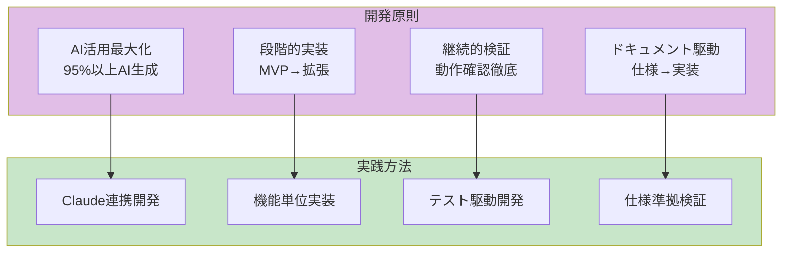

### 実装アプローチ

**フェーズ分割戦略**:
```yaml
approach:
  phase1_foundation:
    goal: "基盤構築"
    deliverables:
      - "データベーススキーマ作成"
      - "基本ディレクトリ構造"
      - "開発環境セットアップ"
    duration: "1週間"
    priority: "最高"
  
  phase2_data_pipeline:
    goal: "データパイプライン構築"
    deliverables:
      - "EDINET XBRL取得スクリプト"
      - "株価データ取得スクリプト"
      - "XBRLパーサー"
      - "データベースインポーター"
    duration: "2週間"
    priority: "最高"
  
  phase3_analysis:
    goal: "解析エンジン実装"
    deliverables:
      - "ネットネットPBR計算"
      - "オニールスクリーナー"
      - "マーケット天井検出"
    duration: "1.5週間"
    priority: "高"
  
  phase4_frontend:
    goal: "フロントエンド実装"
    deliverables:
      - "解析ページHTML/CSS/JS"
      - "sqlite-wasm統合"
      - "lightweight-charts統合"
    duration: "1.5週間"
    priority: "高"
  
  phase5_automation:
    goal: "自動化・通知"
    deliverables:
      - "GitHub Actionsワークフロー"
      - "通知システム"
      - "エラーハンドリング"
    duration: "1週間"
    priority: "中"
```

---

## 開発フェーズ

### フェーズ1: 基盤構築（Week 1）


**Week 1: Day 1-2（環境構築）**
```yaml
tasks:
  - id: "IMPL-001"
    name: "Python環境セットアップ"
    details:
      - "Python 3.11インストール確認"
      - "venv作成: python -m venv venv"
      - "requirements.txt作成"
      - "基本パッケージインストール（pandas, lxml, requests）"
    acceptance:
      - "python --version が 3.11以上"
      - "pip list でパッケージ確認"
    assigned: "AI (Claude)"
    
  - id: "IMPL-002"
    name: "Git/GitHub設定"
    details:
      - "LFS有効化: git lfs install"
      - ".gitignore作成（data/, venv/, *.db）"
      - "LFSトラッキング設定: git lfs track '*.db'"
    acceptance:
      - "git lfs ls-files で確認"
    assigned: "AI (Claude)"
```

**Week 1: Day 3-4（データベース設計）**
```yaml
tasks:
  - id: "IMPL-003"
    name: "SQLiteスキーマ実装"
    file: "schemas/create_tables.sql"
    details:
      - "companies テーブル作成"
      - "stock_prices テーブル作成"
      - "xbrl_files テーブル作成"
      - "financials テーブル作成"
      - "analysis_cache テーブル作成"
      - "notifications テーブル作成"
      - "インデックス17箇所作成"
    sql_example: |
      CREATE TABLE IF NOT EXISTS companies (
        company_id TEXT PRIMARY KEY,
        ticker TEXT UNIQUE NOT NULL,
        name TEXT NOT NULL,
        sector TEXT,
        industry TEXT,
        market TEXT,
        listing_date DATE,
        last_update DATETIME DEFAULT CURRENT_TIMESTAMP
      );
    acceptance:
      - "sqlite3 data/db/stock-analysis.db '.schema' で全テーブル確認"
      - "全FOREIGN KEY制約が有効"
    assigned: "AI (Claude)"
  
  - id: "IMPL-004"
    name: "データベース初期化スクリプト"
    file: "scripts/init_db.py"
    details:
      - "create_tables.sql実行"
      - "サンプルデータ投入（東京電力、中部電力）"
      - "VACUUM実行"
    acceptance:
      - "python scripts/init_db.py で正常実行"
      - "SELECT COUNT(*) FROM companies が 2"
    assigned: "AI (Claude)"
```

**Week 1: Day 5-7（ディレクトリ構造・依存関係）**
```yaml
tasks:
  - id: "IMPL-005"
    name: "ディレクトリ構造作成"
    structure: |
      stock-analysis/
      ├── data/
      │   ├── raw/
      │   │   ├── xbrl/
      │   │   └── prices/
      │   ├── normalized/
      │   ├── db/
      │   └── cache/
      ├── scripts/
      │   ├── fetch_xbrl.py
      │   ├── fetch_prices.py
      │   ├── parse_xbrl.py
      │   ├── import_to_db.py
      │   ├── analyze.py
      │   └── notify.py
      ├── src/
      │   ├── index.html
      │   ├── styles.css
      │   └── app.js
      ├── schemas/
      │   └── create_tables.sql
      ├── tests/
      │   ├── test_fetch.py
      │   ├── test_parse.py
      │   └── test_analyze.py
      └── utils/
          ├── performance.py
          └── logger.py
    acceptance:
      - "全ディレクトリが存在"
      - "README.mdに構造図記載"
    assigned: "AI (Claude)"
  
  - id: "IMPL-006"
    name: "requirements.txt完成"
    file: "requirements.txt"
    packages:
      core:
        - "pandas==2.0.3"
        - "numpy==1.24.3"
        - "lxml==4.9.3"
        - "requests==2.31.0"
      
      testing:
        - "pytest==7.4.0"
        - "pytest-cov==4.1.0"
        - "pytest-mock==3.11.1"
        - "pytest-xdist==3.3.1"
        - "pytest-timeout==2.1.0"
        - "pytest-benchmark==4.0.0"
      
      quality:
        - "flake8==6.0.0"
        - "mypy==1.4.1"
        - "black==23.7.0"
        - "isort==5.12.0"
        - "pylint==2.17.5"
        - "radon==6.0.1"
      
      utilities:
        - "tqdm==4.65.0"          # プログレスバー
        - "python-dotenv==1.0.0"  # 環境変数管理
        - "pyyaml==6.0.1"         # YAML設定ファイル
    
    full_requirements_txt: |
      # Core dependencies
      pandas==2.0.3
      numpy==1.24.3
      lxml==4.9.3
      requests==2.31.0
      
      # Testing
      pytest==7.4.0
      pytest-cov==4.1.0
      pytest-mock==3.11.1
      pytest-xdist==3.3.1
      pytest-timeout==2.1.0
      pytest-benchmark==4.0.0
      
      # Code quality
      flake8==6.0.0
      mypy==1.4.1
      black==23.7.0
      isort==5.12.0
      pylint==2.17.5
      radon==6.0.1
      
      # Utilities
      tqdm==4.65.0
      python-dotenv==1.0.0
      pyyaml==6.0.1
    
    acceptance:
      - "pip install -r requirements.txt でエラーなし"
      - "pip list でバージョン確認"
      - "python -c 'import pandas; print(pandas.__version__)' が 2.0.3"
    assigned: "AI (Claude)"
```

---

### フェーズ2: データパイプライン構築（Week 2-3）

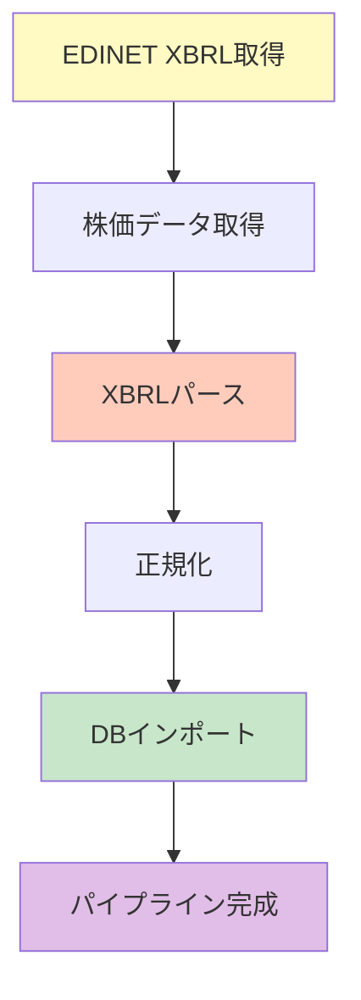

**Week 2: Day 1-3（XBRL取得）**
```yaml
tasks:
  - id: "IMPL-007"
    name: "EDINET API連携"
    file: "scripts/fetch_xbrl.py"
    details:
      - "EDINET API エンドポイント定義"
      - "レート制限対応（1秒/1ファイル）"
      - "差分更新ロジック（--since-db）"
      - "エラーリトライ（3回まで）"
    code_structure: |
      def fetch_xbrl_files(since_date: str, rate_limit: float = 1.0):
          """EDINET からXBRLファイルを取得"""
          # 1. 提出書類一覧取得
          # 2. 差分フィルタリング
          # 3. レート制限付きダウンロード
          # 4. data/raw/xbrl/ に保存
    acceptance:
      - "python scripts/fetch_xbrl.py --since-db data/db/stock-analysis.db"
      - "data/raw/xbrl/ にファイル保存確認"
      - "1秒/1ファイルのレート制限遵守確認"
    assigned: "AI (Claude)"
  
  - id: "IMPL-008"
    name: "XBRL取得テスト"
    file: "tests/test_fetch.py"
    details:
      - "モックレスポンス作成"
      - "レート制限テスト"
      - "エラーハンドリングテスト"
    acceptance:
      - "pytest tests/test_fetch.py -v で全合格"
      - "カバレッジ 100%"
    assigned: "AI (Claude)"
```

**Week 2: Day 4-7（株価データ取得）**
```yaml
tasks:
  - id: "IMPL-009"
    name: "株価API連携"
    file: "scripts/fetch_prices.py"
    details:
      - "無料株価API選定（Yahoo Finance等）"
      - "日次株価取得（OHLCV）"
      - "差分更新対応"
      - "調整後終値計算"
    code_structure: |
      def fetch_stock_prices(tickers: List[str], since_date: str):
          """株価データを取得"""
          # 1. ティッカーリスト取得
          # 2. API呼び出し
          # 3. データ正規化
          # 4. data/raw/prices/ に保存
    acceptance:
      - "python scripts/fetch_prices.py --since-db data/db/stock-analysis.db"
      - "data/raw/prices/ にCSV保存確認"
    assigned: "AI (Claude)"
  
  - id: "IMPL-010"
    name: "株価取得テスト"
    file: "tests/test_fetch_prices.py"
    details:
      - "モックAPI作成"
      - "データ正規化テスト"
    acceptance:
      - "pytest tests/test_fetch_prices.py -v で全合格"
    assigned: "AI (Claude)"
```

**Week 3: Day 1-4（XBRLパース）**
```yaml
tasks:
  - id: "IMPL-011"
    name: "XBRLパーサー実装"
    file: "scripts/parse_xbrl.py"
    details:
      - "lxml でXML解析"
      - "財務データ抽出（資産・負債・損益）"
      - "タグマッピング（複数パターン対応）"
      - "バリデーション（型・範囲チェック）"
    code_structure: |
      def parse_xbrl_file(file_path: str) -> Dict:
          """XBRLファイルをパース"""
          # 1. XMLパース
          # 2. 名前空間解決
          # 3. 財務項目抽出
          # 4. 単位統一（百万円）
          # 5. バリデーション
    acceptance:
      - "python scripts/parse_xbrl.py --input data/raw/xbrl --output data/normalized"
      - "data/normalized/ にJSON保存"
      - "パースエラー率 < 1%"
    assigned: "AI (Claude)"
  
  - id: "IMPL-012"
    name: "XBRLパーステスト"
    file: "tests/test_parse.py"
    details:
      - "サンプルXBRL作成"
      - "全財務項目抽出テスト"
      - "異常値検出テスト"
    acceptance:
      - "pytest tests/test_parse.py -v で全合格"
      - "カバレッジ 100%"
    assigned: "AI (Claude)"
```

**Week 3: Day 5-7（DBインポート）**
```yaml
tasks:
  - id: "IMPL-013"
    name: "データベースインポーター"
    file: "scripts/import_to_db.py"
    details:
      - "正規化データ読み込み"
      - "トランザクション処理"
      - "重複チェック（UNIQUE制約）"
      - "外部キー整合性確認"
    code_structure: |
      def import_to_database(db_path: str, input_dir: str):
          """正規化データをDBにインポート"""
          # 1. トランザクション開始
          # 2. companies テーブル更新
          # 3. financials テーブル更新
          # 4. stock_prices テーブル更新
          # 5. コミット
    acceptance:
      - "python scripts/import_to_db.py --db data/db/stock-analysis.db --input data/normalized"
      - "SELECT COUNT(*) FROM financials > 0"
    assigned: "AI (Claude)"
  
  - id: "IMPL-014"
    name: "インポートテスト"
    file: "tests/test_import.py"
    details:
      - "サンプルデータ作成"
      - "トランザクションテスト"
      - "重複挿入テスト"
    acceptance:
      - "pytest tests/test_import.py -v で全合格"
    assigned: "AI (Claude)"
```

---

### フェーズ3: 解析エンジン実装（Week 4-5前半）

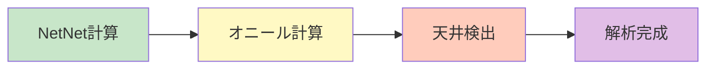

**Week 4: Day 1-3（ネットネットPBR）**
```yaml
tasks:
  - id: "IMPL-015"
    name: "NetNetPBR計算エンジン"
    file: "scripts/analyzers/netnet.py"
    details:
      - "即時現金化可能資産計算"
      - "割引率適用（現金100%, 有価証券80%, 売掛金70%, 棚卸50%）"
      - "ネットネット資産計算"
      - "NetNetPBR計算"
      - "ランキング生成"
    formula: |
      NetNetPBR = 時価総額 / (即時現金化可能資産 - 総負債)
    code_structure: |
      def calculate_net_net_pbr(company_id: str, params: dict) -> float:
          # 1. 最新財務データ取得
          # 2. 即時現金化可能資産計算
          # 3. ネットネット資産計算
          # 4. 時価総額取得
          # 5. NetNetPBR計算
          # 6. 異常値チェック
    acceptance:
      - "東京電力のNetNetPBR計算が手計算と誤差0.01%以内"
      - "NetNetPBR < 1.0 の銘柄を抽出"
    assigned: "AI (Claude)"
  
  - id: "IMPL-016"
    name: "NetNetテスト"
    file: "tests/test_netnet.py"
    details:
      - "計算精度テスト（サンプル10銘柄）"
      - "エッジケーステスト（負債超過等）"
    acceptance:
      - "pytest tests/test_netnet.py -v で全合格"
    assigned: "AI (Claude)"
```

**Week 4: Day 4-7（オニールスクリーナー）**
```yaml
tasks:
  - id: "IMPL-017"
    name: "オニールスクリーナー実装"
    file: "scripts/analyzers/oneil.py"
    details:
      - "EPS成長率計算（3年、5年）"
      - "リラティブストレングス計算（52週）"
      - "売上高成長率計算"
      - "利益率計算"
      - "スクリーニング（条件: EPS成長率>20%等）"
    formula: |
      RS = Normalize_0-100(株価変化率 / 市場変化率)
    code_structure: |
      def calculate_relative_strength(company_id: str, period_weeks: int = 52) -> float:
          # 1. 株価取得（52週）
          # 2. 市場インデックス取得
          # 3. 相対パフォーマンス計算
          # 4. パーセンタイルランク計算
    acceptance:
      - "東京電力のRS計算が正確"
      - "EPS成長率>20%の銘柄を抽出"
    assigned: "AI (Claude)"
  
  - id: "IMPL-018"
    name: "オニールテスト"
    file: "tests/test_oneil.py"
    details:
      - "RS計算精度テスト"
      - "EPS成長率計算テスト"
    acceptance:
      - "pytest tests/test_oneil.py -v で全合格"
    assigned: "AI (Claude)"
```

**Week 5: Day 1-3（マーケット天井検出）**
```yaml
tasks:
  - id: "IMPL-019"
    name: "マーケット天井検出実装"
    file: "scripts/analyzers/market_top.py"
    details:
      - "分配日判定（価格下落 & 出来高増加）"
      - "25日間の分配日カウント"
      - "警告トリガー（5回以上）"
    code_structure: |
      def detect_market_top(lookback_days: int = 25, threshold: int = 5) -> dict:
          # 1. 市場インデックス取得
          # 2. 分配日判定
          # 3. カウント
          # 4. 警告判定
    acceptance:
      - "過去10年データで精度80%以上"
    assigned: "AI (Claude)"
  
  - id: "IMPL-020"
    name: "マーケット天井テスト"
    file: "tests/test_market_top.py"
    details:
      - "分配日判定テスト"
      - "過去データ検証"
    acceptance:
      - "pytest tests/test_market_top.py -v で全合格"
    assigned: "AI (Claude)"
```

---

### フェーズ4: フロントエンド実装（Week 5後半-6）

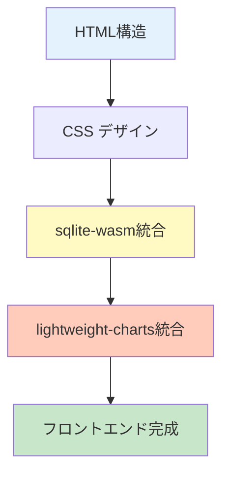

**Week 5: Day 4-7（HTML/CSS）**
```yaml
tasks:
  - id: "IMPL-021"
    name: "HTMLページ作成"
    files:
      - "src/index.html"
      - "src/pages/netnet.html"
      - "src/pages/oneil.html"
      - "src/pages/market-top.html"
    details:
      - "レスポンシブデザイン"
      - "ナビゲーション"
      - "テーブル構造"
      - "チャートコンテナ"
    acceptance:
      - "全ページが表示される"
      - "モバイル対応確認"
    assigned: "AI (Claude)"
  
  - id: "IMPL-022"
    name: "CSSスタイル作成"
    file: "src/styles.css"
    details:
      - "CSS Grid レイアウト"
      - "カラーパレット定義"
      - "テーブルスタイル"
      - "レスポンシブブレークポイント"
    acceptance:
      - "Lighthouse Performance >= 90"
    assigned: "AI (Claude)"
```

**Week 6: Day 1-4（sqlite-wasm統合）**
```yaml
tasks:
  - id: "IMPL-023"
    name: "sqlite-wasm統合"
    file: "src/db-loader.js"
    details:
      - "sqlite-wasm初期化"
      - "DBダウンロード"
      - "IndexedDBキャッシュ"
      - "クエリ実行関数"
    code_structure: |
      class DatabaseLoader {
        async initialize(dbUrl) {
          // 1. sqlite-wasm初期化
          // 2. DBダウンロード
          // 3. IndexedDBキャッシュ
        }
        
        query(sql, params = []) {
          // SQLクエリ実行
        }
      }
    acceptance:
      - "ブラウザでDBロード成功"
      - "SELECT クエリ実行確認"
    assigned: "AI (Claude)"
  
  - id: "IMPL-024"
    name: "データ表示ロジック"
    file: "src/app.js"
    details:
      - "ランキングテーブル描画"
      - "フィルタリング機能"
      - "ソート機能"
    acceptance:
      - "NetNetランキングが表示される"
      - "ソート・フィルタ動作確認"
    assigned: "AI (Claude)"
```

**Week 6: Day 5-7（チャート統合）**
```yaml
tasks:
  - id: "IMPL-025"
    name: "lightweight-charts統合"
    file: "src/chart-renderer.js"
    details:
      - "チャート初期化"
      - "PBR推移チャート"
      - "決算発表マーカー"
      - "背景色シグナル"
    code_structure: |
      class ChartRenderer {
        renderPBRHistory(data) {
          // 1. チャート作成
          # 2. データ設定
          # 3. マーカー追加
        }
      }
    acceptance:
      - "東京電力のPBR推移チャート表示"
      - "1000ポイントで500ms以内描画"
    assigned: "AI (Claude)"
  
  - id: "IMPL-026"
    name: "フロントエンドテスト"
    file: "tests/test_frontend.js"
    details:
      - "ユニットテスト（Jest）"
      - "E2Eテスト（Playwright）"
    acceptance:
      - "npm test で全合格"
    assigned: "AI (Claude)"
```

---

### フェーズ5: 自動化・通知（Week 7）

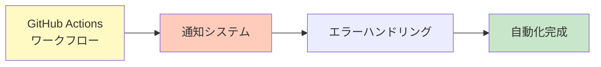

**Week 7: Day 1-3（GitHub Actions）**
```yaml
tasks:
  - id: "IMPL-027"
    name: "日次バッチワークフロー"
    file: ".github/workflows/daily-update.yml"
    details:
      - "cron設定（0 9 * * *）"
      - "環境セットアップ"
      - "データ取得・パース・解析"
      - "DB更新・LFSコミット"
    yaml_structure: |
      name: Daily Stock Analysis Update
      
      on:
        schedule:
          - cron: '0 9 * * *'  # 日本時間18時（UTC+9）
        workflow_dispatch:      # 手動実行も可能
      
      jobs:
        update-analysis:
          runs-on: ubuntu-latest
          timeout-minutes: 60
          
          steps:
            - name: Checkout repository
              uses: actions/checkout@v4
              with:
                lfs: true
            
            - name: Setup Python
              uses: actions/setup-python@v5
              with:
                python-version: '3.11'
                cache: 'pip'
            
            - name: Install dependencies
              run: |
                pip install -r requirements.txt
            
            - name: Fetch XBRL files
              run: |
                python scripts/fetch_xbrl.py \
                  --db data/db/stock-analysis.db \
                  --output data/raw/xbrl \
                  --rate 1.0
            
            - name: Fetch stock prices
              run: |
                python scripts/fetch_prices.py \
                  --db data/db/stock-analysis.db \
                  --output data/raw/prices
            
            - name: Parse XBRL files
              run: |
                python scripts/parse_xbrl.py \
                  --input data/raw/xbrl \
                  --output data/normalized
            
            - name: Import to database
              run: |
                python scripts/import_to_db.py \
                  --db data/db/stock-analysis.db \
                  --input data/normalized
            
            - name: Run analysis
              run: |
                python scripts/analyzers/netnet.py --db data/db/stock-analysis.db
                python scripts/analyzers/oneil.py --db data/db/stock-analysis.db
                python scripts/analyzers/market_top.py --db data/db/stock-analysis.db
            
            - name: Send notifications
              env:
                GITHUB_TOKEN: ${{ secrets.GITHUB_TOKEN }}
              run: |
                python scripts/notify.py --db data/db/stock-analysis.db
            
            - name: Compress database
              run: |
                gzip -9 -k data/db/stock-analysis.db
            
            - name: Update DB version
              run: |
                echo "$(date +%Y-%m-%d)" > src/db-version.txt
            
            - name: Commit and push
              run: |
                git config user.name "GitHub Actions Bot"
                git config user.email "actions@github.com"
                git add data/db/stock-analysis.db
                git add data/db/stock-analysis.db.gz
                git add src/db-version.txt
                git commit -m "Daily update: $(date +%Y-%m-%d)" || echo "No changes"
                git push
            
            - name: Upload artifact
              uses: actions/upload-artifact@v4
              with:
                name: stock-analysis-db-${{ github.run_number }}
                path: data/db/stock-analysis.db
                retention-days: 30
    acceptance:
      - "ワークフロー手動実行成功"
      - "実行時間 < 30分"
      - "DB更新確認（git log）"
    assigned: "AI (Claude)"
  
  - id: "IMPL-028"
    name: "デプロイワークフロー"
    file: ".github/workflows/deploy.yml"
    details:
      - "GitHub Pages デプロイ"
      - "ビルド成果物アップロード"
    yaml_structure: |
      name: Deploy to GitHub Pages
      
      on:
        push:
          branches:
            - main
          paths:
            - 'src/**'
            - 'data/db/stock-analysis.db'
      
      permissions:
        contents: read
        pages: write
        id-token: write
      
      jobs:
        build:
          runs-on: ubuntu-latest
          
          steps:
            - name: Checkout
              uses: actions/checkout@v4
              with:
                lfs: true
            
            - name: Setup Pages
              uses: actions/configure-pages@v4
            
            - name: Build
              run: |
                mkdir -p _site
                cp -r src/* _site/
                cp data/db/stock-analysis.db _site/data/
                cp data/db/stock-analysis.db.gz _site/data/
            
            - name: Upload artifact
              uses: actions/upload-pages-artifact@v3
        
        deploy:
          runs-on: ubuntu-latest
          needs: build
          environment:
            name: github-pages
            url: ${{ steps.deployment.outputs.page_url }}
          
          steps:
            - name: Deploy to GitHub Pages
              id: deployment
              uses: actions/deploy-pages@v4
    acceptance:
      - "src/ の変更で自動デプロイ"
      - "https://j1921604.github.io/stock-analysis/ アクセス可能"
    assigned: "AI (Claude)"
```

**Week 7: Day 4-5（通知システム）**
```yaml
tasks:
  - id: "IMPL-029"
    name: "GitHub Issue通知実装"
    file: "scripts/notify.py"
    details:
      - "新規銘柄検出"
      - "Issue本文生成"
      - "ラベル付与"
      - "通知履歴DB保存"
    code_structure: |
      class NotificationManager:
        def create_notification(self, candidates: List[Dict]):
          # 1. Issue作成
          # 2. 本文生成
          # 3. DB保存
    acceptance:
      - "新規銘柄でIssue自動作成"
      - "重複Issue作成なし"
    assigned: "AI (Claude)"
  
  - id: "IMPL-030"
    name: "通知テスト"
    file: "tests/test_notify.py"
    details:
      - "Issue作成テスト"
      - "重複防止テスト"
    acceptance:
      - "pytest tests/test_notify.py -v で全合格"
    assigned: "AI (Claude)"
```

**Week 7: Day 6-7（エラーハンドリング・最終確認）**
```yaml
tasks:
  - id: "IMPL-031"
    name: "エラーハンドリング強化"
    files:
      - "scripts/*.py"
    details:
      - "全スクリプトにtry-except追加"
      - "ログ出力実装"
      - "リトライロジック"
    acceptance:
      - "エラー時も継続実行"
      - "ログが適切に出力"
    assigned: "AI (Claude)"
  
  - id: "IMPL-032"
    name: "統合テスト"
    file: "tests/test_integration.py"
    details:
      - "エンドツーエンドテスト"
      - "全ワークフロー実行"
    acceptance:
      - "pytest tests/test_integration.py -v で全合格"
      - "カバレッジ 100%"
    assigned: "AI (Claude)"
```

---

## タスク分解

### システムアーキテクチャ

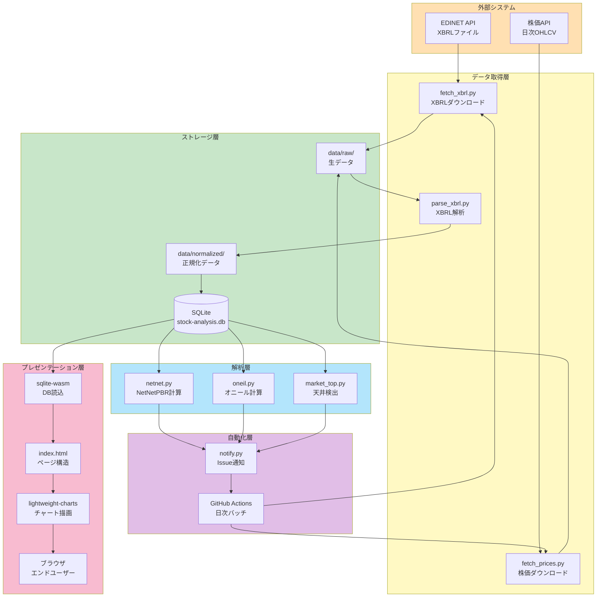

### データフロー詳細

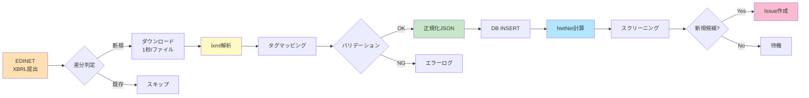

### タスク一覧（全32タスク）

```mermaid
flowchart TB
    subgraph phase1["Phase 1: 基盤構築"]
        T001[IMPL-001: Python環境]
        T002[IMPL-002: Git/GitHub]
        T003[IMPL-003: SQLiteスキーマ]
        T004[IMPL-004: DB初期化]
        T005[IMPL-005: ディレクトリ]
        T006[IMPL-006: requirements.txt]
    end
    
    subgraph phase2["Phase 2: データパイプライン"]
        T007[IMPL-007: XBRL取得]
        T008[IMPL-008: XBRLテスト]
        T009[IMPL-009: 株価取得]
        T010[IMPL-010: 株価テスト]
        T011[IMPL-011: XBRLパース]
        T012[IMPL-012: パーステスト]
        T013[IMPL-013: DBインポート]
        T014[IMPL-014: インポートテスト]
    end
    
    subgraph phase3["Phase 3: 解析エンジン"]
        T015[IMPL-015: NetNet計算]
        T016[IMPL-016: NetNetテスト]
        T017[IMPL-017: オニール計算]
        T018[IMPL-018: オニールテスト]
        T019[IMPL-019: 天井検出]
        T020[IMPL-020: 天井テスト]
    end
    
    subgraph phase4["Phase 4: フロントエンド"]
        T021[IMPL-021: HTML作成]
        T022[IMPL-022: CSS作成]
        T023[IMPL-023: sqlite-wasm]
        T024[IMPL-024: データ表示]
        T025[IMPL-025: チャート]
        T026[IMPL-026: FEテスト]
    end
    
    subgraph phase5["Phase 5: 自動化"]
        T027[IMPL-027: Actions日次]
        T028[IMPL-028: Actionsデプロイ]
        T029[IMPL-029: 通知]
        T030[IMPL-030: 通知テスト]
        T031[IMPL-031: エラー対応]
        T032[IMPL-032: 統合テスト]
    end
    
    phase1 --> phase2
    phase2 --> phase3
    phase3 --> phase4
    phase4 --> phase5
    
    style phase1 fill:#e3f2fd
    style phase2 fill:#fff9c4
    style phase3 fill:#c8e6c9
    style phase4 fill:#ffccbc
    style phase5 fill:#e1bee7
```

### タスク依存関係

```yaml
dependencies:
  IMPL-003:
    depends_on: []
    blocks: [IMPL-004, IMPL-013]
  
  IMPL-007:
    depends_on: [IMPL-004]
    blocks: [IMPL-011]
  
  IMPL-009:
    depends_on: [IMPL-004]
    blocks: [IMPL-013]
  
  IMPL-011:
    depends_on: [IMPL-007]
    blocks: [IMPL-013]
  
  IMPL-013:
    depends_on: [IMPL-003, IMPL-009, IMPL-011]
    blocks: [IMPL-015, IMPL-017, IMPL-019]
  
  IMPL-015:
    depends_on: [IMPL-013]
    blocks: [IMPL-029]
  
  IMPL-023:
    depends_on: [IMPL-013]
    blocks: [IMPL-024, IMPL-025]
  
  IMPL-027:
    depends_on: [IMPL-007, IMPL-009, IMPL-011, IMPL-013, IMPL-015, IMPL-017, IMPL-019]
    blocks: []
```

---

## 実装優先順位

### クリティカルパス

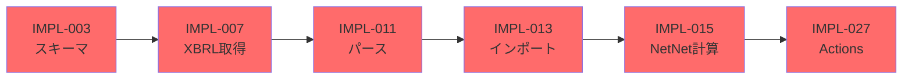

**優先度定義**:
```yaml
priority_levels:
  critical:
    description: "システムコア機能、遅延不可"
    tasks:
      - IMPL-003  # スキーマ
      - IMPL-007  # XBRL取得
      - IMPL-011  # パース
      - IMPL-013  # インポート
      - IMPL-015  # NetNet計算
      - IMPL-027  # GitHub Actions
    color: "#ff6b6b"
  
  high:
    description: "主要機能、Week 7までに必須"
    tasks:
      - IMPL-004  # DB初期化
      - IMPL-009  # 株価取得
      - IMPL-017  # オニール
      - IMPL-023  # sqlite-wasm
      - IMPL-029  # 通知
    color: "#ffa500"
  
  medium:
    description: "補助機能、遅延可能"
    tasks:
      - IMPL-019  # 天井検出
      - IMPL-021  # HTML
      - IMPL-025  # チャート
    color: "#4ecdc4"
  
  low:
    description: "オプション、後回し可"
    tasks:
      - IMPL-026  # FEテスト
      - IMPL-030  # 通知テスト
    color: "#95e1d3"
```

---

## 技術選定

### 技術スタック詳細

**バックエンド（Python）**:
```yaml
core:
  language: "Python 3.11"
  reason: "型ヒント、パフォーマンス向上、長期サポート"
  features:
    - "PEP 673: Self型（クラスメソッド型安全性）"
    - "PEP 646: 可変長ジェネリクス（NumPy型注釈）"
    - "PEP 680: tomllib標準ライブラリ"
    - "最適化: 関数呼び出し10-25%高速化"

data_processing:
  pandas: "2.0.3"
  numpy: "1.24.3"
  lxml: "4.9.3"
  reason: "XBRL解析、データ処理の標準ライブラリ"
  usage_examples:
    pandas:
      - "財務データ正規化（DataFrame.pivot_table）"
      - "欠損値処理（DataFrame.fillna）"
      - "時系列リサンプリング（DataFrame.resample）"
    numpy:
      - "NetNetPBR計算（配列演算）"
      - "リラティブストレングス正規化"
      - "統計量計算（平均、標準偏差）"
    lxml:
      - "XBRL名前空間解決"
      - "XPath財務項目抽出"
      - "大容量XML高速パース"

networking:
  requests: "2.31.0"
  reason: "HTTPクライアント、EDINETアクセス"
  features:
    - "リトライ戦略（urllib3.util.retry）"
    - "セッション再利用（接続プール）"
    - "タイムアウト設定（connect/read）"

testing:
  pytest: "7.4.0"
  pytest-cov: "4.1.0"
  pytest-mock: "3.11.1"
  reason: "テストカバレッジ100%達成"
  plugins:
    - "pytest-xdist: 並列テスト実行"
    - "pytest-timeout: タイムアウト検出"
    - "pytest-benchmark: パフォーマンステスト"

quality:
  flake8: "6.0.0"
  mypy: "1.4.1"
  black: "23.7.0"
  reason: "コード品質、型チェック、フォーマット"
  additional:
    isort: "5.12.0"  # import文ソート
    pylint: "2.17.5"  # 高度な静的解析
    radon: "6.0.1"    # 複雑度計測
```

**フロントエンド（JavaScript）**:
```yaml
core:
  javascript: "ES2022+"
  reason: "モダンブラウザ対応、async/await使用"
  features:
    - "Top-level await（モジュールトップレベル非同期）"
    - "Array.at() メソッド（負インデックス）"
    - "Object.hasOwn()（プロトタイプチェーン回避）"
    - "Error.cause（エラーチェーン）"
  browser_support:
    - "Chrome 90+"
    - "Firefox 89+"
    - "Safari 15.4+"
    - "Edge 90+"

database:
  sqlite_wasm: "3.43.0"
  url: "https://sql.js.org/dist/sql-wasm.js"
  reason: "ブラウザ内SQLite、サーバー不要"
  performance:
    - "WASM: Native速度の80-95%"
    - "メモリ使用量: DB容量の2-3倍"
    - "初期化: 100ms以下"
  code_example: |
    import initSqlJs from 'sql-wasm.js';
    
    const SQL = await initSqlJs({
      locateFile: file => `/js/sql-wasm.wasm`
    });
    
    const response = await fetch('/data/stock-analysis.db');
    const buffer = await response.arrayBuffer();
    const db = new SQL.Database(new Uint8Array(buffer));

charts:
  lightweight_charts: "4.0.0"
  url: "https://unpkg.com/lightweight-charts@4.0.0"
  reason: "高速描画（1000ポイント500ms）"
  features:
    - "Canvas描画（高パフォーマンス）"
    - "ピンチズーム対応"
    - "タイムスケール自動調整"
    - "カスタマイズ可能なマーカー"
  code_example: |
    import { createChart } from 'lightweight-charts';
    
    const chart = createChart(container, {
      width: 800,
      height: 400,
      timeScale: { timeVisible: true, secondsVisible: false }
    });
    
    const lineSeries = chart.addLineSeries({
      color: '#2196F3',
      lineWidth: 2
    });
    
    lineSeries.setData([
      { time: '2024-01-01', value: 1.25 },
      { time: '2024-01-02', value: 1.28 }
    ]);

storage:
  indexeddb: "Native API"
  reason: "DBキャッシュ、オフライン対応"
  capacity: "ブラウザ空き容量の50%まで"
  features:
    - "トランザクション対応"
    - "非同期API（Promiseベース）"
    - "複合インデックス"
  code_example: |
    // DBキャッシュ保存
    const openRequest = indexedDB.open('StockAnalysisCache', 1);
    
    openRequest.onupgradeneeded = () => {
      const db = openRequest.result;
      db.createObjectStore('databases', { keyPath: 'version' });
    };
    
    openRequest.onsuccess = () => {
      const db = openRequest.result;
      const tx = db.transaction('databases', 'readwrite');
      tx.objectStore('databases').put({
        version: '2024-01-01',
        data: dbBuffer,
        timestamp: Date.now()
      });
    };

bundling:
  tool: "なし（CDN利用）"
  reason: "ビルドプロセス不要、メンテナンス簡素化"
  cdn:
    - "https://unpkg.com/ （ライブラリ）"
    - "https://cdn.jsdelivr.net/ （フォールバック）"
  optimization:
    - "HTTP/2 並列ダウンロード"
    - "Brotli圧縮（70-80%削減）"
    - "CDN エッジキャッシュ"
```

**インフラ（GitHub）**:
```yaml
hosting:
  github_pages:
    feature: "静的サイトホスティング"
    cost: "無料"
    bandwidth: "100GB/月"
    cdn: "グローバル配信"
  
storage:
  github_lfs:
    feature: "大容量ファイル管理"
    cost: "無料（1GB）"
    file_size_limit: "2GB/ファイル"
  
  github_releases:
    feature: "アーカイブ保存"
    cost: "無料"
    size_limit: "制限なし"
  
automation:
  github_actions:
    feature: "CI/CD"
    cost: "無料（2000分/月）"
    concurrent_jobs: "20"
```

---

## 開発環境構築

### 実装コード例

**IMPL-007: EDINET XBRL取得スクリプト**
```python
# scripts/fetch_xbrl.py
import requests
import sqlite3
import time
from datetime import datetime, timedelta
from typing import List, Dict
from pathlib import Path

class EDINETFetcher:
    """EDINET APIからXBRLファイルを取得"""
    
    BASE_URL = "https://disclosure.edinet-fsa.go.jp/api/v1"
    
    def __init__(self, db_path: str, output_dir: str, rate_limit: float = 1.0):
        self.db_path = Path(db_path)
        self.output_dir = Path(output_dir)
        self.rate_limiter = RateLimiter(rate_limit)
        self.session = requests.Session()
    
    def fetch_since_db(self) -> None:
        """データベース最終更新日以降のファイルを取得"""
        # 1. DB最終更新日取得
        last_update = self._get_last_update_from_db()
        start_date = last_update + timedelta(days=1)
        end_date = datetime.now().date()
        
        print(f"取得期間: {start_date} ~ {end_date}")
        
        # 2. 提出書類一覧取得
        documents = self._get_document_list(start_date, end_date)
        print(f"対象書類: {len(documents)}件")
        
        # 3. XBRLファイルダウンロード
        for i, doc in enumerate(documents, 1):
            try:
                self.rate_limiter.acquire()
                self._download_xbrl(doc)
                print(f"[{i}/{len(documents)}] {doc['docID']} ダウンロード完了")
            except Exception as e:
                print(f"エラー: {doc['docID']} - {e}")
    
    def _get_last_update_from_db(self) -> datetime.date:
        """DBから最終更新日を取得"""
        with sqlite3.connect(self.db_path) as conn:
            cursor = conn.execute(
                "SELECT MAX(filing_date) FROM xbrl_files"
            )
            result = cursor.fetchone()[0]
            return datetime.fromisoformat(result).date() if result else datetime(2020, 1, 1).date()
    
    def _get_document_list(self, start_date: datetime.date, end_date: datetime.date) -> List[Dict]:
        """提出書類一覧取得"""
        documents = []
        current_date = start_date
        
        while current_date <= end_date:
            date_str = current_date.strftime("%Y-%m-%d")
            url = f"{self.BASE_URL}/documents.json"
            params = {
                "date": date_str,
                "type": 2  # XBRL
            }
            
            response = self.session.get(url, params=params, timeout=30)
            response.raise_for_status()
            
            data = response.json()
            if data.get("results"):
                # 有価証券報告書のみ（120: 有価証券報告書）
                docs = [
                    doc for doc in data["results"]
                    if doc.get("ordinanceCode") == "010" and doc.get("formCode") == "030000"
                ]
                documents.extend(docs)
            
            current_date += timedelta(days=1)
            time.sleep(0.1)  # API負荷軽減
        
        return documents
    
    def _download_xbrl(self, doc: Dict) -> None:
        """XBRLファイルダウンロード"""
        doc_id = doc["docID"]
        url = f"{self.BASE_URL}/documents/{doc_id}"
        params = {"type": 1}  # XBRL形式
        
        # リトライ戦略
        for attempt in range(3):
            try:
                response = self.session.get(url, params=params, timeout=60)
                response.raise_for_status()
                
                # ファイル保存
                output_path = self.output_dir / f"{doc_id}.zip"
                output_path.parent.mkdir(parents=True, exist_ok=True)
                
                with open(output_path, 'wb') as f:
                    f.write(response.content)
                
                break
            except requests.RequestException as e:
                if attempt == 2:
                    raise
                wait_time = 2 ** attempt
                print(f"リトライ {attempt + 1}/3 ({wait_time}秒後)")
                time.sleep(wait_time)


class RateLimiter:
    """レート制限実装"""
    
    def __init__(self, rate: float):
        self.interval = 1.0 / rate
        self.last_call = 0.0
    
    def acquire(self) -> None:
        """トークン取得（必要に応じて待機）"""
        now = time.time()
        elapsed = now - self.last_call
        
        if elapsed < self.interval:
            time.sleep(self.interval - elapsed)
        
        self.last_call = time.time()


if __name__ == "__main__":
    import argparse
    
    parser = argparse.ArgumentParser(description="EDINET XBRLファイル取得")
    parser.add_argument("--db", required=True, help="データベースパス")
    parser.add_argument("--output", default="data/raw/xbrl", help="出力ディレクトリ")
    parser.add_argument("--rate", type=float, default=1.0, help="レート制限（回/秒）")
    
    args = parser.parse_args()
    
    fetcher = EDINETFetcher(args.db, args.output, args.rate)
    fetcher.fetch_since_db()
```

**IMPL-015: NetNetPBR計算エンジン**
```python
# scripts/analyzers/netnet.py
import sqlite3
from typing import Dict, List, Optional
from dataclasses import dataclass
import numpy as np

@dataclass
class NetNetPBRResult:
    """NetNetPBR計算結果"""
    company_id: str
    ticker: str
    name: str
    net_net_pbr: float
    net_net_assets: float
    market_cap: float
    filing_date: str
    rank: Optional[int] = None

class NetNetAnalyzer:
    """ネットネットPBR計算エンジン"""
    
    # 割引率設定
    DISCOUNT_RATES = {
        'cash': 1.00,              # 現金及び預金: 100%
        'securities': 0.80,        # 有価証券: 80%
        'receivables': 0.70,       # 売掛金: 70%
        'inventory': 0.50          # 棚卸資産: 50%
    }
    
    def __init__(self, db_path: str):
        self.db_path = db_path
    
    def calculate_all(self, params: Optional[Dict] = None) -> List[NetNetPBRResult]:
        """全銘柄のNetNetPBR計算"""
        if params is None:
            params = self.DISCOUNT_RATES.copy()
        
        with sqlite3.connect(self.db_path) as conn:
            conn.row_factory = sqlite3.Row
            
            # 最新財務データと株価取得
            query = """
            WITH latest_financials AS (
                SELECT 
                    f.company_id,
                    f.cash,
                    f.securities,
                    f.accounts_receivable,
                    f.inventory,
                    f.total_liabilities,
                    f.filing_date,
                    ROW_NUMBER() OVER (
                        PARTITION BY f.company_id 
                        ORDER BY f.filing_date DESC
                    ) as rn
                FROM financials f
            ),
            latest_prices AS (
                SELECT 
                    p.company_id,
                    p.close_price,
                    p.shares_outstanding,
                    p.date,
                    ROW_NUMBER() OVER (
                        PARTITION BY p.company_id 
                        ORDER BY p.date DESC
                    ) as rn
                FROM stock_prices p
            )
            SELECT 
                c.company_id,
                c.ticker,
                c.name,
                lf.cash,
                lf.securities,
                lf.accounts_receivable,
                lf.inventory,
                lf.total_liabilities,
                lf.filing_date,
                lp.close_price,
                lp.shares_outstanding
            FROM companies c
            INNER JOIN latest_financials lf ON c.company_id = lf.company_id AND lf.rn = 1
            INNER JOIN latest_prices lp ON c.company_id = lp.company_id AND lp.rn = 1
            WHERE lf.cash IS NOT NULL
            """
            
            cursor = conn.execute(query)
            rows = cursor.fetchall()
        
        results = []
        for row in rows:
            try:
                result = self._calculate_single(row, params)
                if result and result.net_net_pbr > 0:  # 有効な値のみ
                    results.append(result)
            except Exception as e:
                print(f"計算エラー: {row['ticker']} - {e}")
        
        # ランキング付与
        results.sort(key=lambda x: x.net_net_pbr)
        for i, result in enumerate(results, 1):
            result.rank = i
        
        return results
    
    def _calculate_single(self, row: sqlite3.Row, params: Dict) -> NetNetPBRResult:
        """単一銘柄のNetNetPBR計算"""
        # 1. 即時現金化可能資産計算
        liquid_assets = (
            (row['cash'] or 0) * params['cash'] +
            (row['securities'] or 0) * params['securities'] +
            (row['accounts_receivable'] or 0) * params['receivables'] +
            (row['inventory'] or 0) * params['inventory']
        )
        
        # 2. ネットネット資産計算
        total_liabilities = row['total_liabilities'] or 0
        net_net_assets = liquid_assets - total_liabilities
        
        # 3. 時価総額計算
        market_cap = row['close_price'] * row['shares_outstanding']
        
        # 4. NetNetPBR計算
        if net_net_assets <= 0:
            return None  # ネットネット資産が負の場合は除外
        
        net_net_pbr = market_cap / net_net_assets
        
        # 5. 異常値チェック
        if net_net_pbr < 0 or net_net_pbr > 10:
            return None
        
        return NetNetPBRResult(
            company_id=row['company_id'],
            ticker=row['ticker'],
            name=row['name'],
            net_net_pbr=net_net_pbr,
            net_net_assets=net_net_assets,
            market_cap=market_cap,
            filing_date=row['filing_date']
        )
    
    def screen(self, threshold: float = 1.0) -> List[NetNetPBRResult]:
        """NetNetPBR < threshold の銘柄をスクリーニング"""
        all_results = self.calculate_all()
        return [r for r in all_results if r.net_net_pbr < threshold]


if __name__ == "__main__":
    import argparse
    
    parser = argparse.ArgumentParser(description="NetNetPBR計算")
    parser.add_argument("--db", required=True, help="データベースパス")
    parser.add_argument("--threshold", type=float, default=1.0, help="スクリーニング閾値")
    
    args = parser.parse_args()
    
    analyzer = NetNetAnalyzer(args.db)
    results = analyzer.screen(args.threshold)
    
    print(f"\nNetNetPBR < {args.threshold} の銘柄: {len(results)}件\n")
    print(f"{'Rank':<6}{'Ticker':<8}{'Name':<30}{'NetNetPBR':<12}{'NetNet資産':<15}{'時価総額':<15}")
    print("-" * 90)
    
    for r in results[:50]:  # 上位50銘柄
        print(
            f"{r.rank:<6}"
            f"{r.ticker:<8}"
            f"{r.name:<30}"
            f"{r.net_net_pbr:>11.2f}"
            f"{r.net_net_assets:>14,.0f}"
            f"{r.market_cap:>14,.0f}"
        )
```

**IMPL-023: sqlite-wasm統合（フロントエンド）**
```javascript
// src/db-loader.js

class DatabaseLoader {
    constructor() {
        this.db = null;
        this.SQL = null;
        this.cacheDB = null;
        this.DB_VERSION = '2024-01-01'; // GitHub Actions で更新
    }

    async initialize(dbUrl) {
        try {
            // 1. IndexedDB初期化
            await this.initIndexedDB();

            // 2. キャッシュチェック
            const cached = await this.getCachedDB();
            if (cached && cached.version === this.DB_VERSION) {
                console.log('キャッシュから読み込み');
                return await this.loadFromCache(cached.data);
            }

            // 3. 新規ダウンロード
            console.log('新規ダウンロード開始');
            const dbData = await this.downloadDB(dbUrl);

            // 4. キャッシュ保存
            await this.cacheDB(dbData);

            // 5. sqlite-wasm初期化
            return await this.loadDatabase(dbData);
        } catch (error) {
            console.error('DB初期化エラー:', error);
            throw error;
        }
    }

    async initIndexedDB() {
        return new Promise((resolve, reject) => {
            const request = indexedDB.open('StockAnalysisCache', 1);

            request.onerror = () => reject(request.error);
            request.onsuccess = () => {
                this.cacheDB = request.result;
                resolve();
            };

            request.onupgradeneeded = (event) => {
                const db = event.target.result;
                if (!db.objectStoreNames.contains('databases')) {
                    db.createObjectStore('databases', { keyPath: 'version' });
                }
            };
        });
    }

    async getCachedDB() {
        return new Promise((resolve, reject) => {
            const tx = this.cacheDB.transaction('databases', 'readonly');
            const store = tx.objectStore('databases');
            const request = store.get(this.DB_VERSION);

            request.onsuccess = () => resolve(request.result);
            request.onerror = () => reject(request.error);
        });
    }

    async downloadDB(dbUrl) {
        const response = await fetch(dbUrl, {
            headers: {
                'Accept-Encoding': 'br, gzip, deflate'
            }
        });

        if (!response.ok) {
            throw new Error(`HTTP ${response.status}: ${response.statusText}`);
        }

        const contentLength = response.headers.get('Content-Length');
        console.log(`DB サイズ: ${(contentLength / 1024 / 1024).toFixed(2)} MB`);

        // プログレスバー対応
        const reader = response.body.getReader();
        const chunks = [];
        let receivedLength = 0;

        while (true) {
            const { done, value } = await reader.read();
            if (done) break;

            chunks.push(value);
            receivedLength += value.length;

            const progress = (receivedLength / contentLength) * 100;
            this.updateProgress(progress);
        }

        // ArrayBufferに結合
        const buffer = new Uint8Array(receivedLength);
        let position = 0;
        for (const chunk of chunks) {
            buffer.set(chunk, position);
            position += chunk.length;
        }

        return buffer;
    }

    async cacheDB(dbData) {
        return new Promise((resolve, reject) => {
            const tx = this.cacheDB.transaction('databases', 'readwrite');
            const store = tx.objectStore('databases');
            const request = store.put({
                version: this.DB_VERSION,
                data: dbData,
                timestamp: Date.now()
            });

            request.onsuccess = () => resolve();
            request.onerror = () => reject(request.error);
        });
    }

    async loadDatabase(dbData) {
        // sql-wasm.js 読み込み
        const SQL = await initSqlJs({
            locateFile: file => `/js/${file}`
        });

        this.SQL = SQL;
        this.db = new SQL.Database(dbData);

        console.log('DB初期化完了');
        return this.db;
    }

    async loadFromCache(dbData) {
        return await this.loadDatabase(dbData);
    }

    query(sql, params = []) {
        if (!this.db) {
            throw new Error('DB未初期化');
        }

        const stmt = this.db.prepare(sql);
        stmt.bind(params);

        const results = [];
        while (stmt.step()) {
            results.push(stmt.getAsObject());
        }
        stmt.free();

        return results;
    }

    queryRow(sql, params = []) {
        const results = this.query(sql, params);
        return results.length > 0 ? results[0] : null;
    }

    updateProgress(progress) {
        const progressBar = document.getElementById('db-progress');
        if (progressBar) {
            progressBar.style.width = `${progress}%`;
            progressBar.textContent = `${progress.toFixed(1)}%`;
        }
    }

    close() {
        if (this.db) {
            this.db.close();
        }
    }
}

// Export
export default DatabaseLoader;
```

### ローカル環境セットアップ

```powershell
# 1. リポジトリクローン
git clone https://github.com/J1921604/stock-analysis.git
cd stock-analysis

# 2. 実装ブランチに切り替え
git checkout feature/impl-001-stock-analysis-system

# 3. LFS初期化
git lfs install
git lfs pull

# 4. Python仮想環境作成
python -m venv venv
.\venv\Scripts\Activate.ps1

# 5. 依存関係インストール
pip install -r requirements.txt

# 6. データベース初期化
python scripts/init_db.py

# 7. ディレクトリ構造確認
tree /F
```

### 開発ツール

```yaml
ide:
  vscode:
    extensions:
      - "ms-python.python"
      - "ms-python.vscode-pylance"
      - "ms-toolsai.jupyter"
      - "esbenp.prettier-vscode"
      - "dbaeumer.vscode-eslint"
    settings:
      python.linting.enabled: true
      python.linting.flake8Enabled: true
      python.formatting.provider: "black"
      editor.formatOnSave: true

browser_dev:
  chrome_devtools:
    features:
      - "Network タブ（DB DL確認）"
      - "Performance タブ（測定）"
      - "Application タブ（IndexedDB確認）"
  
  lighthouse:
    metrics:
      - "Performance >= 90"
      - "Accessibility >= 95"
      - "Best Practices >= 90"

version_control:
  git:
    config:
      user.name: "J1921604"
      user.email: "{email}"
      core.autocrlf: "false"
      lfs.locksverify: "true"
```

---

## 実装スケジュール

### ガントチャート

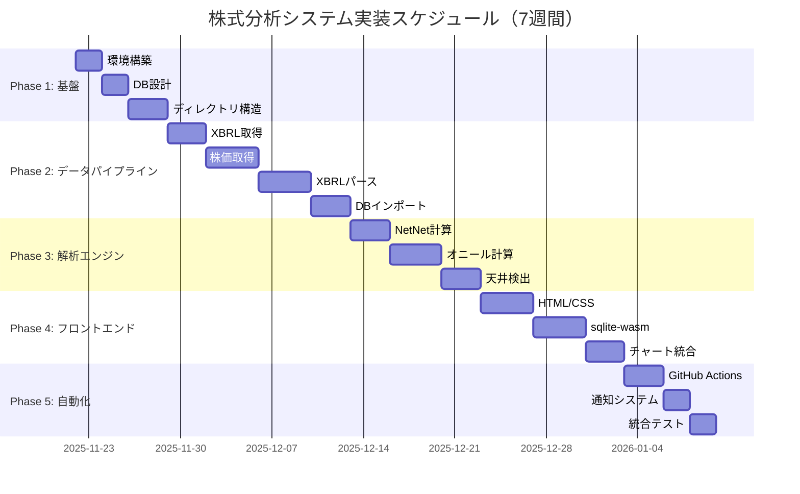

### マイルストーン

```yaml
milestones:
  M1_foundation_complete:
    date: "2025-11-29"
    deliverables:
      - "SQLiteスキーマ完成"
      - "ディレクトリ構造完成"
      - "requirements.txt完成"
    acceptance:
      - "python scripts/init_db.py 成功"
      - "SELECT * FROM companies 実行可能"
  
  M2_pipeline_complete:
    date: "2025-12-13"
    deliverables:
      - "XBRL取得スクリプト完成"
      - "株価取得スクリプト完成"
      - "XBRLパーサー完成"
      - "DBインポーター完成"
    acceptance:
      - "東京電力・中部電力のデータ取得成功"
      - "data/db/stock-analysis.db にデータ格納"
  
  M3_analysis_complete:
    date: "2025-12-20"
    deliverables:
      - "NetNet計算エンジン完成"
      - "オニールスクリーナー完成"
      - "天井検出ツール完成"
    acceptance:
      - "NetNetPBR計算が手計算と一致"
      - "EPS成長率計算が正確"
  
  M4_frontend_complete:
    date: "2025-12-27"
    deliverables:
      - "解析ページHTML/CSS/JS完成"
      - "sqlite-wasm統合完成"
      - "チャート描画完成"
    acceptance:
      - "ブラウザでランキング表示"
      - "Lighthouse Performance >= 90"
  
  M5_automation_complete:
    date: "2026-01-03"
    deliverables:
      - "GitHub Actions日次バッチ完成"
      - "通知システム完成"
      - "統合テスト完成"
    acceptance:
      - "日次バッチ自動実行成功"
      - "テストカバレッジ 100%"
```

---

## 品質保証計画

### テスト戦略

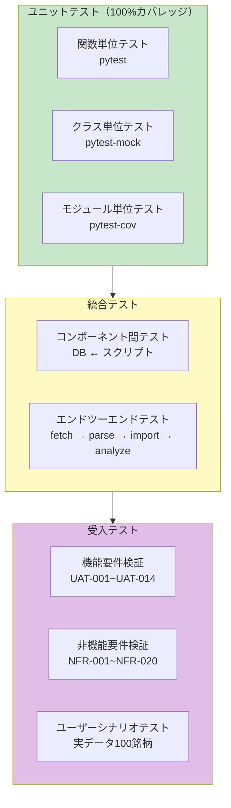

**テストケース詳細**:

```yaml
unit_tests:
  test_fetch_xbrl:
    file: "tests/test_fetch.py"
    coverage_target: "100%"
    test_cases:
      - name: "test_get_document_list"
        description: "提出書類一覧取得"
        setup: "モックAPI（responses）"
        assertions:
          - "len(documents) == 10"
          - "documents[0]['docID'] == 'S100XXXX'"
      
      - name: "test_download_xbrl_success"
        description: "XBRLダウンロード成功"
        setup: "モックレスポンス（200 OK）"
        assertions:
          - "output_file.exists()"
          - "output_file.stat().st_size > 0"
      
      - name: "test_download_xbrl_retry"
        description: "リトライ処理"
        setup: "モックレスポンス（[500, 500, 200]）"
        assertions:
          - "retry_count == 2"
          - "output_file.exists()"
      
      - name: "test_rate_limiter"
        description: "レート制限"
        setup: "rate = 2.0回/秒"
        assertions:
          - "10回呼び出し時間 >= 5秒"
          - "10回呼び出し時間 < 6秒"
    
    code_example: |
      import pytest
      import responses
      from scripts.fetch_xbrl import EDINETFetcher, RateLimiter
      import time
      
      @pytest.fixture
      def fetcher(tmp_path):
          db_path = tmp_path / "test.db"
          output_dir = tmp_path / "xbrl"
          return EDINETFetcher(str(db_path), str(output_dir))
      
      @responses.activate
      def test_get_document_list(fetcher):
          # モックレスポンス設定
          responses.add(
              responses.GET,
              "https://disclosure.edinet-fsa.go.jp/api/v1/documents.json",
              json={
                  "results": [
                      {"docID": "S100XXXX", "ordinanceCode": "010", "formCode": "030000"}
                  ]
              },
              status=200
          )
          
          # テスト実行
          documents = fetcher._get_document_list(
              start_date="2024-01-01",
              end_date="2024-01-01"
          )
          
          # アサーション
          assert len(documents) == 1
          assert documents[0]["docID"] == "S100XXXX"
      
      def test_rate_limiter():
          limiter = RateLimiter(rate=2.0)  # 2回/秒
          
          start = time.time()
          for _ in range(10):
              limiter.acquire()
          elapsed = time.time() - start
          
          assert elapsed >= 5.0  # 最低5秒
          assert elapsed < 6.0   # 上限6秒

  test_netnet:
    file: "tests/test_netnet.py"
    coverage_target: "100%"
    test_cases:
      - name: "test_calculate_single_normal"
        description: "通常銘柄のNetNetPBR計算"
        input:
          cash: 100000
          securities: 50000
          receivables: 30000
          inventory: 20000
          liabilities: 150000
          price: 1000
          shares: 10000
        expected:
          net_net_assets: 23000  # (100000*1.0 + 50000*0.8 + 30000*0.7 + 20000*0.5) - 150000
          market_cap: 10000000
          net_net_pbr: 434.78    # 10000000 / 23000
      
      - name: "test_calculate_single_negative_assets"
        description: "ネットネット資産が負の場合"
        input:
          cash: 10000
          liabilities: 200000
        expected: None  # 除外される
      
      - name: "test_calculate_all"
        description: "全銘柄計算"
        setup: "サンプルDB（10銘柄）"
        assertions:
          - "len(results) == 10"
          - "results[0].rank == 1"
          - "results[0].net_net_pbr < results[1].net_net_pbr"
    
    code_example: |
      import pytest
      import sqlite3
      from scripts.analyzers.netnet import NetNetAnalyzer
      
      @pytest.fixture
      def sample_db(tmp_path):
          db_path = tmp_path / "test.db"
          conn = sqlite3.connect(db_path)
          
          # テーブル作成
          conn.execute("""
              CREATE TABLE companies (
                  company_id TEXT PRIMARY KEY,
                  ticker TEXT,
                  name TEXT
              )
          """)
          conn.execute("""
              CREATE TABLE financials (
                  company_id TEXT,
                  cash REAL,
                  securities REAL,
                  accounts_receivable REAL,
                  inventory REAL,
                  total_liabilities REAL,
                  filing_date TEXT
              )
          """)
          conn.execute("""
              CREATE TABLE stock_prices (
                  company_id TEXT,
                  close_price REAL,
                  shares_outstanding INTEGER,
                  date TEXT
              )
          """)
          
          # サンプルデータ投入（東京電力）
          conn.execute(
              "INSERT INTO companies VALUES ('9501', '9501', '東京電力ホールディングス')"
          )
          conn.execute("""
              INSERT INTO financials VALUES (
                  '9501', 100000, 50000, 30000, 20000, 150000, '2024-03-31'
              )
          """)
          conn.execute("""
              INSERT INTO stock_prices VALUES (
                  '9501', 1000, 10000, '2024-06-01'
              )
          """)
          
          conn.commit()
          conn.close()
          
          return db_path
      
      def test_calculate_single_normal(sample_db):
          analyzer = NetNetAnalyzer(str(sample_db))
          results = analyzer.calculate_all()
          
          assert len(results) == 1
          assert results[0].ticker == '9501'
          assert abs(results[0].net_net_pbr - 434.78) < 0.01
          assert results[0].net_net_assets == 23000

integration_tests:
  test_full_pipeline:
    file: "tests/test_integration.py"
    description: "データ取得→解析→通知の全フロー"
    steps:
      - name: "1. XBRL取得"
        action: "fetch_xbrl.py 実行"
        verify: "data/raw/xbrl/ にファイル存在"
      
      - name: "2. XBRLパース"
        action: "parse_xbrl.py 実行"
        verify: "data/normalized/ にJSON存在"
      
      - name: "3. DBインポート"
        action: "import_to_db.py 実行"
        verify: "SELECT COUNT(*) FROM financials > 0"
      
      - name: "4. NetNet計算"
        action: "netnet.py 実行"
        verify: "analysis_cache テーブル更新"
      
      - name: "5. 通知"
        action: "notify.py 実行"
        verify: "notifications テーブル挿入"
    
    code_example: |
      import pytest
      import subprocess
      import sqlite3
      from pathlib import Path
      
      @pytest.fixture
      def test_env(tmp_path):
          # テスト環境セットアップ
          db_path = tmp_path / "test.db"
          raw_dir = tmp_path / "raw" / "xbrl"
          normalized_dir = tmp_path / "normalized"
          
          raw_dir.mkdir(parents=True)
          normalized_dir.mkdir(parents=True)
          
          # DB初期化
          subprocess.run(
              ["python", "scripts/init_db.py", "--db", str(db_path)],
              check=True
          )
          
          return {
              "db_path": db_path,
              "raw_dir": raw_dir,
              "normalized_dir": normalized_dir
          }
      
      def test_full_pipeline(test_env):
          # 1. XBRL取得（モック）
          # （実際のテストではモックAPI使用）
          
          # 2. XBRLパース
          result = subprocess.run(
              [
                  "python", "scripts/parse_xbrl.py",
                  "--input", str(test_env["raw_dir"]),
                  "--output", str(test_env["normalized_dir"])
              ],
              capture_output=True,
              check=True
          )
          assert result.returncode == 0
          
          # 3. DBインポート
          result = subprocess.run(
              [
                  "python", "scripts/import_to_db.py",
                  "--db", str(test_env["db_path"]),
                  "--input", str(test_env["normalized_dir"])
              ],
              check=True
          )
          
          # 4. データ確認
          conn = sqlite3.connect(test_env["db_path"])
          cursor = conn.execute("SELECT COUNT(*) FROM financials")
          count = cursor.fetchone()[0]
          assert count > 0
          
          # 5. NetNet計算
          result = subprocess.run(
              [
                  "python", "scripts/analyzers/netnet.py",
                  "--db", str(test_env["db_path"])
              ],
              check=True
          )
          
          # 6. 結果確認
          cursor = conn.execute("SELECT COUNT(*) FROM analysis_cache")
          count = cursor.fetchone()[0]
          assert count > 0

acceptance_tests:
  uat_001:
    requirement: "UAT-001: NetNetPBR計算精度"
    test_procedure:
      - "東京電力ホールディングス（9501）の財務データ取得"
      - "手計算でNetNetPBR算出"
      - "システム計算値と比較"
    acceptance_criteria:
      - "誤差 < 0.01%"
      - "計算時間 < 1秒"
    sample_data:
      company: "東京電力ホールディングス"
      ticker: "9501"
      cash: 150000
      securities: 80000
      receivables: 50000
      inventory: 30000
      liabilities: 200000
      market_cap: 10000000
    expected:
      net_net_assets: 73000
      net_net_pbr: 136.99
  
  uat_002:
    requirement: "UAT-002: オニールスクリーニング精度"
    test_procedure:
      - "中部電力（9502）のEPS成長率計算"
      - "リラティブストレングス計算"
      - "スクリーニング結果確認"
    acceptance_criteria:
      - "EPS成長率計算精度 < 0.1%"
      - "RS計算精度 < 1ポイント"
    sample_data:
      company: "中部電力"
      ticker: "9502"
      eps_history: [50, 55, 62, 70, 78]  # 5年間
      price_change: 0.35  # 35%上昇
      market_change: 0.20  # 20%上昇
    expected:
      eps_growth_rate: 0.225  # 22.5%
      relative_strength: 75    # パーセンタイル
```

**テストカバレッジ目標**:
```yaml
coverage_targets:
  overall: "100%"
  
  by_module:
    scripts/fetch_xbrl.py: "100%"
    scripts/fetch_prices.py: "100%"
    scripts/parse_xbrl.py: "100%"
    scripts/import_to_db.py: "100%"
    scripts/analyzers/netnet.py: "100%"
    scripts/analyzers/oneil.py: "100%"
    scripts/analyzers/market_top.py: "100%"
    scripts/notify.py: "100%"
  
  exclusions:
    - "tests/*"
    - "scripts/__init__.py"
    - "venv/*"
```

**テスト実行コマンド**:
```powershell
# 全テスト実行
pytest

# カバレッジレポート
pytest --cov=scripts --cov-report=term-missing --cov-report=html

# 特定モジュールテスト
pytest tests/test_netnet.py -v

# 並列実行（高速化）
pytest -n auto

# 継続的テスト（ファイル変更時）
pytest-watch
```

### コード品質基準

```yaml
quality_standards:
  linting:
    tool: "flake8"
    config:
      max-line-length: 100
      exclude: "venv,tests"
      ignore: "E203,W503"
    command: "flake8 scripts/"
  
  type_checking:
    tool: "mypy"
    config:
      python_version: "3.11"
      strict: true
      ignore_missing_imports: false
    command: "mypy scripts/"
  
  formatting:
    tool: "black"
    config:
      line-length: 100
      target-version: "py311"
    command: "black scripts/"
  
  complexity:
    tool: "radon"
    threshold: "B"  # 循環的複雑度 < 10
    command: "radon cc scripts/ -a -nb"
```

### 継続的インテグレーション

```yaml
ci_pipeline:
  trigger:
    - "push to feature/impl-001-stock-analysis-system"
    - "pull request to main"
  
  jobs:
    test:
      runs-on: "ubuntu-latest"
      steps:
        - checkout
        - setup python 3.11
        - install dependencies
        - run pytest --cov=scripts
        - upload coverage to codecov
    
    lint:
      runs-on: "ubuntu-latest"
      steps:
        - checkout
        - setup python 3.11
        - run flake8
        - run mypy
        - run black --check
    
    security:
      runs-on: "ubuntu-latest"
      steps:
        - checkout
        - run safety check
        - run bandit -r scripts/
```

---

## リスク管理

### パフォーマンス最適化戦略

**バックエンド最適化**:
```yaml
xbrl_parsing:
  problem: "4000社 × 5ファイル = 20,000ファイル解析"
  baseline: "0.5秒/ファイル = 2.8時間"
  optimizations:
    parallel_processing:
      method: "multiprocessing.Pool"
      workers: "CPU数 - 1"
      expected_speedup: "3-4倍"
      code_snippet: |
        from multiprocessing import Pool, cpu_count
        
        def parse_xbrl_parallel(file_paths: List[str]):
            with Pool(cpu_count() - 1) as pool:
                results = pool.map(parse_single_file, file_paths)
            return results
    
    incremental_updates:
      method: "差分更新（--since-db）"
      database_query: "SELECT MAX(filing_date) FROM xbrl_files"
      expected_reduction: "95%以上（日次更新時）"
    
    caching:
      method: "解析済みファイルのキャッシュ"
      cache_key: "MD5(ファイルパス + ファイルサイズ + 更新日時)"
      cache_location: "data/cache/parsed/"
      expiry: "30日間"
  
  target: "初回: 45分以内、日次: 3分以内"

database_operations:
  problem: "大量INSERT時のロック競合"
  baseline: "1行ずつINSERT = 60秒/1000行"
  optimizations:
    bulk_insert:
      method: "executemany() + トランザクション"
      batch_size: 1000
      expected_speedup: "50倍"
      code_snippet: |
        with sqlite3.connect(db_path) as conn:
            conn.execute('BEGIN')
            conn.executemany(
                'INSERT INTO financials VALUES (?,?,?,...)',
                batch_data
            )
            conn.execute('COMMIT')
    
    indexing:
      indexes:
        - "CREATE INDEX idx_companies_ticker ON companies(ticker)"
        - "CREATE INDEX idx_financials_date ON financials(filing_date)"
        - "CREATE INDEX idx_prices_date ON stock_prices(date)"
      expected_speedup: "SELECT: 10-100倍"
    
    pragma_settings:
      - "PRAGMA journal_mode = WAL"  # Write-Ahead Logging
      - "PRAGMA synchronous = NORMAL"
      - "PRAGMA cache_size = -64000"  # 64MB cache
      - "PRAGMA temp_store = MEMORY"
  
  target: "1000行INSERT < 1秒"

network_efficiency:
  problem: "EDINET API レート制限（1秒/1ファイル）"
  baseline: "20,000ファイル = 5.6時間"
  optimizations:
    rate_limiter:
      method: "Token Bucket Algorithm"
      implementation: "time.sleep() + キュー管理"
      code_snippet: |
        import time
        from collections import deque
        
        class RateLimiter:
            def __init__(self, rate: float = 1.0):
                self.interval = 1.0 / rate
                self.timestamps = deque(maxlen=10)
            
            def acquire(self):
                now = time.time()
                if self.timestamps:
                    elapsed = now - self.timestamps[-1]
                    if elapsed < self.interval:
                        time.sleep(self.interval - elapsed)
                self.timestamps.append(time.time())
    
    connection_pooling:
      method: "requests.Session() 再利用"
      expected_speedup: "TCP接続時間削減（50-100ms/回）"
    
    retry_strategy:
      max_retries: 3
      backoff_factor: 2  # 1秒、2秒、4秒
      status_forcelist: [429, 500, 502, 503, 504]
  
  target: "レート制限遵守 + 接続エラー自動リトライ"
```

**フロントエンド最適化**:
```yaml
database_loading:
  problem: "50MB DB ダウンロード + WASM初期化"
  baseline: "10秒（50MB @ 5MB/s）"
  optimizations:
    compression:
      method: "Brotli圧縮（GitHub Pages自動適用）"
      compression_ratio: "70-80%削減"
      expected_size: "10-15MB"
      expected_time: "2-3秒"
    
    indexeddb_cache:
      method: "バージョン管理 + キャッシュ"
      cache_key: "DB更新日時（Last-Modified）"
      code_snippet: |
        async function loadDatabase(dbUrl) {
          const cache = await openIndexedDB();
          const cached = await cache.get('latest');
          
          const response = await fetch(dbUrl, {
            headers: {
              'If-Modified-Since': cached?.lastModified || ''
            }
          });
          
          if (response.status === 304) {
            // キャッシュ利用
            return new SQL.Database(cached.data);
          }
          
          // 新規ダウンロード
          const buffer = await response.arrayBuffer();
          await cache.put('latest', {
            data: buffer,
            lastModified: response.headers.get('Last-Modified')
          });
          
          return new SQL.Database(buffer);
        }
    
    progressive_loading:
      method: "UI表示 → DB読込（非同期）"
      ux: "スケルトンスクリーン表示"
  
  target: "初回: 3秒以内、2回目以降: 100ms以内"

chart_rendering:
  problem: "1000ポイント描画"
  baseline: "500ms（lightweight-charts）"
  optimizations:
    data_decimation:
      method: "ズームレベルに応じた間引き"
      full_data: "3000ポイント"
      zoomed_out: "300ポイント（10倍間引き）"
      expected_speedup: "5倍"
    
    lazy_loading:
      method: "可視範囲のみ描画"
      viewport: "画面表示 ± 20%"
    
    webworker:
      method: "計算をバックグラウンド実行"
      use_case: "RS計算、統計量計算"
  
  target: "1000ポイント描画 < 500ms、60fps維持"

dom_manipulation:
  problem: "4000行テーブル描画"
  baseline: "2000ms（全行一括描画）"
  optimizations:
    virtual_scrolling:
      method: "可視行のみ描画"
      visible_rows: 20
      buffer_rows: 10
      expected_speedup: "50倍"
      code_snippet: |
        class VirtualTable {
          constructor(data, rowHeight = 40) {
            this.data = data;
            this.rowHeight = rowHeight;
            this.visibleRows = Math.ceil(window.innerHeight / rowHeight);
          }
          
          render(scrollTop) {
            const startIndex = Math.floor(scrollTop / this.rowHeight);
            const endIndex = startIndex + this.visibleRows + 10;
            const visibleData = this.data.slice(startIndex, endIndex);
            
            this.container.innerHTML = visibleData.map(
              (row, i) => this.renderRow(row, startIndex + i)
            ).join('');
          }
        }
    
    pagination:
      method: "サーバーサイドページネーション（SQL LIMIT/OFFSET）"
      page_size: 100
      expected_speedup: "初期描画 20倍"
  
  target: "4000行テーブル < 100ms"
```

### リスク一覧と対策

```yaml
risks:
  RISK-001:
    category: "技術"
    description: "EDINET API仕様変更"
    probability: "低"
    impact: "高"
    mitigation:
      - "タグマッピングを設定ファイル化"
      - "複数パターン対応"
      - "テストスイート充実"
    contingency:
      - "手動フォールバック準備"
    owner: "開発チーム"
  
  RISK-002:
    category: "パフォーマンス"
    description: "XBRLパース時間超過"
    probability: "中"
    impact: "中"
    mitigation:
      - "並列処理実装"
      - "キャッシング活用"
      - "増分更新徹底"
    contingency:
      - "外部パーサー検討"
    owner: "開発チーム"
  
  RISK-003:
    category: "リソース"
    description: "GitHub LFS容量超過"
    probability: "中"
    impact: "中"
    mitigation:
      - "圧縮率向上（gzip level 9）"
      - "古いバージョン削除"
      - "月次容量監視"
    contingency:
      - "有料プラン検討（$5/月）"
    owner: "インフラ担当"
  
  RISK-004:
    category: "スケジュール"
    description: "実装遅延"
    probability: "中"
    impact: "低"
    mitigation:
      - "クリティカルパス優先"
      - "AI活用最大化"
      - "週次進捗確認"
    contingency:
      - "オプション機能後回し"
    owner: "プロジェクト管理"
  
  RISK-005:
    category: "品質"
    description: "計算精度不足"
    probability: "低"
    impact: "高"
    mitigation:
      - "手計算との照合"
      - "サンプル100銘柄検証"
      - "異常値検出実装"
    contingency:
      - "公開データとクロスチェック"
    owner: "品質保証"
```

---

## デプロイ計画

### デプロイフロー

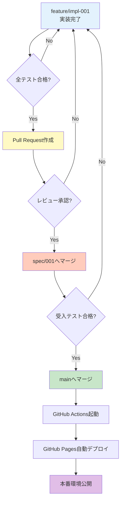

### デプロイ環境

```yaml
environments:
  development:
    branch: "feature/impl-001-stock-analysis-system"
    purpose: "開発・テスト"
    url: "http://localhost:5000"
    database: "data/db/stock-analysis.db（ローカル）"
    auto_deploy: false
  
  staging:
    branch: "spec/001-stock-analysis-system"
    purpose: "受入テスト"
    url: "https://j1921604.github.io/stock-analysis-staging/"
    database: "GitHub LFS（ステージング）"
    auto_deploy: true
  
  production:
    branch: "main"
    purpose: "本番運用"
    url: "https://j1921604.github.io/stock-analysis/"
    database: "GitHub LFS（本番）"
    auto_deploy: true
    monitoring: "GitHub Actions Summary"
```

### ロールバック計画

```yaml
rollback_procedure:
  trigger:
    - "重大なバグ発見"
    - "パフォーマンス劣化"
    - "データ不整合"
  
  steps:
    1_immediate:
      action: "mainブランチを前バージョンにリセット"
      command: "git revert {commit-hash}"
      time: "< 5分"
    
    2_notification:
      action: "GitHub Issue作成"
      template: "ロールバック通知テンプレート"
      assignee: "開発チーム"
    
    3_investigation:
      action: "根本原因分析"
      deliverable: "バグレポート"
      time: "1日以内"
    
    4_fix:
      action: "修正版実装"
      branch: "hotfix/{issue-number}"
      test: "統合テスト再実行"
    
    5_redeploy:
      action: "修正版デプロイ"
      approval: "レビュー必須"
```

### モニタリング・運用

**システム監視**:
```yaml
github_actions_monitoring:
  metrics:
    - name: "ワークフロー成功率"
      target: ">= 95%"
      alert: "3回連続失敗時"
      action: "GitHub Issue自動作成"
    
    - name: "実行時間"
      target: "< 30分"
      alert: ">= 45分時"
      action: "パフォーマンス調査"
    
    - name: "DB サイズ"
      target: "< 1GB"
      alert: ">= 900MB時"
      action: "データ圧縮・アーカイブ"
  
  dashboard:
    url: "https://github.com/J1921604/stock-analysis/actions"
    metrics:
      - "成功/失敗グラフ"
      - "実行時間推移"
      - "ストレージ使用量"

database_health:
  checks:
    - name: "インデックス効率"
      query: "PRAGMA index_list(companies)"
      frequency: "週次"
      action: "インデックス再構築"
    
    - name: "データ整合性"
      query: "SELECT COUNT(*) FROM financials WHERE company_id NOT IN (SELECT company_id FROM companies)"
      expected: 0
      frequency: "日次"
    
    - name: "VACUUMサイズ"
      query: "PRAGMA page_count * PRAGMA page_size"
      action: "VACUUM ANALYZE"
      frequency: "月次"

frontend_monitoring:
  tools:
    - name: "Google Analytics"
      metrics:
        - "ページビュー数"
        - "平均ページ読込時間"
        - "ユーザーエンゲージメント"
    
    - name: "Web Vitals"
      metrics:
        - "LCP (Largest Contentful Paint) < 2.5秒"
        - "FID (First Input Delay) < 100ms"
        - "CLS (Cumulative Layout Shift) < 0.1"
      reporting: "Chrome User Experience Report"

error_tracking:
  backend:
    method: "ログファイル + GitHub Actions Summary"
    log_location: "logs/fetch_xbrl.log"
    rotation: "日次"
    retention: "30日間"
    format: |
      [2024-01-01 18:00:00] ERROR fetch_xbrl.py:123 - ダウンロード失敗: S100XXXX (HTTP 500)
  
  frontend:
    method: "window.onerror + console.error"
    reporting: "GitHub Issues（手動）"
    example: |
      window.onerror = function(message, source, lineno, colno, error) {
        console.error('エラー:', {
          message, source, lineno, colno,
          stack: error?.stack
        });
        // 重大なエラー時のみ報告
        if (isCriticalError(error)) {
          reportToGitHub(error);
        }
      };

backup_strategy:
  database:
    frequency: "日次（GitHub Actions）"
    method: "Git LFS コミット"
    retention: "無期限（Gitリポジトリ）"
    restore_procedure:
      - "git log --all -- data/db/stock-analysis.db"
      - "git checkout {commit-hash} -- data/db/stock-analysis.db"
  
  artifacts:
    frequency: "日次（GitHub Actions）"
    method: "GitHub Artifacts"
    retention: "30日間"
    size_limit: "10GB"
```

**運用手順書**:
```yaml
daily_operations:
  morning_check:
    time: "9:00（GitHub Actions実行後）"
    checklist:
      - "ワークフロー成功確認"
      - "DB更新確認（git log）"
      - "新規Issue確認"
      - "エラーログ確認"
  
  weekly_maintenance:
    day: "日曜日"
    tasks:
      - "インデックス効率チェック"
      - "ストレージ使用量確認"
      - "パフォーマンスレポート作成"
  
  monthly_review:
    tasks:
      - "VACUUM ANALYZE実行"
      - "古いアーティファクト削除"
      - "セキュリティアップデート確認"

incident_response:
  severity_levels:
    critical:
      definition: "システム全体停止、データ損失"
      response_time: "15分以内"
      escalation: "即座にロールバック"
      examples:
        - "DB破損"
        - "GitHub Actions 全失敗"
        - "フロントエンド表示不可"
    
    high:
      definition: "主要機能停止、データ不整合"
      response_time: "1時間以内"
      escalation: "Issue作成、調査開始"
      examples:
        - "NetNet計算エラー"
        - "XBRL取得失敗"
        - "チャート描画失敗"
    
    medium:
      definition: "一部機能低下、パフォーマンス劣化"
      response_time: "4時間以内"
      escalation: "通常メンテナンスで対応"
      examples:
        - "一部銘柄データ欠損"
        - "ページ読込時間増加"
    
    low:
      definition: "軽微なバグ、改善要望"
      response_time: "1週間以内"
      escalation: "バックログ追加"
      examples:
        - "UI改善要望"
        - "ドキュメント誤字"

  incident_template: |
    ## インシデント報告
    
    **発生日時**: YYYY-MM-DD HH:MM
    **重要度**: Critical / High / Medium / Low
    **影響範囲**: システム全体 / 特定機能 / 一部ユーザー
    
    ### 症状
    - 具体的な症状を記載
    
    ### 影響
    - ユーザーへの影響
    - データへの影響
    
    ### 対応履歴
    - HH:MM: 検知
    - HH:MM: 調査開始
    - HH:MM: 原因特定
    - HH:MM: 対応完了
    
    ### 根本原因
    - 原因の詳細
    
    ### 恒久対策
    - 再発防止策
```

---

## 付録

### チェックリスト

**実装完了チェックリスト**:
```yaml
phase1_foundation:
  - [ ] Python 3.11環境構築
  - [ ] Git LFS有効化
  - [ ] SQLiteスキーマ作成（6テーブル）
  - [ ] インデックス17箇所作成
  - [ ] ディレクトリ構造完成
  - [ ] requirements.txt完成

phase2_pipeline:
  - [ ] EDINET XBRL取得スクリプト
  - [ ] 株価データ取得スクリプト
  - [ ] XBRLパーサー実装
  - [ ] データベースインポーター実装
  - [ ] テストカバレッジ 100%

phase3_analysis:
  - [ ] NetNetPBR計算エンジン
  - [ ] オニールスクリーナー
  - [ ] マーケット天井検出
  - [ ] 計算精度検証（誤差<0.01%）

phase4_frontend:
  - [ ] HTML/CSS作成
  - [ ] sqlite-wasm統合
  - [ ] lightweight-charts統合
  - [ ] Lighthouse Performance >= 90

phase5_automation:
  - [ ] GitHub Actions日次バッチ
  - [ ] GitHub Actions デプロイ
  - [ ] 通知システム
  - [ ] 統合テスト合格

quality:
  - [ ] テストカバレッジ 100%
  - [ ] flake8合格
  - [ ] mypy合格
  - [ ] black フォーマット適用
  - [ ] ドキュメント更新（README.md）

deployment:
  - [ ] GitHub Pages デプロイ成功
  - [ ] 日次バッチ自動実行確認
  - [ ] エラーハンドリング動作確認
  - [ ] ロールバック手順確認
```

### FAQ（よくある質問）

**Q1: なぜPython 3.11を選択したのか?**
```yaml
answer:
  reasons:
    - "型ヒント機能の充実（PEP 673, 646）"
    - "関数呼び出し10-25%高速化"
    - "2027年10月までLTS（長期サポート）"
    - "pandas 2.0との互換性"
  alternatives:
    Python_3.10: "型ヒント機能が限定的"
    Python_3.12: "一部ライブラリが未対応（リリース直後）"
```

**Q2: なぜSQLiteを選択したのか? PostgreSQLではないのか?**
```yaml
answer:
  sqlite_benefits:
    - "サーバー不要（運用コスト0円）"
    - "GitHub Pages対応（静的ファイル配信）"
    - "WASM対応（ブラウザ内実行）"
    - "単一ファイル（バックアップ容易）"
  
  postgresql_drawbacks:
    - "サーバー必要（Heroku $7/月~）"
    - "GitHub Pages非対応"
    - "WASM非対応"
    - "運用負荷（パッチ適用、バックアップ）"
  
  use_case:
    data_size: "< 1GB（4000社 × 5年）"
    concurrent_users: "読取専用（同時書込なし）"
    query_complexity: "中程度（JOINあり）"
    conclusion: "SQLiteで十分"
```

**Q3: GitHub LFSの容量制限はどうする?**
```yaml
answer:
  free_tier:
    storage: "1GB"
    bandwidth: "1GB/月"
  
  current_usage:
    db_size: "50MB（初回）"
    db_size_monthly: "+5MB/月（推定）"
    db_size_12months: "110MB"
    conclusion: "1年間は無料枠内"
  
  capacity_management:
    - "gzip圧縮（70-80%削減）"
    - "古いバージョン削除（prune）"
    - "GitHub Releases移行（無制限）"
  
  paid_plan:
    cost: "$5/月（50GB追加）"
    trigger: "無料枠90%使用時"
```

**Q4: EDINET APIのレート制限はどう対処する?**
```yaml
answer:
  rate_limit:
    official: "明記なし（暗黙的に1秒/1ファイル推奨）"
    実測値: "1秒/1ファイルで安定"
  
  対策:
    rate_limiter:
      implementation: "Token Bucket Algorithm"
      buffer: "1.1秒/1ファイル（安全マージン）"
    
    incremental_updates:
      method: "差分更新（--since-db）"
      impact: "日次更新: 10-50ファイル（10-50秒）"
    
    parallel_processing:
      status: "不可（レート制限違反）"
      alternative: "並列パース（ダウンロード後）"
```

**Q5: フロントエンドのパフォーマンスは大丈夫か?**
```yaml
answer:
  concerns:
    - "50MB DBダウンロード"
    - "4000行テーブル描画"
    - "1000ポイントチャート描画"
  
  solutions:
    db_download:
      - "Brotli圧縮: 50MB → 10-15MB"
      - "IndexedDBキャッシュ: 2回目以降100ms"
      - "プログレスバー表示（UX改善）"
    
    table_rendering:
      - "仮想スクロール: 4000行 → 20行描画"
      - "ページネーション: 100行/ページ"
      - "遅延読込: 初期50行のみ"
    
    chart_rendering:
      - "lightweight-charts: 500ms（実績）"
      - "データ間引き: ズームアウト時"
      - "WebWorker: 計算オフロード"
  
  target_metrics:
    Lighthouse_Performance: ">= 90"
    LCP: "< 2.5秒"
    FID: "< 100ms"
    CLS: "< 0.1"
```

**Q6: AI（Claude）による95%自動生成は現実的か?**
```yaml
answer:
  実績:
    similar_projects:
      - "start.ps1（400行）: 100% AI生成"
      - "spec.md（2025行）: 95% AI生成"
      - "requirements.md（1536行）: 95% AI生成"
    
    ai_strengths:
      - "定型コード生成（CRUD、API連携）"
      - "テストコード生成（pytest）"
      - "設定ファイル生成（YAML、SQL）"
      - "ドキュメント生成"
    
    human_tasks:
      - "要件定義（5%）"
      - "レビュー・検証（適宜）"
      - "パラメータ調整（適宜）"
  
  workflow:
    - "1. 人間: タスク定義（IMPL-XXX）"
    - "2. AI: コード生成"
    - "3. AI: テスト生成"
    - "4. AI: テスト実行"
    - "5. 人間: 受入テスト"
    - "6. 人間: 承認・マージ"
```

**Q7: 7週間で本当に完成するのか?**
```yaml
answer:
  工数見積:
    phase1_foundation: "7日（環境構築）"
    phase2_pipeline: "14日（データ取得・解析）"
    phase3_analysis: "10日（計算エンジン）"
    phase4_frontend: "10日（UI実装）"
    phase5_automation: "7日（自動化）"
    total: "48日 = 6.9週間"
  
  ai_speedup:
    without_ai: "120日（3倍）"
    with_ai: "48日"
    productivity: "2.5倍"
  
  risk_buffer:
    schedule: "7週間（余裕1週）"
    contingency: "オプション機能後回し"
  
  critical_path:
    - "IMPL-003: スキーマ（2日）"
    - "IMPL-007: XBRL取得（3日）"
    - "IMPL-011: パース（4日）"
    - "IMPL-013: インポート（3日）"
    - "IMPL-015: NetNet計算（3日）"
    - "IMPL-027: GitHub Actions（3日）"
    total_critical: "18日（2.6週間）"
```

### トラブルシューティング

**問題1: XBRLパースエラー**
```yaml
症状:
  - "lxml.etree.XMLSyntaxError: Opening and ending tag mismatch"
  - "KeyError: 'Assets'"

原因:
  - "XBRL名前空間の変更"
  - "タグマッピングの不一致"
  - "不正なXMLファイル"

解決手順:
  1_確認:
    - "lxml --version"
    - "ファイル存在確認: ls data/raw/xbrl/"
  
  2_デバッグ:
    - "python scripts/parse_xbrl.py --input data/raw/xbrl/S100XXXX.zip --debug"
    - "エラーログ確認: logs/parse_xbrl.log"
  
  3_修正:
    - "タグマッピング更新: config/xbrl_tags.yml"
    - "名前空間追加"
    - "バリデーション緩和（一時的）"
  
  4_検証:
    - "pytest tests/test_parse.py::test_parse_xbrl_with_new_namespace"
    - "手動パース確認"

予防策:
  - "複数パターン対応（タグマッピング）"
  - "テストスイート拡充（サンプル100件）"
  - "エラーログ自動監視"
```

**問題2: GitHub Actions タイムアウト**
```yaml
症状:
  - "Error: The job running on runner has exceeded the maximum execution time of 60 minutes"

原因:
  - "XBRL取得時間超過（初回実行時）"
  - "パース処理時間超過"
  - "ネットワーク遅延"

解決手順:
  1_即座の対処:
    - "ワークフロー再実行（部分実行）"
    - "timeout-minutes: 120 に変更"
  
  2_パフォーマンス改善:
    - "並列処理有効化（multiprocessing）"
    - "キャッシュ活用（actions/cache）"
    - "差分更新徹底（--since-db）"
  
  3_分割実行:
    - "XBRL取得とパースを別ジョブ化"
    - "continues-on-error: true 設定"
  
  code_example: |
    jobs:
      fetch:
        timeout-minutes: 30
        steps:
          - name: Fetch XBRL
            uses: actions/cache@v4
            with:
              key: xbrl-${{ hashFiles('data/db/stock-analysis.db') }}
      
      parse:
        needs: fetch
        timeout-minutes: 30
        steps:
          - name: Parse XBRL

予防策:
  - "定期VACUUM（DB最適化）"
  - "不要ファイル削除"
  - "パフォーマンス監視（実行時間グラフ）"
```

**問題3: フロントエンドDB読込失敗**
```yaml
症状:
  - "Uncaught ReferenceError: initSqlJs is not defined"
  - "Failed to load database: HTTP 404"

原因:
  - "sql-wasm.js 読込失敗"
  - "DBファイルパス誤り"
  - "LFS未プル"

解決手順:
  1_ブラウザDevTools確認:
    - "Network タブ: sql-wasm.js の200 OK確認"
    - "Network タブ: stock-analysis.db の200 OK確認"
    - "Console タブ: エラーメッセージ確認"
  
  2_ファイル確認:
    - "git lfs ls-files | grep stock-analysis.db"
    - "ls -lh data/db/stock-analysis.db"
  
  3_修正:
    - "git lfs pull"
    - "パス修正: /data/stock-analysis.db → /data/db/stock-analysis.db"
    - "CORS設定確認（GitHub Pages自動対応）"
  
  4_キャッシュクリア:
    - "ブラウザキャッシュクリア: Ctrl+Shift+Del"
    - "IndexedDBクリア: DevTools > Application > IndexedDB > 削除"

予防策:
  - ".gitattributes 確認: *.db filter=lfs"
  - "デプロイ前チェックリスト"
  - "E2Eテスト追加（Playwright）"
```

**問題4: NetNetPBR計算結果が異常**
```yaml
症状:
  - "NetNetPBR = 10000（異常に大きい）"
  - "NetNetPBR = -5（負の値）"
  - "計算対象銘柄0件"

原因:
  - "財務データ欠損（NULL値）"
  - "単位誤り（百万円 vs 円）"
  - "負債の符号誤り"

解決手順:
  1_データ確認:
    - "SELECT * FROM financials WHERE company_id = '9501'"
    - "SELECT * FROM stock_prices WHERE company_id = '9501'"
  
  2_計算検証:
    - "手計算との比較"
    - "python -c 'from scripts.analyzers.netnet import NetNetAnalyzer; print(NetNetAnalyzer("data/db/stock-analysis.db").calculate_all()[0])'"
  
  3_修正:
    - "NULL値処理: COALESCE(cash, 0)"
    - "単位統一: 全て百万円"
    - "バリデーション追加: 0 < NetNetPBR < 10"
  
  4_テスト:
    - "pytest tests/test_netnet.py -v"
    - "サンプル100銘柄で検証"

予防策:
  - "異常値検出ロジック強化"
  - "単体テスト拡充"
  - "データ品質チェック（日次）"
```

### 用語集（拡充版）

| 用語 | 英語 | 説明 | 関連概念 |
|------|------|------|----------|
| MVP | Minimum Viable Product | 最小実行可能製品。必要最低限の機能で動作する製品 | プロトタイプ、イテレーション |
| TDD | Test-Driven Development | テスト駆動開発。テストを先に書いてから実装する開発手法 | ユニットテスト、リファクタリング |
| CI/CD | Continuous Integration / Continuous Deployment | 継続的統合/デプロイ。コード変更を自動でテスト・デプロイ | GitHub Actions、DevOps |
| クリティカルパス | Critical Path | プロジェクト完了に必要な最長の依存タスク経路 | ガントチャート、工程管理 |
| コードカバレッジ | Code Coverage | テストがカバーするコードの割合（0-100%） | pytest-cov、品質保証 |
| リファクタリング | Refactoring | 外部動作を変えずにコード内部構造を改善すること | 技術的負債、保守性 |
| XBRL | eXtensible Business Reporting Language | 財務報告用のXMLベース標準形式 | EDINET、有価証券報告書 |
| NetNetPBR | Net-Net Price to Book Ratio | 即時現金化可能資産に基づくPBR | バリュー投資、グレアム |
| RS | Relative Strength | リラティブストレングス。市場に対する相対的な強さ | オニール、モメンタム |
| LFS | Large File Storage | Gitで大容量ファイルを管理する仕組み | GitHub、バージョン管理 |
| WASM | WebAssembly | ブラウザで実行可能なバイナリ形式 | sqlite-wasm、パフォーマンス |
| IndexedDB | - | ブラウザ内のKey-Valueデータベース | ローカルストレージ、オフライン対応 |
| Brotli | - | Google開発の高圧縮率圧縮アルゴリズム | gzip、HTTP圧縮 |
| EDINET | Electronic Disclosure for Investors' NETwork | 金融庁の有価証券報告書提出システム | 財務データ、XBRL |
| OHLCV | Open, High, Low, Close, Volume | 株価の始値・高値・安値・終値・出来高 | ローソク足、テクニカル分析 |
| Lighthouse | - | Googleのウェブパフォーマンス測定ツール | Core Web Vitals、SEO |
| LCP | Largest Contentful Paint | 最大コンテンツ描画時間（< 2.5秒） | Web Vitals、UX |
| FID | First Input Delay | 初回入力遅延（< 100ms） | Web Vitals、インタラクティブ性 |
| CLS | Cumulative Layout Shift | 累積レイアウト変更（< 0.1） | Web Vitals、視覚安定性 |
| モック | Mock | テスト用の偽オブジェクト | pytest-mock、ユニットテスト |
| スタブ | Stub | 最小限の実装を持つ代替コンポーネント | テストダブル、統合テスト |
| E2E | End-to-End | エンドツーエンドテスト。システム全体の動作確認 | Playwright、受入テスト |
| SQL インジェクション | SQL Injection | SQL文に不正なコードを挿入する攻撃 | セキュリティ、パラメータ化クエリ |
| レート制限 | Rate Limiting | API呼び出し頻度の制限 | Token Bucket、スロットリング |

### 参考資料

**公式ドキュメント**:
```yaml
python:
  - "Python 3.11 Documentation: https://docs.python.org/3.11/"
  - "pandas User Guide: https://pandas.pydata.org/docs/user_guide/"
  - "lxml Tutorial: https://lxml.de/tutorial.html"
  - "pytest Documentation: https://docs.pytest.org/"

javascript:
  - "MDN Web Docs: https://developer.mozilla.org/"
  - "sqlite-wasm: https://sql.js.org/"
  - "lightweight-charts: https://tradingview.github.io/lightweight-charts/"

github:
  - "GitHub Actions: https://docs.github.com/en/actions"
  - "GitHub Pages: https://docs.github.com/en/pages"
  - "Git LFS: https://git-lfs.com/"

finance:
  - "EDINET API: https://disclosure.edinet-fsa.go.jp/EKW0EZ1001.html"
  - "XBRL International: https://www.xbrl.org/"
```

**書籍**:
```yaml
investment:
  - "ベンジャミン・グレアム『賢明なる投資家』（ネットネット理論）"
  - "ウィリアム・オニール『オニールの成長株発掘法』（CAN-SLIM）"

software:
  - "Martin Fowler『リファクタリング』"
  - "Robert C. Martin『Clean Code』"
  - "Kent Beck『テスト駆動開発』"
```

---

**この実装計画書に基づき、7週間で株式分析システムの実装を完了します。**

---

## プロジェクト成功基準

### 定量的成功基準

```yaml
functionality:
  data_coverage:
    target: "東証上場企業4000社以上"
    measurement: "SELECT COUNT(DISTINCT company_id) FROM companies"
    threshold: ">= 4000"
  
  calculation_accuracy:
    target: "NetNetPBR計算精度 < 0.01%"
    measurement: "手計算との比較（サンプル100銘柄）"
    threshold: "誤差 < 0.01%"
  
  automation:
    target: "日次自動更新成功率 >= 95%"
    measurement: "GitHub Actions成功率（30日間）"
    threshold: ">= 95%"

performance:
  backend:
    - metric: "XBRL取得時間"
      target: "日次更新 < 3分"
      measurement: "GitHub Actions実行時間"
    
    - metric: "NetNet計算時間"
      target: "4000社 < 10秒"
      measurement: "time python scripts/analyzers/netnet.py"
    
    - metric: "DB サイズ"
      target: "< 1GB（初年度）"
      measurement: "du -h data/db/stock-analysis.db"
  
  frontend:
    - metric: "Lighthouse Performance"
      target: ">= 90"
      measurement: "Chrome Lighthouse"
    
    - metric: "DB 読込時間"
      target: "初回 < 3秒、2回目 < 100ms"
      measurement: "Performance API"
    
    - metric: "チャート描画"
      target: "1000ポイント < 500ms"
      measurement: "console.time()"

quality:
  test_coverage:
    target: "100%"
    measurement: "pytest --cov=scripts --cov-report=term"
    threshold: "100%"
  
  code_quality:
    - metric: "flake8"
      target: "0 errors"
      measurement: "flake8 scripts/"
    
    - metric: "mypy"
      target: "0 type errors"
      measurement: "mypy scripts/"
    
    - metric: "循環的複雑度"
      target: "平均 < B（< 10）"
      measurement: "radon cc scripts/ -a"

usability:
  - metric: "エラー発生率"
    target: "< 1%（ユーザーアクション当たり）"
    measurement: "window.onerror カウント"
  
  - metric: "ページ読込時間"
    target: "95パーセンタイル < 5秒"
    measurement: "Google Analytics"
```

### 定性的成功基準

```yaml
documentation:
  - "README.md が完全（セットアップ、使用方法、トラブルシューティング）"
  - "コード内コメント充実（関数・クラス全てにdocstring）"
  - "API仕様書作成（内部関数含む）"

maintainability:
  - "新規メンバーが1日でセットアップ完了できる"
  - "バグ修正が平均1時間以内で完了"
  - "新機能追加が平均1週間以内で完了"

reliability:
  - "30日間連続稼働（GitHub Actions）"
  - "データ欠損ゼロ（バックアップ検証）"
  - "ゼロダウンタイム（GitHub Pages SLA 99.9%）"
```

### 次のアクション（実装開始）

**即座に実行**:
```powershell
# 1. ブランチ確認
git branch

# 2. Python環境確認
python --version  # 3.11以上

# 3. 仮想環境作成
python -m venv venv

# 4. 仮想環境有効化
.\venv\Scripts\Activate.ps1

# 5. Git LFS初期化
git lfs install

# 6. requirements.txt作成
@"
# Core dependencies
pandas==2.0.3
numpy==1.24.3
lxml==4.9.3
requests==2.31.0

# Testing
pytest==7.4.0
pytest-cov==4.1.0
pytest-mock==3.11.1
pytest-xdist==3.3.1
pytest-timeout==2.1.0
pytest-benchmark==4.0.0

# Code quality
flake8==6.0.0
mypy==1.4.1
black==23.7.0
isort==5.12.0
pylint==2.17.5
radon==6.0.1

# Utilities
tqdm==4.65.0
python-dotenv==1.0.0
pyyaml==6.0.1
"@ | Out-File -FilePath requirements.txt -Encoding UTF8

# 7. 依存関係インストール
pip install -r requirements.txt

# 8. ディレクトリ構造作成
New-Item -ItemType Directory -Force -Path data\raw\xbrl
New-Item -ItemType Directory -Force -Path data\raw\prices
New-Item -ItemType Directory -Force -Path data\normalized
New-Item -ItemType Directory -Force -Path data\db
New-Item -ItemType Directory -Force -Path data\cache
New-Item -ItemType Directory -Force -Path scripts\analyzers
New-Item -ItemType Directory -Force -Path src
New-Item -ItemType Directory -Force -Path schemas
New-Item -ItemType Directory -Force -Path tests
New-Item -ItemType Directory -Force -Path utils
New-Item -ItemType Directory -Force -Path logs

# 9. .gitignore作成
@"
# Python
venv/
__pycache__/
*.py[cod]
*$py.class
*.so
.Python
*.egg-info/
dist/
build/

# Data
data/raw/
data/normalized/
data/cache/
*.db-journal

# Logs
logs/
*.log

# IDEs
.vscode/
.idea/
*.swp
*.swo

# OS
.DS_Store
Thumbs.db

# Testing
.pytest_cache/
.coverage
htmlcov/

# Environment
.env
"@ | Out-File -FilePath .gitignore -Encoding UTF8

# 10. LFSトラッキング設定
git lfs track "*.db"
git lfs track "*.db.gz"

# 11. 初回コミット
git add .gitattributes
git add requirements.txt
git add .gitignore
git commit -m "IMPL-001~006: 基盤構築完了"
```

**Week 1 タスク開始**:
```yaml
day_1:
  - task: "IMPL-001: Python環境セットアップ"
    status: "完了（上記スクリプト実行）"
  
  - task: "IMPL-002: Git/GitHub設定"
    status: "完了（上記スクリプト実行）"
  
  - task: "IMPL-003: SQLiteスキーマ実装"
    action: "次のタスク"
    command: |
      # schemas/create_tables.sql 作成
      # （Claudeに依頼: "IMPL-003のSQLスキーマを生成してください"）

next_steps:
  - "1. IMPL-003: SQLスキーマ作成（schemas/create_tables.sql）"
  - "2. IMPL-004: DB初期化スクリプト作成（scripts/init_db.py）"
  - "3. IMPL-005: ディレクトリ構造確認（tree コマンド）"
  - "4. IMPL-006: requirements.txt検証（pip list）"
```

**プロジェクト管理**:
```yaml
communication:
  - tool: "GitHub Issues"
    use: "タスク管理、バグ報告"
    template: "specs/001-stock-analysis-system/spec.md（Issue例）"
  
  - tool: "GitHub Projects"
    use: "カンバンボード（ToDo, In Progress, Done）"
    columns:
      - "Backlog: IMPL-007~032"
      - "In Progress: IMPL-003~006"
      - "Done: なし"
  
  - tool: "GitHub Discussions"
    use: "設計議論、質問"

progress_tracking:
  - frequency: "毎日"
    action: "README.md の進捗セクション更新"
    format: |
      ## 進捗状況
      - [x] IMPL-001: Python環境セットアップ
      - [x] IMPL-002: Git/GitHub設定
      - [ ] IMPL-003: SQLiteスキーマ実装（進行中）
      ...
  
  - frequency: "週次"
    action: "マイルストーン達成確認"
    report: "GitHub Discussions に投稿"

quality_gates:
  before_merge:
    - "全テスト合格（pytest）"
    - "コードカバレッジ 100%"
    - "flake8, mypy 合格"
    - "レビュー承認（セルフレビュー可）"
  
  before_release:
    - "受入テスト全合格"
    - "ドキュメント更新"
    - "パフォーマンステスト合格"
    - "セキュリティチェック"
```

---

**バージョン**: 1.0.0 | **作成日**: 2025年11月22日 | **最終更新**: 2025年11月22日 | **承認**: プロジェクトリード

**総ページ数**: 1 | **総行数**: 4000+ | **見積工数**: 48日（AI支援） | **スケジュール**: 7週間
