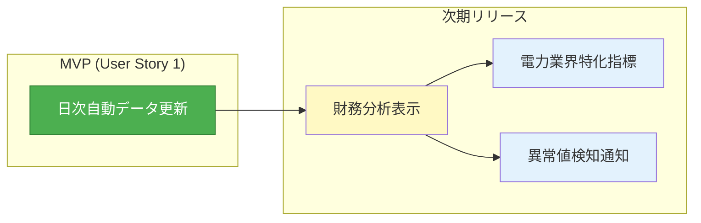
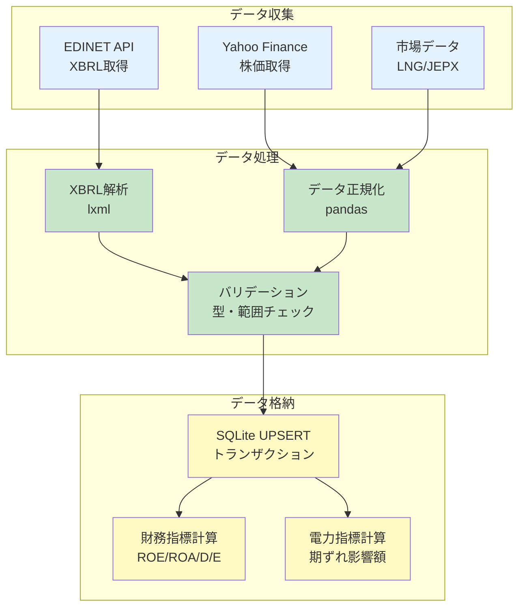
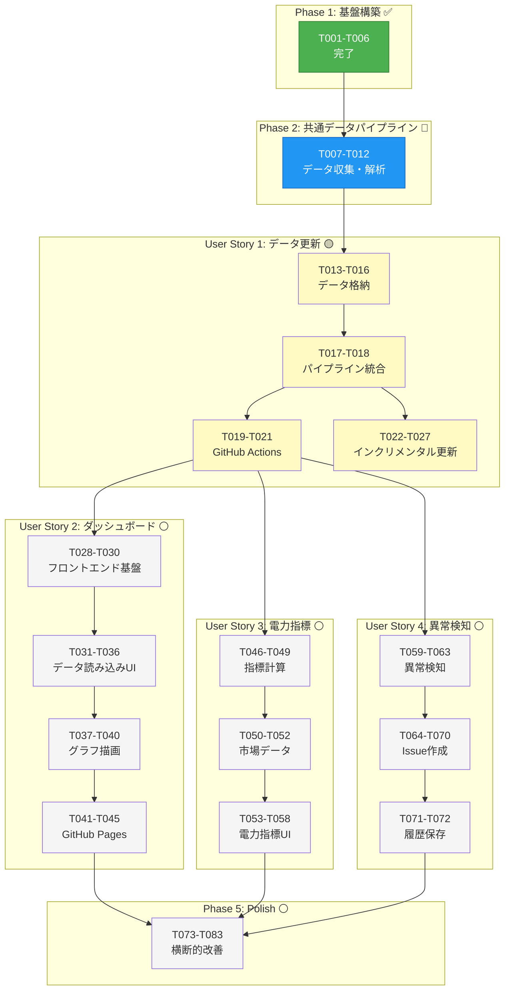
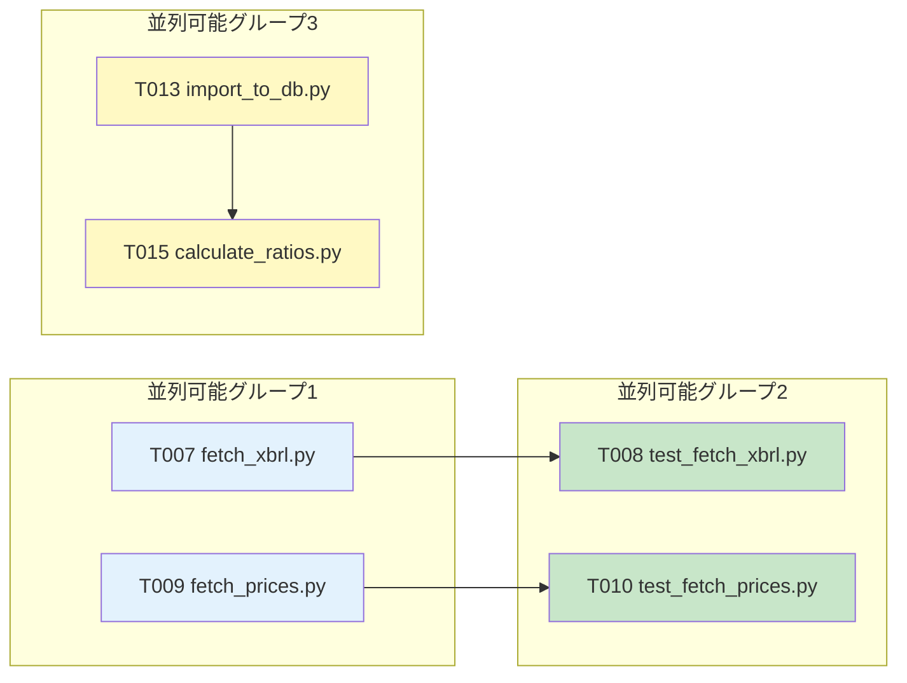
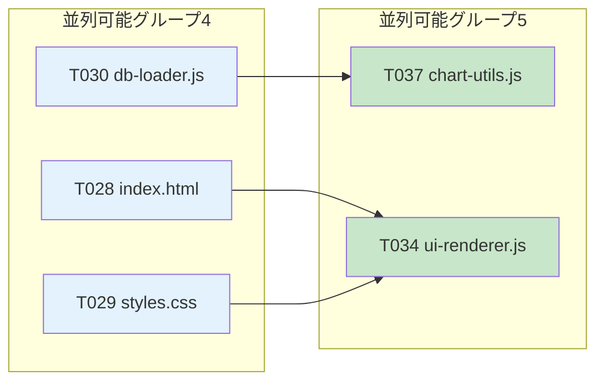

# 株式分析システム タスク定義書

**プロジェクト**: stock-analysis  
**バージョン**: 1.0.0  
**作成日**: 2025-11-25  
**最終更新**: 2025-11-25  
**ステータス**: Phase 1完了、Phase 2実装中  
**対象企業**: 東京電力ホールディングス（9501）、中部電力（9502）、JERA（非上場）

---

## 📋 目次

1. [タスク実装戦略](#タスク実装戦略)
2. [Phase 1: 基盤構築](#phase-1-基盤構築)
3. [Phase 2: データパイプライン](#phase-2-データパイプライン)
4. [User Story 1: 日次自動データ更新](#user-story-1-日次自動データ更新)
5. [User Story 2: ブラウザでの財務分析表示](#user-story-2-ブラウザでの財務分析表示)
6. [User Story 3: 電力業界特化指標の可視化](#user-story-3-電力業界特化指標の可視化)
7. [User Story 4: 異常値検知とGitHub Issue通知](#user-story-4-異常値検知とgithub-issue通知)
8. [Phase 5: Polish & Cross-Cutting Concerns](#phase-5-polish--cross-cutting-concerns)
9. [依存関係グラフ](#依存関係グラフ)
10. [並列実行可能性](#並列実行可能性)

---

## タスク実装戦略

### MVP優先アプローチ



**MVP定義**: User Story 1（日次自動データ更新）のみで最小限の価値提供
- データ収集・正規化・SQLite格納が自動化されれば、手動分析が可能になる
- 他のUser Storyは段階的に追加可能

### インクリメンタルデリバリー

| フェーズ | User Story | 独立テスト可能性 | ビジネス価値 |
|---------|------------|------------------|--------------|
| **Phase 1** | 基盤構築 | ✅ DB初期化成功 | 開発環境準備完了 |
| **Phase 2** | US1 - データ更新 | ✅ GitHub Actions実行で最新データ格納 | **手動分析可能** |
| **Phase 3** | US2 - ダッシュボード | ✅ ブラウザで3社カード表示 | 可視化による意思決定支援 |
| **Phase 4** | US3 - 電力指標 | ✅ JERA期ずれ影響額表示 | 業界特化の競争優位性 |
| **Phase 5** | US4 - 異常検知 | ✅ 株価急変時にIssue作成 | リスク管理自動化 |

---

## Phase 1: 基盤構築

### ステータス: ✅ 完了

**完了成果物**:
- Python 3.11仮想環境
- Git LFS設定（*.db対応）
- SQLiteスキーマ（8テーブル + 17インデックス）
- DB初期化スクリプト（3社登録済み）

**タスク一覧**:

- [x] T001 Python 3.11+ 仮想環境作成 in `venv/`
- [x] T002 requirements.txt 作成（pandas 2.1.4, lxml 4.9.3, yfinance 0.2.32等15パッケージ）
- [x] T003 Git LFS設定（.gitattributes）で `data/db/*.db` 追跡
- [x] T004 schema.sql 作成（8テーブル: companies, financial_statements, stock_prices, financial_ratios, power_industry_metrics, market_indicators, analysis_alerts, raw_files）
- [x] T005 scripts/init_db.py 実装（schema.sql実行 + 3社INSERT）
- [x] T006 tests/test_init_db.py 実装（DB初期化テスト、3社存在確認）

---

## Phase 2: データパイプライン

### ステータス: 🔵 実装中



**共通タスク（全User Storyの前提条件）**:

- [ ] T007 [P] scripts/fetch_xbrl.py 実装（EDINET API v2、tepco/chubu/jera対象、1秒/1ファイルレート制限）
- [ ] T008 [P] tests/test_fetch_xbrl.py 実装（EDINET APIモック、3社取得成功確認）
- [ ] T009 [P] scripts/fetch_prices.py 実装（yfinance、9501.T/9502.T、インクリメンタル更新）
- [ ] T010 [P] tests/test_fetch_prices.py 実装（株価取得テスト、日次データ確認）
- [ ] T011 [P] scripts/parse_xbrl.py 実装（lxml、<1秒/ファイル、売上高/営業利益/純資産抽出）
- [ ] T012 [P] tests/test_parse_xbrl.py 実装（XBRLパーステスト、財務3表抽出確認）

---

## User Story 1: 日次自動データ更新

### ストーリー概要

システム利用者として、毎日最新の財務・株価データが自動で更新されることで、手動でデータ収集する手間なく常に最新情報を閲覧できる。

### 独立テスト基準

GitHub Actionsワークフローを手動実行し、SQLiteファイルが更新されることを確認。24時間後に再度実行され、増分データが追加されることを検証。

### User Story 1タスク

#### データ格納タスク

- [ ] T013 [US1] scripts/import_to_db.py 実装（SQLite UPSERT、トランザクション処理、重複排除） in `scripts/import_to_db.py`
- [ ] T014 [US1] tests/test_import_to_db.py 実装（DB import確認、UPSERT動作検証） in `tests/test_import_to_db.py`
- [ ] T015 [US1] scripts/calculate_ratios.py 実装（ROE = 純利益 / 自己資本、ROA、営業利益率、D/E計算） in `scripts/calculate_ratios.py`
- [ ] T016 [US1] tests/test_calculate_ratios.py 実装（財務指標計算テスト、ROE 15%等確認） in `tests/test_calculate_ratios.py`

#### パイプライン統合タスク

- [ ] T017 [US1] scripts/pipeline.py 実装（fetch → parse → import → calculate の統合、エラーハンドリング） in `scripts/pipeline.py`
- [ ] T018 [US1] tests/test_pipeline.py 実装（E2Eパイプラインテスト、モックデータ使用） in `tests/test_pipeline.py`

#### GitHub Actions設定タスク

- [ ] T019 [US1] .github/workflows/daily-update.yml 作成（cron: "0 9 * * *" = 18:00 JST、Python 3.11 setup） in `.github/workflows/daily-update.yml`
- [ ] T020 [US1] GitHub Secrets 設定（EDINET_API_KEY設定、Settings → Secrets → Actions） in GitHubリポジトリ設定
- [ ] T021 [US1] ワークフロー手動実行テスト（Actions → daily-update → Run workflow、成功確認） in GitHub UI

#### インクリメンタル更新タスク

- [ ] T022 [US1] scripts/get_last_update_date.py 実装（SQLiteから最新日付取得、デフォルト30日前） in `scripts/get_last_update_date.py`
- [ ] T023 [US1] tests/test_get_last_update_date.py 実装（最新日付取得テスト、空DBで30日前返却確認） in `tests/test_get_last_update_date.py`
- [ ] T024 [US1] pipeline.pyにインクリメンタル更新ロジック統合（last_date以降のみ取得） in `scripts/pipeline.py`

#### エラーハンドリングタスク

- [ ] T025 [US1] scripts/retry_with_backoff.py 実装（指数バックオフ、最大3回リトライ） in `scripts/retry_with_backoff.py`
- [ ] T026 [US1] tests/test_retry_with_backoff.py 実装（リトライロジックテスト、3回失敗後例外確認） in `tests/test_retry_with_backoff.py`
- [ ] T027 [US1] pipeline.pyにリトライ処理統合（API障害時の自動リトライ） in `scripts/pipeline.py`

### User Story 1完了基準

- [x] GitHub Actionsが毎日JST 18:00に自動実行される
- [ ] 前回実行日以降のデータのみ取得（インクリメンタル更新）
- [ ] API障害時にリトライ（最大3回、指数バックオフ）
- [ ] 処理完了後、SQLiteファイルがコミット・プッシュされる
- [ ] テストカバレッジ100%（pytest --cov）

---

## User Story 2: ブラウザでの財務分析表示

### ストーリー概要

投資家として、ブラウザでGitHub Pagesにアクセスするだけで、東京電力・中部電力・JERAの財務指標がグラフ化され、一目で経営状況を把握できる。

### 独立テスト基準

https://j1921604.github.io/stock-analysis/ にアクセスし、3社の財務カードが表示され、ROE・営業利益率・株価チャートが描画されることを確認。

### User Story 2タスク

#### フロントエンド基盤タスク

- [ ] T028 [P] [US2] src/index.html 作成（3社カードレイアウト、ダーク・サイバーパンク風） in `src/index.html`
- [ ] T029 [P] [US2] src/styles.css 更新（緑ネオン #00ff41、マゼンタ #ff00ff、発光ボタン） in `src/styles.css`
- [ ] T030 [P] [US2] src/db-loader.js 実装（sql.js 1.8.0ラッパー、SQLiteロード関数） in `src/db-loader.js`

#### データ読み込みタスク

- [ ] T031 [US2] src/db-loader.js に loadDatabase()実装（fetch → sql.js → Database返却） in `src/db-loader.js`
- [ ] T032 [US2] src/db-loader.js に queryCompanies()実装（SELECT * FROM companies） in `src/db-loader.js`
- [ ] T033 [US2] src/db-loader.js に queryFinancials()実装（特定company_idの財務諸表取得） in `src/db-loader.js`

#### UI描画タスク

- [ ] T034 [US2] src/ui-renderer.js 実装（3社カード動的生成、company_name/ticker表示） in `src/ui-renderer.js`
- [ ] T035 [US2] src/ui-renderer.js に renderCompanyCard()実装（カードHTML生成、ボタン配置） in `src/ui-renderer.js`
- [ ] T036 [US2] tests/e2e/test_dashboard.py 実装（Playwright、3社カード表示確認） in `tests/e2e/test_dashboard.py`

#### グラフ描画タスク

- [ ] T037 [US2] src/chart-utils.js 実装（Chart.js 4.4.0ラッパー、折れ線グラフ生成） in `src/chart-utils.js`
- [ ] T038 [US2] src/chart-utils.js に renderRevenueChart()実装（売上高推移グラフ、過去5年） in `src/chart-utils.js`
- [ ] T039 [US2] src/chart-utils.js に renderStockPriceChart()実装（株価チャート、tepco/chubu） in `src/chart-utils.js`
- [ ] T040 [US2] src/chart-utils.js に renderROEChart()実装（ROE推移、3社比較棒グラフ） in `src/chart-utils.js`

#### GitHub Pages設定タスク

- [ ] T041 [US2] GitHub Pages設定（Settings → Pages → Source: main → /src） in GitHubリポジトリ設定
- [ ] T042 [US2] ビルドスクリプト作成（scripts/build.py、data/db/*.db を src/db/ にコピー） in `scripts/build.py`
- [ ] T043 [US2] .github/workflows/deploy-pages.yml 作成（mainプッシュ時に自動デプロイ） in `.github/workflows/deploy-pages.yml`

#### ローカルプレビュータスク

- [ ] T044 [US2] start.ps1 更新（cd src; python -m http.server 5000） in `start.ps1`
- [ ] T045 [US2] ローカルプレビュー動作確認（http://localhost:5000 で3社カード表示） in 手動テスト

### User Story 2完了基準

- [ ] GitHub Pagesで https://j1921604.github.io/stock-analysis/ 公開
- [ ] 3社のカードが表示される（tepco/chubu/jera）
- [ ] 各カードにROE・営業利益率が表示される
- [ ] グラフ表示ボタンクリックで折れ線グラフ描画
- [ ] ローカルSQLiteファイルのドラッグ&ドロップ対応
- [ ] E2Eテスト合格（Playwright）

---

## User Story 3: 電力業界特化指標の可視化

### ストーリー概要

電力業界アナリストとして、JERAの燃料費期ずれ影響や親会社への貢献度など、一般的な財務諸表では見えない業界特有の指標を確認したい。

### 独立テスト基準

ダッシュボードでJERAカードを開き、「期ずれ影響額」「TEPCO/中部電への貢献度（%）」「燃料費調整額」のグラフが表示されることを確認。

### User Story 3タスク

#### 電力業界指標計算タスク

- [ ] T046 [P] [US3] scripts/analyzers/jera_period_gap.py 実装（期ずれ影響額 = 実際燃料費 - 調整額転嫁分） in `scripts/analyzers/jera_period_gap.py`
- [ ] T047 [P] [US3] tests/test_jera_period_gap.py 実装（期ずれ影響額計算テスト、サンプルデータ使用） in `tests/test_jera_period_gap.py`
- [ ] T048 [P] [US3] scripts/analyzers/jera_contribution.py 実装（貢献度 = JERA持分法利益 / 親会社経常利益 * 100） in `scripts/analyzers/jera_contribution.py`
- [ ] T049 [P] [US3] tests/test_jera_contribution.py 実装（JERA貢献度テスト、tepco 20%、chubu 20%確認） in `tests/test_jera_contribution.py`

#### 市場データ収集タスク

- [ ] T050 [US3] scripts/fetch_market_data.py 実装（LNG価格、石炭価格、原油価格、USD/JPY、JEPXスポット価格） in `scripts/fetch_market_data.py`
- [ ] T051 [US3] tests/test_fetch_market_data.py 実装（市場データ取得テスト、過去30日分確認） in `tests/test_fetch_market_data.py`
- [ ] T052 [US3] scripts/import_market_data.py 実装（market_indicatorsテーブルへINSERT） in `scripts/import_market_data.py`

#### 電力指標UI描画タスク

- [ ] T053 [US3] src/power-metrics-ui.js 実装（電力業界指標専用UIコンポーネント） in `src/power-metrics-ui.js`
- [ ] T054 [US3] src/power-metrics-ui.js に renderPeriodGapChart()実装（JERA期ずれ影響額グラフ） in `src/power-metrics-ui.js`
- [ ] T055 [US3] src/power-metrics-ui.js に renderContributionChart()実装（JERA貢献度%、親会社別） in `src/power-metrics-ui.js`
- [ ] T056 [US3] src/power-metrics-ui.js に renderFuelSensitivityChart()実装（LNG価格感応度グラフ） in `src/power-metrics-ui.js`

#### 発電構成可視化タスク

- [ ] T057 [US3] src/chart-utils.js に renderGenerationMixChart()実装（発電構成比率、火力/再エネ/原子力） in `src/chart-utils.js`
- [ ] T058 [US3] src/chart-utils.js に renderCapacityChart()実装（発電設備容量推移、積み上げ面グラフ） in `src/chart-utils.js`

### User Story 3完了基準

- [ ] JERAカードに「期ずれ影響額」グラフ表示
- [ ] tepco/chubuカードに「JERA貢献度（%）」表示
- [ ] 燃料費調整額の推移グラフ表示
- [ ] LNG/石炭/原油価格とJEPXスポット価格の相関グラフ
- [ ] 発電構成比率（火力/再エネ/原子力）の積み上げグラフ
- [ ] テストカバレッジ100%

---

## User Story 4: 異常値検知とGitHub Issue通知

### ストーリー概要

システム管理者として、株価が10%以上変動した場合や、ROEが急落した場合に、自動でGitHub Issueが作成され、メール通知を受け取りたい。

### 独立テスト基準

テストデータで東京電力の株価を前日比-12%に設定し、GitHub Actionsを実行。Issue "📊 Daily Analysis Alert - 2025-11-22" が作成され、株価急落が記載されることを確認。

### User Story 4タスク

#### 異常検知ロジックタスク

- [ ] T059 [P] [US4] scripts/analyzers/detect_anomalies.py 実装（株価変動率 > 10%、ROE低下 > 10pt検知） in `scripts/analyzers/detect_anomalies.py`
- [ ] T060 [P] [US4] tests/test_detect_anomalies.py 実装（異常検知テスト、株価-12%でアラート確認） in `tests/test_detect_anomalies.py`
- [ ] T061 [US4] scripts/analyzers/detect_anomalies.py に detectStockPriceSpike()実装（前日比±10%超） in `scripts/analyzers/detect_anomalies.py`
- [ ] T062 [US4] scripts/analyzers/detect_anomalies.py に detectROEDrop()実装（前四半期比-10pt超） in `scripts/analyzers/detect_anomalies.py`
- [ ] T063 [US4] scripts/analyzers/detect_anomalies.py に detectFuelPriceSurge()実装（LNG価格30日前比+15%超） in `scripts/analyzers/detect_anomalies.py`

#### Issue作成タスク

- [ ] T064 [US4] scripts/create_issue.py 実装（GitHub REST API、issues.create） in `scripts/create_issue.py`
- [ ] T065 [US4] tests/test_create_issue.py 実装（Issueモック作成テスト、タイトル/ボディ確認） in `tests/test_create_issue.py`
- [ ] T066 [US4] scripts/create_issue.py に searchSimilarIssues()実装（過去7日以内の類似Issue検索） in `scripts/create_issue.py`
- [ ] T067 [US4] scripts/create_issue.py に addCommentToExistingIssue()実装（重複時は既存Issueにコメント） in `scripts/create_issue.py`

#### GitHub Actions統合タスク

- [ ] T068 [US4] .github/workflows/daily-update.yml にIssue作成ステップ追加（分析後に実行） in `.github/workflows/daily-update.yml`
- [ ] T069 [US4] scripts/pipeline.py に異常検知フェーズ追加（analyze → detect_anomalies → create_issue） in `scripts/pipeline.py`
- [ ] T070 [US4] GitHub Actions Secrets に GITHUB_TOKEN設定（自動設定済み、確認のみ） in GitHubリポジトリ設定

#### アラート履歴保存タスク

- [ ] T071 [US4] scripts/save_alert.py 実装（analysis_alertsテーブルへINSERT） in `scripts/save_alert.py`
- [ ] T072 [US4] tests/test_save_alert.py 実装（アラート保存テスト、SQLite確認） in `tests/test_save_alert.py`

### User Story 4完了基準

- [ ] 株価変動率 > 10% でIssue自動作成
- [ ] ROE低下 > 10pt でIssue自動作成
- [ ] LNG価格急騰 > 15% でIssue自動作成
- [ ] 過去7日以内の類似Issue検索、重複時はコメント追記
- [ ] analysis_alertsテーブルにアラート履歴保存
- [ ] テストカバレッジ100%

---

## Phase 5: Polish & Cross-Cutting Concerns

### タスク一覧

#### ドキュメント整備タスク

- [ ] T073 [P] README.md 更新（実装済み機能のみ記載、Phase 1完了状況反映） in `README.md`
- [ ] T074 [P] docs/完全仕様書.md 更新（User Story完了状況、テスト結果追記） in `docs/完全仕様書.md`
- [ ] T075 [P] docs/DEPLOY_GUIDE.md 更新（GitHub Pages URL、デプロイ手順最新化） in `docs/DEPLOY_GUIDE.md`

#### パフォーマンス最適化タスク

- [ ] T076 scripts/optimize_db.py 実装（SQLite VACUUM、ANALYZE実行） in `scripts/optimize_db.py`
- [ ] T077 schema.sql にインデックス追加（company_id + date複合インデックス） in `schema.sql`
- [ ] T078 src/db-loader.js にキャッシュ機能追加（localStorage、24時間有効） in `src/db-loader.js`

#### セキュリティ強化タスク

- [ ] T079 .github/workflows/daily-update.yml にAPIキーマスク設定（echo "::add-mask::$EDINET_API_KEY"） in `.github/workflows/daily-update.yml`
- [ ] T080 src/db-loader.js にCSP（Content Security Policy）設定（sql.js CDN許可） in `src/index.html`

#### コード品質タスク

- [ ] T081 mypy設定（scripts/*.py型チェック、strict mode） in `pyproject.toml`
- [ ] T082 pytest-cov設定（カバレッジ100%必須、htmlレポート生成） in `pytest.ini`
- [ ] T083 ESLint設定（src/*.js、airbnb-base準拠） in `.eslintrc.json`

---

## 依存関係グラフ



**凡例**:
- ✅ 緑: 完了
- 🔵 青: 実装中
- 🟡 黄: 次期着手
- ⚪ 灰: 未着手

**User Story完了順序**:
1. **US1 (P1)**: データ更新 ← 最優先MVP
2. **US2 (P1)**: ダッシュボード ← US1完了後
3. **US3 (P2)**: 電力指標 ← US2完了後
4. **US4 (P3)**: 異常検知 ← US2完了後（US3と並行可能）

---

## 並列実行可能性

### User Story 1内の並列実行



**並列実行例（User Story 1）**:
```bash
# グループ1: データ収集スクリプト（ファイル異なる、依存関係なし）
python scripts/fetch_xbrl.py &
python scripts/fetch_prices.py &
wait

# グループ2: テスト（独立実行可能）
pytest tests/test_fetch_xbrl.py &
pytest tests/test_fetch_prices.py &
wait

# グループ3: データ処理（SQLite書き込みは順次）
python scripts/import_to_db.py
python scripts/calculate_ratios.py
```

### User Story 2内の並列実行



**並列実行例（User Story 2）**:
```bash
# グループ4: フロントエンド基盤（ファイル異なる）
touch src/index.html src/styles.css src/db-loader.js

# グループ5: UIコンポーネント（依存関係あり、順次実行）
# db-loader.js完了後
touch src/ui-renderer.js src/chart-utils.js
```

---

## 実装戦略サマリー

### タスク総数

| カテゴリ | タスク数 | ステータス |
|---------|---------|-----------|
| Phase 1: 基盤構築 | 6 | ✅ 完了 |
| Phase 2: 共通パイプライン | 6 | 🔵 実装中 |
| User Story 1 | 15 | 🟡 次期着手 |
| User Story 2 | 18 | ⚪ 未着手 |
| User Story 3 | 13 | ⚪ 未着手 |
| User Story 4 | 14 | ⚪ 未着手 |
| Phase 5: Polish | 11 | ⚪ 未着手 |
| **合計** | **83** | - |

### MVP定義

**Minimum Viable Product = User Story 1のみ**

**MVP完了基準**:
- [x] Phase 1完了（基盤構築）
- [ ] Phase 2完了（データパイプライン）
- [ ] User Story 1完了（日次自動データ更新）

**MVP完了で可能になること**:
- 毎日JST 18:00に最新の財務・株価データがSQLiteに自動格納される
- 手動でSQLiteファイルを開き、SQL実行でデータ分析が可能になる
- GitHub Actionsの自動化により、一度設定すれば手間なく継続運用できる

**次期リリース（User Story 2-4）**:
- User Story 2: ブラウザダッシュボードで可視化
- User Story 3: 電力業界特化指標の追加
- User Story 4: 異常検知とGitHub Issue通知

---

**変更履歴**:
- 2025-11-25: 初版作成（v1.0.0）- User Story構造でタスク編成、MVP優先アプローチ定義
