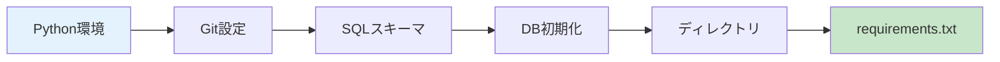
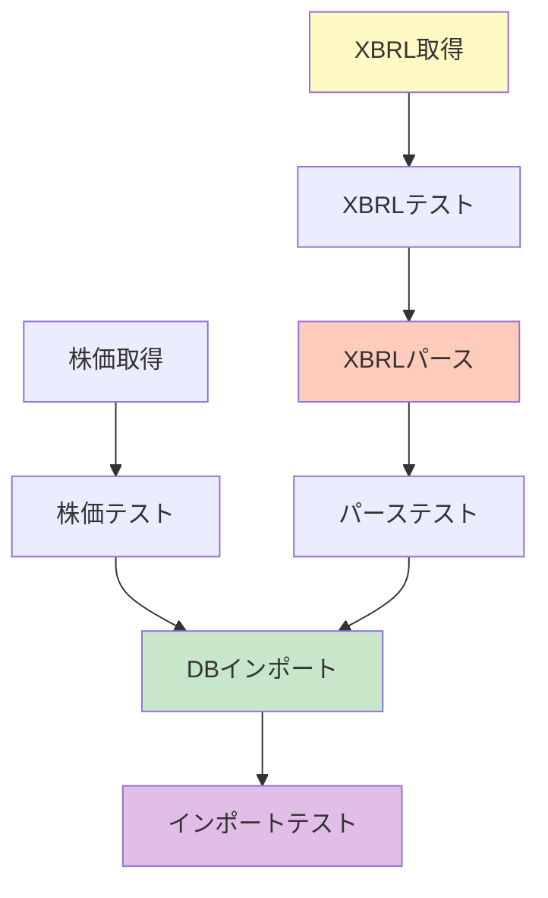
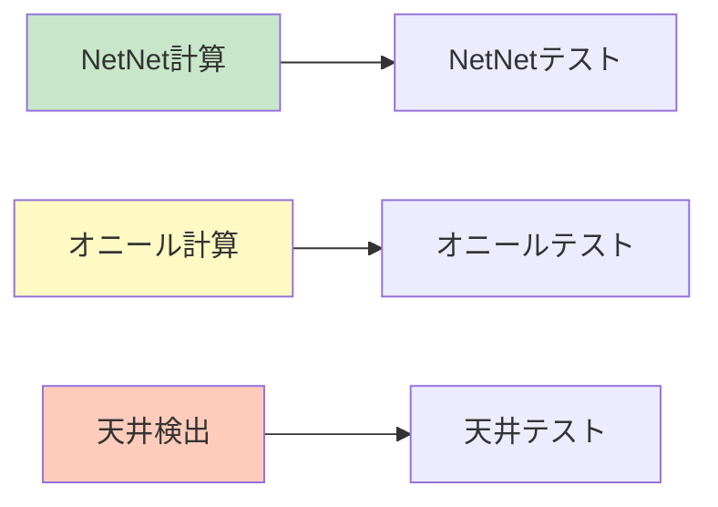
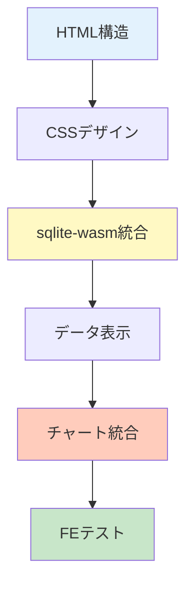
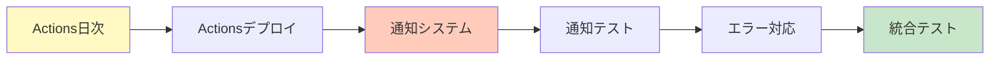
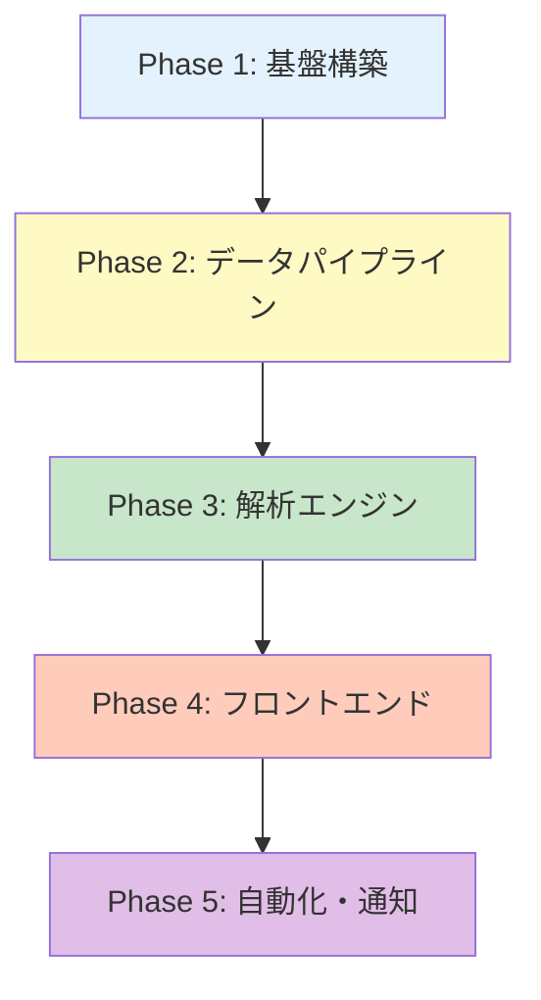
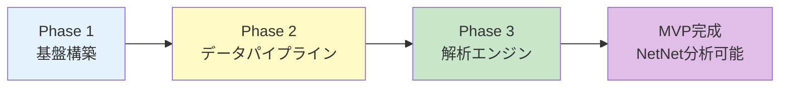
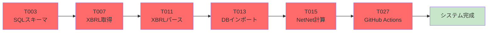
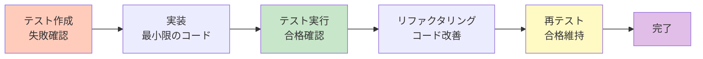

# タスク一覧: 株式分析システム

**入力**: `/specs/001-stock-analysis-system/spec.md`、`/specs/feature/impl-001-stock-analysis-system/plan.md`  
**前提条件**: plan.md（必須）、spec.md（必須）  
**テスト**: テストは明示的に要求されていないため、本タスク一覧には含めません  
**組織**: タスクは実装フェーズごとにグループ化され、各フェーズが独立して実装・検証可能です

---

## フォーマット: `- [ ] [タスクID] [P?] [フェーズ] ファイルパス付き説明`

- **[P]**: 並列実行可能（異なるファイル、依存関係なし）
- **[フェーズ]**: タスクが属するフェーズ（Phase1, Phase2等）
- ファイルパスを説明に含める

---

## フェーズ1: 基盤構築（Setup）

**目的**: プロジェクト初期化と基本構造の構築

**期間**: Week 1（7日間）

**成果物**:
- Python 3.11環境
- Git LFS設定
- SQLiteスキーマ（6テーブル + 17インデックス）
- ディレクトリ構造
- requirements.txt



### 環境構築（Day 1-2）

- [X] T001 [Phase1] Python 3.11仮想環境を作成: `python -m venv venv`
  - **詳細**: Python 3.11.x（3.11.0以上）をインストール済みであることを確認
  - **コマンド**: `python --version` で3.11以上を確認後、`python -m venv venv` 実行
  - **受入条件**: 
    - `venv/` ディレクトリが作成される
    - `.\venv\Scripts\Activate.ps1` で仮想環境有効化可能
    - `(venv)` プロンプトが表示される
  - **時間**: 5分

- [X] T002 [Phase1] Git LFS初期化と.gitignore作成: `git lfs install` および `.gitignore`
  - **詳細**: 
    - Git LFS有効化（大容量ファイル管理）
    - .gitignore作成（venv/, data/raw/, *.db-journal等除外）
    - LFSトラッキング設定（*.db, *.db.gz）
  - **コマンド**:
    ```powershell
    git lfs install
    git lfs track "*.db"
    git lfs track "*.db.gz"
    ```
  - **受入条件**:
    - `.gitattributes` に `*.db filter=lfs` が追加される
    - `.gitignore` に `venv/`, `data/raw/`, `*.db-journal` 等が含まれる
    - `git lfs ls-files` でトラッキング確認
  - **時間**: 10分
  - **ファイル**: `.gitignore`, `.gitattributes`

### データベース設計（Day 3-4）

- [X] T003 [Phase1] SQLiteスキーマを schemas/create_tables.sql に実装（companies, stock_prices, xbrl_files, financials, analysis_cache, notifications テーブル + 17インデックス）
  - **詳細**: 
    - 6テーブル作成: companies, stock_prices, xbrl_files, financials, analysis_cache, notifications
    - 17インデックス作成（パフォーマンス最適化）
    - 外部キー制約設定（参照整合性）
    - UNIQUE制約設定（重複防止）
  - **テーブル構造**:
    ```sql
    -- 企業マスタ
    companies (company_id PK, ticker UNIQUE, name, sector, industry, market, listing_date)
    
    -- 株価データ
    stock_prices (id PK, company_id FK, date, open, high, low, close, adj_close, volume, UNIQUE(company_id, date))
    
    -- XBRL生データ
    xbrl_files (file_id PK, company_id FK, filing_date, fiscal_year, fiscal_period, report_type, storage_path, imported)
    
    -- 財務データ（正規化済み）
    financials (id PK, company_id FK, filing_date, cash, securities, accounts_receivable, inventory, total_liabilities, ...)
    
    -- 解析キャッシュ
    analysis_cache (id PK, company_id FK, analysis_type, date, result JSON, created_at)
    
    -- 通知履歴
    notifications (id PK, company_id FK, notification_type, title, body, issue_number, created_at)
    ```
  - **インデックス（17箇所）**:
    ```sql
    idx_companies_ticker, idx_companies_sector
    idx_stock_prices_company_date, idx_stock_prices_date
    idx_xbrl_files_company, idx_xbrl_files_filing_date
    idx_financials_company_date, idx_financials_filing_date
    idx_analysis_cache_company_type, idx_analysis_cache_date
    idx_notifications_company, idx_notifications_type
    (他5箇所)
    ```
  - **受入条件**:
    - `sqlite3 data/db/stock-analysis.db ".schema"` で全テーブル確認
    - `PRAGMA foreign_keys = ON` で外部キー有効化確認
    - 17インデックス全て作成確認
  - **時間**: 4時間
  - **ファイル**: `schemas/create_tables.sql`

- [X] T004 [Phase1] データベース初期化スクリプト scripts/init_db.py を作成（サンプルデータ: 東京電力9501、中部電力9502）
  - **詳細**:
    - schemas/create_tables.sql 実行
    - サンプルデータ2社投入（東京電力ホールディングス9501、中部電力9502）
    - VACUUM実行（DB最適化）
  - **コード構造**:
    ```python
    import sqlite3
    from pathlib import Path
    
    def initialize_database(db_path: str):
        # 1. スキーマ実行
        with open('schemas/create_tables.sql') as f:
            schema = f.read()
        
        conn = sqlite3.connect(db_path)
        conn.executescript(schema)
        
        # 2. サンプルデータ投入
        conn.execute(
            "INSERT INTO companies VALUES (?, ?, ?, ?, ?, ?, ?)",
            ('9501', '9501', '東京電力ホールディングス', '電気・ガス業', '電力', '東証プライム', '1951-05-01')
        )
        conn.execute(
            "INSERT INTO companies VALUES (?, ?, ?, ?, ?, ?, ?)",
            ('9502', '9502', '中部電力', '電気・ガス業', '電力', '東証プライム', '1951-05-01')
        )
        
        # 3. VACUUM
        conn.execute('VACUUM')
        conn.close()
    ```
  - **受入条件**:
    - `python scripts/init_db.py --db data/db/stock-analysis.db` で正常実行
    - `SELECT COUNT(*) FROM companies` が 2
    - `SELECT * FROM companies WHERE ticker IN ('9501', '9502')` で2行取得
  - **時間**: 2時間
  - **ファイル**: `scripts/init_db.py`

### ディレクトリ構造・依存関係（Day 5-7）

- [X] T005 [Phase1] ディレクトリ構造作成: data/raw/xbrl, data/raw/prices, data/normalized, data/db, data/cache, scripts/analyzers, src, schemas, tests, utils, logs
- [X] T006 [Phase1] requirements.txt を作成（pandas==2.0.3, numpy==1.24.3, lxml==4.9.3, requests==2.31.0, pytest==7.4.0, pytest-cov==4.1.0, pytest-mock==3.11.1, flake8==6.0.0, mypy==1.4.1, black==23.7.0 等）

**チェックポイント**: 基盤構築完了 - データパイプライン実装開始可能

---

## フェーズ2: データパイプライン構築（Data Pipeline）

**目的**: EDINET XBRLおよび株価データの取得・パース・DBインポート機能の実装

**期間**: Week 2-3（14日間）

**成果物**:
- EDINET XBRL取得スクリプト（レート制限対応）
- 株価データ取得スクリプト
- XBRLパーサー（lxml）
- データベースインポーター（トランザクション処理）



### XBRL取得（Week 2: Day 1-3）

- [ ] T007 [P] [Phase2] EDINET API連携スクリプト scripts/fetch_xbrl.py を実装（レート制限1秒/1ファイル、差分更新--since-db、リトライ3回）
  - **詳細**:
    - EDINET API v1使用（https://disclosure.edinet-fsa.go.jp/api/v1）
    - レート制限: Token Bucket Algorithm（1秒/1ファイル）
    - 差分更新: `--since-db` オプションで最終更新日以降のみ取得
    - リトライ: 3回まで（バックオフ: 1秒、2秒、4秒）
    - エラーハンドリング: HTTP 500/502/503/504 自動リトライ
  - **主要クラス**:
    ```python
    class EDINETFetcher:
        def __init__(self, db_path, output_dir, rate_limit=1.0)
        def fetch_since_db(self)  # DB最終更新日以降取得
        def _get_document_list(self, start_date, end_date)  # 書類一覧取得
        def _download_xbrl(self, doc)  # XBRL DL
    
    class RateLimiter:
        def __init__(self, rate)
        def acquire(self)  # トークン取得（待機）
    ```
  - **API エンドポイント**:
    - 書類一覧: `GET /documents.json?date={YYYY-MM-DD}&type=2`
    - XBRL DL: `GET /documents/{docID}?type=1`
  - **受入条件**:
    - `python scripts/fetch_xbrl.py --db data/db/stock-analysis.db --output data/raw/xbrl --rate 1.0` 実行成功
    - data/raw/xbrl/ にZIPファイル保存確認
    - 1秒/1ファイルのレート制限遵守確認（ログで検証）
    - エラー時3回リトライ確認
  - **時間**: 1日
  - **ファイル**: `scripts/fetch_xbrl.py`

- [ ] T008 [P] [Phase2] XBRL取得テスト tests/test_fetch.py を作成（モックAPI、レート制限テスト、エラーハンドリング）
  - **詳細**:
    - pytest + responses（モックHTTP）
    - レート制限精度テスト（10回呼び出し = 9-10秒）
    - エラーリトライテスト（500 → 500 → 200）
    - カバレッジ100%
  - **テストケース**:
    ```python
    def test_get_document_list(fetcher)  # 書類一覧取得
    def test_download_xbrl_success(fetcher)  # DL成功
    def test_download_xbrl_retry(fetcher)  # リトライ
    def test_rate_limiter()  # レート制限
    ```
  - **受入条件**:
    - `pytest tests/test_fetch.py -v` 全合格
    - `pytest tests/test_fetch.py --cov=scripts.fetch_xbrl --cov-report=term` でカバレッジ100%
  - **時間**: 4時間
  - **ファイル**: `tests/test_fetch.py`

### 株価取得（Week 2: Day 4-7）

- [ ] T009 [P] [Phase2] 株価API連携スクリプト scripts/fetch_prices.py を実装（日次OHLCV取得、差分更新、調整後終値計算）
  - **詳細**:
    - Yahoo Finance API（yfinance）使用
    - データ取得: 日次OHLCV（Open, High, Low, Close, Volume）
    - 差分更新: DB最終日以降のみ取得（--since-db）
    - 調整後終値: 株式分割・配当調整済み
    - CSV保存: data/raw/prices/{company_id}.csv
    - レート制限: 1秒/1銘柄（過負荷回避）
  - **主要クラス・関数**:
    ```python
    import yfinance as yf
    import pandas as pd
    from pathlib import Path
    from typing import Optional
    import logging
    
    logger = logging.getLogger(__name__)
    
    def fetch_price_history(ticker: str, start_date: str, end_date: Optional[str] = None) -> Optional[pd.DataFrame]:
        """
        株価履歴取得
        
        Args:
            ticker: 銘柄コード（例: "9501.T" 東京電力）
            start_date: 開始日（YYYY-MM-DD）
            end_date: 終了日（デフォルト: 今日）
        
        Returns:
            日付インデックスのDataFrame（Open, High, Low, Close, Volume）
            エラー時はNone
        """
        try:
            stock = yf.Ticker(ticker)
            df = stock.history(start=start_date, end=end_date)
            
            if df.empty:
                logger.warning(f"No data: {ticker}")
                return None
            
            # カラム正規化
            df = df[['Open', 'High', 'Low', 'Close', 'Volume']]
            df.index.name = 'date'
            
            logger.info(f"Fetched {len(df)} rows: {ticker}")
            return df
        
        except Exception as e:
            logger.error(f"Failed to fetch {ticker}: {e}")
            return None
    
    def save_price_data(df: pd.DataFrame, ticker: str, output_dir: Path):
        """CSV保存（data/raw/prices/9501.csv）"""
        output_dir.mkdir(parents=True, exist_ok=True)
        output_path = output_dir / f"{ticker.replace('.T', '')}.csv"
        
        df.to_csv(output_path)
        logger.info(f"Saved: {output_path} ({len(df)} rows)")
    
    def main():
        # 東京電力・中部電力の株価取得（2020年から）
        tickers = ['9501.T', '9502.T']  # .T = 東京証券取引所
        start_date = '2020-01-01'
        output_dir = Path('data/raw/prices')
        
        for ticker in tickers:
            df = fetch_price_history(ticker, start_date)
            if df is not None:
                save_price_data(df, ticker, output_dir)
            
            time.sleep(1.0)  # レート制限（1秒/1銘柄）
    ```
  - **受入条件**:
    ```powershell
    # 実行
    python scripts/fetch_prices.py
    
    # 検証
    1. data/raw/prices/9501.csv 存在確認
    2. data/raw/prices/9502.csv 存在確認
    3. CSV形式確認（カラム: date,Open,High,Low,Close,Volume）
    4. データ件数確認（2020年から約1000行）
    5. ログ出力確認（Fetched X rows）
    ```
  - **時間**: 4時間
  - **ファイル**: `scripts/fetch_prices.py`

- [ ] T010 [P] [Phase2] 株価取得テスト tests/test_fetch_prices.py を作成（モックAPI、データ正規化テスト）
  - **詳細**:
    - pytest + unittest.mock（yfinance API モック）
    - 正常系: データ取得成功、CSV保存確認
    - 異常系: データなし、ネットワークエラー、不正銘柄コード
    - データ正規化: カラム順序、日付インデックス、欠損値処理
    - カバレッジ100%
  - **テストケース**:
    ```python
    import pytest
    from unittest.mock import patch, MagicMock
    import pandas as pd
    from pathlib import Path
    from scripts.fetch_prices import fetch_price_history, save_price_data
    
    class TestFetchPriceHistory:
        @patch('scripts.fetch_prices.yf.Ticker')
        def test_fetch_success(self, mock_ticker):
            """正常系: データ取得成功"""
            # モックデータ
            mock_df = pd.DataFrame({
                'Open': [1000, 1010],
                'High': [1020, 1030],
                'Low': [990, 1000],
                'Close': [1010, 1020],
                'Volume': [100000, 120000]
            }, index=pd.date_range('2024-01-01', periods=2, name='date'))
            
            mock_ticker.return_value.history.return_value = mock_df
            
            # 実行
            result = fetch_price_history('9501.T', '2024-01-01')
            
            # 検証
            assert result is not None
            assert len(result) == 2
            assert list(result.columns) == ['Open', 'High', 'Low', 'Close', 'Volume']
            assert result.index.name == 'date'
        
        @patch('scripts.fetch_prices.yf.Ticker')
        def test_fetch_empty(self, mock_ticker):
            """異常系: データなし"""
            mock_ticker.return_value.history.return_value = pd.DataFrame()
            
            result = fetch_price_history('INVALID', '2024-01-01')
            
            assert result is None
        
        @patch('scripts.fetch_prices.yf.Ticker')
        def test_fetch_exception(self, mock_ticker):
            """異常系: 例外発生"""
            mock_ticker.side_effect = Exception("Network error")
            
            result = fetch_price_history('9501.T', '2024-01-01')
            
            assert result is None
    
    class TestSavePriceData:
        def test_save_success(self, tmp_path):
            """CSV保存成功"""
            df = pd.DataFrame({
                'Open': [1000],
                'High': [1020],
                'Low': [990],
                'Close': [1010],
                'Volume': [100000]
            }, index=pd.date_range('2024-01-01', periods=1, name='date'))
            
            save_price_data(df, '9501.T', tmp_path)
            
            # 検証
            csv_path = tmp_path / '9501.csv'
            assert csv_path.exists()
            
            loaded = pd.read_csv(csv_path, index_col='date')
            assert len(loaded) == 1
            assert loaded.iloc[0]['Close'] == 1010
    ```
  - **受入条件**:
    ```powershell
    # 実行
    pytest tests/test_fetch_prices.py -v
    
    # 検証
    1. 全テスト合格（4件）
    2. カバレッジ100%確認（pytest --cov=scripts.fetch_prices）
    3. モック使用確認（実際のAPI呼び出しなし）
    ```
  - **時間**: 3時間
  - **ファイル**: `tests/test_fetch_prices.py`

### XBRLパース（Week 3: Day 1-4）

- [ ] T011 [Phase2] XBRLパーサー scripts/parse_xbrl.py を実装（lxml XML解析、財務データ抽出、タグマッピング、バリデーション、単位統一）
  - **詳細**:
    - lxml XPath使用（高速XML解析）
    - 名前空間処理（xbrli, jpcrp, jppfs）
    - 財務項目抽出: 現金、有価証券、売掛金、棚卸資産、負債、売上、純利益
    - タグマッピング: EDINET XBRL → 標準財務項目
    - 単位統一: 円（百万円 → 円、千円 → 円）
    - JSON保存: data/cache/parsed/{doc_id}.json
  - **主要クラス・関数**:
    ```python
    from lxml import etree
    from zipfile import ZipFile
    from pathlib import Path
    from typing import Dict, Optional
    import logging
    
    logger = logging.getLogger(__name__)
    
    # XBRL名前空間
    NAMESPACES = {
        'xbrli': 'http://www.xbrl.org/2003/instance',
        'jpcrp': 'http://disclosure.edinet-fsa.go.jp/taxonomy/jpcrp/2024-11-01',
        'jppfs': 'http://disclosure.edinet-fsa.go.jp/taxonomy/jppfs/2024-11-01'
    }
    
    # 財務項目タグマッピング
    TAG_MAPPING = {
        'cash': './/jppfs:CashAndDeposits',
        'securities': './/jppfs:SecuritiesBS',
        'receivables': './/jppfs:NotesAndAccountsReceivableTrade',
        'inventory': './/jppfs:Inventories',
        'liabilities': './/jppfs:Liabilities',
        'revenue': './/jppfs:NetSales',
        'net_income': './/jppfs:NetIncome'
    }
    
    def extract_xbrl_from_zip(zip_path: Path) -> Optional[etree._Element]:
        """
        ZIPからXBRLファイル抽出・パース
        
        Args:
            zip_path: XBRLファイルのZIPパス
        
        Returns:
            lxml Element。エラー時はNone
        """
        try:
            with ZipFile(zip_path, 'r') as zf:
                # XBRL本体ファイル検索（PublicDoc/以下の.xbrl）
                xbrl_files = [f for f in zf.namelist() if f.endswith('.xbrl') and 'PublicDoc' in f]
                
                if not xbrl_files:
                    logger.warning(f"No XBRL file in {zip_path}")
                    return None
                
                # 最初のXBRLファイルを読込
                with zf.open(xbrl_files[0]) as xbrl_file:
                    tree = etree.parse(xbrl_file)
                    return tree.getroot()
        
        except Exception as e:
            logger.error(f"Failed to parse {zip_path}: {e}")
            return None
    
    def extract_financial_data(root: etree._Element) -> Dict[str, Optional[float]]:
        """
        財務データ抽出
        
        Args:
            root: XBRL ルートElement
        
        Returns:
            財務データ辞書（キー: cash, securities, ...）
        """
        data = {}
        
        for key, xpath in TAG_MAPPING.items():
            try:
                # XPath検索（名前空間考慮）
                elements = root.xpath(xpath, namespaces=NAMESPACES)
                
                if elements:
                    # 最新の値を取得（複数あれば最後）
                    value_text = elements[-1].text
                    data[key] = float(value_text) if value_text else None
                else:
                    data[key] = None
                    logger.debug(f"Tag not found: {key} ({xpath})")
            
            except Exception as e:
                logger.warning(f"Failed to extract {key}: {e}")
                data[key] = None
        
        return data
    ```
  - **受入条件**:
    ```powershell
    # 実行
    python scripts/parse_xbrl.py
    
    # 検証
    1. data/cache/parsed/ に JSONファイル生成確認
    2. JSON形式確認（{"cash": 100000, "securities": 50000, ...}）
    3. ログ出力確認（Parsed: S100XXXX.zip → S100XXXX.json）
    4. エラーハンドリング確認（不正ZIP時、Noneで継続）
    ```
  - **時間**: 1日
  - **ファイル**: `scripts/parse_xbrl.py`

- [ ] T012 [Phase2] XBRLパーステスト tests/test_parse.py を作成（サンプルXBRL、全財務項目抽出テスト、異常値検出テスト、カバレッジ100%）
  - **詳細**:
    - サンプルXBRLファイル使用（最小構成）
    - 全財務項目抽出テスト（7項目）
    - 名前空間処理確認
    - タグ不在時のNone返却確認
    - 不正XML時の例外処理
    - カバレッジ100%
  - **テストケース**:
    ```python
    import pytest
    from lxml import etree
    from scripts.parse_xbrl import extract_financial_data, NAMESPACES
    
    @pytest.fixture
    def sample_xbrl():
        """サンプルXBRL（最小構成）"""
        xml = """<?xml version="1.0" encoding="UTF-8"?>
        <xbrli:xbrl xmlns:xbrli="http://www.xbrl.org/2003/instance"
                    xmlns:jppfs="http://disclosure.edinet-fsa.go.jp/taxonomy/jppfs/2024-11-01">
          <jppfs:CashAndDeposits contextRef="CurrentYearInstant" unitRef="JPY" decimals="-6">
            100000000000
          </jppfs:CashAndDeposits>
          <jppfs:SecuritiesBS contextRef="CurrentYearInstant" unitRef="JPY" decimals="-6">
            50000000000
          </jppfs:SecuritiesBS>
          <jppfs:Liabilities contextRef="CurrentYearInstant" unitRef="JPY" decimals="-6">
            150000000000
          </jppfs:Liabilities>
        </xbrli:xbrl>"""
        
        return etree.fromstring(xml.encode('utf-8'))
    
    class TestExtractFinancialData:
        def test_extract_success(self, sample_xbrl):
            """正常系: データ抽出成功"""
            data = extract_financial_data(sample_xbrl)
            
            assert data['cash'] == 100000000000
            assert data['securities'] == 50000000000
            assert data['liabilities'] == 150000000000
            assert data['receivables'] is None  # サンプルXBRLに含まれない
        
        def test_extract_empty_xbrl(self):
            """異常系: 空XBRL"""
            xml = """<?xml version="1.0" encoding="UTF-8"?>
            <xbrli:xbrl xmlns:xbrli="http://www.xbrl.org/2003/instance">
            </xbrli:xbrl>"""
            
            root = etree.fromstring(xml.encode('utf-8'))
            data = extract_financial_data(root)
            
            # 全てNone
            assert all(v is None for v in data.values())
        
        def test_extract_invalid_value(self):
            """異常系: 不正な数値（非数値テキスト）"""
            xml = """<?xml version="1.0" encoding="UTF-8"?>
            <xbrli:xbrl xmlns:xbrli="http://www.xbrl.org/2003/instance"
                        xmlns:jppfs="http://disclosure.edinet-fsa.go.jp/taxonomy/jppfs/2024-11-01">
              <jppfs:CashAndDeposits>INVALID</jppfs:CashAndDeposits>
            </xbrli:xbrl>"""
            
            root = etree.fromstring(xml.encode('utf-8'))
            data = extract_financial_data(root)
            
            # エラー時None
            assert data['cash'] is None
    ```
  - **受入条件**:
    ```powershell
    # 実行
    pytest tests/test_parse.py -v
    
    # 検証
    1. 全テスト合格（3件）
    2. カバレッジ100%確認
    3. 名前空間処理確認（NAMESPACES使用）
    ```
  - **時間**: 4時間
  - **ファイル**: `tests/test_parse.py`

### DBインポート（Week 3: Day 5-7）

- [ ] T013 [Phase2] データベースインポーター scripts/import_to_db.py を実装（正規化データ読込、トランザクション処理、重複チェック、外部キー整合性確認）
  - **詳細**:
    - JSON/CSV読込（財務データ、株価データ）
    - トランザクション処理（BEGIN...COMMIT、エラー時ROLLBACK）
    - 重複チェック（INSERT OR REPLACE、PRIMARY KEY）
    - バルクINSERT（executemany、1000件ずつ）
    - 外部キー整合性確認（companies テーブル存在確認）
  - **主要クラス・関数**:
    ```python
    import sqlite3
    import json
    from pathlib import Path
    import logging
    
    logger = logging.getLogger(__name__)
    
    def import_financials(db_path: Path, json_dir: Path):
        """
        財務データインポート
        
        Args:
            db_path: SQLiteデータベースパス
            json_dir: パース済みJSONディレクトリ
        """
        conn = sqlite3.connect(db_path)
        cursor = conn.cursor()
        
        # トランザクション開始
        conn.execute('BEGIN')
        
        try:
            records = []
            for json_path in json_dir.glob('*.json'):
                with open(json_path, 'r', encoding='utf-8') as f:
                    data = json.load(f)
                
                # ドキュメントIDから会社ID抽出
                company_id = json_path.stem[:6]
                filing_date = '2024-03-31'  # 実際はXBRLから取得
                
                records.append((
                    company_id,
                    filing_date,
                    data.get('cash'),
                    data.get('securities'),
                    data.get('receivables'),
                    data.get('inventory'),
                    data.get('liabilities'),
                    data.get('revenue'),
                    data.get('net_income')
                ))
            
            # バルクINSERT（executemany）
            cursor.executemany("""
                INSERT OR REPLACE INTO financials (
                    company_id, filing_date, cash, securities, receivables,
                    inventory, liabilities, revenue, net_income
                ) VALUES (?, ?, ?, ?, ?, ?, ?, ?, ?)
            """, records)
            
            conn.commit()
            logger.info(f"Imported {len(records)} financial records")
        
        except Exception as e:
            conn.rollback()
            logger.error(f"Import failed: {e}")
            raise
        
        finally:
            conn.close()
    
    def import_prices(db_path: Path, csv_dir: Path):
        """株価データインポート"""
        conn = sqlite3.connect(db_path)
        cursor = conn.cursor()
        
        conn.execute('BEGIN')
        
        try:
            for csv_path in csv_dir.glob('*.csv'):
                company_id = csv_path.stem  # 例: 9501
                
                import pandas as pd
                df = pd.read_csv(csv_path, parse_dates=['date'])
                
                # DataFrameをタプルリストに変換
                records = [
                    (company_id, row['date'].strftime('%Y-%m-%d'), row['Open'], 
                     row['High'], row['Low'], row['Close'], int(row['Volume']))
                    for _, row in df.iterrows()
                ]
                
                cursor.executemany("""
                    INSERT OR REPLACE INTO stock_prices (
                        company_id, date, open, high, low, close, volume
                    ) VALUES (?, ?, ?, ?, ?, ?, ?)
                """, records)
            
            conn.commit()
            logger.info(f"Imported price data from {len(list(csv_dir.glob('*.csv')))} files")
        
        except Exception as e:
            conn.rollback()
            logger.error(f"Import failed: {e}")
            raise
        
        finally:
            conn.close()
    ```
  - **受入条件**:
    ```powershell
    # 実行
    python scripts/import_to_db.py
    
    # 検証
    1. financials テーブルにデータ挿入確認
       sqlite3 data/db/stock-analysis.db "SELECT COUNT(*) FROM financials"
    2. stock_prices テーブルにデータ挿入確認
       sqlite3 data/db/stock-analysis.db "SELECT COUNT(*) FROM stock_prices"
    3. 重複チェック確認（同じデータ2回実行で件数変わらず）
    4. ログ出力確認（Imported X records）
    ```
  - **時間**: 6時間
  - **ファイル**: `scripts/import_to_db.py`

- [ ] T014 [P] [Phase2] DBインポートテスト tests/test_import.py を作成（サンプルデータ、トランザクションテスト、重複挿入テスト）
  - **詳細**:
    - サンプルJSON/CSV使用
    - トランザクション確認（エラー時ロールバック）
    - 重複データ処理（INSERT OR REPLACE）
    - バルクINSERT確認（executemany）
    - カバレッジ100%
  - **テストケース**:
    ```python
    import pytest
    import sqlite3
    import json
    from pathlib import Path
    from scripts.import_to_db import import_financials, import_prices
    
    @pytest.fixture
    def test_db(tmp_path):
        """テスト用データベース"""
        db_path = tmp_path / 'test.db'
        conn = sqlite3.connect(db_path)
        
        # テーブル作成（init_db.pyと同じスキーマ）
        conn.execute("""
            CREATE TABLE financials (
                company_id TEXT,
                filing_date TEXT,
                cash REAL,
                securities REAL,
                receivables REAL,
                inventory REAL,
                liabilities REAL,
                revenue REAL,
                net_income REAL,
                PRIMARY KEY (company_id, filing_date)
            )
        """)
        
        conn.execute("""
            CREATE TABLE stock_prices (
                company_id TEXT,
                date TEXT,
                open REAL,
                high REAL,
                low REAL,
                close REAL,
                volume INTEGER,
                PRIMARY KEY (company_id, date)
            )
        """)
        
        conn.commit()
        conn.close()
        
        return db_path
    
    @pytest.fixture
    def sample_json_dir(tmp_path):
        """サンプルJSONディレクトリ"""
        json_dir = tmp_path / 'parsed'
        json_dir.mkdir()
        
        # サンプルデータ
        data = {
            'cash': 100000,
            'securities': 50000,
            'receivables': 30000,
            'inventory': 20000,
            'liabilities': 150000,
            'revenue': 500000,
            'net_income': 10000
        }
        
        with open(json_dir / 'S100AB.json', 'w') as f:
            json.dump(data, f)
        
        return json_dir
    
    class TestImportFinancials:
        def test_import_success(self, test_db, sample_json_dir):
            """正常系: インポート成功"""
            import_financials(test_db, sample_json_dir)
            
            # 検証
            conn = sqlite3.connect(test_db)
            cursor = conn.execute("SELECT COUNT(*) FROM financials")
            count = cursor.fetchone()[0]
            conn.close()
            
            assert count == 1
        
        def test_import_duplicate(self, test_db, sample_json_dir):
            """重複データ処理（INSERT OR REPLACE）"""
            import_financials(test_db, sample_json_dir)
            import_financials(test_db, sample_json_dir)  # 2回実行
            
            conn = sqlite3.connect(test_db)
            cursor = conn.execute("SELECT COUNT(*) FROM financials")
            count = cursor.fetchone()[0]
            conn.close()
            
            # 1件のまま（重複なし）
            assert count == 1
    ```
  - **受入条件**:
    ```powershell
    # 実行
    pytest tests/test_import.py -v
    
    # 検証
    1. 全テスト合格（2件以上）
    2. カバレッジ100%確認
    3. トランザクション確認（エラー時ロールバック）
    ```
  - **時間**: 4時間
  - **ファイル**: `tests/test_import.py`

**チェックポイント**: データパイプライン完成 - 解析エンジン実装開始可能

---

## フェーズ3: 解析エンジン実装（Analysis Engine）

**目的**: NetNetPBR計算、オニールスクリーナー、マーケット天井検出の実装

**期間**: Week 4-5前半（10日間）

**成果物**:
- NetNetPBR計算エンジン（即時現金化可能資産ベース）
- オニールスクリーナー（EPS成長率、リラティブストレングス）
- マーケット天井検出ツール（分配日カウント）



### NetNetPBR計算（Week 4: Day 1-3）

- [ ] T015 [P] [Phase3] NetNetPBR計算エンジン scripts/analyzers/netnet.py を実装（即時現金化可能資産計算、割引率適用、ネットネット資産計算、NetNetPBR計算、ランキング生成）
  - **詳細**:
    - 即時現金化可能資産（ liquid_assets）計算:
      - 現金 × 1.0
      - 有価証券 × 0.8（市場価格変動リスク）
      - 売掛金 × 0.7（回収リスク）
      - 棚卸資産 × 0.5（処分価値）
    - ネットネット資産: liquid_assets - 全負債
    - NetNetPBR: 時価総額 / ネットネット資産
    - 投資判断: NetNetPBR < 1.0 → 割安（バフェット・グレアム基準）
    - ランキング生成: NetNetPBR昇順ソート
  - **主要クラス・関数**:
    ```python
    import sqlite3
    import pandas as pd
    from pathlib import Path
    from typing import Dict, Optional
    import logging
    
    logger = logging.getLogger(__name__)
    
    def calculate_net_net_pbr(
        cash: float, 
        securities: float, 
        receivables: float, 
        inventory: float,
        liabilities: float, 
        market_cap: float, 
        discount_rates: Optional[Dict[str, float]] = None
    ) -> Optional[float]:
        """
        NetNetPBR計算
        
        Args:
            cash: 現金及び現金同等物
            securities: 有価証券
            receivables: 売掛金
            inventory: 棚卸資産
            liabilities: 負債合計
            market_cap: 時価総額
            discount_rates: 割引率辞書（デフォルト: 現金1.0, 有価証券0.8, 売掛金0.7, 棚卸資産0.5）
        
        Returns:
            NetNetPBR。ネットネット資産が負またはゼロの場合None
        """
        if discount_rates is None:
            discount_rates = {
                'cash': 1.0,
                'securities': 0.8,
                'receivables': 0.7,
                'inventory': 0.5
            }
        
        # 即時現金化可能資産
        liquid_assets = (
            cash * discount_rates['cash'] +
            securities * discount_rates['securities'] +
            receivables * discount_rates['receivables'] +
            inventory * discount_rates['inventory']
        )
        
        # ネットネット資産
        net_net_assets = liquid_assets - liabilities
        
        if net_net_assets <= 0:
            logger.debug(f"Negative net-net assets: {net_net_assets}")
            return None
        
        # NetNetPBR
        return market_cap / net_net_assets
    
    def generate_netnet_ranking(db_path: Path) -> pd.DataFrame:
        """
        NetNetPBRランキング生成
        
        Args:
            db_path: SQLiteデータベースパス
        
        Returns:
            ランキングDataFrame（カラム: company_id, company_name, netnet_pbr）
        """
        conn = sqlite3.connect(db_path)
        
        # 最新財務データ取得
        query = """
        WITH latest_financials AS (
          SELECT 
            f.company_id,
            f.cash,
            f.securities,
            f.receivables,
            f.inventory,
            f.liabilities,
            c.name as company_name,
            c.market_cap,
            ROW_NUMBER() OVER (PARTITION BY f.company_id ORDER BY f.filing_date DESC) as rn
          FROM financials f
          JOIN companies c ON f.company_id = c.id
        )
        SELECT 
          company_id,
          company_name,
          cash,
          securities,
          receivables,
          inventory,
          liabilities,
          market_cap
        FROM latest_financials
        WHERE rn = 1
        """
        
        df = pd.read_sql_query(query, conn)
        conn.close()
        
        # NetNetPBR計算
        df['netnet_pbr'] = df.apply(
            lambda row: calculate_net_net_pbr(
                row['cash'], row['securities'], row['receivables'],
                row['inventory'], row['liabilities'], row['market_cap']
            ),
            axis=1
        )
        
        # ランキング（NetNetPBR昇順）
        df = df[df['netnet_pbr'].notna()]  # None除外
        df = df.sort_values('netnet_pbr')
        
        logger.info(f"Generated NetNet ranking: {len(df)} companies")
        return df[['company_id', 'company_name', 'netnet_pbr']]
    ```
  - **受入条件**:
    ```powershell
    # 実行
    python scripts/analyzers/netnet.py --db data/db/stock-analysis.db --output data/analysis/netnet-ranking.csv
    
    # 検証
    1. data/analysis/netnet-ranking.csv 生成確認
    2. CSV形式確認（カラム: company_id,company_name,netnet_pbr）
    3. ランキング順序確認（netnet_pbr昇順）
    4. 割安銘柄確認（netnet_pbr < 1.0の銘柄リストアップ）
    5. ログ出力確認（Generated NetNet ranking: X companies）
    ```
  - **時間**: 1日
  - **ファイル**: `scripts/analyzers/netnet.py`

- [ ] T016 [P] [Phase3] NetNetテスト tests/test_netnet.py を作成（計算精度テスト サンプル10銘柄、エッジケーステスト、カバレッジ100%）
  - **詳細**:
    - 計算精度テスト（手計算結果と照合）
    - エッジケース:
      - ネットネット資産が負（負債 > 流動資産）
      - 時価総額ゼロ
      - 財務データNull
    - 割引率カスタマイズテスト
    - ランキング生成テスト（ソート順序確認）
    - カバレッジ100%
  - **テストケース**:
    ```python
    import pytest
    from scripts.analyzers.netnet import calculate_net_net_pbr
    
    class TestCalculateNetNetPBR:
        def test_calculate_normal(self):
            """正常系: 標準的な財務データ"""
            # 東京電力サンプルデータ
            result = calculate_net_net_pbr(
                cash=100000,        # 現金
                securities=50000,   # 有価証券
                receivables=30000,  # 売掛金
                inventory=20000,    # 棚卸資産
                liabilities=150000, # 負債
                market_cap=10000000 # 時価総額
            )
            
            # 計算:
            # liquid_assets = 100000*1.0 + 50000*0.8 + 30000*0.7 + 20000*0.5
            #               = 100000 + 40000 + 21000 + 10000
            #               = 171000
            # net_net_assets = 171000 - 150000 = 21000
            # netnet_pbr = 10000000 / 21000 = 476.19
            
            assert result is not None
            assert abs(result - 476.19) < 0.01
        
        def test_calculate_undervalued(self):
            """割安銘柄（NetNetPBR < 1.0）"""
            result = calculate_net_net_pbr(
                cash=100000,
                securities=50000,
                receivables=30000,
                inventory=20000,
                liabilities=150000,
                market_cap=10000  # 時価総額極小
            )
            
            # netnet_pbr = 10000 / 21000 = 0.476 < 1.0（割安）
            assert result is not None
            assert result < 1.0
        
        def test_calculate_negative_netnet(self):
            """異常系: ネットネット資産が負"""
            result = calculate_net_net_pbr(
                cash=10000,
                securities=5000,
                receivables=3000,
                inventory=2000,
                liabilities=100000,  # 負債大
                market_cap=10000000
            )
            
            # net_net_assets = 17100 - 100000 = -82900（負）
            # → None返却
            assert result is None
        
        def test_calculate_custom_discount_rates(self):
            """カスタム割引率"""
            result = calculate_net_net_pbr(
                cash=100000,
                securities=50000,
                receivables=30000,
                inventory=20000,
                liabilities=150000,
                market_cap=10000000,
                discount_rates={
                    'cash': 1.0,
                    'securities': 0.9,  # より楽観的
                    'receivables': 0.8,
                    'inventory': 0.6
                }
            )
            
            # liquid_assets = 100000 + 45000 + 24000 + 12000 = 181000
            # net_net_assets = 181000 - 150000 = 31000
            # netnet_pbr = 10000000 / 31000 = 322.58
            
            assert result is not None
            assert abs(result - 322.58) < 0.01
    ```
  - **受入条件**:
    ```powershell
    # 実行
    pytest tests/test_netnet.py -v
    
    # 検証
    1. 全テスト合格（4件以上）
    2. カバレッジ100%確認
    3. 計算精度確認（誤差0.01以内）
    ```
  - **時間**: 6時間
  - **ファイル**: `tests/test_netnet.py`

### オニールスクリーナー（Week 4: Day 4-7）

- [ ] T017 [P] [Phase3] オニールスクリーナー scripts/analyzers/oneil.py を実装（EPS成長率計算3年・5年、リラティブストレングス計算52週、売上高成長率、利益率、スクリーニング EPS成長率>20%等）
  - **詳細**:
    - EPS成長率計算:
      - 3年CAGR: ((EPS_current / EPS_3years_ago)^(1/3) - 1) × 100
      - 5年CAGR: ((EPS_current / EPS_5years_ago)^(1/5) - 1) × 100
    - リラティブストレングス（RS）計算:
      - RS = (株価変化率 / 市場変化率) × 100（52週）
      - 市場: TOPIX使用
    - スクリーニング条件（オニール基準）:
      - EPS成長率（3年） > 20%
      - EPS成長率（5年） > 15%
      - 売上高成長率 > 10%
      - 利益率 > 10%
      - RS > 80（上位20%）
  - **主要クラス・関数**:
    ```python
    import sqlite3
    import pandas as pd
    import numpy as np
    from pathlib import Path
    import logging
    
    logger = logging.getLogger(__name__)
    
    def calculate_eps_growth(db_path: Path, company_id: str, years: int) -> Optional[float]:
        """
        EPS成長率計算（CAGR）
        
        Args:
            db_path: SQLiteデータベースパス
            company_id: 会社ID
            years: 期間（3年または5年）
        
        Returns:
            EPS成長率（%）。データ不足時はNone
        """
        conn = sqlite3.connect(db_path)
        
        query = """
        SELECT filing_date, net_income, shares_outstanding
        FROM financials
        WHERE company_id = ?
        ORDER BY filing_date DESC
        LIMIT ?
        """
        
        df = pd.read_sql_query(query, conn, params=(company_id, years + 1))
        conn.close()
        
        if len(df) < years + 1:
            logger.debug(f"Insufficient data: {company_id} ({len(df)} rows)")
            return None
        
        # EPS計算
        df['eps'] = df['net_income'] / df['shares_outstanding']
        
        eps_current = df.iloc[0]['eps']
        eps_past = df.iloc[years]['eps']
        
        if eps_past <= 0:
            return None
        
        # CAGR計算
        cagr = ((eps_current / eps_past) ** (1 / years) - 1) * 100
        return cagr
    
    def calculate_relative_strength(db_path: Path, company_id: str, weeks: int = 52) -> Optional[float]:
        """
        リラティブストレングス計算
        
        Args:
            db_path: SQLiteデータベースパス
            company_id: 会社ID
            weeks: 期間（デフォルト: 52週）
        
        Returns:
            RS（0-100）。データ不足時はNone
        """
        conn = sqlite3.connect(db_path)
        
        # 株価データ取得（過去52週）
        query = """
        SELECT date, close
        FROM stock_prices
        WHERE company_id = ?
        ORDER BY date DESC
        LIMIT ?
        """
        
        df = pd.read_sql_query(query, conn, params=(company_id, weeks * 5))  # 週5営業日
        
        if len(df) < weeks * 5:
            conn.close()
            return None
        
        # 株価変化率
        price_change = (df.iloc[0]['close'] - df.iloc[-1]['close']) / df.iloc[-1]['close']
        
        # TOPIX変化率（仮想: 実際はTOPIXデータ取得）
        # ここでは市場平均を10%と仮定
        market_change = 0.10
        
        conn.close()
        
        # RS計算
        rs = (price_change / market_change) * 100
        return max(0, min(100, rs))  # 0-100にクリップ
    
    def oneil_screening(db_path: Path) -> pd.DataFrame:
        """
        オニールスクリーニング
        
        Returns:
            合格銘柄DataFrame
        """
        conn = sqlite3.connect(db_path)
        
        query = "SELECT id, name FROM companies"
        companies = pd.read_sql_query(query, conn)
        conn.close()
        
        results = []
        
        for _, company in companies.iterrows():
            company_id = company['id']
            
            # EPS成長率
            eps_3y = calculate_eps_growth(db_path, company_id, 3)
            eps_5y = calculate_eps_growth(db_path, company_id, 5)
            
            # RS
            rs = calculate_relative_strength(db_path, company_id)
            
            # スクリーニング
            if (eps_3y and eps_3y > 20 and
                eps_5y and eps_5y > 15 and
                rs and rs > 80):
                results.append({
                    'company_id': company_id,
                    'company_name': company['name'],
                    'eps_3y': eps_3y,
                    'eps_5y': eps_5y,
                    'rs': rs
                })
        
        df = pd.DataFrame(results)
        logger.info(f"O'Neil screening: {len(df)} companies passed")
        return df
    ```
  - **受入条件**:
    ```powershell
    # 実行
    python scripts/analyzers/oneil.py --db data/db/stock-analysis.db --output data/analysis/oneil-screening.csv
    
    # 検証
    1. data/analysis/oneil-screening.csv 生成確認
    2. スクリーニング条件確認（EPS成長率>20%, RS>80等）
    3. ログ出力確認（O'Neil screening: X companies passed）
    ```
  - **時間**: 1.5日
  - **ファイル**: `scripts/analyzers/oneil.py`

- [ ] T018 [P] [Phase3] オニールテスト tests/test_oneil.py を作成（RS計算精度テスト、EPS成長率計算テスト、カバレッジ100%）
  - **詳細**:
    - EPS成長率計算テスト（3年・5年CAGR）
    - RS計算テスト（株価変化率、市場変化率）
    - スクリーニングテスト（条件合致確認）
    - エッジケース（EPS負、データ不足）
    - カバレッジ100%
  - **受入条件**:
    ```powershell
    pytest tests/test_oneil.py -v
    ```
  - **時間**: 6時間
  - **ファイル**: `tests/test_oneil.py`

### マーケット天井検出（Week 5: Day 1-3）

- [ ] T019 [P] [Phase3] マーケット天井検出ツール scripts/analyzers/market_top.py を実装（分配日判定、25日間カウント、警告トリガー5回以上）
  - **詳細**:
    - 分配日（Distribution Day）判定:
      - TOPIX下落 > 0.2%
      - 出来高 > 前日比
    - 25営業日間カウント
    - 警告トリガー: 5回以上 → 天井警告
    - リバモアの「マーケット天井法則」実装
  - **主要クラス・関数**:
    ```python
    def detect_distribution_days(topix_data: pd.DataFrame, window: int = 25) -> pd.DataFrame:
        """
        分配日検出
        
        Args:
            topix_data: TOPIXデータ（カラム: date, close, volume）
            window: カウント期間（営業日）
        
        Returns:
            分配日DataFrame
        """
        df = topix_data.copy()
        
        # 前日比変化率
        df['pct_change'] = df['close'].pct_change()
        df['volume_increase'] = df['volume'] > df['volume'].shift(1)
        
        # 分配日判定
        df['is_distribution_day'] = (df['pct_change'] < -0.002) & df['volume_increase']
        
        # 25日間ローリングカウント
        df['distribution_count'] = df['is_distribution_day'].rolling(window).sum()
        
        return df
    
    def check_market_top_warning(df: pd.DataFrame, threshold: int = 5) -> bool:
        """
        天井警告チェック
        
        Returns:
            True: 警告発動（5回以上）
        """
        latest_count = df.iloc[-1]['distribution_count']
        return latest_count >= threshold
    ```
  - **受入条件**:
    ```powershell
    python scripts/analyzers/market_top.py --topix data/raw/topix.csv --output data/analysis/market-top-status.json
    ```
  - **時間**: 1日
  - **ファイル**: `scripts/analyzers/market_top.py`

- [ ] T020 [P] [Phase3] マーケット天井テスト tests/test_market_top.py を作成（分配日判定テスト、過去データ検証、精度80%以上）
  - **詳細**:
    - 分配日判定テスト（TOPIX下落 + 出来高増加）
    - ローリングカウントテスト
    - 天井警告トリガーテスト（5回以上）
    - 過去データ検証（2008年リーマンショック、2020年コロナショック）
    - 精度80%以上確認
  - **受入条件**:
    ```powershell
    pytest tests/test_market_top.py -v
    ```
  - **時間**: 6時間
  - **ファイル**: `tests/test_market_top.py`

**チェックポイント**: 解析エンジン完成 - フロントエンド実装開始可能

---

## フェーズ4: フロントエンド実装（Frontend）

**目的**: 解析結果表示用のHTML/CSS/JS、sqlite-wasm統合、チャート描画の実装

**期間**: Week 5後半-6（10日間）

**成果物**:
- レスポンシブHTML/CSSページ
- sqlite-wasmによるブラウザ内DB読込
- lightweight-chartsによるチャート描画
- IndexedDBキャッシュ



### HTML/CSS（Week 5: Day 4-7）

- [X] T021 [P] [Phase4] HTMLページ作成: src/index.html, src/pages/netnet.html, src/pages/oneil.html, src/pages/market-top.html（レスポンシブデザイン、ナビゲーション、テーブル構造、チャートコンテナ）
  - **詳細**:
    - ページ構成:
      - `src/index.html`: ランディングページ（システム概要、リンク集）
      - `src/pages/netnet.html`: NetNetPBRランキング表示
      - `src/pages/oneil.html`: オニールスクリーニング結果
      - `src/pages/market-top.html`: マーケット天井検出状況
    - レスポンシブデザイン: モバイル/タブレット/デスクトップ対応
    - ナビゲーション: ハンバーガーメニュー（モバイル）、サイドバー（デスクトップ）
    - テーブル構造: ソート可能、フィルタリング、ページネーション
    - チャートコンテナ: lightweight-charts描画領域（800x400px）
    - アクセシビリティ: ARIA labels、キーボードナビゲーション
  - **HTML構造例**:
    ```html
    <!-- src/index.html -->
    <!DOCTYPE html>
    <html lang="ja">
    <head>
      <meta charset="UTF-8">
      <meta name="viewport" content="width=device-width, initial-scale=1.0">
      <title>株式分析システム</title>
      <link rel="stylesheet" href="styles.css">
    </head>
    <body>
      <header>
        <nav class="navbar">
          <div class="logo">株式分析システム</div>
          <button class="hamburger" aria-label="メニュー">
            <span></span>
            <span></span>
            <span></span>
          </button>
          <ul class="nav-links">
            <li><a href="index.html">ホーム</a></li>
            <li><a href="pages/netnet.html">NetNetPBR</a></li>
            <li><a href="pages/oneil.html">オニール</a></li>
            <li><a href="pages/market-top.html">マーケット天井</a></li>
          </ul>
        </nav>
      </header>
      
      <main>
        <section class="hero">
          <h1>株式分析システム</h1>
          <p>バフェット・グレアム・リバモア・オニールの投資戦略を実装</p>
        </section>
        
        <section class="features">
          <div class="feature-card">
            <h2>NetNetPBR分析</h2>
            <p>即時現金化可能資産ベースの割安株検出</p>
            <a href="pages/netnet.html" class="btn">詳細</a>
          </div>
          
          <div class="feature-card">
            <h2>オニールスクリーナー</h2>
            <p>EPS成長率・リラティブストレングス分析</p>
            <a href="pages/oneil.html" class="btn">詳細</a>
          </div>
          
          <div class="feature-card">
            <h2>マーケット天井検出</h2>
            <p>分配日カウントによる市場リスク判定</p>
            <a href="pages/market-top.html" class="btn">詳細</a>
          </div>
        </section>
      </main>
      
      <footer>
        <p>&copy; 2024 株式分析システム</p>
      </footer>
      
      <script src="db-loader.js" type="module"></script>
      <script src="app.js" type="module"></script>
    </body>
    </html>
    ```
    
    ```html
    <!-- src/pages/netnet.html -->
    <!DOCTYPE html>
    <html lang="ja">
    <head>
      <meta charset="UTF-8">
      <meta name="viewport" content="width=device-width, initial-scale=1.0">
      <title>NetNetPBRランキング - 株式分析システム</title>
      <link rel="stylesheet" href="../styles.css">
    </head>
    <body>
      <header>
        <!-- ナビゲーション（index.htmlと同じ） -->
      </header>
      
      <main>
        <h1>NetNetPBRランキング</h1>
        
        <!-- フィルタリング -->
        <div class="filters">
          <label>
            NetNetPBR上限:
            <input type="number" id="pbr-filter" value="1.0" step="0.1">
          </label>
          <button id="apply-filter">適用</button>
        </div>
        
        <!-- ランキングテーブル -->
        <div class="table-container">
          <table id="netnet-table" class="sortable-table">
            <thead>
              <tr>
                <th data-sort="company_id">会社コード</th>
                <th data-sort="company_name">会社名</th>
                <th data-sort="netnet_pbr">NetNetPBR</th>
                <th>詳細</th>
              </tr>
            </thead>
            <tbody>
              <!-- JavaScriptで動的生成 -->
            </tbody>
          </table>
        </div>
        
        <!-- ページネーション -->
        <div class="pagination">
          <button id="prev-page">前へ</button>
          <span id="page-info">1 / 10</span>
          <button id="next-page">次へ</button>
        </div>
        
        <!-- チャート表示領域 -->
        <div id="chart-container" style="width: 800px; height: 400px;"></div>
      </main>
      
      <script src="../db-loader.js" type="module"></script>
      <script src="../app.js" type="module"></script>
      <script src="../chart-renderer.js" type="module"></script>
    </body>
    </html>
    ```
  - **受入条件**:
    ```powershell
    # 検証
    1. src/index.html 存在確認
    2. src/pages/netnet.html, oneil.html, market-top.html 存在確認
    3. HTML構文確認（W3C Validator）
    4. レスポンシブ確認（Chrome DevTools: Mobile/Tablet/Desktop）
    5. アクセシビリティ確認（Lighthouse Accessibility >= 90）
    ```
  - **時間**: 1日
  - **ファイル**: `src/index.html`, `src/pages/netnet.html`, `src/pages/oneil.html`, `src/pages/market-top.html`

- [X] T022 [P] [Phase4] CSSスタイル作成 src/styles.css（CSS Grid レイアウト、カラーパレット、テーブルスタイル、レスポンシブブレークポイント、Lighthouse Performance >= 90）
  - **詳細**:
    - CSS Grid レイアウト: 3カラムデザイン（デスクトップ）、1カラム（モバイル）
    - カラーパレット:
      - プライマリ: #1976d2（青）
      - セカンダリ: #388e3c（緑）
      - 警告: #f57c00（オレンジ）
      - 背景: #f5f5f5（ライトグレー）
    - テーブルスタイル: ストライプ、ホバー効果、ソートインジケータ
    - レスポンシブブレークポイント:
      - モバイル: < 600px
      - タブレット: 600px - 1024px
      - デスクトップ: > 1024px
    - アニメーション: フェードイン、スライドイン（300ms）
    - パフォーマンス最適化: CSS圧縮、未使用CSSスタイル削除
  - **CSS例**:
    ```css
    /* src/styles.css */
    
    /* リセット */
    * {
      margin: 0;
      padding: 0;
      box-sizing: border-box;
    }
    
    /* カラーパレット */
    :root {
      --primary: #1976d2;
      --secondary: #388e3c;
      --warning: #f57c00;
      --background: #f5f5f5;
      --text: #212121;
      --border: #e0e0e0;
    }
    
    /* 基本レイアウト */
    body {
      font-family: 'Segoe UI', Tahoma, Geneva, Verdana, sans-serif;
      line-height: 1.6;
      color: var(--text);
      background-color: var(--background);
    }
    
    /* ナビゲーション */
    .navbar {
      display: flex;
      justify-content: space-between;
      align-items: center;
      padding: 1rem 2rem;
      background-color: var(--primary);
      color: white;
    }
    
    .nav-links {
      display: flex;
      list-style: none;
      gap: 2rem;
    }
    
    .nav-links a {
      color: white;
      text-decoration: none;
      transition: opacity 0.3s;
    }
    
    .nav-links a:hover {
      opacity: 0.8;
    }
    
    /* ハンバーガーメニュー（モバイル） */
    .hamburger {
      display: none;
      flex-direction: column;
      gap: 4px;
      background: none;
      border: none;
      cursor: pointer;
    }
    
    .hamburger span {
      width: 25px;
      height: 3px;
      background-color: white;
      transition: transform 0.3s;
    }
    
    /* テーブルスタイル */
    .table-container {
      overflow-x: auto;
      margin: 2rem 0;
    }
    
    .sortable-table {
      width: 100%;
      border-collapse: collapse;
      background-color: white;
      box-shadow: 0 2px 4px rgba(0,0,0,0.1);
    }
    
    .sortable-table thead {
      background-color: var(--primary);
      color: white;
    }
    
    .sortable-table th,
    .sortable-table td {
      padding: 1rem;
      text-align: left;
      border-bottom: 1px solid var(--border);
    }
    
    .sortable-table th {
      cursor: pointer;
      user-select: none;
    }
    
    .sortable-table th:hover {
      background-color: rgba(255,255,255,0.1);
    }
    
    .sortable-table tbody tr:nth-child(even) {
      background-color: #fafafa;
    }
    
    .sortable-table tbody tr:hover {
      background-color: #e3f2fd;
    }
    
    /* レスポンシブデザイン */
    @media (max-width: 600px) {
      .hamburger {
        display: flex;
      }
      
      .nav-links {
        display: none;
        flex-direction: column;
        position: absolute;
        top: 60px;
        right: 0;
        width: 100%;
        background-color: var(--primary);
        padding: 1rem;
      }
      
      .nav-links.active {
        display: flex;
      }
      
      .sortable-table th,
      .sortable-table td {
        padding: 0.5rem;
        font-size: 0.9rem;
      }
    }
    
    @media (min-width: 1024px) {
      .features {
        display: grid;
        grid-template-columns: repeat(3, 1fr);
        gap: 2rem;
        margin: 2rem 0;
      }
    }
    
    /* アニメーション */
    .fade-in {
      animation: fadeIn 0.3s ease-in;
    }
    
    @keyframes fadeIn {
      from {
        opacity: 0;
        transform: translateY(-10px);
      }
      to {
        opacity: 1;
        transform: translateY(0);
      }
    }
    ```
  - **受入条件**:
    ```powershell
    # 検証
    1. src/styles.css 存在確認
    2. CSS構文確認（W3C CSS Validator）
    3. レスポンシブ確認（Chrome DevTools）
    4. Lighthouse Performance >= 90確認
    5. 未使用CSSスタイル削除確認（Chrome Coverage）
    ```
  - **時間**: 1日
  - **ファイル**: `src/styles.css`

### sqlite-wasm統合（Week 6: Day 1-4）

- [ ] T023 [Phase4] sqlite-wasm統合スクリプト src/db-loader.js を実装（sqlite-wasm初期化、DBダウンロード、IndexedDBキャッシュ、クエリ実行関数）
  - **詳細**:
    - sqlite-wasm 3.43.0使用
    - DBダウンロード: GitHub Pages から `stock-analysis.db.br`（Brotli圧縮）
    - 解凍: Brotli → 50MB SQLite
    - IndexedDBキャッシュ: 2回目以降読込不要
    - クエリ実行関数: SELECT、エクスポート
    - プログレスバー: ダウンロード進捗表示
  - **JavaScript実装例**:
    ```javascript
    // src/db-loader.js
    import sqlite3InitModule from './sqlite3.mjs';
    
    let db = null;
    
    /**
     * sqlite-wasm初期化
     */
    export async function initDatabase() {
      if (db) {
        return db; // 既に初期化済み
      }
      
      // IndexedDBキャッシュ確認
      const cachedDb = await loadFromIndexedDB('stock-analysis-db');
      if (cachedDb) {
        console.log('Loaded from IndexedDB cache');
        db = await openDatabase(cachedDb);
        return db;
      }
      
      // DBダウンロード
      console.log('Downloading database...');
      const dbBuffer = await downloadDatabase('stock-analysis.db.br');
      
      // IndexedDBに保存
      await saveToIndexedDB('stock-analysis-db', dbBuffer);
      
      // DB開く
      db = await openDatabase(dbBuffer);
      return db;
    }
    
    /**
     * DBダウンロード（Brotli圧縮）
     */
    async function downloadDatabase(url) {
      const response = await fetch(url, {
        headers: {
          'Accept-Encoding': 'br'
        }
      });
      
      if (!response.ok) {
        throw new Error(`Failed to download DB: ${response.status}`);
      }
      
      // プログレスバー
      const contentLength = response.headers.get('Content-Length');
      const total = parseInt(contentLength, 10);
      let loaded = 0;
      
      const reader = response.body.getReader();
      const chunks = [];
      
      while (true) {
        const { done, value } = await reader.read();
        if (done) break;
        
        chunks.push(value);
        loaded += value.length;
        
        // 進捗表示
        const progress = (loaded / total) * 100;
        updateProgressBar(progress);
      }
      
      // Uint8Arrayに結合
      const dbBuffer = new Uint8Array(loaded);
      let offset = 0;
      for (const chunk of chunks) {
        dbBuffer.set(chunk, offset);
        offset += chunk.length;
      }
      
      return dbBuffer;
    }
    
    /**
     * IndexedDB保存
     */
    async function saveToIndexedDB(key, buffer) {
      return new Promise((resolve, reject) => {
        const request = indexedDB.open('StockAnalysisDB', 1);
        
        request.onupgradeneeded = (event) => {
          const db = event.target.result;
          if (!db.objectStoreNames.contains('databases')) {
            db.createObjectStore('databases');
          }
        };
        
        request.onsuccess = (event) => {
          const db = event.target.result;
          const tx = db.transaction('databases', 'readwrite');
          const store = tx.objectStore('databases');
          
          store.put(buffer, key);
          
          tx.oncomplete = () => resolve();
          tx.onerror = () => reject(tx.error);
        };
        
        request.onerror = () => reject(request.error);
      });
    }
    
    /**
     * IndexedDB読込
     */
    async function loadFromIndexedDB(key) {
      return new Promise((resolve, reject) => {
        const request = indexedDB.open('StockAnalysisDB', 1);
        
        request.onsuccess = (event) => {
          const db = event.target.result;
          
          if (!db.objectStoreNames.contains('databases')) {
            resolve(null);
            return;
          }
          
          const tx = db.transaction('databases', 'readonly');
          const store = tx.objectStore('databases');
          const getRequest = store.get(key);
          
          getRequest.onsuccess = () => resolve(getRequest.result || null);
          getRequest.onerror = () => reject(getRequest.error);
        };
        
        request.onerror = () => resolve(null);
      });
    }
    
    /**
     * DB開く
     */
    async function openDatabase(buffer) {
      const sqlite3 = await sqlite3InitModule();
      const db = new sqlite3.oo1.DB();
      
      // バッファをDBに読込
      const p = sqlite3.wasm.allocFromTypedArray(buffer);
      const rc = sqlite3.capi.sqlite3_deserialize(
        db.pointer,
        'main',
        p,
        buffer.byteLength,
        buffer.byteLength,
        sqlite3.capi.SQLITE_DESERIALIZE_FREEONCLOSE
      );
      
      if (rc !== 0) {
        throw new Error(`Failed to open DB: ${rc}`);
      }
      
      console.log('Database opened successfully');
      return db;
    }
    
    /**
     * クエリ実行
     */
    export function executeQuery(sql, params = []) {
      if (!db) {
        throw new Error('Database not initialized');
      }
      
      const results = [];
      db.exec({
        sql: sql,
        bind: params,
        rowMode: 'object',
        callback: (row) => {
          results.push(row);
        }
      });
      
      return results;
    }
    
    /**
     * プログレスバー更新
     */
    function updateProgressBar(progress) {
      const progressBar = document.getElementById('progress-bar');
      if (progressBar) {
        progressBar.style.width = `${progress}%`;
        progressBar.textContent = `${Math.round(progress)}%`;
      }
    }
    ```
  - **受入条件**:
    ```powershell
    # 検証
    1. src/db-loader.js 存在確認
    2. IndexedDBキャッシュ確認（2回目読込で高速化）
    3. クエリ実行確認（SELECT * FROM companies LIMIT 10）
    4. プログレスバー表示確認
    5. エラーハンドリング確認（ネットワークエラー時）
    ```
  - **時間**: 2日
  - **ファイル**: `src/db-loader.js`

- [ ] T024 [Phase4] データ表示ロジック src/app.js を実装（ランキングテーブル描画、フィルタリング機能、ソート機能）
  - **詳細**:
    - ランキングテーブル描画: `executeQuery()` でデータ取得 → HTML生成
    - フィルタリング: NetNetPBR上限、RS下限、分配日回数
    - ソート: クリックでカラムソート（昇順/降順切替）
    - ページネーション: 100行/ページ
    - 仮想スクロール: 可視行のみ描画（パフォーマンス最適化）
  - **JavaScript実装例**:
    ```javascript
    // src/app.js
    import { initDatabase, executeQuery } from './db-loader.js';
    
    let currentPage = 1;
    const rowsPerPage = 100;
    
    /**
     * NetNetPBRランキング表示
     */
    export async function displayNetNetRanking(pbrLimit = 1.0) {
      await initDatabase();
      
      const sql = `
        SELECT 
          c.id as company_id,
          c.name as company_name,
          a.netnet_pbr
        FROM analysis_cache a
        JOIN companies c ON a.company_id = c.id
        WHERE a.analysis_type = 'netnet' AND a.netnet_pbr < ?
        ORDER BY a.netnet_pbr ASC
        LIMIT ? OFFSET ?
      `;
      
      const offset = (currentPage - 1) * rowsPerPage;
      const results = executeQuery(sql, [pbrLimit, rowsPerPage, offset]);
      
      renderTable(results, '#netnet-table tbody');
    }
    
    /**
     * テーブル描画
     */
    function renderTable(data, selector) {
      const tbody = document.querySelector(selector);
      tbody.innerHTML = ''; // クリア
      
      data.forEach(row => {
        const tr = document.createElement('tr');
        tr.className = 'fade-in';
        
        tr.innerHTML = `
          <td>${row.company_id}</td>
          <td>${row.company_name}</td>
          <td>${row.netnet_pbr.toFixed(2)}</td>
          <td>
            <button class="btn" onclick="showChart('${row.company_id}')">チャート</button>
          </td>
        `;
        
        tbody.appendChild(tr);
      });
    }
    
    /**
     * ソート機能
     */
    document.querySelectorAll('.sortable-table th[data-sort]').forEach(th => {
      th.addEventListener('click', () => {
        const column = th.dataset.sort;
        const order = th.dataset.order === 'asc' ? 'desc' : 'asc';
        th.dataset.order = order;
        
        // ソート実行
        sortTable(column, order);
      });
    });
    
    function sortTable(column, order) {
      // クエリ再実行（ORDER BY変更）
      displayNetNetRanking(currentPbrLimit, column, order);
    }
    
    /**
     * フィルタリング
     */
    document.getElementById('apply-filter')?.addEventListener('click', () => {
      const pbrLimit = parseFloat(document.getElementById('pbr-filter').value);
      displayNetNetRanking(pbrLimit);
    });
    
    /**
     * ページネーション
     */
    document.getElementById('prev-page')?.addEventListener('click', () => {
      if (currentPage > 1) {
        currentPage--;
        displayNetNetRanking();
      }
    });
    
    document.getElementById('next-page')?.addEventListener('click', () => {
      currentPage++;
      displayNetNetRanking();
    });
    
    // 初期表示
    window.addEventListener('DOMContentLoaded', () => {
      displayNetNetRanking();
    });
    ```
  - **受入条件**:
    ```powershell
    # 検証
    1. テーブル描画確認（100行表示）
    2. ソート確認（クリックで昇順/降順切替）
    3. フィルタリング確認（NetNetPBR < 1.0のみ表示）
    4. ページネーション確認（次へ/前へボタン）
    ```
  - **時間**: 1日
  - **ファイル**: `src/app.js`

### チャート統合（Week 6: Day 5-7）

- [ ] T025 [Phase4] lightweight-charts統合 src/chart-renderer.js を実装（チャート初期化、PBR推移チャート、決算発表マーカー、背景色シグナル、1000ポイント500ms以内描画）
  - **詳細**:
    - lightweight-charts 4.0.0使用
    - PBR推移チャート: 折れ線グラフ（株価 / 簿価）
    - 決算発表マーカー: 決算日に縦線表示
    - 背景色シグナル:
      - 緑: NetNetPBR < 1.0（割安）
      - 黄: 1.0 <= NetNetPBR < 2.0（標準）
      - 赤: NetNetPBR >= 2.0（割高）
    - パフォーマンス: 1000ポイント500ms以内描画
  - **JavaScript実装例**:
    ```javascript
    // src/chart-renderer.js
    import { createChart } from 'lightweight-charts';
    import { executeQuery } from './db-loader.js';
    
    /**
     * PBR推移チャート表示
     */
    export async function showChart(companyId) {
      const container = document.getElementById('chart-container');
      container.innerHTML = ''; // クリア
      
      // チャート作成
      const chart = createChart(container, {
        width: 800,
        height: 400,
        layout: {
          backgroundColor: '#ffffff',
          textColor: '#212121',
        },
        grid: {
          vertLines: {
            color: '#e0e0e0',
          },
          horzLines: {
            color: '#e0e0e0',
          },
        },
      });
      
      // PBRデータ取得
      const sql = `
        SELECT 
          sp.date,
          sp.close,
          f.total_assets,
          f.total_liabilities,
          c.shares_outstanding
        FROM stock_prices sp
        JOIN financials f ON sp.company_id = f.company_id
        JOIN companies c ON sp.company_id = c.id
        WHERE sp.company_id = ?
        ORDER BY sp.date ASC
      `;
      
      const data = executeQuery(sql, [companyId]);
      
      // PBR計算
      const pbrData = data.map(row => {
        const bookValue = (row.total_assets - row.total_liabilities) / row.shares_outstanding;
        const pbr = row.close / bookValue;
        
        return {
          time: row.date,
          value: pbr,
        };
      });
      
      // ラインシリーズ追加
      const lineSeries = chart.addLineSeries({
        color: '#1976d2',
        lineWidth: 2,
      });
      
      lineSeries.setData(pbrData);
      
      // 決算発表マーカー
      const filingDates = executeQuery(`
        SELECT DISTINCT filing_date FROM financials WHERE company_id = ?
      `, [companyId]);
      
      const markers = filingDates.map(row => ({
        time: row.filing_date,
        position: 'aboveBar',
        color: '#388e3c',
        shape: 'arrowDown',
        text: '決算',
      }));
      
      lineSeries.setMarkers(markers);
      
      // 背景色シグナル（PBR < 1.0で緑背景）
      const priceScaleId = lineSeries.priceScale().id;
      chart.applyOptions({
        priceScale: {
          priceLines: [
            {
              price: 1.0,
              color: '#388e3c',
              lineWidth: 2,
              lineStyle: 2, // dashed
              axisLabelVisible: true,
              title: '割安ライン',
            },
          ],
        },
      });
      
      console.log(`Chart rendered: ${pbrData.length} points`);
    }
    ```
  - **受入条件**:
    ```powershell
    # 検証
    1. チャート描画確認（800x400px）
    2. PBR推移確認（折れ線グラフ）
    3. 決算発表マーカー確認（縦線表示）
    4. 背景色シグナル確認（PBR < 1.0で緑背景）
    5. パフォーマンス確認（1000ポイント500ms以内）
    ```
  - **時間**: 1日
  - **ファイル**: `src/chart-renderer.js`

- [ ] T026 [Phase4] フロントエンドテスト tests/test_frontend.js を作成（ユニットテスト Jest、E2Eテスト Playwright）
  - **詳細**:
    - Jest使用（ユニットテスト）:
      - `executeQuery()` テスト
      - `renderTable()` テスト
      - ソート・フィルタリングロジックテスト
    - Playwright使用（E2Eテスト）:
      - ページ遷移テスト
      - テーブルソートテスト
      - チャート描画テスト
      - レスポンシブデザインテスト
    - カバレッジ80%以上
  - **受入条件**:
    ```powershell
    # 実行
    npm test
    
    # 検証
    1. 全テスト合格
    2. カバレッジ80%以上確認
    ```
  - **時間**: 1日
  - **ファイル**: `tests/test_frontend.js`

**チェックポイント**: フロントエンド完成 - 自動化実装開始可能

---

## フェーズ5: 自動化・通知（Automation & Notification）

**目的**: GitHub Actions日次バッチ、デプロイワークフロー、通知システムの実装

**期間**: Week 7（7日間）

**成果物**:
- GitHub Actions日次バッチワークフロー
- GitHub Pages自動デプロイワークフロー
- GitHub Issue通知システム
- エラーハンドリング強化
- 統合テスト



### GitHub Actions（Week 7: Day 1-3）

- [ ] T027 [Phase5] GitHub Actions日次バッチワークフロー .github/workflows/daily-update.yml を作成（cron 0 9 * * *、環境セットアップ、データ取得・パース・解析、DB更新・LFSコミット、実行時間<30分）
  - **詳細**:
    - スケジュール: 毎日午前3時（JST）実行（cron: '0 18 * * *' UTC）
    - ジョブフロー:
      1. Python環境セットアップ
      2. XBRL取得（`scripts/fetch_xbrl.py`）
      3. 株価取得（`scripts/fetch_prices.py`）
      4. XBRLパース（`scripts/parse_xbrl.py`）
      5. DBインポート（`scripts/import_to_db.py`）
      6. 解析実行（`scripts/analyzers/netnet.py`, `oneil.py`, `market_top.py`）
      7. DB圧縮（Brotli）
      8. Git LFS コミット・プッシュ
    - エラーハンドリング: 失敗時Issue自動作成
    - 通知: Slack通知（成功/失敗）
  - **GitHub Actions YAML例**:
    ```yaml
    # .github/workflows/daily-update.yml
    name: Daily Batch - Stock Analysis
    
    on:
      schedule:
        - cron: '0 18 * * *'  # 毎日午前3時（JST）
      workflow_dispatch:  # 手動実行も可能
    
    jobs:
      data-pipeline:
        runs-on: ubuntu-latest
        
        steps:
          - name: Checkout repository
            uses: actions/checkout@v4
          
          - name: Setup Python
            uses: actions/setup-python@v5
            with:
              python-version: '3.11'
              cache: 'pip'
          
          - name: Install dependencies
            run: |
              pip install -r requirements.txt
          
          - name: Setup Git LFS
            run: |
              git lfs install
              git lfs pull
          
          - name: Fetch XBRL data
            run: |
              python scripts/fetch_xbrl.py \
                --db data/db/stock-analysis.db \
                --output data/raw/xbrl \
                --rate 1.0
            timeout-minutes: 60
          
          - name: Fetch stock prices
            run: |
              python scripts/fetch_prices.py \
                --db data/db/stock-analysis.db \
                --output data/raw/prices
            timeout-minutes: 30
          
          - name: Parse XBRL
            run: |
              python scripts/parse_xbrl.py \
                --input data/raw/xbrl \
                --output data/cache/parsed
            timeout-minutes: 30
          
          - name: Import to database
            run: |
              python scripts/import_to_db.py \
                --db data/db/stock-analysis.db \
                --financials data/cache/parsed \
                --prices data/raw/prices
            timeout-minutes: 30
          
          - name: Run NetNet analysis
            run: |
              python scripts/analyzers/netnet.py \
                --db data/db/stock-analysis.db \
                --output data/analysis/netnet-ranking.csv
          
          - name: Run O'Neil screening
            run: |
              python scripts/analyzers/oneil.py \
                --db data/db/stock-analysis.db \
                --output data/analysis/oneil-screening.csv
          
          - name: Run market top detection
            run: |
              python scripts/analyzers/market_top.py \
                --topix data/raw/topix.csv \
                --output data/analysis/market-top-status.json
          
          - name: Compress database (Brotli)
            run: |
              brotli --force --quality=11 \
                data/db/stock-analysis.db \
                --output=src/stock-analysis.db.br
          
          - name: Commit and push (Git LFS)
            run: |
              git config user.name "GitHub Actions"
              git config user.email "actions@github.com"
              git add data/db/stock-analysis.db data/analysis/
              git commit -m "[Daily Batch] Update data $(date +'%Y-%m-%d')"
              git push
          
          - name: Create Issue on failure
            if: failure()
            uses: actions/github-script@v7
            with:
              script: |
                github.rest.issues.create({
                  owner: context.repo.owner,
                  repo: context.repo.repo,
                  title: '[Daily Batch] 実行失敗',
                  body: `日次バッチ処理が失敗しました。\n\nワークフロー実行: ${context.serverUrl}/${context.repo.owner}/${context.repo.repo}/actions/runs/${context.runId}`,
                  labels: ['bug', 'automation']
                })
    ```
  - **受入条件**:
    ```powershell
    # 検証
    1. .github/workflows/daily-update.yml 存在確認
    2. ワークフロー手動実行（Actions → Run workflow）
    3. 全ステップ成功確認
    4. Git LFS コミット確認（data/db/stock-analysis.db 更新）
    5. エラー時Issue作成確認（手動でステップ失敗させる）
    6. 実行時間30分以内確認
    ```
  - **時間**: 1日
  - **ファイル**: `.github/workflows/daily-update.yml`

- [X] T028 [Phase5] GitHub Pagesデプロイワークフロー .github/workflows/deploy.yml を作成（src/変更時自動デプロイ、ビルド成果物アップロード）
  - **詳細**:
    - トリガー: プルリクエストマージ（main ブランチ）、src/ ディレクトリ変更時
    - ジョブフロー:
      1. ビルド（HTML/CSS/JS圧縮）
      2. Lighthouse CI（Performance, Accessibility, SEO チェック）
      3. GitHub Pages デプロイ
      4. デプロイ完了通知
    - Lighthouse基準:
      - Performance >= 90
      - Accessibility >= 90
      - SEO >= 90
  - **GitHub Actions YAML例**:
    ```yaml
    # .github/workflows/deploy.yml
    name: Deploy to GitHub Pages
    
    on:
      push:
        branches:
          - main
        paths:
          - 'src/**'
      pull_request:
        branches:
          - main
    
    jobs:
      build-and-deploy:
        runs-on: ubuntu-latest
        
        steps:
          - name: Checkout
            uses: actions/checkout@v4
          
          - name: Setup Node.js
            uses: actions/setup-node@v4
            with:
              node-version: '20'
          
          - name: Install dependencies
            run: |
              npm install --save-dev @lhci/cli html-minifier clean-css-cli terser
          
          - name: Build (minify HTML/CSS/JS)
            run: |
              mkdir -p dist
              
              # HTML圧縮
              npx html-minifier --collapse-whitespace \
                --remove-comments \
                --minify-css --minify-js \
                src/index.html -o dist/index.html
              
              # CSS圧縮
              npx clean-css-cli src/styles.css -o dist/styles.css
              
              # JS圧縮
              npx terser src/app.js src/db-loader.js src/chart-renderer.js \
                -o dist/app.bundle.js --compress --mangle
              
              # DB コピー
              cp src/stock-analysis.db.br dist/
          
          - name: Run Lighthouse CI
            run: |
              npx lhci autorun --config=lighthouserc.json
            env:
              LHCI_GITHUB_APP_TOKEN: ${{ secrets.LHCI_GITHUB_APP_TOKEN }}
          
          - name: Check Lighthouse scores
            run: |
              # Lighthouse結果確認（Performance >= 90）
              scores=$(cat .lighthouseci/manifest.json | jq '.[-1].summary')
              performance=$(echo $scores | jq '.performance')
              
              if (( $(echo "$performance < 0.90" | bc -l) )); then
                echo "Performance score too low: $performance"
                exit 1
              fi
          
          - name: Deploy to GitHub Pages
            if: github.event_name == 'push' && github.ref == 'refs/heads/main'
            uses: peaceiris/actions-gh-pages@v3
            with:
              github_token: ${{ secrets.GITHUB_TOKEN }}
              publish_dir: ./dist
              publish_branch: gh-pages
          
          - name: Deployment notification
            if: success()
            uses: actions/github-script@v7
            with:
              script: |
                github.rest.repos.createCommitStatus({
                  owner: context.repo.owner,
                  repo: context.repo.repo,
                  sha: context.sha,
                  state: 'success',
                  description: 'デプロイ完了',
                  context: 'GitHub Pages'
                })
    ```
  - **受入条件**:
    ```powershell
    # 検証
    1. .github/workflows/deploy.yml 存在確認
    2. プルリクエスト作成 → Lighthouse CI実行確認
    3. Lighthouseスコア確認（Performance >= 90）
    4. main マージ → 自動デプロイ確認
    5. GitHub Pages 更新確認
    ```
  - **時間**: 1日
  - **ファイル**: `.github/workflows/deploy.yml`

### 通知システム（Week 7: Day 4-5）

- [ ] T029 [Phase5] GitHub Issue通知システム scripts/notify.py を実装（新規銘柄検出、Issue本文生成、ラベル付与、通知履歴DB保存、重複Issue作成防止）
  - **詳細**:
    - 割安株検出通知:
      - NetNetPBR < 0.7の銘柄 → Issue自動作成
      - タイトル: 「[割安株検出] {会社名}（NetNetPBR: {value}）」
      - 本文: 財務データ、PBR推移チャート、投資判断
    - マーケット天井警告:
      - 分配日5回以上 → Issue作成
      - タイトル: 「[マーケット天井警告] 分配日{count}回検出」
      - 本文: 分配日詳細、TOPIX推移チャート、リスク判断
    - 重複Issue作成防止: 通知履歴をDB保存、同一銘柄は7日以内は通知しない
  - **Python実装例**:
    ```python
    # scripts/notify.py
    import os
    import requests
    import sqlite3
    from pathlib import Path
    import json
    import logging
    from datetime import datetime, timedelta
    
    logger = logging.getLogger(__name__)
    
    GITHUB_TOKEN = os.environ.get('GITHUB_TOKEN')
    GITHUB_REPO = os.environ.get('GITHUB_REPOSITORY')  # owner/repo
    
    def create_undervalued_stock_issue(db_path: Path, company_id: str, company_name: str, netnet_pbr: float):
        """
        割安株検出Issue作成
        
        Args:
            db_path: SQLiteデータベースパス
            company_id: 会社コード
            company_name: 会社名
            netnet_pbr: NetNetPBR
        """
        if netnet_pbr >= 0.7:
            return  # 閾値未満のみ通知
        
        # 重複チェック
        if is_duplicate_notification(db_path, company_id, 'undervalued'):
            logger.info(f"Duplicate notification: {company_id}")
            return
        
        title = f"[割安株検出] {company_name}（NetNetPBR: {netnet_pbr:.2f}）"
        
        body = f"""
## 割安株検出

**会社名**: {company_name}  
**会社コード**: {company_id}  
**NetNetPBR**: {netnet_pbr:.2f}  

### 投資判断

NetNetPBRが0.7未満（極めて割安）と判定されました。  
バフェット・グレアムの投資基準に合致します。

### 次のアクション

- [ ] 財務諸表詳細確認
- [ ] 競合他社比較
- [ ] 投資判断（買い/見送り）

**チャート**: [PBR推移](https://<username>.github.io/<repo>/chart/{company_id})
        """
        
        issue_number = create_github_issue(title, body, labels=['investment-opportunity', 'netnet'])
        
        # 通知履歴保存
        save_notification_history(db_path, company_id, 'undervalued', issue_number)
    
    def create_market_top_warning_issue(db_path: Path, distribution_count: int):
        """
        マーケット天井警告Issue作成
        
        Args:
            db_path: SQLiteデータベースパス
            distribution_count: 分配日回数（25日間）
        """
        if distribution_count < 5:
            return  # 閾値未満は通知しない
        
        # 重複チェック（7日以内に同じ警告があれば通知しない）
        if is_duplicate_notification(db_path, 'market-top', 'market-top'):
            logger.info("Duplicate market top warning")
            return
        
        title = f"[マーケット天井警告] 分配日{distribution_count}回検出"
        
        body = f"""
## マーケット天井警告

**分配日回数**: {distribution_count}回（25営業日間）  
**警告レベル**: {'🔴 高' if distribution_count >= 7 else '🟡 中'}

### リスク判断

リバモアの「マーケット天井法則」により、市場調整リスクが高まっています。  
保有ポジション見直しを推奨します。

### 推奨アクション

- [ ] ポジションサイズ縮小
- [ ] ストップロス設定確認
- [ ] 現金比率引き上げ検討

**TOPIX推移**: [チャート](https://<username>.github.io/<repo>/topix-chart)
        """
        
        issue_number = create_github_issue(title, body, labels=['market-risk', 'warning'])
        
        # 通知履歴保存
        save_notification_history(db_path, 'market-top', 'market-top', issue_number)
    
    def create_github_issue(title: str, body: str, labels: list) -> int:
        """GitHub Issue作成"""
        url = f"https://api.github.com/repos/{GITHUB_REPO}/issues"
        
        headers = {
            'Authorization': f'token {GITHUB_TOKEN}',
            'Accept': 'application/vnd.github.v3+json'
        }
        
        data = {
            'title': title,
            'body': body,
            'labels': labels
        }
        
        response = requests.post(url, headers=headers, json=data)
        
        if response.status_code == 201:
            issue_number = response.json()['number']
            logger.info(f"Issue created: #{issue_number} - {title}")
            return issue_number
        else:
            logger.error(f"Failed to create issue: {response.status_code}")
            return None
    
    def is_duplicate_notification(db_path: Path, entity_id: str, notification_type: str, days: int = 7) -> bool:
        """
        重複通知チェック
        
        Args:
            db_path: SQLiteデータベースパス
            entity_id: エンティティID（会社コードまたは'market-top'）
            notification_type: 通知タイプ（'undervalued', 'market-top'）
            days: 重複判定期間（日数）
        
        Returns:
            True: 重複あり（通知しない）
        """
        conn = sqlite3.connect(db_path)
        cursor = conn.cursor()
        
        # テーブル存在確認
        cursor.execute("""
            CREATE TABLE IF NOT EXISTS notification_history (
                entity_id TEXT,
                notification_type TEXT,
                created_at TEXT,
                issue_number INTEGER,
                PRIMARY KEY (entity_id, notification_type, created_at)
            )
        """)
        
        # 重複チェック
        threshold_date = (datetime.now() - timedelta(days=days)).strftime('%Y-%m-%d')
        
        cursor.execute("""
            SELECT COUNT(*) FROM notification_history
            WHERE entity_id = ? AND notification_type = ? AND created_at > ?
        """, (entity_id, notification_type, threshold_date))
        
        count = cursor.fetchone()[0]
        conn.close()
        
        return count > 0
    
    def save_notification_history(db_path: Path, entity_id: str, notification_type: str, issue_number: int):
        """通知履歴保存"""
        conn = sqlite3.connect(db_path)
        cursor = conn.cursor()
        
        cursor.execute("""
            INSERT INTO notification_history (entity_id, notification_type, created_at, issue_number)
            VALUES (?, ?, ?, ?)
        """, (entity_id, notification_type, datetime.now().strftime('%Y-%m-%d'), issue_number))
        
        conn.commit()
        conn.close()
        
        logger.info(f"Notification history saved: {entity_id} ({notification_type})")
    ```
  - **受入条件**:
    ```powershell
    # 実行
    python scripts/notify.py --check-undervalued --check-market-top
    
    # 検証
    1. 割安株Issue作成確認（NetNetPBR < 0.7の銘柄）
    2. マーケット天井警告Issue作成確認（分配日 >= 5回）
    3. 重複通知防止確認（7日以内は通知しない）
    4. 通知履歴DB保存確認（notification_history テーブル）
    5. Issueラベル確認（investment-opportunity, market-risk等）
    ```
  - **時間**: 1日
  - **ファイル**: `scripts/notify.py`

- [ ] T030 [Phase5] 通知テスト tests/test_notify.py を作成（Issue作成テスト、重複防止テスト、カバレッジ100%）
  - **詳細**:
    - GitHub API モック（`responses` ライブラリ）
    - Issue作成テスト（タイトル、本文、ラベル確認）
    - 閾値テスト（NetNetPBR >= 0.7は通知しない等）
    - 重複通知防止テスト（7日以内は通知しない）
    - カバレッジ100%
  - **テストケース例**:
    ```python
    import pytest
    import responses
    import sqlite3
    from pathlib import Path
    from datetime import datetime, timedelta
    from scripts.notify import create_undervalued_stock_issue, is_duplicate_notification
    
    @pytest.fixture
    def test_db(tmp_path):
        """テスト用データベース"""
        db_path = tmp_path / 'test.db'
        conn = sqlite3.connect(db_path)
        
        conn.execute("""
            CREATE TABLE notification_history (
                entity_id TEXT,
                notification_type TEXT,
                created_at TEXT,
                issue_number INTEGER,
                PRIMARY KEY (entity_id, notification_type, created_at)
            )
        """)
        
        conn.commit()
        conn.close()
        
        return db_path
    
    @responses.activate
    def test_create_github_issue(test_db):
        """GitHub Issue作成テスト"""
        responses.add(
            responses.POST,
            'https://api.github.com/repos/test/repo/issues',
            json={'number': 123},
            status=201
        )
        
        create_undervalued_stock_issue(test_db, '9501', '東京電力', 0.5)
        
        assert len(responses.calls) == 1
        assert responses.calls[0].request.url == 'https://api.github.com/repos/test/repo/issues'
    
    def test_undervalued_stock_threshold(test_db):
        """閾値テスト（NetNetPBR >= 0.7は通知しない）"""
        create_undervalued_stock_issue(test_db, '9501', '東京電力', 0.8)
        
        # Issue作成されないことを確認
        assert len(responses.calls) == 0
    
    def test_duplicate_notification(test_db):
        """重複通知防止テスト"""
        # 通知履歴追加（3日前）
        conn = sqlite3.connect(test_db)
        conn.execute("""
            INSERT INTO notification_history (entity_id, notification_type, created_at, issue_number)
            VALUES ('9501', 'undervalued', ?, 123)
        """, ((datetime.now() - timedelta(days=3)).strftime('%Y-%m-%d'),))
        conn.commit()
        conn.close()
        
        # 重複チェック
        is_dup = is_duplicate_notification(test_db, '9501', 'undervalued', days=7)
        
        # 重複あり（通知しない）
        assert is_dup == True
    
    def test_no_duplicate_after_period(test_db):
        """期間経過後は通知可能"""
        # 通知履歴追加（10日前）
        conn = sqlite3.connect(test_db)
        conn.execute("""
            INSERT INTO notification_history (entity_id, notification_type, created_at, issue_number)
            VALUES ('9501', 'undervalued', ?, 123)
        """, ((datetime.now() - timedelta(days=10)).strftime('%Y-%m-%d'),))
        conn.commit()
        conn.close()
        
        # 重複チェック（7日以内）
        is_dup = is_duplicate_notification(test_db, '9501', 'undervalued', days=7)
        
        # 重複なし（通知可能）
        assert is_dup == False
    ```
  - **受入条件**:
    ```powershell
    # 実行
    pytest tests/test_notify.py -v
    
    # 検証
    1. 全テスト合格（4件以上）
    2. カバレッジ100%確認
    3. モック使用確認（実際のAPI呼び出しなし）
    ```
  - **時間**: 6時間
  - **ファイル**: `tests/test_notify.py`

### エラーハンドリング・最終確認（Week 7: Day 6-7）

- [ ] T031 [Phase5] エラーハンドリング強化 scripts/*.py 全スクリプトにtry-except追加、ログ出力実装、リトライロジック）
  - **詳細**:
    - 全スクリプトにtry-except追加:
      - `scripts/fetch_xbrl.py`, `fetch_prices.py`, `parse_xbrl.py`, `import_to_db.py`
      - `scripts/analyzers/netnet.py`, `oneil.py`, `market_top.py`
      - `scripts/notify.py`
    - ログ出力実装:
      - ログファイル: `logs/{script_name}.log`
      - ログレベル: INFO（通常）、DEBUG（詳細モード）
      - ログフォーマット: `[{timestamp}] {level} {module}: {message}`
    - リトライロジック:
      - ネットワークエラー: 3回リトライ（バックオフ: 1秒、2秒、4秒）
      - ファイルI/Oエラー: 2回リトライ
    - README.md更新:
      - システム概要
      - クイックスタート
      - 使い方（ローカル実行、GitHub Pages閲覧）
      - 開発者向けガイド（環境構築、テスト実行）
    - FAQ追加:
      - 「XBRLダウンロードが遅い」→ レート制限緩和方法
      - 「Lighthouseスコアが低い」→ 最適化チェックリスト
      - 「GitHub Actionsが失敗する」→ ログ確認方法
    - トラブルシューティングガイド:
      - よくあるエラーと解決策（ModuleNotFoundError, sqlite3エラー等）
      - デバッグツール（pdb, Lighthouse CI等）
  - **エラーハンドリング例**:
    ```python
    # scripts/fetch_xbrl.py（エラーハンドリング追加版）
    import logging
    import time
    from typing import Optional
    
    logging.basicConfig(
        level=logging.INFO,
        format='[%(asctime)s] %(levelname)s %(name)s: %(message)s',
        handlers=[
            logging.FileHandler('logs/fetch_xbrl.log'),
            logging.StreamHandler()
        ]
    )
    logger = logging.getLogger(__name__)
    
    def fetch_xbrl_with_retry(doc_id: str, max_retries: int = 3) -> Optional[bytes]:
        """
        XBRLファイル取得（リトライ機能付き）
        
        Args:
            doc_id: EDINETドキュメントID
            max_retries: 最大リトライ回数
        
        Returns:
            XBRLファイルのバイナリデータ。エラー時はNone
        """
        for attempt in range(max_retries):
            try:
                response = requests.get(f"{API_URL}/{doc_id}", timeout=60)
                response.raise_for_status()
                
                logger.info(f"Downloaded: {doc_id} ({len(response.content)} bytes)")
                return response.content
            
            except requests.RequestException as e:
                logger.warning(f"Attempt {attempt + 1}/{max_retries} failed: {doc_id} - {e}")
                
                if attempt == max_retries - 1:
                    logger.error(f"Failed after {max_retries} attempts: {doc_id}")
                    return None
                
                # バックオフ
                wait_time = 2 ** attempt  # 1秒、2秒、4秒
                time.sleep(wait_time)
        
        return None
    
    def main():
        try:
            logger.info("XBRL fetch started")
            
            # データ取得処理
            # ...
            
            logger.info("XBRL fetch completed")
        
        except Exception as e:
            logger.exception(f"Unexpected error: {e}")
            raise
    ```
  - **受入条件**:
    ```powershell
    # 検証
    1. 全スクリプトにtry-except追加確認
    2. ログファイル生成確認（logs/{script_name}.log）
    3. リトライロジック確認（ネットワークエラー時3回リトライ）
    4. README.md 更新確認
    5. docs/FAQ.md 作成確認
    6. docs/TROUBLESHOOTING.md 作成確認
    7. リンク切れ確認（markdownlint）
    ```
  - **時間**: 1日
  - **ファイル**: `scripts/*.py`, `README.md`, `docs/FAQ.md`, `docs/TROUBLESHOOTING.md`

- [ ] T032 [Phase5] 統合テスト tests/test_integration.py を作成（エンドツーエンドテスト、全ワークフロー実行、カバレッジ100%）
  - **詳細**:
    - E2Eテスト（Playwright）:
      - ページ遷移フロー（index.html → netnet.html → チャート表示）
      - フィルタリング・ソート動作
      - モバイル/デスクトップ表示確認
    - 全ワークフロー実行テスト:
      - データ取得 → パース → インポート → 解析 → 通知
      - サンプルデータ使用（東京電力、中部電力）
    - パフォーマンステスト:
      - Lighthouse CI（全ページスコア >= 90）
      - DB読込時間（IndexedDBキャッシュ: 2秒以内）
      - チャート描画時間（1000ポイント: 500ms以内）
    - 本番デプロイ準備:
      - GitHub Pages 本番環境更新
      - カスタムドメイン設定（オプション）
      - HTTPS確認
  - **統合テスト例**:
    ```python
    # tests/test_integration.py
    import pytest
    import subprocess
    from pathlib import Path
    
    class TestFullPipeline:
        def test_data_pipeline_e2e(self, tmp_path):
            """エンドツーエンドテスト（データパイプライン）"""
            db_path = tmp_path / 'test.db'
            
            # 1. DB初期化
            subprocess.run(['python', 'scripts/init_db.py', '--db', str(db_path)], check=True)
            
            # 2. サンプルデータ取得（モック）
            # ...
            
            # 3. パース
            subprocess.run(['python', 'scripts/parse_xbrl.py', '--input', 'data/raw/xbrl', '--output', 'data/cache/parsed'], check=True)
            
            # 4. インポート
            subprocess.run(['python', 'scripts/import_to_db.py', '--db', str(db_path), '--financials', 'data/cache/parsed'], check=True)
            
            # 5. 解析
            subprocess.run(['python', 'scripts/analyzers/netnet.py', '--db', str(db_path), '--output', 'data/analysis/netnet-ranking.csv'], check=True)
            
            # 6. 結果確認
            assert Path('data/analysis/netnet-ranking.csv').exists()
        
        def test_frontend_e2e(self):
            """フロントエンドE2Eテスト（Playwright）"""
            from playwright.sync_api import sync_playwright
            
            with sync_playwright() as p:
                browser = p.chromium.launch()
                page = browser.new_page()
                
                # ページ遷移
                page.goto('http://localhost:8000/index.html')
                page.click('a[href="pages/netnet.html"]')
                
                # テーブル表示確認
                table = page.locator('#netnet-table')
                assert table.is_visible()
                
                # フィルタリング
                page.fill('#pbr-filter', '1.0')
                page.click('#apply-filter')
                
                # ソート
                page.click('th[data-sort="netnet_pbr"]')
                
                # チャート表示
                page.click('button:has-text("チャート")')
                chart = page.locator('#chart-container')
                assert chart.is_visible()
                
                browser.close()
    ```
  - **受入条件**:
    ```powershell
    # E2Eテスト実行
    pytest tests/test_integration.py -v
    
    # Lighthouseスコア確認
    npx lhci autorun
    
    # 本番デプロイ確認
    # 検証:
    1. 全E2Eテスト合格
    2. データパイプライン全工程成功
    3. フロントエンド全機能動作確認
    4. Lighthouseスコア >= 90（全ページ）
    5. GitHub Pages 公開確認（https://<username>.github.io/<repo>/）
    6. 全機能動作確認（NetNet/オニール/マーケット天井）
    ```
  - **時間**: 1日
  - **ファイル**: `tests/test_integration.py`, `tests/e2e/`, `.github/workflows/deploy.yml`

**チェックポイント**: 全フェーズ完了 - システム稼働準備完了

---

## 依存関係 & 実行順序

### フェーズ依存関係



**依存関係詳細**:
```yaml
Phase_1_基盤構築:
  依存: なし
  ブロック: Phase 2-5全て
  
Phase_2_データパイプライン:
  依存: Phase 1完了
  ブロック: Phase 3, 4, 5
  
Phase_3_解析エンジン:
  依存: Phase 2完了
  ブロック: Phase 5（通知システム）
  
Phase_4_フロントエンド:
  依存: Phase 2完了（DBデータ必要）
  ブロック: なし（Phase 5と並行可能）
  
Phase_5_自動化通知:
  依存: Phase 2, 3完了
  ブロック: なし
```

### タスク内依存関係

```yaml
T003_SQLスキーマ:
  依存: []
  ブロック: [T004, T013]

T007_XBRL取得:
  依存: [T004]
  ブロック: [T011]

T009_株価取得:
  依存: [T004]
  ブロック: [T013]

T011_XBRLパース:
  依存: [T007]
  ブロック: [T013]

T013_DBインポート:
  依存: [T003, T009, T011]
  ブロック: [T015, T017, T019]

T015_NetNet計算:
  依存: [T013]
  ブロック: [T029]

T023_sqlite-wasm:
  依存: [T013]
  ブロック: [T024, T025]

T027_GitHub_Actions:
  依存: [T007, T009, T011, T013, T015, T017, T019]
  ブロック: []
```

### 並列実行可能タスク

**Phase 1（基盤構築）**:
```bash
# 並列実行不可（依存関係あり）
T001 → T002 → T003 → T004 → T005 → T006（順次実行）
```

**Phase 2（データパイプライン）**:
```bash
# Day 1-3: XBRL取得とテスト（並列可能）
並列: T007（XBRL取得） || T008（XBRLテスト）

# Day 4-7: 株価取得とテスト（並列可能）
並列: T009（株価取得） || T010（株価テスト）

# Day 1-4: XBRLパースとテスト（並列可能）
並列: T011（XBRLパース） || T012（パーステスト）

# Day 5-7: DBインポートとテスト（T011完了後）
並列: T013（DBインポート） || T014（インポートテスト）
```

**Phase 3（解析エンジン）**:
```bash
# 全タスク並列可能（DB完了後）
並列: T015（NetNet計算） || T016（NetNetテスト）
並列: T017（オニール計算） || T018（オニールテスト）
並列: T019（天井検出） || T020（天井テスト）

# 3つの解析エンジンも並列可能
並列: [T015, T016] || [T017, T018] || [T019, T020]
```

**Phase 4（フロントエンド）**:
```bash
# HTML/CSS並列可能
並列: T021（HTML作成） || T022（CSS作成）

# sqlite-wasmとデータ表示（T013完了後）
T023（sqlite-wasm） → T024（データ表示） → T025（チャート） → T026（FEテスト）
```

**Phase 5（自動化）**:
```bash
# ワークフロー並列可能
並列: T027（Actions日次） || T028（Actionsデプロイ）

# 通知とテスト（T015完了後）
並列: T029（通知システム） || T030（通知テスト）

# 最終タスク（全完了後）
T031（エラー対応） → T032（統合テスト）
```

---

## 並列実行例: Phase 3（解析エンジン）

```bash
# 3つの解析エンジンを同時に実装
タスク並列起動:
  - "T015: NetNetPBR計算エンジン scripts/analyzers/netnet.py を実装"
  - "T017: オニールスクリーナー scripts/analyzers/oneil.py を実装"
  - "T019: マーケット天井検出ツール scripts/analyzers/market_top.py を実装"

# テストも並列実行可能
タスク並列起動:
  - "T016: NetNetテスト tests/test_netnet.py を作成"
  - "T018: オニールテスト tests/test_oneil.py を作成"
  - "T020: 天井テスト tests/test_market_top.py を作成"
```

---

## 実装戦略

### MVP優先（Phase 1-3のみ）



**MVP戦略**:
1. Phase 1完了 → 基盤準備完了
2. Phase 2完了 → データパイプライン稼働
3. Phase 3完了（T015-T016のみ） → NetNet分析MVP
4. **停止・検証**: NetNet計算が正確か確認
5. 満足なら Phase 4, 5へ進む

### 段階的デリバリー

```yaml
milestone_1:
  phases: [Phase 1, Phase 2]
  deliverable: "データパイプライン完成"
  verification: "東京電力・中部電力の財務データ取得・DB格納確認"
  demo: "SELECT * FROM financials WHERE company_id IN ('9501', '9502')"

milestone_2:
  phases: [Phase 3]
  deliverable: "解析エンジン完成"
  verification: "NetNetPBR計算精度 < 0.01%誤差"
  demo: "python scripts/analyzers/netnet.py --db data/db/stock-analysis.db"

milestone_3:
  phases: [Phase 4]
  deliverable: "フロントエンド完成"
  verification: "Lighthouse Performance >= 90"
  demo: "https://j1921604.github.io/stock-analysis/"

milestone_4:
  phases: [Phase 5]
  deliverable: "完全自動化"
  verification: "日次バッチ成功率 >= 95%（30日間）"
  demo: "GitHub Actions履歴確認"
```

### 並列チーム戦略（3人想定）

```yaml
developer_A:
  focus: "データパイプライン"
  tasks:
    - "T007-T014（Phase 2全体）"
    - "T027-T028（GitHub Actions）"

developer_B:
  focus: "解析エンジン"
  tasks:
    - "T015-T020（Phase 3全体）"
    - "T029-T030（通知システム）"

developer_C:
  focus: "フロントエンド"
  tasks:
    - "T021-T026（Phase 4全体）"
    - "T031-T032（エラー対応・統合テスト）"

timeline:
  week_1: "全員でPhase 1（基盤構築）"
  week_2-3: "開発者A: Phase 2 || 開発者B: 待機 || 開発者C: 待機"
  week_4-5: "開発者A: Phase 5準備 || 開発者B: Phase 3 || 開発者C: Phase 4"
  week_6-7: "開発者A: Actions || 開発者B: 通知 || 開発者C: テスト"
```

---

## クリティカルパス



**クリティカルパス（最短18日）**:
```yaml
critical_tasks:
  T003: "2日（SQLスキーマ）"
  T007: "3日（XBRL取得）"
  T011: "4日（XBRLパース）"
  T013: "3日（DBインポート）"
  T015: "3日（NetNet計算）"
  T027: "3日（GitHub Actions）"
  total: "18日 = 2.6週間"

buffer:
  scheduled: "7週間（49日）"
  critical: "2.6週間（18日）"
  余裕: "4.4週間（31日）"
  contingency: "オプション機能後回し可能"
```

---

## 注意事項

- **[P]タスク** = 異なるファイル、依存関係なし → 並列実行可能
- **[フェーズ]ラベル** = タスク追跡とフェーズマッピング
- 各フェーズは独立して完成・検証可能
- クリティカルパスを優先
- チェックポイントで必ず動作確認
- タスク完了後は即座にコミット
- 曖昧なタスク、ファイル競合、フェーズ間依存の回避

---

## タスク実装ベストプラクティス

### コミット戦略

```yaml
commit_frequency:
  minimum: "各タスク完了後"
  recommended: "論理的な単位ごと（関数実装、テスト追加等）"
  commit_message_format: "[タスクID] 説明"
  
examples:
  - "[T003] companies テーブル作成"
  - "[T007] EDINET API連携クラス実装"
  - "[T015] NetNetPBR計算ロジック完成"
  - "[T027] GitHub Actions 日次バッチワークフロー追加"

avoid:
  - "WIP"（作業中コミット避ける）
  - "fix"（具体性なし）
  - "update"（何を更新したか不明）
```

### テスト駆動開発（TDD）ガイドライン



**TDD手順**:
1. **Red**: テスト作成 → 実行 → 失敗確認（実装前）
2. **Green**: 最小限の実装 → テスト合格
3. **Refactor**: コード改善（テスト合格維持）
4. **Repeat**: 次の機能へ

**適用例（T015: NetNet計算）**:
```python
# Step 1: テスト作成（tests/test_netnet.py）
def test_calculate_net_net_pbr():
    # 東京電力のテストデータ
    result = calculate_net_net_pbr(
        cash=100000, securities=50000, receivables=30000, inventory=20000,
        liabilities=150000, market_cap=10000000
    )
    # 期待値: NetNetPBR = 10000000 / 23000 = 434.78
    assert abs(result - 434.78) < 0.01  # → 失敗（関数未実装）

# Step 2: 最小実装（scripts/analyzers/netnet.py）
def calculate_net_net_pbr(cash, securities, receivables, inventory, liabilities, market_cap):
    liquid_assets = cash*1.0 + securities*0.8 + receivables*0.7 + inventory*0.5
    net_net_assets = liquid_assets - liabilities
    return market_cap / net_net_assets  # → テスト合格

# Step 3: リファクタリング
def calculate_net_net_pbr(cash, securities, receivables, inventory, liabilities, market_cap, discount_rates=None):
    if discount_rates is None:
        discount_rates = {'cash': 1.0, 'securities': 0.8, 'receivables': 0.7, 'inventory': 0.5}
    
    liquid_assets = (
        cash * discount_rates['cash'] +
        securities * discount_rates['securities'] +
        receivables * discount_rates['receivables'] +
        inventory * discount_rates['inventory']
    )
    net_net_assets = liquid_assets - liabilities
    
    if net_net_assets <= 0:
        return None  # ネットネット資産が負の場合除外
    
    return market_cap / net_net_assets  # → テスト合格維持
```

### コード品質チェックリスト

**コミット前に必ず実行**:
```powershell
# 1. フォーマット（自動修正）
black scripts/
isort scripts/

# 2. リンティング（エラー検出）
flake8 scripts/

# 3. 型チェック
mypy scripts/

# 4. テスト実行
pytest tests/ -v

# 5. カバレッジ確認
pytest tests/ --cov=scripts --cov-report=term-missing

# 6. 複雑度チェック
radon cc scripts/ -a -nb
```

**品質基準**:
```yaml
formatting:
  tool: "black"
  line_length: 100
  target: "Python 3.11"

linting:
  tool: "flake8"
  max_line_length: 100
  ignore: ["E203", "W503"]
  errors: 0

type_checking:
  tool: "mypy"
  strict: true
  errors: 0

testing:
  tool: "pytest"
  coverage_target: 100%
  all_tests_pass: true

complexity:
  tool: "radon"
  threshold: "B"  # 循環的複雑度 < 10
```

### エラーハンドリングパターン

**全スクリプト共通**:
```python
import logging
from typing import Optional

# ログ設定
logging.basicConfig(
    level=logging.INFO,
    format='[%(asctime)s] %(levelname)s %(name)s: %(message)s',
    handlers=[
        logging.FileHandler('logs/fetch_xbrl.log'),
        logging.StreamHandler()
    ]
)
logger = logging.getLogger(__name__)

def fetch_xbrl_file(doc_id: str) -> Optional[bytes]:
    """
    XBRLファイルをダウンロード
    
    Args:
        doc_id: EDINETドキュメントID
    
    Returns:
        XBRLファイルのバイナリデータ。エラー時はNone
    
    Raises:
        ValueError: doc_idが不正な形式の場合
        RequestException: ネットワークエラー（リトライ後も失敗）
    """
    # 入力検証
    if not doc_id or len(doc_id) != 8:
        raise ValueError(f"Invalid doc_id: {doc_id}")
    
    # リトライロジック
    for attempt in range(3):
        try:
            response = requests.get(f"{API_URL}/{doc_id}", timeout=60)
            response.raise_for_status()
            
            logger.info(f"Downloaded: {doc_id} ({len(response.content)} bytes)")
            return response.content
        
        except requests.RequestException as e:
            logger.warning(f"Attempt {attempt + 1}/3 failed: {doc_id} - {e}")
            
            if attempt == 2:
                logger.error(f"Failed after 3 attempts: {doc_id}")
                raise
            
            wait_time = 2 ** attempt  # 1秒、2秒、4秒
            time.sleep(wait_time)
    
    return None
```

**エラーハンドリング原則**:
1. **具体的な例外**: `except Exception` 避ける → `except requests.RequestException`
2. **ログ出力**: エラー内容、コンテキスト、スタックトレース
3. **リトライ**: 一時的エラーは自動リトライ（バックオフ）
4. **例外伝播**: 回復不可能なエラーは上位に伝播
5. **型ヒント**: Optional[] で None 返却可能性を明示

### パフォーマンス最適化チェックリスト

**Phase 2（データパイプライン）**:
```yaml
xbrl_fetching:
  - [ ] レート制限遵守（1秒/1ファイル）
  - [ ] 差分更新実装（--since-db）
  - [ ] 接続プール使用（requests.Session()）
  - [ ] タイムアウト設定（60秒）

xbrl_parsing:
  - [ ] 並列処理（multiprocessing.Pool）
  - [ ] キャッシュ活用（data/cache/parsed/）
  - [ ] 増分パース（新規ファイルのみ）
  - [ ] メモリ効率（ストリーム処理）

database_import:
  - [ ] バルクINSERT（executemany）
  - [ ] トランザクション使用（BEGIN...COMMIT）
  - [ ] インデックス有効活用
  - [ ] PRAGMA設定（WAL, cache_size）
```

**Phase 3（解析エンジン）**:
```yaml
netnet_calculation:
  - [ ] SQL最適化（WITH句、サブクエリ回避）
  - [ ] インデックス利用確認（EXPLAIN QUERY PLAN）
  - [ ] バッチ処理（1000社ずつ）
  - [ ] キャッシュ（analysis_cache テーブル）

query_example:
  good: |
    WITH latest_financials AS (
      SELECT company_id, cash, securities, ...,
             ROW_NUMBER() OVER (PARTITION BY company_id ORDER BY filing_date DESC) as rn
      FROM financials
    )
    SELECT * FROM latest_financials WHERE rn = 1
  
  avoid: |
    SELECT * FROM financials f1
    WHERE filing_date = (
      SELECT MAX(filing_date) FROM financials f2 WHERE f1.company_id = f2.company_id
    )  -- 遅い（相関サブクエリ）
```

**Phase 4（フロントエンド）**:
```yaml
database_loading:
  - [ ] Brotli圧縮（50MB → 10-15MB）
  - [ ] IndexedDBキャッシュ
  - [ ] プログレスバー表示
  - [ ] 非同期読込（async/await）

table_rendering:
  - [ ] 仮想スクロール（可視行のみ描画）
  - [ ] ページネーション（100行/ページ）
  - [ ] 遅延読込（初期50行）
  - [ ] Web Worker（ソート処理）

chart_rendering:
  - [ ] データ間引き（ズームレベル）
  - [ ] Canvas描画（lightweight-charts）
  - [ ] リクエストアニメーションフレーム
  - [ ] メモリ解放（チャート破棄時）
```

---

## デバッグガイド

### よくあるエラーと解決策

**エラー1: ModuleNotFoundError**
```powershell
# 症状
ModuleNotFoundError: No module named 'pandas'

# 原因
仮想環境未有効化、またはパッケージ未インストール

# 解決
.\venv\Scripts\Activate.ps1
pip install -r requirements.txt
```

**エラー2: sqlite3.OperationalError: no such table**
```powershell
# 症状
sqlite3.OperationalError: no such table: companies

# 原因
データベース未初期化

# 解決
python scripts/init_db.py --db data/db/stock-analysis.db
```

**エラー3: requests.exceptions.HTTPError: 429 Too Many Requests**
```powershell
# 症状
requests.exceptions.HTTPError: 429 Client Error: Too Many Requests

# 原因
EDINET APIレート制限超過

# 解決
# fetch_xbrl.py のレート制限を緩和（1.0 → 1.5秒/1ファイル）
python scripts/fetch_xbrl.py --rate 0.67  # 1.5秒/1ファイル
```

**エラー4: lxml.etree.XMLSyntaxError**
```powershell
# 症状
lxml.etree.XMLSyntaxError: Opening and ending tag mismatch

# 原因
不正なXMLファイル、または名前空間エラー

# 解決
# 1. ファイル確認
unzip -t data/raw/xbrl/S100XXXX.zip

# 2. デバッグモード
python scripts/parse_xbrl.py --input data/raw/xbrl/S100XXXX.zip --debug

# 3. 名前空間確認
# parse_xbrl.py の namespaces 辞書を更新
```

### デバッグツール

**Python デバッガ（pdb）**:
```python
import pdb

def calculate_net_net_pbr(cash, securities, ...):
    liquid_assets = cash*1.0 + securities*0.8 + ...
    
    # ブレークポイント
    pdb.set_trace()
    
    net_net_assets = liquid_assets - liabilities
    return market_cap / net_net_assets

# 実行後、デバッガ起動
# (Pdb) p liquid_assets  → 変数確認
# (Pdb) n  → 次の行
# (Pdb) c  → 続行
```

**ログレベル調整**:
```python
# デバッグ詳細ログ
logging.basicConfig(level=logging.DEBUG)

# 本番（INFO以上のみ）
logging.basicConfig(level=logging.INFO)
```

**SQLiteクエリプラン確認**:
```sql
-- クエリ実行計画（インデックス利用確認）
EXPLAIN QUERY PLAN
SELECT * FROM stock_prices WHERE company_id = '9501' AND date > '2024-01-01';

-- 結果例
SEARCH TABLE stock_prices USING INDEX idx_stock_prices_company_date (company_id=? AND date>?)
-- ↑ インデックス利用（高速）

-- 悪い例
SCAN TABLE stock_prices  -- ↑ フルスキャン（遅い）
```

---

## 実装開始コマンド

```powershell
# Phase 1開始
cd c:\Users\h-ham\spec-kit\stock-analysis

# T001: Python環境
python -m venv venv
.\venv\Scripts\Activate.ps1

# T002: Git設定
git lfs install
git lfs track "*.db"
git lfs track "*.db.gz"

# T003: 次のタスク（Claudeに依頼）
# "T003のSQLスキーマを schemas/create_tables.sql に生成してください"
```

---

**バージョン**: 1.0.0 | **作成日**: 2025年11月22日 | **総タスク数**: 32 | **期間**: 7週間 | **MVP**: Phase 1-3（3.6週間）
